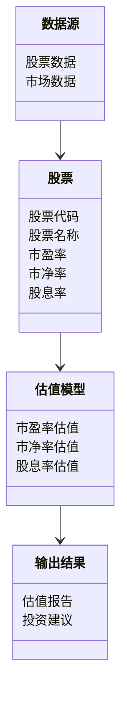
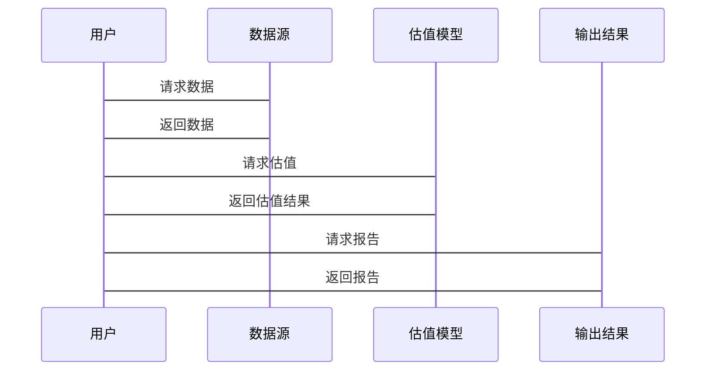

                 


# 英国股市估值:脱欧后的市场表现

## 关键词：英国股市，脱欧，市盈率，市净率，股息率，股票估值，投资策略

## 摘要

脱欧对英国经济和股市产生了深远的影响。本文将探讨脱欧后英国股市的市场表现，分析常用的股市估值指标，如市盈率、市净率和股息率，并通过实例展示如何利用这些指标进行股票估值。文章还介绍了股息贴现模型和资本资产定价模型，帮助读者更好地理解脱欧后英国股市的投资策略。

## 第1章: 背景介绍

### 1.1 脱欧对英国经济的影响

#### 1.1.1 脱欧对英国政治环境的影响
脱欧导致英国政治格局的变化，影响了政府的稳定性，进而影响了市场的信心。

#### 1.1.2 脱欧对英国经济政策的调整
脱欧后，英国调整了贸易政策和货币政策，以适应新的国际环境。

#### 1.1.3 脱欧对英国社会经济结构的改变
脱欧对英国的就业率、消费习惯和企业结构产生了深远影响。

### 1.2 英国股市的基本概念与估值方法

#### 1.2.1 股市估值的基本概念
股市估值是评估股票内在价值的过程，常用的指标包括市盈率、市净率和股息率。

#### 1.2.2 常用的股市估值指标
- 市盈率（P/E）：股价与每股收益的比率。
- 市净率（P/B）：股价与每股净资产的比率。
- 股息率：股息与股价的比率。

#### 1.2.3 脱欧对英国股市估值的影响
脱欧后的政治和经济变化影响了这些估值指标的计算和应用。

## 第2章: 核心概念与联系

### 2.1 脱欧对英国股市的主要影响

#### 2.1.1 脱欧对英国股市整体表现的影响
脱欧后，英国股市经历了波动，整体表现受到政治和经济因素的影响。

#### 2.1.2 脱欧对英国主要行业的影响
金融、能源和制造业等行业在脱欧后的表现各异，需具体分析。

#### 2.1.3 脱欧对英国股市流动性的分析
脱欧影响了外国投资者的流入，进而影响股市流动性。

### 2.2 英国股市估值的核心概念

#### 2.2.1 市盈率与市净率的定义与应用

##### 2.2.1.1 市盈率
市盈率 = 股价 / 每股收益（EPS）

##### 2.2.1.2 市净率
市净率 = 股价 / 每股净资产（BPS）

#### 2.2.2 股息率与股票估值的关系
股息率 = 每股股息（DIV） / 股价

#### 2.2.3 脱欧对英国股市估值的影响
脱欧后的政策变化和市场波动影响了市盈率、市净率和股息率的计算和应用。

## 第3章: 算法原理讲解

### 3.1 股票估值算法的实现

#### 3.1.1 市盈率估值法
根据目标公司的市盈率和可比公司的市盈率，估算目标公司的股价。

#### 3.1.2 市净率估值法
根据目标公司的市净率和可比公司的市净率，估算目标公司的股价。

#### 3.1.3 股息率估值法
根据目标公司的股息率和可比公司的股息率，估算目标公司的股价。

## 第4章: 数学模型

### 4.1 股息贴现模型（DDM）

#### 4.1.1 DDM公式
$$ V = \frac{D}{k - g} $$
其中，D是股息，k是贴现率，g是股息增长率。

### 4.2 资本资产定价模型（CAPM）

#### 4.2.1 CAPM公式
$$ R = R_f + \beta (R_m - R_f) $$
其中，R是预期收益率，R_f是无风险利率，β是股票的贝塔系数，R_m是市场预期收益率。

## 第5章: 系统分析与架构设计方案

### 5.1 问题场景介绍

#### 5.1.1 项目介绍
本项目旨在构建一个英国股市估值系统，基于脱欧后的市场数据，提供股票估值服务。

### 5.2 系统功能设计

#### 5.2.1 领域模型


### 5.3 系统架构设计

#### 5.3.1 系统架构


### 5.4 系统接口设计

#### 5.4.1 系统接口
- 数据接口：从数据库获取股票数据
- 估值接口：调用估值模型进行计算
- 输出接口：生成估值报告

### 5.5 系统交互设计

#### 5.5.1 系统交互


## 第6章: 项目实战

### 6.1 环境安装

#### 6.1.1 安装Python和相关库
```bash
pip install pandas numpy matplotlib
```

### 6.2 核心实现

#### 6.2.1 股票数据读取
```python
import pandas as pd
df = pd.read_csv('stocks.csv')
```

#### 6.2.2 估值模型实现
```python
def calculate_pe(stock_price, eps):
    return stock_price / eps

def calculate_pb(stock_price, book_value):
    return stock_price / book_value

def calculate_div_yield(dividend, stock_price):
    return dividend / stock_price
```

### 6.3 案例分析

#### 6.3.1 某行业公司的估值
```python
# 假设某公司股价为100，EPS为10，股息为5
pe = calculate_pe(100, 10)  # 10
pb = calculate_pb(100, 50)   # 2
div_yield = calculate_div_yield(5, 100)  # 5%
```

## 第7章: 总结与展望

### 7.1 小结
脱欧后的英国股市估值需要考虑多方面因素，包括市盈率、市净率和股息率。本文通过实例和模型，展示了如何在脱欧后进行股票估值。

### 7.2 注意事项
投资者应结合市场动态和公司基本面，综合考虑各种因素，做出明智的投资决策。

### 7.3 拓展阅读
建议进一步研究机器学习算法在股票估值中的应用，以提高模型的准确性和预测能力。

---

以上是《英国股市估值:脱欧后的市场表现》的技术博客文章。通过系统的分析和详细的代码示例，本文为读者提供了全面的股市估值方法和实际应用案例。

