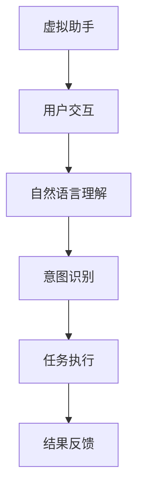
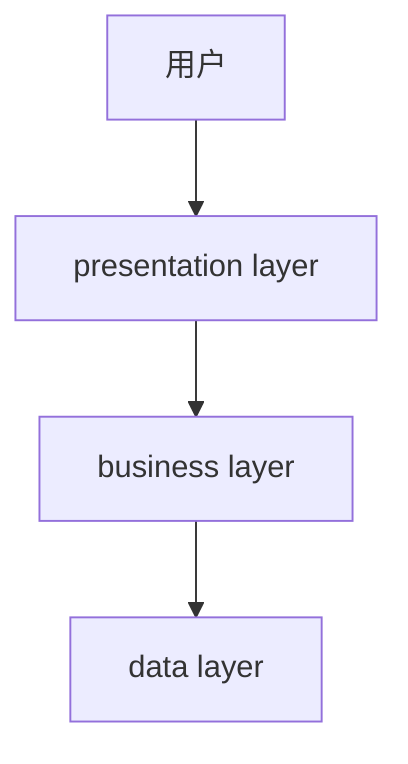
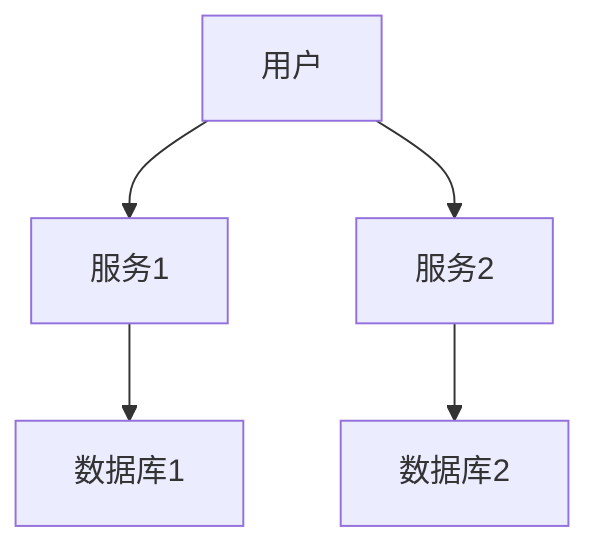
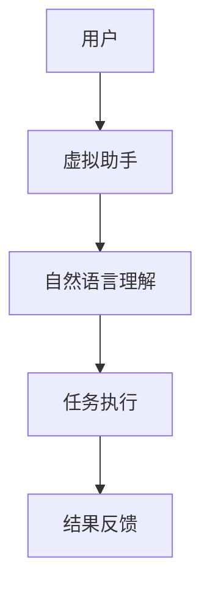

                 


# 虚拟助手AI Agent：从Siri到更智能的未来

> 关键词：虚拟助手、AI Agent、Siri、自然语言处理、机器学习、深度学习、系统架构

> 摘要：本文将从虚拟助手的起源与发展、核心技术与实现原理、系统架构与设计、项目实战以及未来展望五个方面，详细探讨虚拟助手AI Agent的发展历程与技术突破。通过分析从Siri到更智能的AI助手的演变，揭示其背后的技术原理和未来发展趋势，为读者提供一个全面而深入的技术视角。

---

# 第一部分: 虚拟助手AI Agent的背景与概念

# 第1章: 虚拟助手AI Agent的发展历程

## 1.1 虚拟助手的起源与发展

### 1.1.1 虚拟助手的定义与核心概念

虚拟助手（Virtual Assistant, VA）是一种基于人工智能技术的智能系统，能够通过自然语言处理（NLP）和机器学习算法，理解用户意图并提供相应的服务。虚拟助手的核心目标是通过模拟人类助手的能力，为用户提供便捷、高效的服务。

- **定义**：虚拟助手是一种能够理解和执行用户命令的智能系统，通常通过语音或文本交互实现。
- **核心概念**：
  - 自然语言理解（NLU）：理解用户输入的意图和语义。
  - 对话管理：根据上下文生成合适的回复。
  - 任务执行：通过调用后端服务完成用户需求。



### 1.1.2 虚拟助手的历史发展脉络

虚拟助手的发展经历了多个阶段，从简单的规则匹配到复杂的深度学习模型，技术不断进步。

- **第一阶段**：基于规则的虚拟助手（2010年前）。
  - 例如：早期的Siri基于语音识别和简单的规则匹配。
- **第二阶段**：基于机器学习的虚拟助手（2010-2020年）。
  - 例如：Google Assistant、Amazon Alexa采用深度学习模型。
- **第三阶段**：基于大模型的虚拟助手（2020年至今）。
  - 例如：ChatGPT、GPT-4等大模型的应用。

### 1.1.3 虚拟助手的现状与未来趋势

- **现状**：
  - 技术成熟度高，应用场景广泛。
  - 主流产品包括Siri、Google Assistant、Alexa等。
- **未来趋势**：
  - 更强的上下文理解和对话能力。
  - 多模态交互（结合视觉、听觉等）。
  - 更高的隐私和安全性能。

## 1.2 虚拟助手的关键技术与实现原理

### 1.2.1 自然语言处理（NLP）技术

自然语言处理是虚拟助手的核心技术，主要用于理解用户输入的自然语言文本或语音。

- **NLP的核心任务**：
  - 词性标注（POS tagging）。
  - 命名实体识别（NER）。
  - 句法分析（Syntax Analysis）。
  - 情感分析（Sentiment Analysis）。

### 1.2.2 机器学习与深度学习

机器学习和深度学习技术为虚拟助手提供了强大的学习和推理能力。

- **机器学习模型**：
  - 支持向量机（SVM）。
  - 随机森林（Random Forest）。
- **深度学习模型**：
  - 循环神经网络（RNN）。
  - 变量长度的序列到序列模型（Sequence-to-Sequence）。

### 1.2.3 对话系统与交互设计

对话系统的设计直接影响用户体验。

- **对话系统的核心模块**：
  - 意图识别（Intent Recognition）。
  - 实体抽取（Entity Extraction）。
  - 对话状态管理（Dialog State Management）。

### 1.2.4 情感计算与用户行为分析

情感计算（Affect Computing）用于分析用户的语调和情感，从而提供更个性化的服务。

- **情感计算的核心任务**：
  - 情感分类。
  - 情感强度分析。

## 1.3 虚拟助手的应用场景与典型案例

### 1.3.1 智能音箱中的虚拟助手（如Siri、Alexa）

智能音箱通过语音交互为用户提供音乐播放、天气查询、智能家居控制等服务。

### 1.3.2 智能手机中的虚拟助手（如Siri、Google Assistant）

智能手机中的虚拟助手可以执行任务调度、信息查询、日程管理等功能。

### 1.3.3 智慧城市的虚拟助手应用

在智慧城市建设中，虚拟助手可以用于公共信息服务、交通调度、应急响应等领域。

## 1.4 虚拟助手的边界与外延

### 1.4.1 虚拟助手的功能边界

- **核心功能**：
  - 语音交互。
  - 文本交互。
  - 任务执行。
- **非核心功能**：
  - 系统设置。
  - 应用管理。

### 1.4.2 虚拟助手与其他智能系统的关系

- **智能家居**：
  - 虚拟助手作为智能家居的控制中心。
- **智能汽车**：
  - 虚拟助手用于车载交互和导航。

### 1.4.3 虚拟助手的未来发展路径

- **智能化**：
  - 强化学习（Reinforcement Learning）的应用。
- **个性化**：
  - 基于用户行为的个性化推荐。

## 1.5 本章小结

本章从虚拟助手的起源与发展、核心技术与实现原理、应用场景与典型案例以及边界与外延四个方面进行了详细探讨。通过分析从Siri到更智能的AI助手的演变，揭示了虚拟助手技术的逐步进步和未来发展趋势。

---

# 第二部分: 虚拟助手AI Agent的核心技术与实现原理

# 第2章: 自然语言处理（NLP）技术

## 2.1 自然语言处理的基本概念

### 2.1.1 什么是自然语言处理

自然语言处理（NLP）是人工智能的核心技术之一，旨在让计算机能够理解和处理人类语言。

- **NLP的目标**：
  - 理解人类语言。
  - 生成人类语言。

### 2.1.2 NLP的核心任务与挑战

- **核心任务**：
  - 分词（Tokenization）。
  - 词性标注。
  - 句法分析。
  - 情感分析。
- **挑战**：
  - 语言的歧义性。
  - 文化差异。
  - 数据稀疏性。

### 2.1.3 NLP在虚拟助手中的应用

- **应用场景**：
  - 用户意图识别。
  - 信息抽取。
  - 对话生成。

## 2.2 词袋模型与TF-IDF

### 2.2.1 词袋模型的原理与实现

词袋模型是一种简单的文本表示方法，将文本表示为单词的集合。

- **实现步骤**：
  1. 分词。
  2. 统计词频。
  3. 创建词袋向量。

### 2.2.2 TF-IDF的计算方法

TF-IDF是一种用于衡量一个词语在文档中的重要程度的统计方法。

- **公式**：
  \[
  TF-IDF(t, d) = TF(t, d) \times ID
  \]
  - TF(t, d)：词语t在文档d中的词频。
  - ID：词语t的逆文档频率。

### 2.2.3 词袋模型与TF-IDF在虚拟助手中的应用

- **应用场景**：
  - 用户查询的关键词提取。
  - 文本相似度计算。

## 2.3 深度学习模型（如BERT）

### 2.3.1 BERT模型的基本原理

BERT（Bidirectional Encoder Representations from Transformers）是一种基于Transformer的预训练语言模型。

- **特点**：
  - 双向编码。
  - 大规模预训练。

### 2.3.2 BERT模型在NLP任务中的应用

- **任务**：
  - 文本分类。
  - 问答系统。
  - 机器翻译。

### 2.3.3 BERT模型在虚拟助手中的应用案例

- **案例**：
  - 智能客服中的问答系统。
  - 智能音箱中的语音交互。

## 2.4 对比分析：词袋模型 vs 深度学习模型

### 2.4.1 词袋模型的优缺点

- **优点**：
  - 简单易实现。
- **缺点**：
  - 无法捕捉语义信息。

### 2.4.2 深度学习模型的优缺点

- **优点**：
  - 性能强大。
- **缺点**：
  - 计算资源需求高。

### 2.4.3 选择合适模型的策略

- **策略**：
  - 根据任务需求选择模型。
  - 考虑计算资源限制。

## 2.5 本章小结

本章详细探讨了自然语言处理技术在虚拟助手中的应用，分析了词袋模型和深度学习模型的优缺点，并通过具体案例展示了BERT模型的应用。

---

# 第三部分: 虚拟助手AI Agent的系统架构与设计

# 第3章: 虚拟助手系统的架构设计

## 3.1 系统整体架构

### 3.1.1 分层架构设计

分层架构将系统分为 presentation layer、business layer 和 data layer。



### 3.1.2 微服务架构设计

微服务架构将系统功能分解为多个独立的服务。



### 3.1.3 混合架构设计

混合架构结合了分层架构和微服务架构的优点。

## 3.2 核心模块设计

### 3.2.1 自然语言理解模块

- **功能**：
  - 用户输入解析。
  - 意图识别。

### 3.2.2 对话管理模块

- **功能**：
  - 对话状态管理。
  - 响应生成。

### 3.2.3 后端服务模块

- **功能**：
  - 任务执行。
  - 数据存储。

## 3.3 数据库设计

### 3.3.1 用户数据存储

- **数据表**：
  - 用户ID。
  - 用户历史记录。

### 3.3.2 对话历史存储

- **数据表**：
  - 对话ID。
  - 对话内容。

### 3.3.3 知识库设计

- **数据表**：
  - 知识点。
  - 知识点描述。

## 3.4 系统接口设计

### 3.4.1 API设计

- **RESTful API**：
  - GET、POST、PUT、DELETE。

### 3.4.2 接口调用

- **流程**：
  - 用户请求。
  - 服务处理。
  - 返回结果。

## 3.5 系统交互设计

### 3.5.1 交互流程



### 3.5.2 交互优化

- **优化点**：
  - 提高响应速度。
  - 提升用户体验。

## 3.6 本章小结

本章详细探讨了虚拟助手系统的架构设计，包括整体架构、核心模块设计、数据库设计、系统接口设计和系统交互设计。通过合理的架构设计，可以提高系统的可扩展性和可维护性。

---

# 第四部分: 虚拟助手AI Agent的项目实战

# 第4章: 虚拟助手项目实战

## 4.1 环境搭建

### 4.1.1 安装Python

- **命令**：
  ```bash
  python --version
  ```

### 4.1.2 安装必要的库

- **库**：
  - numpy。
  - pandas。
  - transformers。

## 4.2 系统核心实现

### 4.2.1 自然语言理解模块实现

- **代码示例**：
  ```python
  from transformers import pipeline

  nlp = pipeline("text-classification")
  result = nlp("我今天有点开心")
  print(result)
  ```

### 4.2.2 对话管理模块实现

- **代码示例**：
  ```python
  def manage_dialogue(user_input):
      # 处理用户输入
      pass
  ```

### 4.2.3 后端服务模块实现

- **代码示例**：
  ```python
  from flask import Flask

  app = Flask(__name__)

  @app.route('/')
  def home():
      return "Hello, Virtual Assistant!"
  ```

## 4.3 代码应用解读与分析

### 4.3.1 自然语言理解模块解读

- **代码分析**：
  ```python
  result = nlp("我今天有点开心")
  print(result)
  ```
  - 使用transformers库中的预训练模型进行情感分析。

### 4.3.2 对话管理模块解读

- **代码分析**：
  ```python
  def manage_dialogue(user_input):
      # 处理用户输入
      pass
  ```
  - 定义一个函数来处理用户输入，具体实现可以根据需求扩展。

## 4.4 项目小结

本章通过一个虚拟助手项目的实战，展示了如何搭建环境、实现核心模块以及进行代码应用。通过具体的代码示例和分析，帮助读者更好地理解虚拟助手的技术实现。

---

# 第五部分: 虚拟助手AI Agent的未来展望

# 第5章: 虚拟助手的未来发展趋势

## 5.1 技术发展趋势

### 5.1.1 大模型的应用

- **趋势**：
  - 强化学习的应用。
  - 多模态交互的发展。

### 5.1.2 分布式计算与边缘计算

- **技术**：
  - 分布式系统。
  - 边缘计算。

## 5.2 伦理与社会影响

### 5.2.1 数据隐私问题

- **挑战**：
  - 用户数据的安全性。
  - 数据隐私的保护。

### 5.2.2 伦理问题

- **问题**：
  - 虚假信息的传播。
  - 用户误导的风险。

## 5.3 对人类社会的影响

### 5.3.1 提高生活效率

- **影响**：
  - 智能家居。
  - 智能办公。

### 5.3.2 改变人机交互方式

- **影响**：
  - 更自然的交互方式。
  - 更高效的协作模式。

## 5.4 本章小结

本章探讨了虚拟助手的未来发展趋势，包括技术上的进步、伦理与社会影响以及对人类社会的影响。通过分析，我们可以看到虚拟助手技术的未来发展潜力巨大，但也需要关注相关的伦理和社会问题。

---

# 结语

从Siri到更智能的未来，虚拟助手AI Agent的发展历程和技术突破展现了人工智能的强大潜力。通过本文的详细探讨，我们不仅了解了虚拟助手的核心技术与实现原理，还通过项目实战和未来展望，展望了其广阔的应用前景。未来，随着技术的不断进步，虚拟助手将更加智能化、个性化，为人类社会带来更多的便利与变革。

---

# 参考文献

（此处可以根据实际需求添加相关文献和资料引用）

---

# 致谢

感谢读者的耐心阅读，感谢技术界先驱们的智慧与努力，感谢所有为人工智能发展贡献力量的开发者和研究人员。

