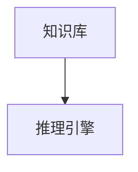
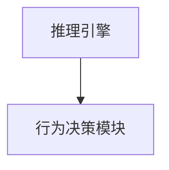
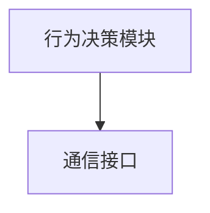
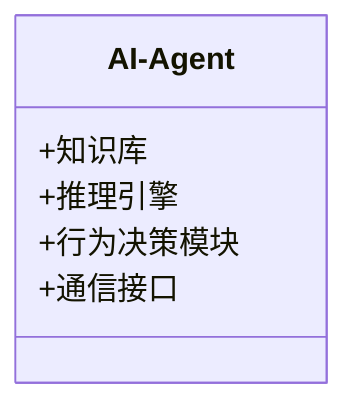
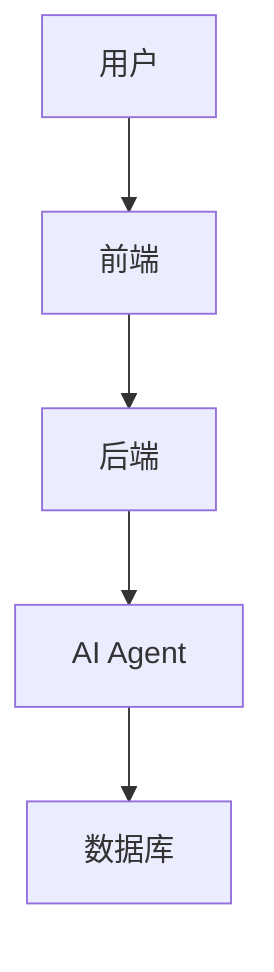
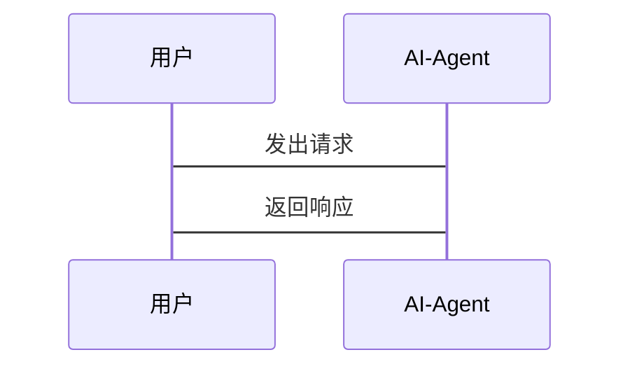
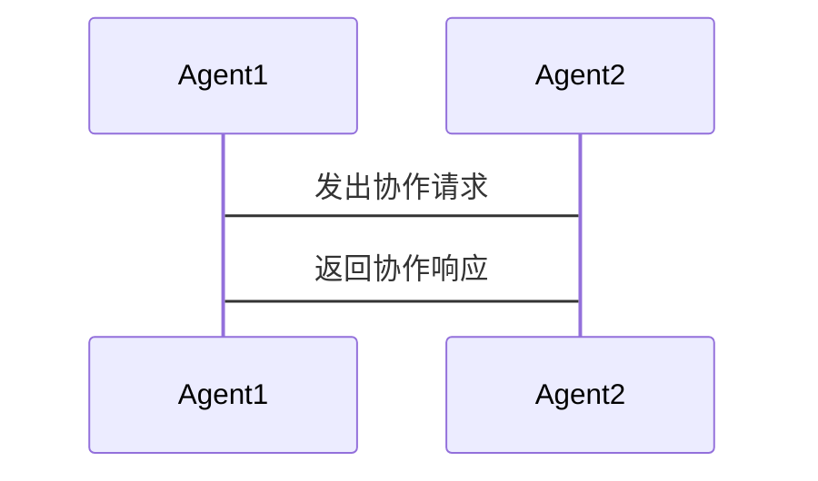

                 


# 规模化部署：将AI Agent推广到生产环境

## 关键词：AI Agent、规模化部署、生产环境、系统架构、算法原理、项目实战

## 摘要：本文详细探讨了如何将AI Agent从开发阶段推广到生产环境的过程，涵盖了AI Agent的核心概念、算法原理、系统架构设计以及项目实战等内容。通过理论与实践相结合的方式，为读者提供了一套系统化的部署方案，帮助他们在实际项目中高效地部署和管理AI Agent。

---

# 第一部分：AI Agent与规模化部署概述

## 第1章：AI Agent与规模化部署概述

### 1.1 AI Agent的基本概念

#### 1.1.1 AI Agent的定义与分类

AI Agent（人工智能代理）是指能够感知环境并采取行动以实现目标的智能实体。根据功能和应用场景的不同，AI Agent可以分为多种类型，如基于规则的Agent、基于模型的推理Agent、学习型Agent等。每种类型都有其独特的特点和适用场景。

| 类型 | 特点 | 适用场景 |
|------|------|----------|
| 基于规则的Agent | 基于预定义规则进行决策 | 简单任务自动化 |
| 基于模型的推理Agent | 使用知识库进行推理 | 复杂问题求解 |
| 学习型Agent | 通过数据学习改进性能 | 需要自适应的场景 |

#### 1.1.2 AI Agent的核心特征

AI Agent的核心特征包括自主性、反应性、目标导向和社会能力。自主性使其能够在没有外部干预的情况下运行；反应性使其能够根据环境变化调整行为；目标导向使其具有明确的目标驱动；社会能力使其能够与其他Agent或用户进行交互。

#### 1.1.3 规模化部署的定义与目标

规模化部署是指在生产环境中大量部署AI Agent，以满足复杂的业务需求。其目标是实现高效、稳定、可扩展的部署，确保每个Agent能够协同工作，同时具备高可用性和容错能力。

### 1.2 AI Agent在生产环境中的应用现状

#### 1.2.1 AI Agent在企业中的应用场景

AI Agent在企业中的应用场景包括智能客服、自动化运维、智能监控等。例如，在智能客服中，AI Agent可以处理用户的咨询，提供个性化的服务。

#### 1.2.2 当前AI Agent部署的主要挑战

部署AI Agent的主要挑战包括资源分配问题、通信延迟、数据隐私问题以及错误处理机制的不完善。这些问题可能导致系统性能下降或用户体验受损。

#### 1.2.3 规模化部署的重要性与必要性

随着企业数字化转型的加速，AI Agent的规模化部署变得至关重要。它能够提高企业的运营效率，降低成本，并提供更优质的服务。

### 1.3 本章小结

本章介绍了AI Agent的基本概念、核心特征以及规模化部署的重要性。通过分析当前的应用场景和挑战，为后续章节的深入讨论奠定了基础。

---

# 第二部分：AI Agent的核心概念与体系结构

## 第2章：AI Agent的体系结构

### 2.1 AI Agent的基本组成

#### 2.1.1 知识库与推理引擎

知识库是AI Agent进行推理的基础，推理引擎负责根据知识库中的信息进行逻辑推理。



#### 2.1.2 行为决策模块

行为决策模块负责根据推理结果生成行动指令。



#### 2.1.3 通信与交互接口

通信与交互接口是AI Agent与外部环境交互的桥梁。



### 2.2 AI Agent的通信机制

#### 2.2.1 Agent间的通信协议

常用的通信协议包括HTTP、WebSocket等，确保Agent之间的高效通信。

#### 2.2.2 通信的可靠性与安全性

通过加密技术和冗余机制，确保通信的可靠性和安全性。

### 2.3 AI Agent的部署模型

#### 2.3.1 单体部署模型

单体部署模型适用于小型项目，每个Agent独立运行。

#### 2.3.2 分布式部署模型

分布式部署模型适用于大型项目，通过分布式计算提高系统的扩展性。

#### 2.3.3 微服务化部署模型

微服务化部署模型将系统拆分为多个微服务，每个服务独立运行，便于管理和扩展。

### 2.4 本章小结

本章详细讨论了AI Agent的体系结构及其组成部分，分析了不同部署模型的特点和适用场景。

---

# 第三部分：AI Agent的算法原理与数学模型

## 第3章：AI Agent的核心算法

### 3.1 强化学习在AI Agent中的应用

#### 3.1.1 强化学习的基本原理

强化学习通过智能体与环境的交互，学习最优策略以最大化累计奖励。

#### 3.1.2 Q-Learning算法

Q-Learning是一种经典的强化学习算法，通过更新Q值表来学习最优策略。

$$ Q(s, a) = Q(s, a) + \alpha (r + \gamma \max Q(s', a') - Q(s, a)) $$

#### 3.1.3 DQN算法在AI Agent中的应用

DQN（Deep Q-Network）算法通过深度神经网络近似Q值函数，适用于复杂的环境。

### 3.2 分布式系统中的共识算法

#### 3.2.1 分布式系统的基本概念

分布式系统是多个计算节点协作完成任务的系统，共识算法用于确保节点间的一致性。

#### 3.2.2 Consensus算法（如Paxos、Raft）

Paxos和Raft是常用的共识算法，确保分布式系统中的数据一致性。

#### 3.2.3 在AI Agent中的应用案例

共识算法在分布式AI Agent系统中用于确保决策的一致性。

### 3.3 联合学习与联邦学习

#### 3.3.1 联合学习的定义与优势

联合学习通过多个机构的数据协作训练模型，保护数据隐私。

#### 3.3.2 联邦学习的数学模型

联邦学习通过异步更新和加密技术，实现模型的联合训练。

#### 3.3.3 在AI Agent中的应用

联邦学习可用于分布式环境中的模型更新和协作。

### 3.4 本章小结

本章详细探讨了强化学习、共识算法和联邦学习在AI Agent中的应用，分析了其算法原理和数学模型。

---

# 第四部分：AI Agent的系统分析与架构设计

## 第4章：AI Agent的系统架构

### 4.1 系统功能设计

#### 4.1.1 领域模型设计（Mermaid类图）



#### 4.1.2 功能模块划分

系统功能模块包括数据采集、模型训练、决策执行和结果反馈。

### 4.2 系统架构设计

#### 4.2.1 分层架构设计（Mermaid架构图）



#### 4.2.2 微服务架构设计

微服务架构将系统拆分为多个独立的服务，每个服务负责特定的功能。

### 4.3 系统接口设计

#### 4.3.1 API接口规范

API接口规范包括RESTful API的设计和JSON数据格式。

#### 4.3.2 接口的安全性与可靠性

通过HTTPS和JWT实现接口的安全性，通过冗余和负载均衡实现可靠性。

### 4.4 系统交互流程设计

#### 4.4.1 Agent与用户交互流程（Mermaid序列图）



#### 4.4.2 Agent间的协作流程



### 4.5 本章小结

本章分析了AI Agent系统的功能设计、架构设计和交互流程，提供了系统的整体架构图。

---

# 第五部分：AI Agent的项目实战

## 第5章：环境安装与核心实现

### 5.1 环境安装

#### 5.1.1 安装Python与依赖库

安装Python 3.8及以上版本，安装必要的依赖库，如TensorFlow、Keras等。

#### 5.1.2 安装框架与工具

安装必要的框架和工具，如Flask用于Web服务，Celery用于任务队列。

### 5.2 系统核心实现

#### 5.2.1 AI Agent的核心代码实现

以下是AI Agent的核心代码实现：

```python
import tensorflow as tf
from tensorflow.keras import layers

class AI-Agent:
    def __init__(self):
        self.model = self.build_model()

    def build_model(self):
        model = tf.keras.Sequential()
        model.add(layers.Dense(64, activation='relu'))
        model.add(layers.Dense(1, activation='sigmoid'))
        return model

    def train(self, x, y):
        self.model.fit(x, y, epochs=10, batch_size=32)

    def predict(self, x):
        return self.model.predict(x)
```

#### 5.2.2 API接口的开发与测试

开发RESTful API接口，使用Flask框架，编写测试用例，确保接口的正确性。

#### 5.2.3 系统集成与部署

将系统部署到云平台，配置负载均衡和自动扩展，确保系统的高可用性。

### 5.3 项目实战：AI Agent在智能客服中的应用

#### 5.3.1 案例分析

分析智能客服中AI Agent的应用场景，如用户咨询处理、信息检索等。

#### 5.3.2 代码实现与分析

详细分析AI Agent在智能客服中的代码实现，展示其如何处理用户请求和生成响应。

#### 5.3.3 系统性能优化

通过优化算法和调整系统架构，提升系统的响应速度和处理能力。

### 5.4 本章小结

本章通过项目实战，详细展示了AI Agent从环境安装到系统部署的全过程，并通过实际案例分析，帮助读者理解如何将理论应用于实践。

---

# 第六部分：总结与展望

## 第6章：总结与展望

### 6.1 本章小结

总结本文的主要内容，强调规模化部署AI Agent的重要性和实现方法。

### 6.2 注意事项

在实际部署过程中，需要注意系统的可扩展性、安全性和容错能力。

### 6.3 拓展阅读

推荐阅读相关领域的书籍和论文，如分布式系统、强化学习等。

---

# 结语

通过本文的详细讲解，读者可以系统地了解如何将AI Agent从开发阶段推广到生产环境。从理论到实践，从系统架构到项目实战，本文为读者提供了一套完整的部署方案。希望本文能够为读者在实际项目中提供有价值的参考和指导。

---

