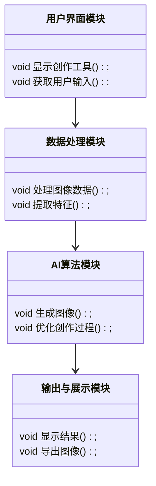
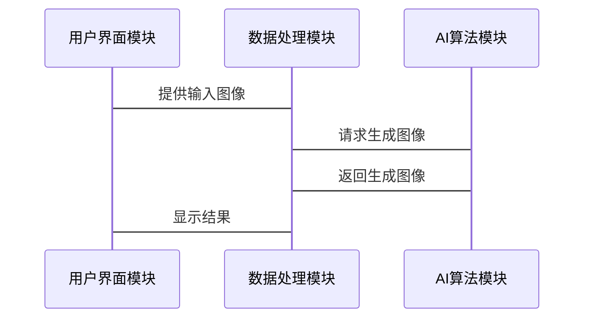

                 


# 视觉艺术领域的AI Agent创作工具

> 关键词：AI Agent，视觉艺术，创作工具，深度学习，生成对抗网络，强化学习

> 摘要：本文探讨了AI Agent在视觉艺术创作中的应用，详细分析了AI Agent的核心概念、算法原理、系统架构，并通过实际案例展示了其在视觉艺术创作工具中的应用。文章还提供了最佳实践和未来展望。

---

## 第1章：视觉艺术与AI Agent的背景介绍

### 1.1 视觉艺术的基本概念
- 1.1.1 视觉艺术的定义与分类
  - 视觉艺术包括绘画、雕塑、摄影、设计等多个领域。
  - 分类：具象艺术、抽象艺术、数字艺术等。
- 1.1.2 视觉艺术的核心要素
  - 构图、色彩、形状、质感、光影等。
- 1.1.3 视觉艺术的发展历程
  - 从传统媒介到数字工具的演变。

### 1.2 AI Agent的基本概念
- 1.2.1 AI Agent的定义
  - AI Agent是具有感知环境、推理和自主决策能力的智能体。
- 1.2.2 AI Agent的核心特征
  - 感知能力、推理能力、决策能力、学习能力。
- 1.2.3 AI Agent与传统软件的区别
  - 具备自主性和适应性。

### 1.3 视觉艺术与AI Agent的结合
- 1.3.1 视觉艺术创作中的问题与挑战
  - 创作效率低下、灵感枯竭、技术门槛高。
- 1.3.2 AI Agent在视觉艺术中的应用潜力
  - 自动化设计、灵感激发、效果优化。
- 1.3.3 当前视觉艺术创作工具的局限性
  - 缺乏智能化、个性化和自主性。

---

## 第2章：AI Agent在视觉艺术创作中的核心概念

### 2.1 AI Agent的感知与理解
- 2.1.1 视觉感知的基本原理
  - 使用深度学习模型（如CNN）进行图像识别。
- 2.1.2 视觉数据的处理与分析
  - 图像分割、特征提取、目标检测。
- 2.1.3 基于AI的图像理解技术
  - 语义理解、风格识别、情感分析。

### 2.2 AI Agent的创作与生成
- 2.2.1 创作过程中的AI算法选择
  - 根据需求选择GAN、强化学习或转移学习。
- 2.2.2 基于AI的图像生成模型
  - GAN生成逼真图像，强化学习优化创作过程。
- 2.2.3 创作过程中的用户反馈机制
  - 实时调整风格、细节优化。

### 2.3 视觉艺术创作工具的AI Agent架构
- 2.3.1 工具的功能模块划分
  - 数据输入、AI处理、用户交互、结果输出。
- 2.3.2 各模块之间的交互关系
  - 数据流、控制流和反馈流。
- 2.3.3 架构的灵活性与可扩展性
  - 支持多种创作模式和用户需求。

---

## 第3章：视觉艺术创作工具中的AI Agent算法原理

### 3.1 基于深度学习的图像生成算法
- 3.1.1 GAN（生成对抗网络）的基本原理
  - 生成器和判别器的对抗训练。
- 3.1.2 GAN在图像生成中的应用
  - 生成抽象艺术、写实风格图像。
- 3.1.3 GAN的变体与优化
  - StyleGAN、CycleGAN、条件GAN。

#### 图3.1 GAN的工作流程图
```mermaid
graph LR
    GAN[生成对抗网络] --> 生成器
    GAN --> 判别器
    生成器 --> [生成图像]
    判别器 --> [判别结果]
```

### 3.2 基于强化学习的创作过程优化
- 3.2.1 强化学习的基本概念
  - 基于奖励机制的策略优化。
- 3.2.2 强化学习在创作过程中的应用
  - 优化笔触、色彩选择、构图调整。
- 3.2.3 奖励机制的设计与实现
  - 用户评分、创作效率、视觉效果评分。

#### 图3.2 强化学习的创作优化流程
```mermaid
graph LR
    RL[强化学习] --> 策略网络
    策略网络 --> [动作]
    动作 --> 创作工具
    创作工具 --> [结果]
    结果 --> 评分器
    评分器 --> [奖励]
```

### 3.3 图像处理算法的数学模型
- 3.3.1 常用图像处理算法的数学公式
  - 滤波器：$f(x) = \sum_{i} w_i x_i$
  - 图像分割：$P(x) = \argmax_{k} P(k|x)$
- 3.3.2 算法的实现步骤与流程图
  - 数据预处理、模型训练、结果输出。
- 3.3.3 算法的优化与改进
  - 并行计算、模型剪枝、量化。

---

## 第4章：视觉艺术创作工具的系统架构设计

### 4.1 系统功能模块划分
- 4.1.1 用户界面模块
  - 提供交互界面，支持用户输入需求。
- 4.1.2 数据处理模块
  - 图像预处理、特征提取。
- 4.1.3 AI算法模块
  - GAN生成图像，强化学习优化。
- 4.1.4 输出与展示模块
  - 显示生成图像，支持导出。

### 4.2 系统架构设计
- 4.2.1 模块之间的交互关系
  - 数据流、控制流和反馈流。
- 4.2.2 系统的扩展性设计
  - 支持多种AI算法和创作模式。
- 4.2.3 系统的性能优化
  - 并行计算、缓存优化、资源分配。

#### 图4.1 系统架构类图


### 4.3 系统接口设计
- 4.3.1 用户与系统的交互接口
  - 图形界面、命令行接口。
- 4.3.2 各模块之间的接口规范
  - 数据格式、调用协议。
- 4.3.3 接口的设计原则与实现
  - 标准化、模块化、可扩展性。

#### 图4.2 系统交互序列图


---

## 第5章：视觉艺术创作工具的项目实战

### 5.1 环境搭建与工具安装
- 5.1.1 开发环境的选择与配置
  - Python、PyTorch、TensorFlow、深度学习框架。
- 5.1.2 工具安装
  - 安装依赖库、配置环境变量。

### 5.2 核心实现
- 5.2.1 GAN模型的实现
  - 代码示例：
    ```python
    import torch
    import torch.nn as nn

    class Generator(nn.Module):
        def __init__(self):
            super(Generator, self).__init__()
            self.main = nn.Sequential(
                nn.ConvTranspose2d(100, 50, 4, 2, 1),
                nn.ReLU(),
                nn.ConvTranspose2d(50, 3, 4, 2, 1),
                nn.Tanh()
            )

        def forward(self, x):
            return self.main(x)

    class Discriminator(nn.Module):
        def __init__(self):
            super(Discriminator, self).__init__()
            self.main = nn.Sequential(
                nn.Conv2d(3, 50, 4, 2, 1),
                nn.LeakyReLU(0.2),
                nn.Conv2d(50, 100, 4, 2, 1),
                nn.LeakyReLU(0.2),
                nn.Conv2d(100, 1, 4, 2, 1),
                nn.Sigmoid()
            )

        def forward(self, x):
            return self.main(x)
    ```
- 5.2.2 强化学习的实现
  - 代码示例：
    ```python
    import torch
    import torch.nn as nn
    import torch.optim as optim

    class PolicyNetwork(nn.Module):
        def __init__(self):
            super(PolicyNetwork, self).__init__()
            self.fc1 = nn.Linear(100, 50)
            self.fc2 = nn.Linear(50, 20)
            self.fc3 = nn.Linear(20, 5)

        def forward(self, x):
            x = torch.relu(self.fc1(x))
            x = torch.relu(self.fc2(x))
            x = torch.sigmoid(self.fc3(x))
            return x

    policy = PolicyNetwork()
    optimizer = optim.Adam(policy.parameters(), lr=0.001)
    ```

### 5.3 实际案例分析
- 5.3.1 案例背景
  - 使用AI生成抽象艺术作品。
- 5.3.2 创作过程
  - 用户输入主题，AI生成图像，用户反馈调整。
- 5.3.3 成果展示
  - 生成的艺术作品及其效果分析。

### 5.4 项目小结
- 成功实现了AI Agent辅助创作工具。
- 验证了AI在视觉艺术创作中的潜力。
- 提供了可扩展的系统架构和算法实现。

---

## 第6章：最佳实践与未来展望

### 6.1 最佳实践
- 选择合适的AI算法。
- 确保系统的可扩展性和灵活性。
- 定期更新模型和工具。

### 6.2 小结
- AI Agent在视觉艺术创作中的应用前景广阔。
- 技术的不断进步将进一步提升创作工具的功能。

### 6.3 注意事项
- 数据隐私和版权问题。
- 确保工具的易用性和用户体验。

### 6.4 拓展阅读
- 推荐相关书籍和论文。
- 提供进一步学习和研究的方向。

---

## 参考文献
- [1] Goodfellow, I., Bengio, Y., & Courville, A. (2016). Deep Learning.
- [2] LeCun, Y., Bengio, Y., & Hinton, G. (2015). Deep learning.
- [3] Sutton, R. S., & Barto, A. G. (2018). Reinforcement learning: Theory and algorithms.

---

通过以上目录大纲，您可以逐步撰写详细的正文内容，确保每一部分都符合要求，并提供丰富的技术细节和实际案例。

