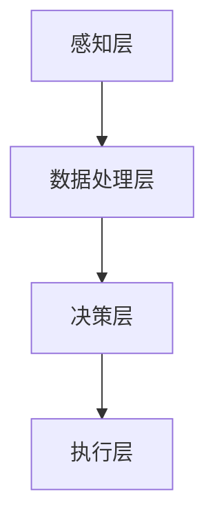
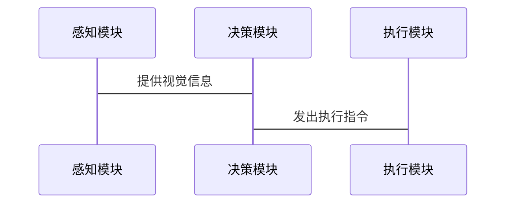

                 


# 计算机视觉集成：扩展AI Agent的感知能力

> **关键词**：计算机视觉、AI Agent、感知能力、图像处理、目标检测、深度学习  
> **摘要**：本文探讨了如何通过计算机视觉技术扩展AI Agent的感知能力，详细介绍计算机视觉的核心算法、AI Agent的结构与工作原理，以及两者结合的实际应用案例。通过系统的架构设计和项目实战，展示了如何将计算机视觉集成到AI Agent中，以提升其感知能力。

---

## 第1章: 引言与背景

### 1.1 问题背景
AI Agent作为一种智能体，广泛应用于自动驾驶、智能助手、机器人等领域。然而，其感知能力主要依赖于传感器和规则引擎，缺乏对视觉信息的深度理解和处理能力。随着计算机视觉技术的发展，将视觉感知引入AI Agent成为扩展其能力的重要方向。

### 1.2 解决方案
通过集成计算机视觉技术，AI Agent能够从图像或视频中提取更多信息，如目标检测、语义分割和场景理解，从而提升其感知能力。本文将从算法原理、系统设计和项目实战三个方面展开讨论。

### 1.3 问题边界
- **计算机视觉的边界**：主要关注图像处理和视频分析，不涉及音频或文本信息。
- **AI Agent感知能力的边界**：专注于视觉感知，不涉及决策或动作执行。
- **两者结合的综合考虑**：强调视觉信息的处理和应用，不涉及其他感知模态的集成。

### 1.4 概念结构
- **计算机视觉核心要素**：图像处理、目标检测、图像分割、语义理解。
- **AI Agent核心要素**：感知模块、决策模块、执行模块。
- **结合概念结构**：感知层（计算机视觉）→ 数据处理 → 决策层 → 动作执行。

---

## 第2章: 计算机视觉与AI Agent的核心概念

### 2.1 计算机视觉的核心原理
- **图像处理**：包括图像增强、边缘检测等预处理步骤。
- **目标检测**：通过算法定位并识别图像中的目标（如YOLO、Faster R-CNN）。
- **图像分割**：将图像划分为不同语义区域（如U-Net、Mask R-CNN）。

### 2.2 AI Agent的核心原理
- **定义与结构**：AI Agent由感知模块、推理模块和执行模块组成。
- **感知模块**：负责从环境中获取信息（如视觉、听觉等）。
- **决策模块**：基于感知信息做出决策（如路径规划）。
- **执行模块**：执行决策动作（如移动或发出指令）。

### 2.3 两者联系
- **感知层**：计算机视觉作为AI Agent的视觉感知模块，提供环境信息。
- **数据流**：视觉信息通过感知模块处理后，传递给决策模块。
- **系统架构**：感知层 → 数据处理 → 决策层 → 动作执行。

---

## 第3章: 计算机视觉技术的核心算法与实现

### 3.1 基础算法与原理
- **图像处理**：使用OpenCV进行图像增强和边缘检测。
- **目标检测**：基于深度学习的目标检测算法（如YOLO）。
- **图像分割**：使用U-Net进行语义分割。

### 3.2 算法实现
```python
import cv2
def detect_objects(image):
    # YOLO目标检测
    model = YOLOv5()
    result = model(image)
    return result
```

### 3.3 算法优化
- **模型压缩**：使用剪枝和量化技术优化模型大小。
- **推理加速**：通过并行计算和优化框架（如TensorRT）加速推理。

---

## 第4章: AI Agent的感知能力扩展

### 4.1 感知能力的需求分析
- **实时性**：AI Agent需要快速处理视觉信息。
- **准确性**：视觉感知必须准确识别目标和场景。
- **鲁棒性**：在复杂环境下保持稳定性能。

### 4.2 计算机视觉的集成方法
- **模块化设计**：将计算机视觉模块独立开发并集成到AI Agent中。
- **数据融合**：结合多模态数据（如视觉和激光雷达）提升感知能力。

### 4.3 感知能力的评估与优化
- **评估指标**：使用mAP（平均精度）评估目标检测性能。
- **持续优化**：通过数据增强和模型微调提升算法性能。

---

## 第5章: 系统架构与设计

### 5.1 系统架构设计


### 5.2 接口设计
- **输入接口**：接收视觉数据流（如视频流）。
- **输出接口**：传递处理后的信息到决策模块。

### 5.3 交互流程设计


---

## 第6章: 项目实战

### 6.1 项目背景
- **项目目标**：开发一个基于计算机视觉的AI Agent，用于智能监控系统。
- **需求分析**：实时监控视频流，检测异常行为。

### 6.2 环境搭建
- **安装依赖**：Python、OpenCV、TensorFlow、YOLOv5。

### 6.3 核心实现
```python
import cv2
import torch
from yolov5.models import YOLOv5

def main():
    model = YOLOv5()
    cap = cv2.VideoCapture(0)
    while cap.isOpened():
        success, frame = cap.read()
        if not success:
            break
        results = model(frame)
        for box in results.xyxy[0]:
            x1, y1, x2, y2 = box[:4]
            cv2.rectangle(frame, (x1, y1), (x2, y2), (0, 255, 0), 2)
        cv2.imshow('AI Agent Vision', frame)
        if cv2.waitKey(1) & 0xFF == ord('q'):
            break
    cap.release()
    cv2.destroyAllWindows()

if __name__ == "__main__":
    main()
```

### 6.4 应用案例
- **案例分析**：在智能监控中实时检测异常行为，如入侵检测。
- **总结**：展示了计算机视觉在扩展AI Agent感知能力中的实际应用。

---

## 第7章: 总结与展望

### 7.1 核心内容回顾
- 本文详细探讨了计算机视觉在扩展AI Agent感知能力中的应用。
- 通过算法实现、系统设计和项目实战，展示了如何将计算机视觉技术集成到AI Agent中。

### 7.2 最佳实践 tips
- **模块化设计**：确保系统各模块独立且易于维护。
- **数据处理**：使用高效的图像处理库（如OpenCV）优化性能。
- **持续优化**：定期更新模型和算法，提升感知能力。

### 7.3 未来展望
- **多模态集成**：结合视觉、听觉等多种感知模态，提升AI Agent的综合感知能力。
- **边缘计算**：在边缘设备上部署轻量级模型，实现低延迟的实时感知。

---

## 第8章: 参考文献与拓展阅读

### 8.1 参考文献
1. Redmon, J., et al. "YOLOv3: An Incremental Approach to Real-Time Object Detection." arXiv preprint arXiv:1804.02787 (2018).
2. Long, J., Shelhamer, E., & Darrell, T. "Fully Convolutional Networks for Semantic Segmentation." CVPR (2015).
3. LeCun, Y., Bengio, Y., & Hinton, G. "Deep Learning." Nature (2015).

### 8.2 拓展阅读
- 推荐书籍：《Deep Learning》（Ian Goodfellow等著）。
- 推荐论文：《Attention Is All You Need》（Vaswani et al., 2017）。

---

通过以上目录大纲，您可以逐步撰写详细的正文内容，涵盖每个章节的核心内容和细节。

