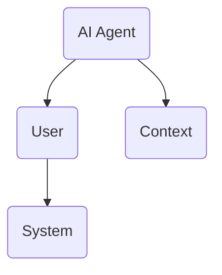

                 


```
# 设计AI Agent的人机协作接口

## 关键词
AI Agent, 人机协作, 接口设计, 自然语言处理, 强化学习, 系统架构

## 摘要
本文详细探讨了设计AI Agent的人机协作接口的关键步骤与技术要点。从AI Agent的基本概念和人机协作的背景出发，逐步深入到算法原理和系统架构设计，最后通过项目实战巩固所学内容。文章结合理论与实践，旨在为读者提供一份全面的设计指南。

---

# 第1章 AI Agent与人机协作概述

## 1.1 AI Agent的基本概念
### 1.1.1 AI Agent的定义与分类
- **定义**：AI Agent是指能够感知环境、自主决策并执行任务的智能实体。
- **分类**：根据智能水平，AI Agent可分为简单反应型、基于模型反应型、目标驱动型和效用驱动型。

### 1.1.2 人机协作的背景与现状
- **背景**：随着AI技术的发展，人机协作已成为提升效率的重要方式。
- **现状**：广泛应用于客服、医疗、教育等领域。

### 1.1.3 AI Agent与人机协作的设计原则
- **需求分析**：了解用户的真实需求。
- **界面设计**：注重用户体验。
- **交互逻辑**：确保流程清晰。

## 1.2 人机协作的背景与现状
### 1.2.1 人工智能的发展历程
- 从早期的专家系统到现在的深度学习。

### 1.2.2 当前人机协作的主要应用场景
- 包括客服、医疗诊断、教育辅助等。

### 1.2.3 人机协作的挑战与机遇
- **挑战**：理解用户意图、处理复杂场景。
- **机遇**：提升效率、创造新价值。

---

# 第2章 AI Agent的核心概念与技术特征

## 2.1 AI Agent的核心概念
### 2.1.1 智能体的定义与属性
- 智能体具有感知、决策、执行能力。

### 2.1.2 智能体的分类与特点
- 分为简单反应型、基于模型反应型、目标驱动型和效用驱动型。

### 2.1.3 智能体的生命周期
- 包括初始化、感知、决策、执行、学习等阶段。

## 2.2 人机协作接口的关键技术
### 2.2.1 自然语言处理技术
- 用于理解用户输入和生成自然语言输出。

### 2.2.2 强化学习与决策算法
- 用于智能体的决策过程。

### 2.2.3 语音识别与合成技术
- 支持语音交互。

## 2.3 AI Agent与人机协作的实体关系图


---

# 第3章 AI Agent的人机协作接口设计方法

## 3.1 设计方法概述
### 3.1.1 需求分析与用户画像
- 明确用户需求，构建用户画像。

### 3.1.2 交互流程设计
- 设计清晰的交互流程。

### 3.1.3 界面设计与用户体验优化
- 确保界面简洁易用。

## 3.2 人机协作接口的设计要素
### 3.2.1 交互模式
- 支持文本、语音等多种交互方式。

### 3.2.2 信息呈现方式
- 包括文本、图像、语音等多种形式。

### 3.2.3 错误处理与反馈机制
- 提供及时的错误提示和反馈。

## 3.3 设计流程与工具
### 3.3.1 设计流程
- 包括需求分析、设计、测试、优化等阶段。

### 3.3.2 常用工具与框架
- 推荐使用Figma、Lucidchart等工具。

---

# 第4章 AI Agent协作接口的算法原理

## 4.1 自然语言处理算法
### 4.1.1 Transformer模型原理
- 通过mermaid图展示模型结构。

### 4.1.2 BERT模型的应用
- 用于语义理解。

## 4.2 强化学习算法
### 4.2.1 Q-Learning算法
- 通过mermaid图展示算法流程。

### 4.2.2 DQN算法的实现
- 结合环境、智能体和动作空间进行详细讲解。

## 4.3 语音识别与合成算法
### 4.3.1 端到端语音识别
- 使用Python代码示例展示实现过程。

### 4.3.2 TTS技术的实现
- 介绍文本到语音的转换过程。

---

# 第5章 AI Agent协作系统的架构设计

## 5.1 系统架构概述
### 5.1.1 分层架构
- 包括数据层、业务逻辑层和表示层。

### 5.1.2 微服务架构
- 通过mermaid图展示系统架构。

## 5.2 系统功能设计
### 5.2.1 用户交互模块
- 负责接收和处理用户输入。

### 5.2.2 AI处理模块
- 负责理解和生成自然语言。

## 5.3 系统架构设计
### 5.3.1 领域模型设计
- 通过mermaid类图展示核心实体及其关系。

### 5.3.2 系统交互设计
- 使用mermaid序列图展示交互流程。

---

# 第6章 项目实战：设计一个简单的AI Agent协作接口

## 6.1 环境安装
### 6.1.1 安装Python和必要的库
- 使用pip安装所需的Python库。

## 6.2 系统核心实现
### 6.2.1 用户输入处理
- 实现自然语言理解功能。

### 6.2.2 系统响应生成
- 生成自然语言的响应。

## 6.3 代码应用解读与分析
### 6.3.1 代码实现
- 提供完整的代码示例。

### 6.3.2 代码分析
- 解释代码的功能和实现细节。

## 6.4 实际案例分析
### 6.4.1 案例背景
- 描述实际应用场景。

### 6.4.2 案例实现
- 展示如何实现具体的案例。

## 6.5 项目小结
- 总结项目实现的关键点和经验教训。

---

# 第7章 总结与展望

## 7.1 总结
- 回顾全文，强调设计AI Agent协作接口的重要性和方法。

## 7.2 未来展望
- 展望人机协作的发展趋势和可能的研究方向。

---

# 第8章 最佳实践与注意事项

## 8.1 最佳实践
### 8.1.1 保持简洁
- 确保设计简洁易用。

### 8.1.2 注重反馈
- 提供及时的反馈机制。

## 8.2 注意事项
### 8.2.1 避免过度复杂
- 避免设计过于复杂，影响用户体验。

### 8.2.2 确保安全性
- 保护用户隐私和数据安全。

---

# 第9章 拓展阅读

## 9.1 推荐书籍
### 《人工智能：一种现代的方法》
### 《人机交互设计之道》

## 9.2 推荐在线资源
### OpenAI官方文档
### TensorFlow官方文档

---

通过以上目录结构，文章将从理论到实践，全面、系统地讲解设计AI Agent的人机协作接口的关键技术和方法，帮助读者掌握这一领域的核心知识。
```

