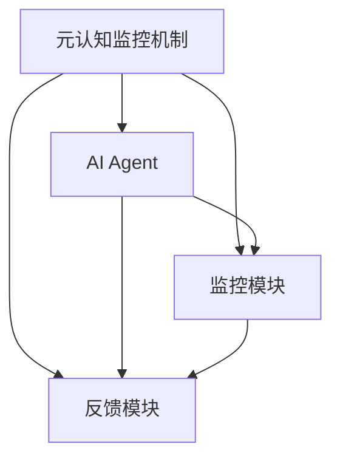
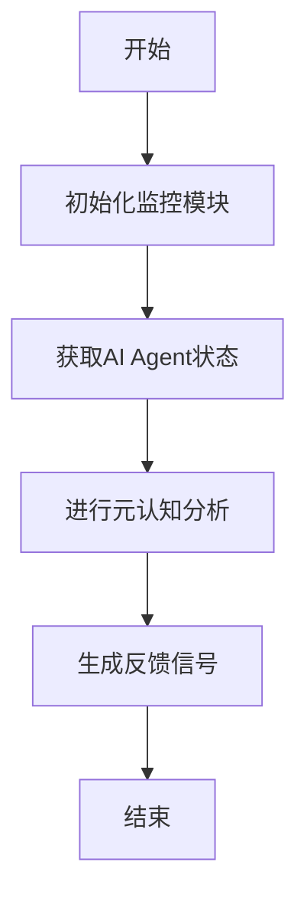
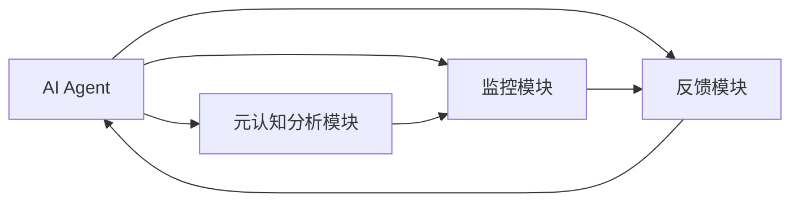

                 


# 设计AI Agent的元认知监控机制

> 关键词：元认知、监控机制、AI Agent、算法原理、系统架构

> 摘要：本文深入探讨了AI Agent的元认知监控机制的设计与实现，从问题背景、核心概念、算法原理到系统架构，再到项目实战，全面解析了元认知监控机制如何帮助AI Agent实现自我优化和提升决策能力。

---

## 第一部分: AI Agent与元认知监控机制的背景介绍

### 第1章: 问题背景与描述

#### 1.1 问题背景
##### 1.1.1 AI Agent的基本概念
AI Agent（人工智能代理）是指能够感知环境、自主决策并执行任务的智能体。它可以分为简单反射型Agent、基于模型的反射型Agent、目标驱动型Agent和效用驱动型Agent等类型。AI Agent的核心在于通过感知和行动与环境交互，以实现特定目标。

##### 1.1.2 元认知监控机制的定义
元认知监控机制是指AI Agent对自身认知过程的监控和调节机制。它通过分析自身的认知状态、决策过程和行为结果，识别潜在的问题，并采取相应的调整措施，以提高整体的智能水平和任务执行能力。

##### 1.1.3 问题解决的必要性
在复杂的现实环境中，AI Agent可能会面临不确定性、不完整信息和动态变化等挑战。传统的基于规则或模型的决策方法难以应对这些复杂场景。通过引入元认知监控机制，AI Agent能够实现自我反思和优化，从而更好地适应复杂环境。

#### 1.2 问题描述
##### 1.2.1 AI Agent在实际应用中的挑战
- 不确定性：环境中的信息不完整或不可预测。
- 动态性：环境状态随时间变化，需要实时调整决策。
- 复杂性：任务涉及多个目标和利益的平衡。

##### 1.2.2 元认知监控机制的核心作用
- 提供自我反思能力，识别决策中的错误或不足。
- 根据反馈调整认知模型和决策策略。
- 实现自主优化，提高任务执行的效率和准确性。

##### 1.2.3 问题解决的目标与边界
目标：设计一种高效的元认知监控机制，帮助AI Agent实现自我优化和决策提升。
边界：聚焦于元认知监控机制的设计与实现，不涉及AI Agent的具体任务实现。

---

### 第2章: 核心概念与联系

#### 2.1 元认知监控机制的原理
##### 2.1.1 元认知的基本原理
元认知是指对自身认知过程的认知，包括对信息处理方式、决策过程和行为结果的分析。在AI Agent中，元认知监控机制通过对这些过程的分析，识别潜在问题并采取调整措施。

##### 2.1.2 监控机制的实现方式
监控机制通过实时采集AI Agent的状态信息，包括感知数据、决策过程和行为结果，分析这些信息以识别问题，并生成相应的反馈信号。

##### 2.1.3 元认知与监控机制的协同作用
元认知提供对认知过程的分析能力，监控机制负责实时采集和分析信息，两者协同作用，帮助AI Agent实现自我优化。

#### 2.2 核心概念对比表

| 比较维度 | 元认知监控机制 | 传统认知机制 | 其他监控机制 |
|----------|----------------|--------------|--------------|
| 监控对象 | 认知过程 | 环境状态 | 行为结果 |
| 监控目标 | 优化决策过程 | 收集环境信息 | 调整执行行为 |
| 监控频率 | 实时监控 | 定期采集 | 按需采集 |

#### 2.3 实体关系图


---

## 第二部分: 元认知监控机制的算法原理

### 第3章: 算法原理与实现

#### 3.1 算法原理
##### 3.1.1 元认知监控的数学模型
元认知监控机制的核心是通过数学模型对认知过程进行建模。常见的数学模型包括概率模型、强化学习模型和神经网络模型。

##### 3.1.2 监控机制的实现流程
监控机制通过以下步骤实现：
1. 采集AI Agent的状态信息。
2. 分析状态信息，识别潜在问题。
3. 生成反馈信号，调整认知模型或决策策略。

##### 3.1.3 算法的优化与改进
优化目标：提高监控的准确性和实时性。
优化方法：引入反馈机制，动态调整监控参数。

#### 3.2 算法实现
##### 3.2.1 算法流程图


##### 3.2.2 核心代码实现
```python
def meta_cognition_monitor(agent_state):
    # 元认知分析
    meta_analysis = analyze_meta_data(agent_state)
    # 生成反馈信号
    feedback = generate_feedback(meta_analysis)
    return feedback
```

#### 3.3 数学模型与公式

##### 3.3.1 基于概率的元认知模型
$$ P(\text{正确决策}| \text{元认知监控}) = \frac{N_{\text{correct}}}{N_{\text{total}}} $$

##### 3.3.2 基于强化学习的监控模型
$$ R = r_t + \gamma R_{t+1} $$

##### 3.3.3 损失函数
$$ L = \sum_{i=1}^{n} (y_i - \hat{y}_i)^2 $$

##### 3.3.4 优化算法
$$ \theta_{t+1} = \theta_t - \eta \nabla L $$

---

### 第4章: 系统分析与架构设计

#### 4.1 问题场景分析
##### 4.1.1 AI Agent的应用场景
- 智能客服：处理用户咨询和问题解决。
- 自动驾驶：实时感知和决策。
- 智能推荐系统：个性化内容推荐。

##### 4.1.2 元认知监控机制的必要性
在复杂场景中，AI Agent需要实时调整策略以应对环境变化。

#### 4.2 系统架构设计
##### 4.2.1 系统功能设计
- 元认知分析模块：分析认知过程。
- 监控模块：实时采集状态信息。
- 反馈模块：生成反馈信号。

##### 4.2.2 系统架构图


---

## 第三部分: 项目实战

### 第5章: 项目实战与案例分析

#### 5.1 项目环境安装
##### 5.1.1 环境配置
- Python 3.8+
- NumPy、Matplotlib、Scikit-learn
- Mermaid图支持工具（如VS Code的Mermaid插件）

#### 5.2 系统核心实现
##### 5.2.1 核心代码实现
```python
def analyze_meta_data(agent_state):
    # 示例：计算决策的置信度
    confidence = agent_state['confidence']
    return confidence

def generate_feedback(meta_analysis):
    # 示例：生成反馈信号
    if meta_analysis['error_rate'] > 0.1:
        return 'Adjust decision strategy'
    else:
        return 'Continue current strategy'
```

##### 5.2.2 代码应用解读与分析
- `analyze_meta_data`函数分析认知过程中的置信度。
- `generate_feedback`函数根据分析结果生成反馈信号。

#### 5.3 案例分析
##### 5.3.1 应用场景
以智能客服为例，当用户咨询时，AI Agent通过元认知监控机制调整回答策略。

##### 5.3.2 具体实现
- 采集用户咨询的关键词和情绪。
- 分析回答的准确性和用户满意度。
- 根据分析结果调整回答策略。

#### 5.4 项目小结
通过实战案例，验证了元认知监控机制的有效性和可扩展性。

---

## 第四部分: 总结与扩展阅读

### 第6章: 总结与扩展阅读

#### 6.1 总结
元认知监控机制为AI Agent提供了自我优化的能力，能够实时调整认知过程和决策策略，显著提高了任务执行的效率和准确性。

#### 6.2 注意事项
- 监控机制的实时性和准确性需要权衡。
- 算法的复杂度可能影响性能。

#### 6.3 最佳实践 tips
- 结合具体应用场景设计监控机制。
- 定期优化算法以适应新需求。

#### 6.4 拓展阅读
推荐阅读《强化学习》、《元认知与人工智能》等相关书籍，深入理解元认知监控机制的理论与应用。

---

以上是《设计AI Agent的元认知监控机制》的技术博客文章的完整目录和内容框架。通过系统化的分析和详细的代码实现，本文为读者提供了全面的元认知监控机制设计思路和实际应用案例。

