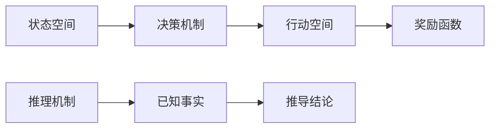
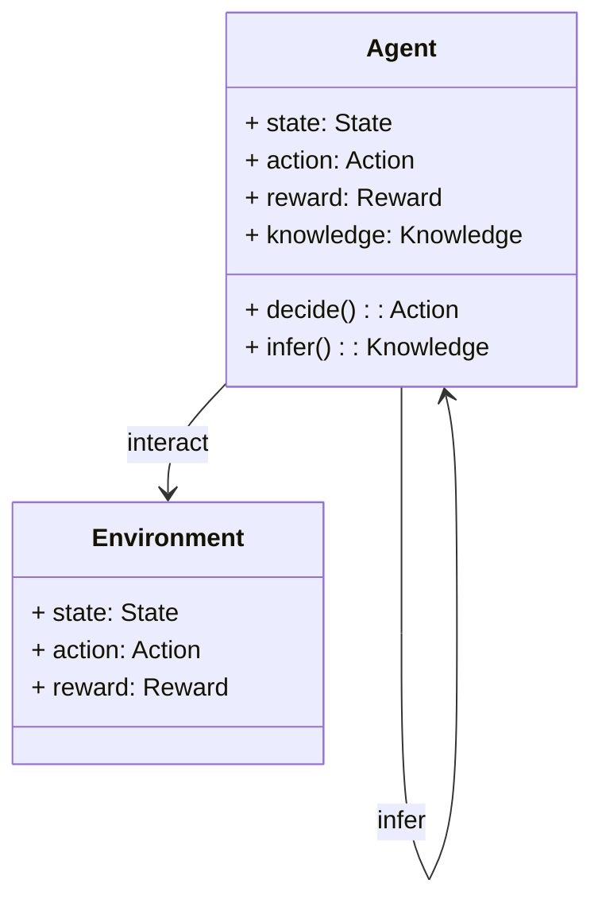
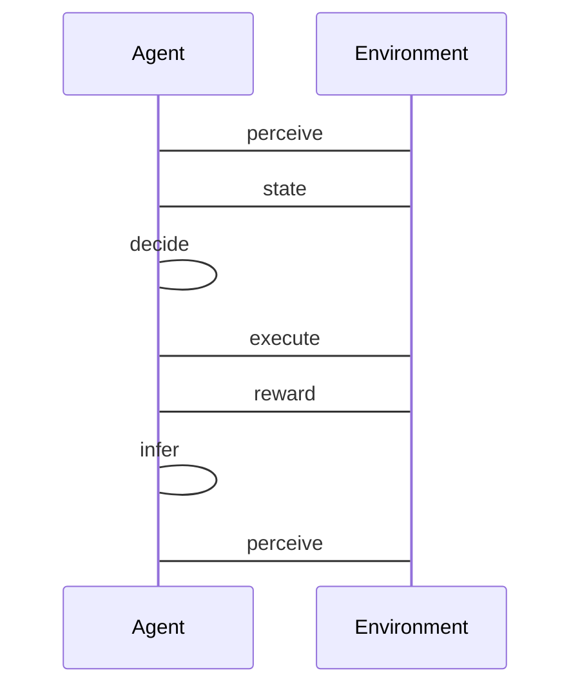

                 


# 设计AI Agent的决策与推理机制

> 关键词：AI Agent, 决策机制, 推理机制, 状态空间, 行动空间, 奖励函数, 策略

> 摘要：本文将详细探讨AI Agent的决策与推理机制，从基本概念到核心算法，从系统架构到项目实战，全面解析AI Agent如何通过决策与推理机制实现智能决策。我们将结合理论分析、算法实现和实际案例，深入探讨决策与推理机制的设计原理和实现方法。

---

## 第一部分: AI Agent的决策与推理机制概述

### 第1章: AI Agent的基本概念与背景

#### 1.1 AI Agent的定义与特点
- 1.1.1 AI Agent的基本定义
  - AI Agent是一种智能体，能够感知环境并采取行动以实现目标。
- 1.1.2 AI Agent的核心特点
  - 自主性：能够自主决策。
  - 反应性：能够实时感知并响应环境变化。
  - 目标导向：所有行为都以实现特定目标为导向。
  - 学习能力：能够通过经验改进决策策略。

#### 1.2 AI Agent的应用场景
- 1.2.1 智能助手
  - 例如，Siri、Alexa等智能语音助手。
- 1.2.2 自动驾驶
  - 例如，特斯拉、Waymo的自动驾驶系统。
- 1.2.3 游戏AI
  - 例如，游戏中的非玩家角色（NPC）行为决策。
- 1.2.4 机器人控制
  - 例如，工业机器人、服务机器人的行为控制。

#### 1.3 AI Agent的决策与推理机制的重要性
- 1.3.1 决策与推理机制的基本概念
  - 决策：基于当前状态和环境信息，选择最优行动。
  - 推理：通过逻辑推理，从已知信息中推导出新的结论。
- 1.3.2 决策与推理机制在AI Agent中的作用
  - 是AI Agent实现智能行为的核心机制。
- 1.3.3 决策与推理机制的挑战与机遇
  - 挑战：复杂环境下的决策不确定性、实时性要求、计算资源限制。
  - 机遇：通过深度学习、强化学习等技术提升决策与推理能力。

### 第2章: AI Agent的决策与推理机制的背景

#### 2.1 问题背景
- 2.1.1 AI Agent面临的复杂决策问题
  - 多目标优化、多约束条件、动态环境等。
- 2.1.2 决策与推理机制的必要性
  - 在复杂环境中，AI Agent需要实时做出合理决策。

#### 2.2 问题描述
- 2.2.1 AI Agent决策的多维度性
  - 包括感知、推理、规划等多个维度。
- 2.2.2 决策与推理机制的复杂性
  - 需要考虑环境的不确定性、行动的后果、目标的优先级等。

#### 2.3 问题解决
- 2.3.1 决策与推理机制的设计目标
  - 提高决策的准确性和实时性。
- 2.3.2 决策与推理机制的实现路径
  - 基于强化学习、符号逻辑推理、概率推理等方法。

### 第3章: AI Agent决策与推理机制的核心概念

#### 3.1 决策与推理机制的定义与特点
- 3.1.1 决策机制的定义
  - 基于当前状态和可能的行动，选择最优行动的过程。
- 3.1.2 推理机制的定义
  - 通过逻辑推理，从已知信息中推导出新的结论的过程。
- 3.1.3 决策与推理机制的联系与区别
  - 决策更注重结果的选择，推理更注重过程的推导。

#### 3.2 决策与推理机制的核心要素
- 3.2.1 状态空间
  - 所有可能状态的集合，表示AI Agent所处的环境状态。
- 3.2.2 行动空间
  - 所有可能行动的集合，表示AI Agent可以采取的动作。
- 3.2.3 奖励函数
  - 定义了每个状态-行动对的奖励值，用于指导决策。
- 3.2.4 策略
  - 定义了AI Agent在每个状态下采取行动的概率分布。

#### 3.3 决策与推理机制的边界与外延
- 3.3.1 决策与推理机制的边界
  - 界定决策与推理机制的输入和输出范围。
- 3.3.2 决策与推理机制的外延
  - 包括与决策和推理相关的其他机制，如感知、规划等。

---

## 第二部分: AI Agent决策与推理机制的核心概念与联系

### 第4章: AI Agent决策与推理机制的核心概念与联系

#### 4.1 决策机制的原理
- 4.1.1 状态表示
  - 使用状态空间中的状态表示当前环境情况。
- 4.1.2 动作选择
  - 在行动空间中选择最优行动。
- 4.1.3 奖励建模
  - 定义奖励函数，指导决策过程。

#### 4.2 推理机制的原理
- 4.2.1 推理的基本流程
  - 输入已知事实，通过推理规则，得出新的结论。
- 4.2.2 推理方法
  - 基于符号逻辑的推理、概率推理、模糊推理等。

#### 4.3 决策与推理的联系
- 4.3.1 决策依赖推理
  - 决策过程需要推理来获取必要的环境信息。
- 4.3.2 推理依赖决策
  - 推理的结果可以为决策提供依据。

#### 4.4 决策与推理机制的数学模型
- 4.4.1 决策模型
  - 状态-行动-奖励模型：$R(s, a)$，其中$s$是状态，$a$是行动。
- 4.4.2 推理模型
  - 逻辑推理模型：$C = \{c_1, c_2, ..., c_n\}$，其中$c_i$是条件。

#### 4.5 决策与推理机制的表格对比
| 概念 | 决策机制 | 推理机制 |
|------|----------|----------|
| 输入 | 当前状态 | 已知事实 |
| 输出 | 行动选择 | 推导结论 |
| 目标 | 最大化奖励 | 得出正确结论 |
| 方法 | 强化学习、贪心算法 | 命题逻辑、概率推理 |

#### 4.6 实体关系图


---

## 第三部分: AI Agent决策与推理机制的算法原理

### 第5章: 决策机制的算法原理

#### 5.1 基于强化学习的决策算法
- 5.1.1 强化学习的基本原理
  - 通过与环境交互，学习最优策略。
- 5.1.2 算法步骤
  - 初始化策略$\pi$。
  - 在当前状态下，根据策略选择行动$a$。
  - 执行行动$a$，观察环境反馈的状态$s'$和奖励$r$。
  - 更新策略$\pi$，以最大化累计奖励。

#### 5.2 基于符号逻辑的决策算法
- 5.2.1 符号逻辑的基本原理
  - 使用符号逻辑表示知识和规则。
- 5.2.2 算法步骤
  - 建立知识库，定义规则和条件。
  - 根据当前状态，匹配知识库中的规则，选择最优行动。

#### 5.3 决策算法的数学模型
- 5.3.1 强化学习的数学模型
  - 状态价值函数：$V(s)$，表示在状态$s$下，采取最优策略的期望奖励。
  - 动作价值函数：$Q(s, a)$，表示在状态$s$下采取行动$a$的期望奖励。
- 5.3.2 符号逻辑的数学模型
  - 命题逻辑公式：$P \rightarrow Q$，表示如果$P$为真，则$Q$为真。

#### 5.4 决策算法的Mermaid流程图


#### 5.5 决策算法的Python代码实现
```python
class DecisionAgent:
    def __init__(self):
        self.strategy = None

    def decide(self, state):
        if self.strategy == 'reinforcement':
            return self.reinforcement_learning(state)
        elif self.strategy == 'symbolic':
            return self.symbolic_logic(state)
        else:
            return None

    def reinforcement_learning(self, state):
        # 假设Q表已经训练好
        return self.q_table[state]

    def symbolic_logic(self, state):
        # 假设知识库已经定义好规则
        for rule in self.knowledge_base:
            if rule['condition'](state):
                return rule['action']
        return None
```

### 第6章: 推理机制的算法原理

#### 6.1 基于概率推理的算法
- 6.1.1 概率推理的基本原理
  - 使用概率论进行推理，考虑不确定性。
- 6.1.2 算法步骤
  - 建立概率模型，定义先验概率和条件概率。
  - 根据观测数据，更新后验概率。
  - 根据后验概率，做出推断。

#### 6.2 基于符号逻辑的推理算法
- 6.2.1 符号逻辑推理的基本原理
  - 使用命题逻辑或谓词逻辑进行推理。
- 6.2.2 算法步骤
  - 建立知识库，定义规则和条件。
  - 根据当前事实，匹配知识库中的规则，推导出结论。

#### 6.3 推理算法的数学模型
- 6.3.1 概率推理的数学模型
  - 贝叶斯定理：$P(A|B) = \frac{P(B|A)P(A)}{P(B)}$
- 6.3.2 符号逻辑推理的数学模型
  - 命题逻辑公式：$P \land Q$，表示$P$和$Q$同时为真。

#### 6.4 推理算法的Mermaid流程图


#### 6.5 推理算法的Python代码实现
```python
class ReasoningAgent:
    def __init__(self):
        self.knowledge_base = None

    def infer(self, facts):
        if self.knowledge_base is None:
            return None
        for rule in self.knowledge_base:
            if all(rule['premises'](fact) for fact in facts):
                return rule['conclusion']
        return None
```

---

## 第四部分: AI Agent决策与推理机制的系统分析与架构设计

### 第7章: 问题场景介绍

#### 7.1 问题背景
- 在一个动态复杂的环境中，AI Agent需要实时感知环境，做出决策和推理。

#### 7.2 问题描述
- AI Agent需要根据当前状态和环境信息，做出最优决策，并通过推理获得新的知识。

#### 7.3 问题解决
- 设计一个AI Agent，能够在动态复杂的环境中，实时做出最优决策，并通过推理获得新的知识。

### 第8章: 系统功能设计

#### 8.1 系统功能概述
- 包括感知模块、决策模块、推理模块和执行模块。

#### 8.2 领域模型
- 使用Mermaid类图表示系统功能模块之间的关系。



#### 8.3 系统架构设计
- 使用分层架构，包括感知层、决策层、推理层和执行层。

#### 8.4 系统接口设计
- 包括状态接口、行动接口、奖励接口和知识接口。

#### 8.5 系统交互流程
- 使用Mermaid序列图表示系统交互流程。



### 第9章: 项目实战

#### 9.1 环境安装
- 安装必要的Python库，如numpy、pandas、scikit-learn、tensorflow等。

#### 9.2 核心代码实现
- 决策模块的实现：
  ```python
  def decide(state):
      # 实现决策逻辑
      return action
  ```
- 推理模块的实现：
  ```python
  def infer(facts):
      # 实现推理逻辑
      return conclusion
  ```

#### 9.3 案例分析与详细讲解
- 以一个具体案例为例，详细分析决策与推理机制的实现过程。

#### 9.4 项目总结
- 总结项目的实现过程，分析存在的问题和改进方向。

### 第10章: 最佳实践、小结、注意事项和拓展阅读

#### 10.1 最佳实践
- 在设计AI Agent的决策与推理机制时，建议采用模块化设计，便于维护和扩展。

#### 10.2 小结
- 本文详细探讨了AI Agent的决策与推理机制，从基本概念到算法实现，再到系统架构和项目实战，全面解析了AI Agent如何通过决策与推理机制实现智能决策。

#### 10.3 注意事项
- 在实际应用中，需要考虑环境的动态性、计算资源的限制以及算法的实时性要求。

#### 10.4 拓展阅读
- 推荐阅读相关领域的书籍和论文，深入了解强化学习、符号逻辑推理等技术。

---

## 结语

通过本文的详细讲解，读者可以全面了解AI Agent的决策与推理机制的设计原理和实现方法。从基本概念到算法实现，从系统架构到项目实战，本文为读者提供了丰富的理论知识和实践指导。希望本文能够帮助读者在设计AI Agent的决策与推理机制时，能够更加得心应手。

