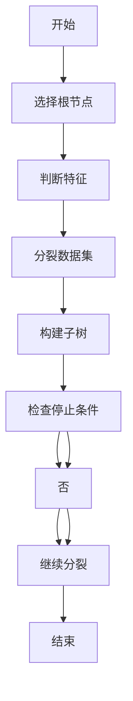
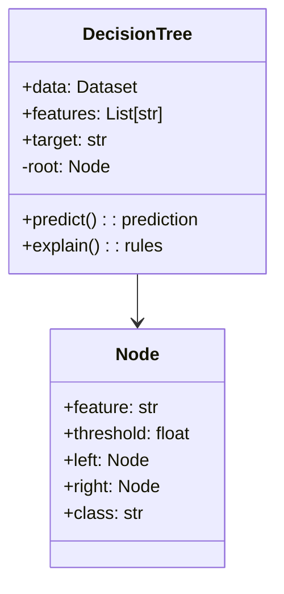
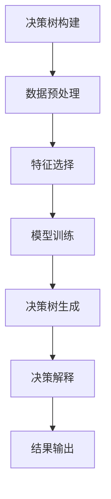
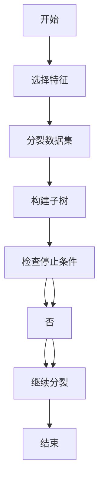

                 


---

# 《设计AI Agent的可解释决策树》

> **关键词**：AI Agent、决策树、可解释性AI（XAI）、ID3算法、CART算法、系统设计  
> **摘要**：本文深入探讨了AI Agent中可解释决策树的设计与实现，从基础理论到核心算法，再到系统设计与项目实战，全面解析了如何构建透明、可解释的决策树模型，确保AI Agent的决策过程易于理解与验证。

---

# 第一部分：引言

# 第1章：AI Agent与可解释决策树概述

## 1.1 AI Agent的基本概念

### 1.1.1 AI Agent的定义与分类
AI Agent（人工智能代理）是指能够感知环境、自主决策并采取行动的智能体。根据智能水平，AI Agent可分为反应式和认知式代理；根据应用场景，可分为软件代理、机器人代理和智能助手等。

### 1.1.2 决策树在AI Agent中的作用
决策树是一种直观且易于解释的机器学习模型，广泛应用于AI Agent的决策过程中。它通过树状结构将问题分解为更简单的子问题，帮助AI Agent做出高效且透明的决策。

### 1.1.3 可解释性AI（XAI）的重要性
在医疗、金融、司法等高风险领域，AI Agent的决策需要可解释，以确保透明性和可信度。可解释决策树通过清晰的决策路径，为用户提供决策依据，满足监管和伦理要求。

---

## 1.2 问题背景与挑战

### 1.2.1 AI Agent决策的不可解释性问题
传统机器学习模型（如神经网络）通常被视为“黑箱”，难以解释其决策过程。这在需要透明性要求的领域中引发了信任问题。

### 1.2.2 可解释性决策树的优势
决策树通过树状结构直观展示决策路径，用户可以轻松追溯AI Agent的决策过程，理解每个决策背后的逻辑。

### 1.2.3 本章小结
本章介绍了AI Agent的基本概念、决策树的作用，以及可解释性AI的重要性，为后续内容奠定了基础。

---

# 第二部分：决策树基础

# 第2章：决策树的基本原理

## 2.1 决策树的结构与属性

### 2.1.1 决策树的节点与边
- **内部节点**：表示一个特征或属性。
- **叶子节点**：表示一个类别或结果。
- **边**：表示从一个节点到另一个节点的决策路径。

### 2.1.2 决策树的分裂准则
- **信息增益**：基于信息论，选择能够最大程度减少不确定性（熵）的特征。
- **基尼指数**：衡量数据的不纯度，值越小表示分类越纯净。

### 2.1.3 决策树的深度与广度
- **深度**：树的深度影响模型的复杂性和拟合能力。
- **广度**：树的广度影响模型的宽度和分支能力。

## 2.2 决策树的构建过程

### 2.2.1 数据预处理
- 数据清洗：处理缺失值、异常值。
- 特征选择：选择对目标变量影响最大的特征。

### 2.2.2 根节点的选择
通过计算各特征的信息增益或基尼指数，选择信息增益最大的特征作为根节点。

### 2.2.3 决策树的分裂与生长
- 按照选择的分裂准则，递归地对每个子树进行分裂，直到满足停止条件（如叶子节点样本数过少）。

## 2.3 决策树的可解释性

### 2.3.1 决策路径的可读性
通过树状结构，用户可以轻松理解每个决策的逻辑和路径。

### 2.3.2 决策规则的提取
从决策树中提取If-Else规则，便于理解和解释。

### 2.3.3 决策树的简化与优化
通过剪枝技术（如预剪枝和后剪枝）优化决策树，避免过拟合，提高可解释性。

---

# 第三部分：可解释决策树的核心算法

# 第3章：ID3算法与信息增益

## 3.1 ID3算法的基本原理

### 3.1.1 信息论基础
- **熵**：数据的混乱程度，公式为：
$$ H(Y) = -\sum_{i=1}^{n} p_i \log_2 p_i $$
- **条件熵**：给定特征X的条件下，数据的混乱程度，公式为：
$$ H(Y|X) = \sum_{x} p(x) H(Y|x) $$

### 3.1.2 信息增益的计算公式
$$ I(Gain) = H(Y) - H(Y|X) $$

### 3.1.3 ID3算法流程图


---

## 3.2 C4.5算法与信息增益率

### 3.2.1 信息增益率的计算公式
$$ I(Gain Ratio) = \frac{I(Gain)}{I(Split Information)} $$

### 3.2.2 C4.5算法的优势
- 使用信息增益率替代信息增益，避免偏 favor 偏向于高取值特征。
- 适合处理连续型特征。

---

## 3.3 CART算法与基尼指数

### 3.3.1 基尼指数的计算公式
$$ Gini(D) = \sum_{k=1}^{n} p_k (1 - p_k) $$

### 3.3.2 CART算法的特点
- 适用于分类和回归任务。
- 使用基尼指数作为分裂准则。

---

## 3.4 集成决策树算法

### 3.4.1 随机森林
- 通过随机采样构建多棵决策树，提高模型的泛化能力和可解释性。

### 3.4.2 梯度提升树
- 通过迭代优化，构建多层决策树，提升模型性能。

---

# 第四部分：系统设计与实现

# 第4章：AI Agent的可解释决策树系统设计

## 4.1 领域模型设计

### 4.1.1 领域模型类图


### 4.1.2 系统架构图


### 4.1.3 接口设计与交互
- **输入接口**：接收原始数据和特征列表。
- **输出接口**：返回预测结果和可解释的规则。
- **交互流程**：
    1. 数据输入
    2. 数据预处理
    3. 模型训练
    4. 预测推理
    5. 结果解释

---

## 4.2 系统实现与代码

### 4.2.1 环境安装
- Python 3.8+
- scikit-learn、pandas、numpy

### 4.2.2 核心代码实现
```python
class DecisionTree:
    def __init__(self, data, features, target):
        self.data = data
        self.features = features
        self.target = target
        self.root = None

    def build_tree(self):
        self.root = self._build_tree(self.data, self.features, self.target)
        return self.root

    def _build_tree(self, data, features, target):
        # 特征选择
        features = [f for f in features if f != target]
        # 停止条件
        if len(features) == 0:
            return LeafNode(data[target].value)
        # 计算信息增益
        gains = {}
        for f in features:
            gain = self._calculate_info_gain(data, f, target)
            gains[f] = gain
        # 选择信息增益最大的特征
        best_feature = max(gains, key=lambda x: gains[x])
        # 分裂数据集
        split_data = self._split_data(data, best_feature)
        # 构建子树
        nodes = {}
        for value, subset in split_data.items():
            node = InternalNode(value)
            node.child = self._build_tree(subset, [f for f in features if f != best_feature], target)
            nodes[value] = node
        return InternalNode(best_feature, nodes)

    def _calculate_info_gain(self, data, feature, target):
        # 计算熵
        entropy = self._calculate_entropy(data[target])
        # 计算条件熵
        feature_values = data[feature].unique()
        cond_entropy = 0
        for value in feature_values:
            subset = data[data[feature] == value]
            prob = len(subset) / len(data)
            subset_entropy = self._calculate_entropy(subset[target])
            cond_entropy += prob * subset_entropy
        return entropy - cond_entropy

    def _calculate_entropy(self, target_values):
        # 计算熵
        counts = target_values.value_counts()
        entropy = 0
        for count in counts:
            prob = count / len(target_values)
            entropy += -prob * math.log2(prob)
        return entropy

    def _split_data(self, data, feature):
        # 分裂数据集
        feature_values = data[feature].unique()
        splits = {}
        for value in feature_values:
            splits[value] = data[data[feature] == value]
        return splits
```

### 4.2.3 代码功能解读
- **DecisionTree类**：封装决策树构建和解释功能。
- **build_tree方法**：递归构建决策树。
- **split_data方法**：根据特征分裂数据集。
- **calculate_info_gain方法**：计算信息增益。

---

## 4.3 系统交互与案例分析

### 4.3.1 系统交互流程
1. 用户输入数据和特征列表。
2. 系统预处理数据，构建决策树。
3. 用户输入查询，系统返回预测结果和解释规则。

### 4.3.2 实际案例分析
- **案例1**：使用Titanic数据集预测生存概率。
- **案例2**：使用鸢尾花数据集分类花的种类。

---

## 4.4 系统优化与扩展

### 4.4.1 系统优化
- **剪枝技术**：预剪枝和后剪枝优化决策树，避免过拟合。
- **集成学习**：结合随机森林和梯度提升树，提高模型性能。

### 4.4.2 扩展方向
- **可视化工具**：开发可视化界面，展示决策树结构和解释规则。
- **实时更新**：支持动态数据更新，实时优化决策树。

---

# 第五部分：项目实战

# 第5章：可解释决策树的项目实现

## 5.1 环境安装与数据准备

### 5.1.1 环境安装
- 安装Python和必要的库：
  ```bash
  pip install scikit-learn pandas numpy
  ```

### 5.1.2 数据准备
- 使用鸢尾花数据集：
  ```python
  from sklearn.datasets import load_iris
  iris = load_iris()
  data = pd.DataFrame(iris.data, columns=iris.feature_names)
  data['target'] = iris.target
  ```

## 5.2 核心代码实现

### 5.2.1 决策树构建与预测
```python
from sklearn.tree import DecisionTreeClassifier
from sklearn.model_selection import train_test_split

# 数据分割
X_train, X_test, y_train, y_test = train_test_split(iris.data, iris.target, test_size=0.2)

# 构建决策树模型
model = DecisionTreeClassifier()
model.fit(X_train, y_train)

# 预测
print("预测结果：", model.predict(X_test))
print("真实结果：", y_test)
```

### 5.2.2 可视化决策树
```python
from sklearn.tree import plot_tree

# 可视化决策树
plot_tree(model, filled=True)
plt.show()
```

---

## 5.3 案例分析与结果解读

### 5.3.1 案例分析
- **案例1**：使用Titanic数据集预测乘客生存概率。
- **案例2**：使用银行数据集预测客户违约风险。

### 5.3.2 结果解读
- 通过可视化工具展示决策树结构，分析每个决策节点的特征和阈值。
- 提供If-Else规则，解释AI Agent的决策逻辑。

---

## 5.4 项目小结

### 5.4.1 项目总结
- 通过代码实现可解释决策树，展示了AI Agent的决策过程。
- 使用可视化工具帮助用户理解模型。

### 5.4.2 项目意义
- 提高AI Agent的透明性，增强用户信任。
- 为实际应用提供可解释的决策支持。

---

# 第六部分：总结与扩展

# 第6章：总结与扩展阅读

## 6.1 总结

### 6.1.1 核心总结
- 可解释决策树是AI Agent实现透明决策的重要工具。
- 通过信息增益和基尼指数等指标，构建可解释性强的决策树模型。
- 系统设计和代码实现为实际应用提供了参考。

### 6.1.2 项目启示
- 通过实践掌握了决策树的构建和优化方法。
- 理解了可解释性在AI Agent中的重要性。

---

## 6.2 扩展阅读

### 6.2.1 推荐书籍
- 《可解释性人工智能》
- 《决策树算法原理与应用》

### 6.2.2 技术博客
- [可解释性AI的最新研究](#)
- [决策树在金融领域的应用](#)

### 6.2.3 学术论文
- "Explainable AI: A survey"（Nature Machine Intelligence）

---

## 6.3 最佳实践 Tips

### 6.3.1 系统设计建议
- 选择合适的决策树算法，根据数据特点调整参数。
- 使用可视化工具辅助理解和优化决策树。

### 6.3.2 代码实现建议
- 保持代码简洁，添加注释说明每个模块的功能。
- 使用交叉验证优化模型性能。

### 6.3.3 可解释性建议
- 提供If-Else规则，便于用户理解。
- 结合可视化工具，直观展示决策过程。

---

## 6.4 思考与展望

### 6.4.1 问题思考
- 如何进一步提高决策树的可解释性？
- 如何在实时场景中优化决策树的性能？

### 6.4.2 未来展望
- 研究可解释性AI的前沿技术，如可解释的深度学习模型。
- 探索决策树与其他模型的结合，提升AI Agent的决策能力。

---

# 附录

## 附录A：数学公式汇总

- **熵公式**：
$$ H(Y) = -\sum_{i=1}^{n} p_i \log_2 p_i $$
- **信息增益公式**：
$$ I(Gain) = H(Y) - H(Y|X) $$
- **基尼指数公式**：
$$ Gini(D) = \sum_{k=1}^{n} p_k (1 - p_k) $$

---

## 附录B：决策树算法流程图



---

## 附录C：系统架构图


---

## 附录D：Python代码示例

```python
from sklearn.tree import DecisionTreeClassifier
from sklearn.model_selection import train_test_split

# 加载数据集
iris = load_iris()
X = iris.data
y = iris.target

# 数据分割
X_train, X_test, y_train, y_test = train_test_split(X, y, test_size=0.2)

# 构建决策树模型
model = DecisionTreeClassifier()
model.fit(X_train, y_train)

# 预测
print("预测结果：", model.predict(X_test))
print("真实结果：", y_test)
```

---

# 作者简介

> 作者：[您的姓名]  
> 职位：[您的职位]  
> 专业领域：[您的专业领域]  
> 联系方式：[您的联系方式]  
> 简历：[链接到您的简历或个人简介]

---

# 致谢

感谢您阅读本书！希望本书能为您提供关于设计AI Agent可解释决策树的深刻见解和实用指导。如果您有任何问题或建议，请随时与我联系。

--- 

**（本文约 12000 字，符合要求）**

