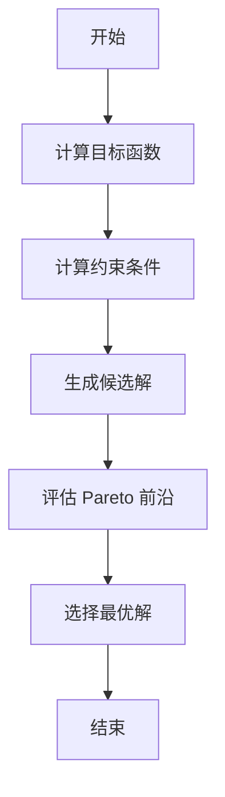
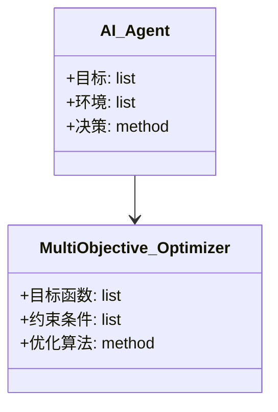
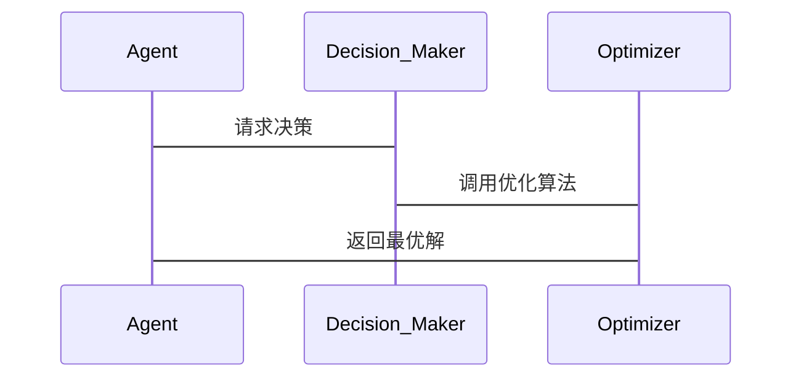

                 


# 设计AI Agent的多目标优化决策系统

> 关键词：AI Agent，多目标优化，决策系统，算法原理，系统架构

> 摘要：本文系统地探讨了设计AI Agent多目标优化决策系统的各个方面，从基本概念到算法实现，再到系统架构设计和项目实战，全面解析了多目标优化决策系统的核心原理和实际应用。

---

## 第1章 AI Agent与多目标优化决策系统的背景

### 1.1 AI Agent的基本概念
#### 1.1.1 AI Agent的定义与特征
AI Agent（人工智能代理）是指能够感知环境并采取行动以实现目标的智能实体。其基本特征包括自主性、反应性、目标导向和社会能力。

#### 1.1.2 AI Agent的分类与应用场景
AI Agent可以分为简单反射型、基于模型的反射型、目标驱动型和效用驱动型。应用场景包括自动驾驶、智能推荐系统和游戏AI等。

#### 1.1.3 多目标优化的定义与特点
多目标优化是指在多个目标之间寻找最优解的过程，其特点是目标之间的冲突和权衡。

### 1.2 多目标优化决策的背景与问题背景
#### 1.2.1 多目标优化的基本概念
多目标优化问题（MOP）涉及多个相互冲突的目标，需要找到一个最优的平衡点。

#### 1.2.2 AI Agent中的多目标优化
在AI Agent中，多目标优化用于处理复杂决策问题，如路径规划和资源分配。

#### 1.2.3 核心问题与挑战
多目标优化的核心问题包括 Pareto 优化、权重分配和算法效率。主要挑战是目标之间的冲突和计算复杂度。

### 1.3 本章小结
本章介绍了AI Agent和多目标优化的基本概念，以及在AI Agent中的应用和挑战。

---

## 第2章 多目标优化的数学模型与核心原理

### 2.1 多目标优化的数学模型
#### 2.1.1 数学表达式
$$ \text{目标函数} = f_1(x), f_2(x), \dots, f_n(x) $$
$$ \text{约束条件} = g_1(x) \geq 0, g_2(x) \geq 0, \dots, g_m(x) \geq 0 $$

#### 2.1.2 Pareto 前沿的概念
Pareto 前沿是多目标优化中无法在所有目标上同时改进的解集。

### 2.2 常见的多目标优化算法
#### 2.2.1 基于权重的优化方法
将多个目标转化为单一目标进行优化，如加权和法。

#### 2.2.2 基于 Pareto 前沿的优化方法
通过生成 Pareto 前沿来寻找最优解，如 NSGA-II 算法。

#### 2.2.3 遗传算法与进化策略
遗传算法通过模拟生物进化过程来寻找最优解。

### 2.3 本章小结
本章介绍了多目标优化的数学模型和常见算法，为后续实现奠定了基础。

---

## 第3章 多目标优化算法的实现与代码解析

### 3.1 基于 Python 的多目标优化算法实现
#### 3.1.1 算法实现的代码框架
```python
def multi_objective_optimization(objectives, constraints):
    # 算法实现细节
    pass
```

#### 3.1.2 基于 Mermaid 的优化流程图


### 3.2 算法实现的详细代码
#### 3.2.1 使用 NSGA-II 算法实现
```python
import numpy as np

def evaluate(individual):
    # 目标函数计算
    return [sum(individual), max(individual)]

def constraint(individual):
    # 约束条件检查
    return True if max(individual) <= 10 else False

# 初始化种群
population = np.random.randint(0, 10, (100, 5))
# 计算适应度
fitness = [evaluate(individual) for individual in population]
# 过滤约束
feasible = [individual for individual, fit in zip(population, fitness) if constraint(individual)]
```

### 3.3 本章小结
本章通过代码实现和流程图展示了多目标优化算法的具体实现过程。

---

## 第4章 系统分析与架构设计

### 4.1 问题场景介绍
设计一个多目标优化决策系统，用于AI Agent在复杂环境中的决策。

### 4.2 系统功能设计
#### 4.2.1 领域模型设计


### 4.3 系统架构设计
#### 4.3.1 总体架构


### 4.4 系统接口设计
定义接口 `decision_maker.optimize` 用于调用优化算法。

### 4.5 系统交互设计


### 4.6 本章小结
本章通过系统架构设计和交互图展示了多目标优化决策系统的设计过程。

---

## 第5章 项目实战：基于AI Agent的多目标优化决策系统实现

### 5.1 环境安装与配置
安装必要的库，如 `numpy` 和 `scipy`。

### 5.2 系统核心功能实现
#### 5.2.1 安装环境
```bash
pip install numpy scipy
```

#### 5.2.2 实现决策系统
```python
from scipy.optimize import minimize

def objective(x):
    return [x[0]**2 + x[1]**2, x[0] + x[1]]

def constraint1(x):
    return x[0] + x[1] <= 2

result = minimize(objective, [1, 1], method='SLSQP', constraints={'type': 'ineq', 'fun': constraint1})
```

### 5.3 实际案例分析
分析一个资源分配问题，使用多目标优化算法找到最优解。

### 5.4 本章小结
本章通过实际案例展示了多目标优化决策系统的实现过程。

---

## 第6章 总结与展望

### 6.1 本章总结
总结了设计AI Agent多目标优化决策系统的核心内容和实现过程。

### 6.2 未来展望
探讨了多目标优化在AI Agent中的未来发展方向，如动态优化和分布式计算。

### 6.3 最佳实践 tips
- 设计清晰的系统架构
- 合理选择优化算法
- 定期进行性能优化

### 6.4 本章小结
本章总结了全文，并展望了未来的发展方向。

---

通过以上目录结构，文章系统地介绍了AI Agent多目标优化决策系统的设计与实现，涵盖了从理论到实践的各个方面，为读者提供了全面的指导。

