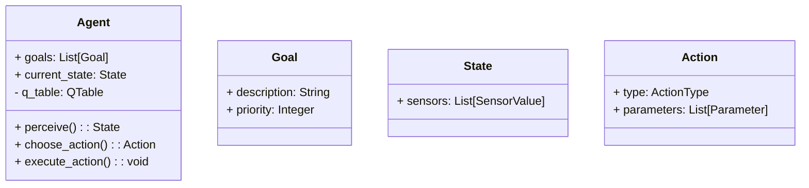
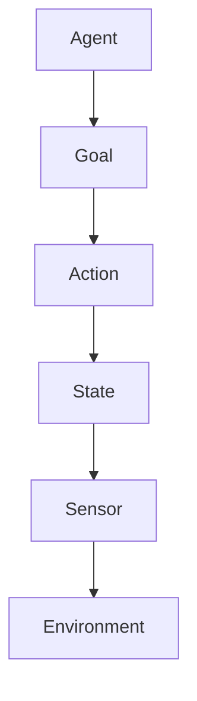

                 


# 设计AI Agent的目标导向行为系统

> 关键词：AI Agent, 目标导向行为, 多智能体协作, 强化学习, 系统架构, 代码实现

> 摘要：本文详细探讨了设计AI Agent的目标导向行为系统的各个方面，包括核心概念、算法原理、系统架构、项目实战等内容。通过逐步分析和详细讲解，帮助读者理解并掌握如何构建高效的目标导向行为系统。

---

## 第一部分: AI Agent的目标导向行为系统概述

### 第1章: 问题背景与核心概念

#### 1.1 问题背景

随着人工智能技术的快速发展，AI Agent（智能体）在各个领域的应用越来越广泛。然而，现有的AI Agent大多基于规则或任务导向，缺乏目标导向的能力。目标导向行为系统能够帮助AI Agent更加灵活地适应复杂环境，自主决策并实现长期目标，这在实际应用中具有重要意义。

#### 1.2 核心概念与定义

- **AI Agent**: 是能够感知环境、执行行动并实现特定目标的智能实体。
- **目标导向行为**: 是指AI Agent通过感知环境状态，选择并执行行动以实现目标的过程。
- **系统边界与外延**: 目标导向行为系统不仅关注单个AI Agent的行为，还涉及多智能体协作、环境交互等复杂场景。

---

### 第2章: 核心概念与联系

#### 2.1 核心概念原理

- **AI Agent的行为机制**: 包括感知、决策和执行三个阶段。
- **目标导向行为的实现原理**: 通过状态感知、目标分解、行为选择和结果评估实现目标。
- **系统各部分的协同关系**: 目标导向行为系统需要多智能体协作、环境感知和强化学习等技术的结合。

#### 2.2 概念对比与ER实体关系图

下表对比了目标导向行为与传统AI的行为方式：

| 对比维度 | 目标导向行为 | 传统AI行为 |
|----------|--------------|------------|
| 行为驱动 | 目标驱动     | 任务驱动   |
| 环境适应 | 强适应能力   | 较弱适应性  |
| 决策方式 | 自主决策     | 预定义规则 |

以下是目标导向行为系统的ER实体关系图：

```mermaid
actor: 用户
agent: AI Agent
goal: 目标
action: 行为
state: 状态
rule: 规则
```

---

## 第二部分: 算法原理讲解

### 第3章: 算法原理

#### 3.1 算法原理

- **多智能体协作算法**: 多个AI Agent通过通信和协作完成复杂任务。
- **强化学习在目标导向行为中的应用**: 使用Q-learning等算法优化行为选择策略。

#### 3.2 算法实现

以下是目标导向行为系统的Python代码实现示例：

```python
class Agent:
    def __init__(self, goals):
        self.goals = goals
        self.current_state = None

    def perceive(self):
        self.current_state = get_current_state()

    def choose_action(self):
        best_action = select_best_action(self.goals, self.current_state)
        return best_action

    def execute_action(self, action):
        execute(action)
        self.current_state = get_new_state()
```

---

### 第4章: 数学模型与公式

#### 4.1 数学模型

目标导向行为系统的数学模型基于Q-learning算法：

$$ Q(s, a) = Q(s, a) + \alpha (r + \gamma \max Q(s', a') - Q(s, a)) $$

其中：
- \( Q(s, a) \) 表示状态 \( s \) 下选择动作 \( a \) 的价值。
- \( \alpha \) 是学习率。
- \( r \) 是奖励值。
- \( \gamma \) 是折扣因子。
- \( s' \) 是新状态。

---

## 第三部分: 系统分析与架构设计

### 第5章: 系统分析与架构设计

#### 5.1 问题场景介绍

目标导向行为系统需要在复杂环境中实现多个AI Agent的协作与竞争。

#### 5.2 系统功能设计

以下是系统功能的领域模型：



#### 5.3 系统架构设计

以下是系统的架构图：



---

## 第四部分: 项目实战

### 第6章: 项目实战

#### 6.1 环境安装

安装必要的库：

```bash
pip install gym numpy matplotlib
```

#### 6.2 系统核心实现

以下是核心代码实现：

```python
import gym
import numpy as np

class Goal:
    def __init__(self, description, priority):
        self.description = description
        self.priority = priority

class Agent:
    def __init__(self, goals):
        self.goals = goals
        self.env = gym.make('CartPole-v0')
        self.q_table = np.zeros(self.env.observation_space.shape)

    def perceive(self):
        self.state = self.env.reset()

    def choose_action(self):
        q_values = self.q_table[self.state]
        max_index = np.argmax(q_values)
        return max_index

    def execute_action(self, action):
        observation, reward, done, info = self.env.step(action)
        self.q_table[self.state][action] += 0.1 * (reward + np.max(self.q_table[observation]) - self.q_table[self.state][action])
        return reward

if __name__ == "__main__":
    goals = [Goal("Balance pole", 1)]
    agent = Agent(goals)
    for _ in range(1000):
        agent.perceive()
        action = agent.choose_action()
        reward = agent.execute_action(action)
        print(f"Reward: {reward}")
```

#### 6.3 案例分析与解读

通过上述代码，我们可以实现一个简单的目标导向行为系统，用于解决CartPole问题。AI Agent通过不断试错和学习，最终能够稳定地平衡杆子。

---

## 第五部分: 总结与展望

### 第7章: 总结与展望

#### 7.1 最佳实践

- 确保目标分解的合理性。
- 使用强化学习优化行为选择。
- 在多智能体协作中采用适当的通信机制。

#### 7.2 小结

目标导向行为系统是AI Agent实现自主决策的核心技术。通过本文的讲解，读者可以掌握其设计原理和实现方法。

#### 7.3 注意事项

- 确保系统在复杂环境中的鲁棒性。
- 处理好多个AI Agent之间的协作与竞争关系。
- 定期更新和优化目标导向行为系统的策略。

#### 7.4 拓展阅读

推荐阅读以下内容：
- 《Reinforcement Learning: Theory and Algorithms》
- 《Multi-Agent Systems: Complexity and Coordination》

---

以上是《设计AI Agent的目标导向行为系统》的完整目录大纲，涵盖了从理论到实践的各个方面，帮助读者系统地理解和掌握目标导向行为系统的设计与实现。

