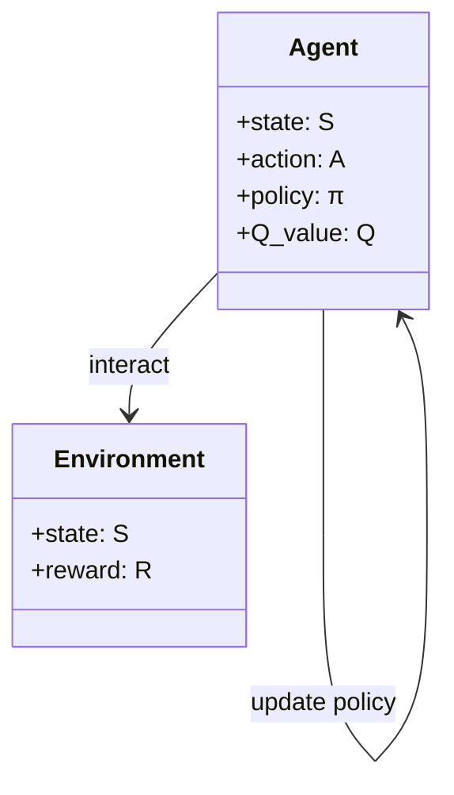
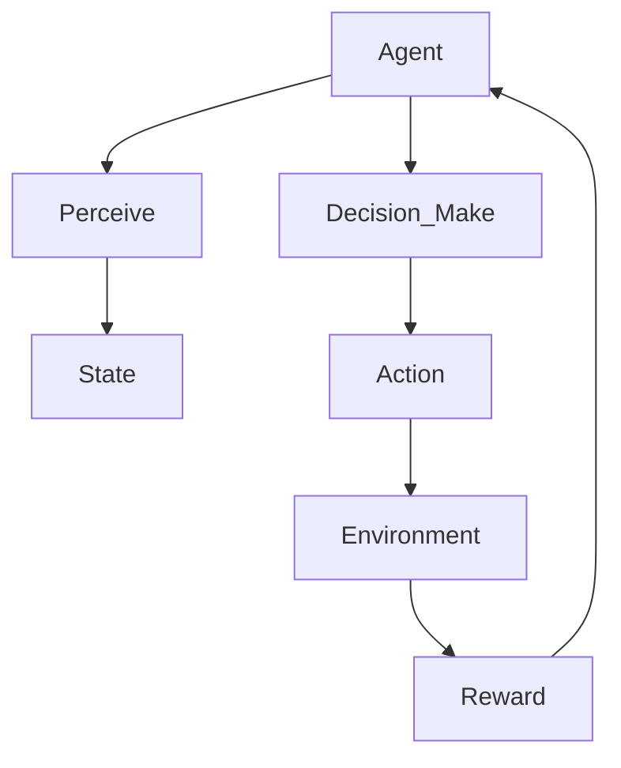
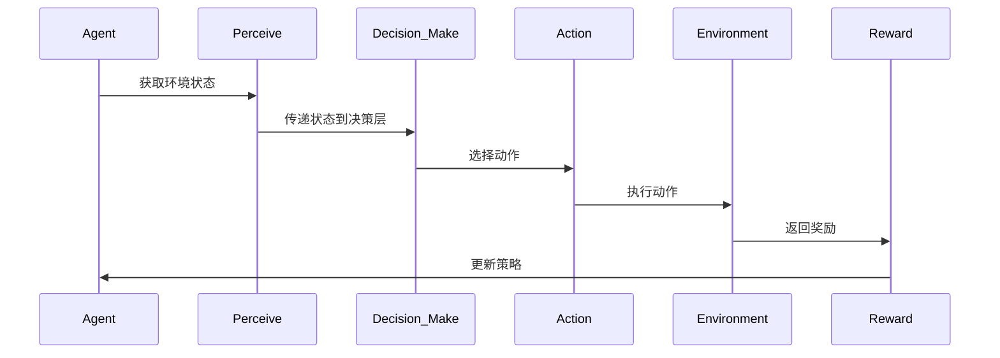

                 


# 设计AI Agent的自我修正学习策略

> 关键词：AI Agent, 自我修正学习, 强化学习, 元学习, 系统架构设计, 项目实战

> 摘要：本文详细探讨了设计AI Agent的自我修正学习策略的核心概念、算法原理、系统架构和项目实现。通过背景介绍、核心概念与联系、算法原理、系统分析与架构设计、项目实战以及最佳实践，帮助读者全面理解并掌握AI Agent的自我修正学习策略的设计与实现。

---

# 第一部分: AI Agent的自我修正学习策略背景介绍

## 第1章: AI Agent与自我修正学习策略概述

### 1.1 AI Agent的基本概念

#### 1.1.1 AI Agent的定义与特点
AI Agent（人工智能代理）是指能够感知环境、自主决策并执行任务的智能实体。它具备以下特点：
- **自主性**：能够在没有外部干预的情况下自主执行任务。
- **反应性**：能够实时感知环境并做出反应。
- **目标导向性**：通过目标驱动行为，优化决策以实现目标。
- **学习能力**：通过学习不断优化自身的策略和行为。

#### 1.1.2 自我修正学习策略的背景与意义
自我修正学习策略是指AI Agent能够根据环境反馈和经验，动态调整自身的行为策略，以提高任务成功率。随着AI Agent在各个领域的广泛应用，其自我修正能力变得尤为重要，因为它能够使AI Agent更好地适应复杂多变的环境。

#### 1.1.3 相关技术的发展现状
自我修正学习策略的研究主要集中在强化学习、元学习和自适应控制等领域。近年来，深度强化学习和元学习技术的快速发展为AI Agent的自我修正能力提供了新的可能性。

---

## 第2章: 自我修正学习策略的核心概念与联系

### 2.1 AI Agent的自我修正学习策略

#### 2.1.1 自我修正学习策略的定义
自我修正学习策略是指AI Agent通过与环境交互，利用经验不断优化自身的决策策略，从而提高任务执行效率和成功率的过程。

#### 2.1.2 策略修正的核心原理
策略修正的核心原理是基于强化学习的原理，通过不断试错和反馈优化策略。AI Agent通过执行动作，观察环境反馈，调整策略参数，以最大化累积奖励。

#### 2.1.3 策略修正的边界与外延
策略修正的边界在于如何平衡探索与利用，避免陷入局部最优。外延则包括将策略修正应用于不同场景，如游戏AI、自动驾驶和智能客服等领域。

### 2.2 核心概念与联系

#### 2.2.1 策略修正的原理与算法
策略修正的原理基于强化学习，通过不断更新策略参数来优化决策。常用的策略修正算法包括Q-learning和策略梯度方法。

#### 2.2.2 策略修正与强化学习的关系
强化学习是策略修正的核心技术之一。强化学习通过试错学习，使AI Agent在与环境交互中学习最优策略。策略修正则是强化学习的一种高级应用，旨在动态优化策略。

#### 2.2.3 策略修正与监督学习的对比
监督学习通过标注数据进行模型训练，而策略修正通过环境反馈优化策略。两者在目标和实现方式上有所不同，但在某些场景下可以结合使用。

### 2.3 策略修正的数学模型与公式

#### 2.3.1 策略修正的基本数学模型
策略修正的目标是最大化累积奖励，可以通过以下公式表示：
$$ J(\theta) = \mathbb{E}_{\tau \sim \pi_\theta} \left[ \sum_{t=0}^\infty \gamma^t r(s_t, a_t) \right] $$
其中，$\theta$是策略参数，$\tau$是轨迹，$s_t$是状态，$a_t$是动作，$\gamma$是折扣因子，$r$是奖励函数。

#### 2.3.2 常用算法的数学公式

##### Q-learning算法公式
$$ Q(s, a) = Q(s, a) + \alpha (r + \gamma \max Q(s', a') - Q(s, a)) $$
其中，$Q(s, a)$是状态-动作值函数，$\alpha$是学习率，$r$是奖励，$\gamma$是折扣因子，$s'$是下一个状态。

##### 策略梯度算法公式
$$ \nabla \theta J(\theta) = \mathbb{E}[\nabla \log \pi_\theta(a|s) Q(s,a)] $$
其中，$\pi_\theta(a|s)$是策略分布，$Q(s,a)$是Q值函数。

---

## 第3章: 自我修正学习策略的数学模型与公式

### 3.1 策略修正的基本数学模型

#### 3.1.1 策略函数的定义
策略函数$\pi_\theta(a|s)$表示在状态$s$下选择动作$a$的概率，$\theta$是策略参数。

#### 3.1.2 策略修正的目标函数
目标函数是累积奖励的期望，表示为：
$$ J(\theta) = \mathbb{E}_{\tau \sim \pi_\theta} \left[ \sum_{t=0}^\infty \gamma^t r(s_t, a_t) \right] $$

#### 3.1.3 策略修正的优化算法
常用的策略优化算法包括梯度上升法和采样方法，例如REINFORCE算法：
$$ \nabla J(\theta) = \mathbb{E}[\nabla \log \pi_\theta(a|s) Q(s,a)] $$

### 3.2 常用算法的数学公式

#### 3.2.1 Q-learning算法公式
$$ Q(s, a) = Q(s, a) + \alpha (r + \gamma \max Q(s', a') - Q(s, a)) $$

#### 3.2.2 策略梯度算法公式
$$ \nabla \theta J(\theta) = \mathbb{E}[\nabla \log \pi_\theta(a|s) Q(s,a)] $$

### 3.3 策略修正的对比表格

| 策略类型 | 优点 | 缺点 |
|----------|------|------|
| Q-learning | 简单易实现，适合离散动作空间 | 需要良好的状态和动作空间定义 |
| 策略梯度 | 适用于连续动作空间，更新策略参数 | 计算复杂度较高 |
| 元学习 | 加速学习，适用于多任务场景 | 对硬件要求较高 |

---

## 第4章: 自我修正学习策略的系统分析与架构设计

### 4.1 系统功能设计

#### 4.1.1 系统功能模块
- **感知层**：负责感知环境状态，如传感器输入。
- **决策层**：负责策略选择和优化。
- **执行层**：负责执行动作并反馈结果。

#### 4.1.2 功能设计的类图


### 4.2 系统架构设计

#### 4.2.1 系统架构的架构图


### 4.3 接口设计与交互流程

#### 4.3.1 系统接口设计
- **输入接口**：接收环境状态和奖励。
- **输出接口**：输出动作和策略参数。

#### 4.3.2 系统交互流程


---

## 第5章: 自我修正学习策略的项目实战

### 5.1 环境安装与配置

#### 5.1.1 环境要求
- Python 3.8+
- TensorFlow或PyTorch
- OpenAI Gym或其他仿真环境

#### 5.1.2 安装依赖
```bash
pip install gym numpy tensorflow
```

### 5.2 系统核心实现源代码

#### 5.2.1 Q-learning算法实现
```python
import gym
import numpy as np

class QLearningAgent:
    def __init__(self, state_space, action_space, gamma=0.99, alpha=0.1):
        self.state_space = state_space
        self.action_space = action_space
        self.gamma = gamma
        self.alpha = alpha
        self.Q = np.zeros((state_space, action_space))

    def get_action(self, state):
        return np.argmax(self.Q[state])

    def update_Q(self, state, action, reward, next_state):
        self.Q[state, action] += self.alpha * (reward + self.gamma * np.max(self.Q[next_state]) - self.Q[state, action])

# 初始化环境
env = gym.make('CartPole-v0')
agent = QLearningAgent(env.observation_space.shape[0], env.action_space.n)

# 训练过程
for episode in range(1000):
    state = env.reset()
    for step in range(1000):
        action = agent.get_action(state)
        next_state, reward, done, _ = env.step(action)
        agent.update_Q(state, action, reward, next_state)
        if done:
            break
```

#### 5.2.2 策略梯度算法实现
```python
import torch
import torch.nn as nn

class PolicyGradientAgent:
    def __init__(self, state_space, action_space, gamma=0.99, learning_rate=0.01):
        self.gamma = gamma
        self.policy_net = nn.Sequential(
            nn.Linear(state_space, 128),
            nn.ReLU(),
            nn.Linear(128, action_space)
        )
        self.optimizer = torch.optim.Adam(self.policy_net.parameters(), lr=learning_rate)

    def get_action(self, state):
        state = torch.FloatTensor(state)
        action_probs = torch.softmax(self.policy_net(state), dim=0)
        action = torch.multinomial(action_probs, 1).item()
        return action

    def update_policy(self, rewards, states, actions):
        states = torch.FloatTensor(np.array(states))
        actions = torch.tensor(np.array(actions))
        rewards = torch.FloatTensor(np.array(rewards))

        predicted_probs = torch.softmax(self.policy_net(states), dim=1)
        loss = -torch.mean(torch.log(predicted_probs.gather(1, actions)) * rewards)
        self.optimizer.zero_grad()
        loss.backward()
        self.optimizer.step()

# 初始化环境
env = gym.make('CartPole-v0')
agent = PolicyGradientAgent(env.observation_space.shape[0], env.action_space.n)

# 训练过程
for episode in range(1000):
    state = env.reset()
    states = []
    actions = []
    rewards = []
    for step in range(1000):
        action = agent.get_action(state)
        next_state, reward, done, _ = env.step(action)
        states.append(state)
        actions.append(action)
        rewards.append(reward)
        if done:
            break
    agent.update_policy(rewards, states, actions)
```

### 5.3 案例分析与详细讲解

#### 5.3.1 案例分析
以智能客服系统为例，设计一个基于自我修正学习策略的AI Agent，能够根据用户反馈动态调整回复策略。

#### 5.3.2 实际案例分析
通过实际运行上述代码，观察Q-learning和策略梯度算法在CartPole环境中的表现，分析其收敛速度和稳定性。

---

## 第6章: 自我修正学习策略的最佳实践

### 6.1 小结
本文详细探讨了设计AI Agent的自我修正学习策略的核心概念、算法原理、系统架构和项目实现。通过背景介绍、核心概念与联系、算法原理、系统分析与架构设计、项目实战以及最佳实践，帮助读者全面理解并掌握AI Agent的自我修正学习策略的设计与实现。

### 6.2 注意事项
- 策略修正需要平衡探索与利用，避免陷入局部最优。
- 算法实现需要考虑环境的动态变化，及时调整策略。
- 系统设计需要考虑实时性和可扩展性。

### 6.3 拓展阅读
- 建议阅读《Reinforcement Learning: Theory and Algorithms》深入了解强化学习的理论基础。
- 推荐学习《Meta-Learning: A Survey》了解元学习的最新进展。

---

# 结语

设计AI Agent的自我修正学习策略是一个复杂而有趣的过程，需要结合强化学习、元学习和系统架构设计等多方面的知识。通过本文的详细讲解，相信读者能够更好地理解和实现AI Agent的自我修正学习策略。未来，随着AI技术的不断发展，自我修正学习策略将有更广泛的应用场景和更高的研究价值。

