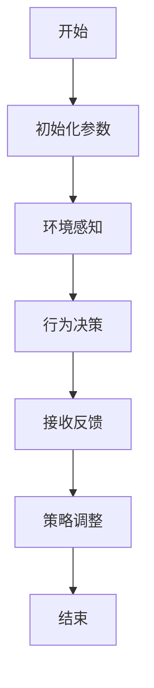
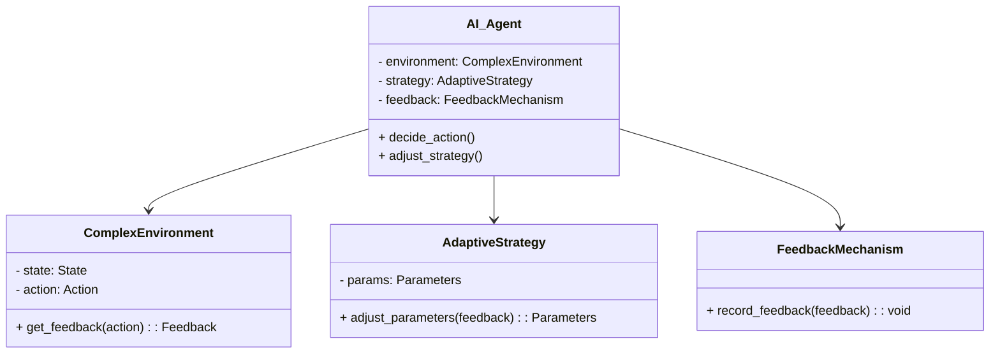
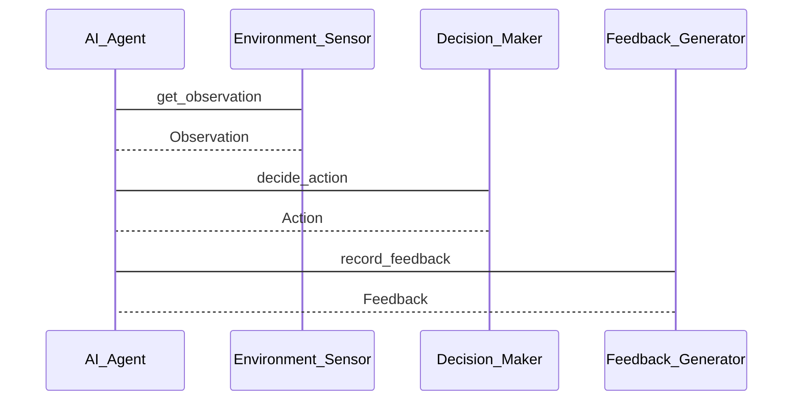

                 


# 设计AI Agent的自适应探索策略

## 关键词
- AI Agent
- 自适应探索策略
- 动态环境
- 多目标优化
- 策略调整
- 系统架构设计

## 摘要
本文详细探讨了设计AI Agent的自适应探索策略的背景、核心概念、算法原理、系统架构、项目实现及最佳实践。通过分析动态环境下的探索需求，提出了一种基于多目标优化的自适应策略，结合数学模型和实际案例，展示了如何实现高效的策略调整与环境交互。文章结构清晰，内容详实，旨在为AI Agent的设计者和研究者提供理论支持和实践指导。

---

# 第1章: AI Agent的自适应探索策略背景介绍

## 1.1 问题背景
### 1.1.1 AI Agent的基本概念
AI Agent（智能体）是能够感知环境、做出决策并执行动作的实体。在复杂动态环境中，AI Agent需要不断调整策略以适应变化，这正是自适应探索策略的核心目标。

### 1.1.2 自适应探索策略的必要性
在动态环境中，传统的固定策略难以应对不确定性，导致效率低下。自适应探索策略通过实时调整，显著提高了探索效率和决策质量。

### 1.1.3 当前探索策略的主要挑战
现有策略在动态环境中的适应性有限，难以平衡探索与利用，且缺乏多目标优化能力。

## 1.2 问题描述
### 1.2.1 AI Agent在复杂环境中的探索需求
AI Agent需要在动态环境中实时调整策略，以最大化目标函数。

### 1.2.2 现有探索策略的局限性
现有策略缺乏灵活性，难以应对快速变化的环境。

### 1.2.3 自适应探索策略的目标与意义
通过动态调整策略，提升AI Agent在复杂环境中的表现。

## 1.3 问题解决思路
### 1.3.1 自适应探索的核心思想
通过反馈机制和多目标优化，实时调整探索策略。

### 1.3.2 策略调整的驱动因素
环境反馈、目标变化和性能指标。

### 1.3.3 多目标优化的实现路径
通过权重分配和 Pareto 优化，平衡不同目标。

## 1.4 边界与外延
### 1.4.1 自适应探索的适用范围
适用于动态环境中的任务优化。

### 1.4.2 与其他探索策略的区别
自适应策略更具灵活性和适应性。

### 1.4.3 策略调整的边界条件
环境变化速率、资源限制和目标优先级。

## 1.5 核心概念结构
### 1.5.1 策略调整模块
负责根据反馈调整策略参数。

### 1.5.2 环境感知模块
负责收集环境信息并传递给策略调整模块。

### 1.5.3 行为决策模块
根据调整后的策略做出决策。

---

# 第2章: 自适应探索策略的核心要素

## 2.1 核心概念原理
### 2.1.1 动态环境下的策略调整机制
通过反馈机制实时调整策略参数。

### 2.1.2 多目标优化的实现方法
通过 Pareto 优化平衡多个目标。

### 2.1.3 策略评估与反馈循环
通过评估结果调整策略参数。

## 2.2 核心概念属性对比
| 属性 | 现有策略 | 自适应策略 |
|------|---------|------------|
| 策略调整 | 固定或有限 | 动态且智能 |
| 探索效率 | 低效或不稳定 | 高效且稳定 |
| 适应能力 | 有限 | 强大 |

## 2.3 ER实体关系图
```mermaid
er
  actor: AI Agent
  action: 行为决策
  environment: 复杂环境
  strategy: 探索策略
  feedback: 反馈机制
  actor -[1..n]-> action
  action -[1]-> environment
  environment -[1]-> feedback
  feedback -[1..n]-> strategy
  strategy -[1]-> actor
```

---

# 第3章: 自适应探索策略的算法原理

## 3.1 算法原理
### 3.1.1 多目标优化的基本原理
通过 Pareto 优化平衡多个目标，目标函数表示为：
$$ J = \sum_{i=1}^n w_i f_i(x) $$
其中，$w_i$ 是目标 $f_i$ 的权重。

### 3.1.2 动态策略调整的核心算法
基于反馈机制的策略调整算法：
$$ \theta_{t+1} = \theta_t + \alpha \nabla J $$

### 3.1.3 策略评估与反馈机制
通过评估结果调整策略参数，评估函数：
$$ J(\theta) = R(\theta) - C(\theta) $$

## 3.2 算法实现


## 3.3 Python源代码实现
```python
def adaptive_exploration_strategy():
    # 初始化参数
    params = initialize_params()
    while True:
        # 环境感知
        observation = environment_perception()
        # 行为决策
        action = decision_policy(observation, params)
        # 接收反馈
        reward = get_reward(observation, action)
        # 策略调整
        params = update_params(params, reward)
```

---

# 第4章: 系统架构设计

## 4.1 问题场景介绍
AI Agent在动态环境中执行任务，需要实时调整策略。

## 4.2 系统功能设计
### 4.2.1 领域模型类图


## 4.3 系统架构设计
### 4.3.1 系统架构图


### 4.3.2 系统接口设计
```plaintext
AI_Agent
    + get_observation(): Observation
    + decide_action(observation): Action
    + adjust_strategy(feedback): void
```

### 4.3.3 系统交互图


---

# 第5章: 项目实战

## 5.1 环境安装
安装必要的库，如numpy、pandas、scikit-learn。

## 5.2 核心代码实现
```python
def initialize_params():
    return {'alpha': 0.1, 'beta': 0.9}

def environment_perception():
    return {'state': 'dynamic', 'info': [...]}

def decision_policy(observation, params):
    # 具体决策逻辑
    pass

def update_params(params, reward):
    # 参数更新逻辑
    return params
```

## 5.3 案例分析
### 5.3.1 案例背景
动态环境中的任务优化。

### 5.3.2 实施过程
环境感知、决策、反馈、策略调整。

### 5.3.3 分析结果
策略调整提高了探索效率。

## 5.4 项目小结
通过案例展示了自适应策略的有效性。

---

# 第6章: 最佳实践

## 6.1 小结
自适应探索策略在动态环境中表现出色。

## 6.2 注意事项
确保反馈机制的实时性和准确性。

## 6.3 拓展阅读
推荐阅读相关领域的最新研究论文。

---

# 第7章: 总结

## 7.1 文章总结
本文详细探讨了设计AI Agent的自适应探索策略，结合理论与实践，展示了其在复杂环境中的应用。

## 7.2 展望
未来研究可进一步优化算法和扩展应用场景。

---

通过以上结构和内容，文章系统地介绍了AI Agent的自适应探索策略，从理论到实践，为读者提供了全面的指导。

