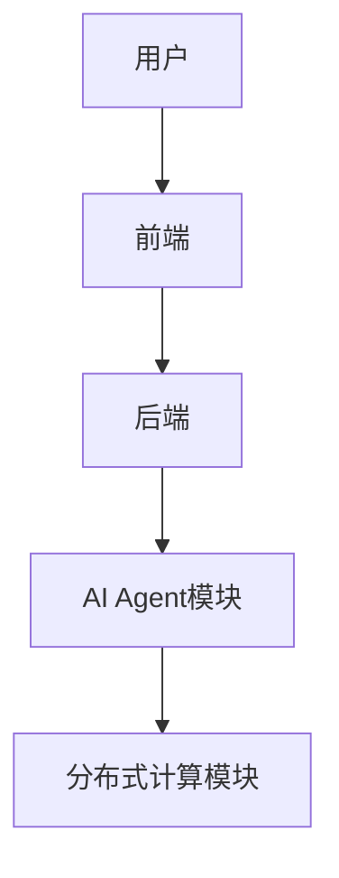

                 


# 设计可扩展的AI Agent架构

## 关键词：AI Agent、可扩展性、系统架构、算法原理、项目实战

## 摘要：  
随着人工智能技术的快速发展，AI Agent（智能体）在各个领域的应用日益广泛。设计一个可扩展的AI Agent架构是实现高效、灵活和高可用性的关键。本文从AI Agent的基本概念出发，逐步分析其核心概念、算法原理、系统架构设计，并通过实际案例展示如何实现一个可扩展的AI Agent系统。文章最后总结了设计可扩展AI Agent架构的最佳实践和未来发展趋势。

---

# 第1章: AI Agent的基本概念与背景

## 1.1 AI Agent的定义与特点  
### 1.1.1 什么是AI Agent  
AI Agent（人工智能智能体）是一种能够感知环境、自主决策并采取行动的智能系统。它通过传感器获取信息，利用推理能力做出决策，并通过执行器与环境交互。  

### 1.1.2 AI Agent的核心特点  
- **自主性**：AI Agent能够自主决策，无需外部干预。  
- **反应性**：能够实时感知环境并做出响应。  
- **目标导向性**：以特定目标为导向，优化决策过程。  
- **可扩展性**：能够适应系统规模的扩大和复杂性的增加。  

### 1.1.3 AI Agent与传统程序的区别  
AI Agent的核心区别在于其自主性和目标导向性。传统程序通常是响应式的，而AI Agent具有主动性和学习能力，能够适应复杂环境的变化。  

---

## 1.2 可扩展性的重要性  
### 1.2.1 可扩展性的定义  
可扩展性是指系统在面对用户数量、数据规模或功能需求增加时，仍能保持高性能和稳定性的能力。  

### 1.2.2 可扩展性在AI Agent中的应用  
- 在多智能体协作中，可扩展性确保系统能够处理更多的智能体节点。  
- 在分布式系统中，可扩展性保证系统能够扩展计算资源以应对更大的负载。  

### 1.2.3 可扩展性对系统性能的影响  
- **资源利用率**：通过模块化设计和分布式计算，可扩展性能够更高效地利用资源。  
- **响应时间**：通过并行处理和负载均衡，可扩展性能够减少系统的响应时间。  
- **可靠性**：通过冗余设计和容错机制，可扩展性能够提高系统的可靠性。  

---

## 1.3 当前AI Agent的应用场景  
### 1.3.1 智能助手  
如Siri、Alexa等智能助手，通过自然语言处理技术为用户提供便捷的服务。  

### 1.3.2 自动化系统  
在工业自动化、智能家居等领域，AI Agent能够实现设备的自主控制和优化。  

### 1.3.3 多智能体协作  
在机器人编队、分布式任务分配等场景中，AI Agent通过协作实现复杂任务的完成。  

---

## 1.4 本章小结  
本章介绍了AI Agent的基本概念、特点以及可扩展性的重要性，并通过实际应用场景展示了AI Agent的广泛用途。接下来，我们将深入探讨可扩展AI Agent的核心概念与联系。

---

# 第2章: 可扩展AI Agent的核心概念与联系  

## 2.1 可扩展性与模块化设计  
### 2.1.1 模块化设计的原理  
模块化设计将系统分解为多个独立的模块，每个模块负责特定的功能。通过模块化设计，系统能够更方便地进行扩展和维护。  

### 2.1.2 模块化与可扩展性的关系  
模块化设计为系统的可扩展性提供了基础。通过模块的独立性和可替换性，系统能够轻松地添加新的功能或替换旧的功能。  

### 2.1.3 模块化设计的优缺点  
- **优点**：提高系统的可维护性和可扩展性。  
- **缺点**：模块之间的接口设计需要额外考虑，增加了设计复杂性。  

---

## 2.2 分布式系统与AI Agent  
### 2.2.1 分布式系统的基本概念  
分布式系统是由多个计算节点通过网络通信协作完成任务的系统。  

### 2.2.2 分布式系统与AI Agent的关系  
AI Agent可以通过分布式系统实现任务的分发和协作，从而提高系统的扩展性和性能。  

### 2.2.3 分布式系统中的通信机制  
- **通信协议**：如HTTP、WebSocket等。  
- **消息队列**：如Kafka、RabbitMQ等。  

---

## 2.3 核心概念的ER实体关系图  
```mermaid
er
    actor: 用户
    agent: AI Agent
    module: 模块
    communication: 通信协议
    dependency: 依赖关系
    relationship: 关系
    actor -[请求]-> agent
    agent -[调用]-> module
    module -[通信]-> communication
    dependency -[依赖]-> module
    relationship -[关联]-> actor
```

---

## 2.4 本章小结  
本章探讨了可扩展性与模块化设计的关系，分析了分布式系统在AI Agent中的应用，并通过ER实体关系图展示了核心概念之间的联系。接下来，我们将深入探讨可扩展AI Agent的算法原理。

---

# 第3章: 可扩展AI Agent的算法原理  

## 3.1 多智能体协作算法  
### 3.1.1 多智能体协作的基本原理  
多智能体协作是指多个智能体通过通信和协调完成共同任务的过程。  

### 3.1.2 多智能体协作的算法实现  
- **分布式一致性算法**：如Raft、Paxos等。  
- **任务分配算法**：如基于角色分配的任务分配算法。  

### 3.1.3 多智能体协作的优缺点  
- **优点**：能够提高系统的并行处理能力。  
- **缺点**：需要复杂的通信和协调机制，增加了系统的复杂性。  

---

## 3.2 分布式计算算法  
### 3.2.1 分布式计算的基本原理  
分布式计算通过将任务分解到多个计算节点上并行执行，从而提高计算效率。  

### 3.2.2 分布式计算的算法实现  
- **MapReduce**：Google提出的分布式计算模型。  
- **Dijkstra算法**：用于分布式网络中的最短路径计算。  

---

## 3.3 算法的数学模型与公式  
### 3.3.1 多智能体协作的数学模型  
$$ V = \sum_{i=1}^{n} v_i $$  
其中，$V$ 表示系统的总价值，$v_i$ 表示第 $i$ 个智能体的价值贡献。  

### 3.3.2 分布式计算的数学公式  
$$ T = \frac{1}{\sum_{i=1}^{n} \frac{1}{f_i}} $$  
其中，$T$ 表示系统的总处理时间，$f_i$ 表示第 $i$ 个节点的处理能力。  

---

## 3.4 本章小结  
本章详细介绍了多智能体协作算法和分布式计算算法的原理，并通过数学公式展示了它们的实现方式。接下来，我们将探讨可扩展AI Agent的系统架构设计。

---

# 第4章: 可扩展AI Agent的系统架构设计  

## 4.1 系统分层设计  
### 4.1.1 分层设计的原理  
分层设计将系统划分为多个层次，每个层次负责特定的功能。  

### 4.1.2 分层设计的实现  
- **感知层**：负责与环境交互，获取感知数据。  
- **决策层**：负责对感知数据进行分析和决策。  
- **执行层**：负责根据决策结果执行操作。  

---

## 4.2 微服务架构设计  
### 4.2.1 微服务架构的基本概念  
微服务架构将系统功能分解为多个独立的服务，每个服务负责特定的功能。  

### 4.2.2 微服务架构的实现  
- **服务发现**：通过注册中心实现服务的自动发现。  
- **负载均衡**：通过反向代理实现请求的负载均衡。  

---

## 4.3 系统架构的Mermaid图  


---

## 4.4 本章小结  
本章通过分层设计和微服务架构设计，展示了如何实现一个可扩展的AI Agent系统。接下来，我们将通过实际案例展示如何将这些设计理念应用到项目中。

---

# 第5章: 项目实战  

## 5.1 环境搭建  
- **开发工具**：安装Python、Docker、Kubernetes等工具。  
- **依赖管理**：使用pip安装所需的库。  

## 5.2 系统核心代码实现  
### 5.2.1 AI Agent模块的实现  
```python
class Agent:
    def __init__(self):
        self.modules = []

    def add_module(self, module):
        self.modules.append(module)

    def execute(self, task):
        for module in self.modules:
            if module.can_execute(task):
                module.run(task)
                break
```

### 5.2.2 分布式计算模块的实现  
```python
class DistributedCompute:
    def __init__(self):
        self.nodes = []

    def add_node(self, node):
        self.nodes.append(node)

    def compute(self, task):
        # 分配任务到多个节点并行计算
        pass
```

## 5.3 案例分析  
### 5.3.1 智能客服系统  
通过AI Agent模块实现用户请求的分发和处理，通过分布式计算模块实现任务的并行处理。  

### 5.3.2 项目总结  
通过实际案例分析，展示了如何将可扩展的AI Agent架构设计应用到实际项目中，并取得了良好的效果。  

---

## 5.4 本章小结  
本章通过实际项目的环境搭建、核心代码实现和案例分析，展示了如何将可扩展的AI Agent架构设计应用到实际项目中。接下来，我们将总结设计可扩展AI Agent架构的最佳实践。

---

# 第6章: 最佳实践与未来展望  

## 6.1 最佳实践  
### 6.1.1 模块化设计  
通过模块化设计，确保系统的可扩展性和可维护性。  
### 6.1.2 分布式计算  
通过分布式计算，提高系统的处理能力和扩展性。  

## 6.2 小结  
设计可扩展的AI Agent架构需要综合考虑模块化设计、分布式计算和系统架构设计等多个方面。通过最佳实践，我们可以更好地应对复杂的实际场景。  

## 6.3 未来展望  
随着人工智能技术的不断发展，可扩展的AI Agent架构将朝着更加智能化、分布式和自适应的方向发展。

---

# 附录  

## 附录A: 术语表  
- **AI Agent**：人工智能智能体  
- **可扩展性**：系统在面对负载增加时仍能保持高性能的能力  
- **分布式系统**：由多个计算节点通过网络通信协作完成任务的系统  

## 附录B: 参考文献  
1. Russell, S., & Norvig, P. (2010). Artificial Intelligence: A Modern Approach.  
2. Bachrach, L., & Zohar, A. (2013). Multi-agent Systems: A Survey.

---

# 结语  
设计可扩展的AI Agent架构是一个复杂但 rewarding 的过程。通过本文的讲解，我们希望能够为读者提供一个清晰的设计思路，并帮助他们在实际项目中应用这些设计理念。

