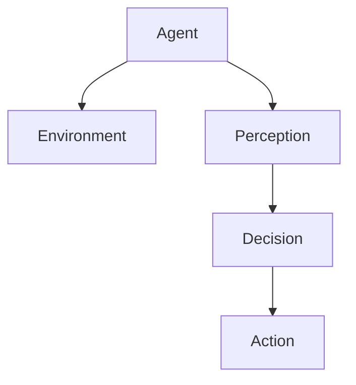
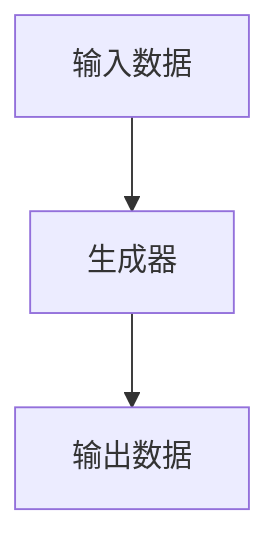
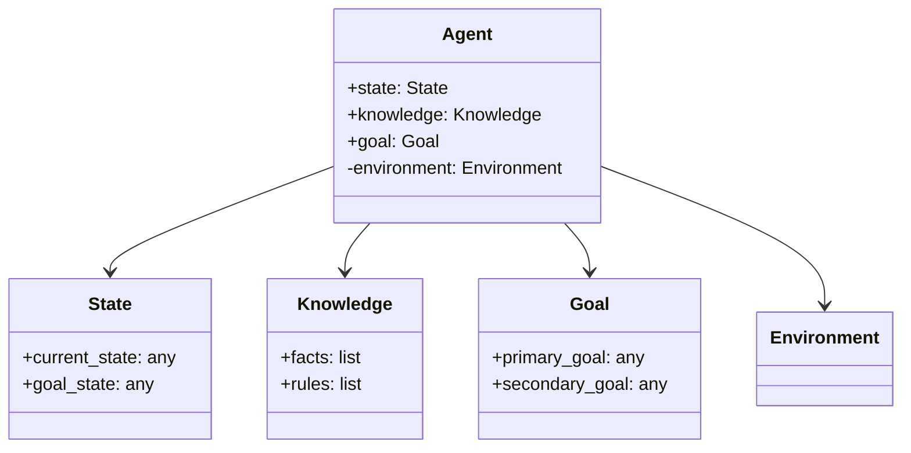
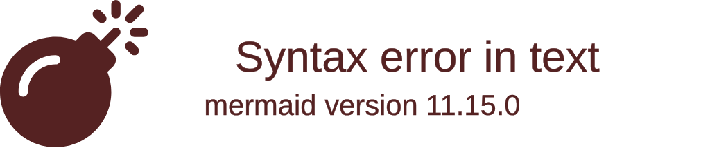
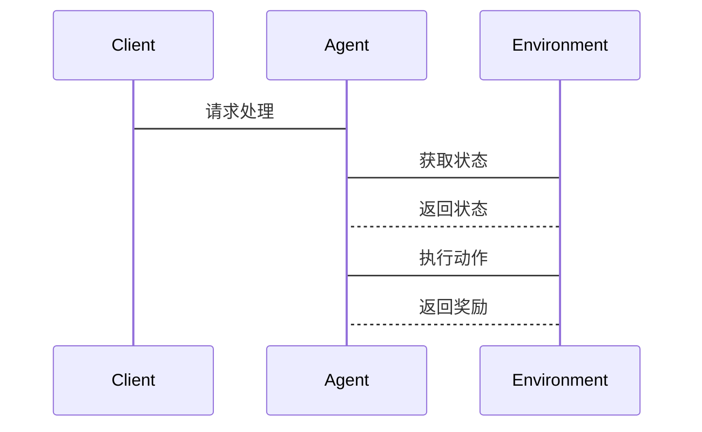

                 


# 课程学习：设计AI Agent的最优学习路径

> 关键词：AI Agent，学习路径，算法原理，系统架构，项目实战

> 摘要：设计AI Agent的最优学习路径需要系统地掌握基础概念、核心算法、系统架构和实战经验。本文从AI Agent的背景与概念入手，深入分析其核心概念与原理，详细讲解相关算法，展示系统架构设计，并通过项目实战帮助读者巩固所学内容，最终形成全面的知识体系。

---

# 第一部分: AI Agent基础与背景

# 第1章: AI Agent的背景与概念

## 1.1 AI Agent的基本定义

### 1.1.1 智能体（Agent）的定义

AI Agent（人工智能代理）是指在特定环境中能够感知并自主行动以实现目标的实体。它能够根据感知到的信息做出决策，并通过执行动作与环境交互。AI Agent的核心在于其智能性，能够适应复杂环境的变化。

### 1.1.2 AI Agent的核心特征

AI Agent具有以下核心特征：
- **自主性**：能够在没有外部干预的情况下自主运行。
- **反应性**：能够实时感知环境并做出反应。
- **目标导向性**：具有明确的目标，并采取行动以实现目标。
- **学习能力**：能够通过经验改进性能。

### 1.1.3 AI Agent与传统程序的区别

AI Agent与传统程序的主要区别在于：
- AI Agent具有自主性和智能性，能够适应动态变化的环境。
- AI Agent能够通过与环境的交互来学习和优化，而传统程序通常是静态的。

## 1.2 AI Agent的分类与应用场景

### 1.2.1 分类：简单反射型、基于模型型、目标驱动型、效用驱动型

AI Agent可以根据其智能性和复杂性分为以下几类：
- **简单反射型**：基于当前感知做出简单反应，如反射弧。
- **基于模型型**：具有内部状态和模型，能够基于模型进行推理和规划。
- **目标驱动型**：具有明确的目标，并通过规划和推理实现目标。
- **效用驱动型**：通过最大化效用函数来优化决策。

### 1.2.2 应用场景：游戏AI、推荐系统、自动驾驶、智能助手

AI Agent的应用场景非常广泛，包括：
- **游戏AI**：在游戏中实现智能NPC（非玩家角色）的行为。
- **推荐系统**：根据用户行为推荐相关内容。
- **自动驾驶**：通过感知和决策实现自动驾驶。
- **智能助手**：如Siri、Alexa等，能够理解和执行用户的指令。

### 1.2.3 AI Agent的边界与外延

AI Agent的边界在于其智能性和自主性，外延则包括与环境的交互方式和决策的复杂性。随着技术的发展，AI Agent的应用场景和能力将不断扩展。

## 1.3 AI Agent的发展历程

### 1.3.1 从专家系统到机器学习

AI Agent的发展经历了从专家系统到机器学习的转变。早期的专家系统依赖于规则和知识库，而现代的AI Agent更多依赖于机器学习算法来实现智能性。

### 1.3.2 强化学习与深度学习的融合

近年来，强化学习和深度学习的结合使得AI Agent的性能得到了显著提升。通过强化学习，AI Agent能够通过与环境的交互来优化决策。

### 1.3.3 当前AI Agent的前沿技术

当前，AI Agent的前沿技术包括：
- **多智能体协作**：多个AI Agent协作完成复杂任务。
- **人机协作**：人类与AI Agent协同工作，共同完成任务。
- **可解释性AI**：使AI Agent的决策过程更加透明和可解释。

## 1.4 本章小结

本章介绍了AI Agent的基本定义、分类、应用场景和发展历程，为后续的学习奠定了基础。

---

# 第二部分: AI Agent的核心概念与原理

# 第2章: AI Agent的核心概念与联系

## 2.1 AI Agent的核心概念

### 2.1.1 知识表示

知识表示是AI Agent理解世界的基础。常见的知识表示方法包括：
- **符号表示**：使用符号逻辑表示知识。
- **语义网络**：通过节点和边表示概念及其关系。
- **概率表示**：通过概率模型表示不确定性知识。

### 2.1.2 行为决策

行为决策是AI Agent的核心功能。决策过程包括：
1. **感知环境**：通过传感器或其他方式获取环境信息。
2. **状态表示**：将感知到的信息转化为状态表示。
3. **决策推理**：基于当前状态和目标，选择最优动作。
4. **执行动作**：将决策结果转化为实际动作。

### 2.1.3 状态感知

状态感知是AI Agent理解环境的关键。常见的状态感知方法包括：
- **基于模型的方法**：通过模型预测未来状态。
- **基于经验的方法**：通过历史数据学习状态变化规律。

## 2.2 AI Agent的核心要素

### 2.2.1 感知机制

感知机制是AI Agent获取环境信息的关键。常见的感知机制包括：
- **传感器**：如摄像头、麦克风等。
- **数据接口**：通过API获取数据。
- **用户输入**：通过用户输入获取信息。

### 2.2.2 决策机制

决策机制是AI Agent做出决策的核心。常见的决策机制包括：
- **规则引擎**：基于预定义的规则进行决策。
- **机器学习模型**：通过训练模型进行预测和决策。
- **强化学习**：通过与环境的交互优化决策策略。

### 2.2.3 执行机制

执行机制是AI Agent将决策转化为实际动作的过程。常见的执行机制包括：
- **控制接口**：如API调用。
- **执行器**：如机器人手臂、自动驾驶汽车等。

## 2.3 AI Agent的实体关系图

以下是一个AI Agent的实体关系图，展示了AI Agent与环境、感知、决策和执行之间的关系：



## 2.4 本章小结

本章详细讲解了AI Agent的核心概念，包括知识表示、行为决策和状态感知，并通过实体关系图展示了各部分之间的联系。

---

# 第三部分: AI Agent的算法原理

# 第3章: AI Agent的算法原理

## 3.1 强化学习算法

### 3.1.1 Q-Learning算法

Q-Learning是一种经典的强化学习算法，适用于离散状态和动作空间。其核心思想是通过更新Q值表来学习最优策略。

#### Q-Learning算法流程图

```mermaid
graph TD
    S[状态] --> A[动作]
    A --> S'[下一个状态]
    S' --> R[奖励]
    R --> Q[S][A]
```

#### Q-Learning算法代码示例

以下是一个简单的Q-Learning算法的Python实现：

```python
import numpy as np

# 初始化Q表
Q = np.zeros([num_states, num_actions])

# 参数设置
alpha = 0.1
gamma = 0.9

# 状态转移函数
def next_state(s, a):
    # 根据动作选择下一个状态
    pass

# Q-Learning算法
for episode in range(num_episodes):
    s = initial_state()
    while not terminal(s):
        # 选择动作
        if np.random.random() < epsilon:
            a = np.random.randint(num_actions)
        else:
            a = np.argmax(Q[s])
        
        # 执行动作并获得下一个状态
        s_prime = next_state(s, a)
        
        # 计算奖励
        r = reward(s, a, s_prime)
        
        # 更新Q表
        Q[s][a] = Q[s][a] + alpha * (r + gamma * np.max(Q[s_prime]) - Q[s][a])
        
        s = s_prime
```

### 3.1.2 Deep Q-Networks (DQN)算法

DQN是一种基于深度学习的强化学习算法，适用于高维状态空间。其核心思想是使用深度神经网络来近似Q值函数。

#### DQN算法流程图

```mermaid
graph TD
    S[状态] --> A[动作]
    A --> S'[下一个状态]
    S' --> R[奖励]
    R --> DQN网络
    DQN网络 --> Q[S][A]
```

#### DQN算法代码示例

以下是一个简单的DQN算法的Python实现：

```python
import numpy as np
import tensorflow as tf

# 定义神经网络模型
class DQN:
    def __init__(self, state_space, action_space):
        self.model = self.build_model()
        self.target_model = self.build_model()
        self.state_space = state_space
        self.action_space = action_space
    
    def build_model(self):
        model = tf.keras.Sequential([
            tf.keras.layers.Dense(64, activation='relu', input_dim=self.state_space),
            tf.keras.layers.Dense(64, activation='relu'),
            tf.keras.layers.Dense(self.action_space, activation='linear')
        ])
        return model
    
    def get_action(self, state, epsilon):
        if np.random.random() < epsilon:
            return np.random.randint(self.action_space)
        else:
            q_values = self.model.predict(state.reshape(1, -1))
            return np.argmax(q_values[0])
    
    def update_target_model(self):
        self.target_model.set_weights(self.model.get_weights())

# 初始化DQN
dqn = DQN(state_space, action_space)

# DQN训练过程
for episode in range(num_episodes):
    s = initial_state()
    while not terminal(s):
        # 选择动作
        a = dqn.get_action(s, epsilon)
        
        # 执行动作并获得下一个状态
        s_prime = next_state(s, a)
        
        # 计算奖励
        r = reward(s, a, s_prime)
        
        # 训练模型
        target = r + gamma * np.max(dqn.target_model.predict(s_prime.reshape(1, -1))[0])
        target = target.astype(np.float32)
        dqn.model.fit(s.reshape(1, -1), np.array([target]), epochs=1, verbose=0)
        
        # 更新目标模型
        dqn.update_target_model()
        
        s = s_prime
```

## 3.2 监督学习算法

### 3.2.1 回归算法

回归算法用于预测连续型输出。线性回归是最简单的回归算法。

#### 线性回归公式

$$
y = \theta^T x + \epsilon
$$

其中，$\theta$是模型参数，$x$是输入特征，$\epsilon$是误差项。

### 3.2.2 分类算法

分类算法用于预测分类型输出。逻辑回归是最常用的分类算法之一。

#### 逻辑回归公式

$$
P(y=1|x) = \frac{e^{\theta^T x}}{1 + e^{\theta^T x}}
$$

## 3.3 生成模型

### 3.3.1 变量关系图

以下是一个生成模型的变量关系图：



### 3.3.2 生成模型的应用场景

生成模型可以应用于数据生成、图像生成等领域。

## 3.4 本章小结

本章介绍了AI Agent中常用的强化学习、监督学习和生成模型算法，并通过代码示例和流程图展示了它们的工作原理。

---

# 第四部分: AI Agent的系统架构与设计

# 第4章: AI Agent的系统架构与设计

## 4.1 系统设计原则

### 4.1.1 开放封闭原则

系统设计应遵循开放封闭原则，即系统内部结构是封闭的，而外部接口是开放的。

### 4.1.2 分层设计原则

系统应采用分层设计，将功能模块按层次划分，每一层负责特定的功能。

### 4.1.3 可扩展性原则

系统设计应具有良好的可扩展性，便于功能的扩展和升级。

## 4.2 系统功能设计

### 4.2.1 领域模型

以下是一个AI Agent的领域模型：



### 4.2.2 系统架构

以下是一个AI Agent的系统架构：



## 4.3 系统接口设计

### 4.3.1 Agent与环境的交互接口

以下是一个AI Agent与环境的交互接口：



## 4.4 本章小结

本章详细讲解了AI Agent的系统架构与设计原则，并通过类图和序列图展示了系统的结构和交互方式。

---

# 第五部分: AI Agent的项目实战

# 第5章: AI Agent的项目实战

## 5.1 环境配置

### 5.1.1 安装依赖

安装必要的Python库：

```bash
pip install numpy
pip install tensorflow
pip install matplotlib
```

### 5.1.2 配置开发环境

配置Jupyter Notebook或PyCharm作为开发环境。

## 5.2 系统核心实现

### 5.2.1 状态表示

以下是一个简单的状态表示代码：

```python
class State:
    def __init__(self, position, velocity):
        self.position = position
        self.velocity = velocity
```

### 5.2.2 动作选择

以下是一个基于DQN的动作选择代码：

```python
def get_action(state, epsilon):
    if np.random.random() < epsilon:
        return np.random.randint(num_actions)
    else:
        q_values = model.predict(state.reshape(1, -1))
        return np.argmax(q_values[0])
```

### 5.2.3 奖励机制

以下是一个简单的奖励机制代码：

```python
def reward(s, a, s_prime):
    # 根据状态转移和动作选择奖励
    return 1 if is_goal(s_prime) else -0.1
```

## 5.3 代码应用解读与分析

### 5.3.1 状态空间的处理

状态空间的处理是AI Agent设计的关键。通过编码或嵌入的方式将高维状态空间降维。

### 5.3.2 动作空间的处理

动作空间的处理需要根据具体任务选择合适的方法，如离散动作空间和连续动作空间。

## 5.4 实际案例分析

### 5.4.1 游戏AI案例

以下是一个简单的游戏AI案例：

```python
class GameAI:
    def __init__(self, game_env):
        self.env = game_env
        self.model = self.build_model()
    
    def build_model(self):
        # 定义神经网络模型
        pass
    
    def get_action(self, state, epsilon):
        # 动作选择
        pass
    
    def train(self, num_episodes):
        # 训练过程
        pass
```

### 5.4.2 智能助手案例

以下是一个智能助手的案例：

```python
class SmartAssistant:
    def __init__(self, knowledge_base):
        self.kb = knowledge_base
        self.nlp_model = load_model()
    
    def process_query(self, query):
        # 解析查询
        pass
    
    def generate_response(self, query, results):
        # 生成回复
        pass
```

## 5.5 项目小结

本章通过实际案例分析，展示了AI Agent设计的实现过程，并对代码进行了详细解读和分析。

---

# 第六部分: 总结与展望

# 第6章: 总结与展望

## 6.1 本课程的总结

通过本课程的学习，读者已经掌握了AI Agent设计的核心概念、算法原理、系统架构和实战经验。

## 6.2 未来发展的展望

随着人工智能技术的不断发展，AI Agent的应用场景和能力将更加广泛。未来的研究方向包括：
- **多智能体协作**：研究多个AI Agent协作的机制和算法。
- **可解释性AI**：使AI Agent的决策过程更加透明和可解释。
- **人机协作**：研究人类与AI Agent协同工作的最佳实践。

## 6.3 学习建议与注意事项

### 6.3.1 学习建议

- **理论与实践结合**：在学习理论的同时，注重实践，通过项目实战巩固所学内容。
- **持续学习**：人工智能技术发展迅速，需要持续关注最新研究成果和技术动态。
- **团队协作**：AI Agent设计通常需要团队协作，培养良好的团队合作能力。

### 6.3.2 注意事项

- **数据质量**：数据质量对AI Agent的性能影响重大，需要重视数据的采集和处理。
- **模型调优**：模型的调优是提高性能的重要手段，需要掌握各种调参技巧。
- **安全性与伦理**：在设计AI Agent时，需要考虑其安全性和伦理问题，确保其符合社会规范。

## 6.4 拓展阅读

推荐以下几本书籍和论文：
- 《人工智能：一种现代的方法》
- 《强化学习：理论与应用》
- 《深度学习》
- 《生成对抗网络：理论与实践》

---

# 附录

## 附录A: 常用工具与库

### A.1 Python库

- **NumPy**：数值计算库。
- **TensorFlow**：深度学习框架。
- **Keras**：基于TensorFlow的深度学习库。
- **OpenAI Gym**：强化学习环境库。

### A.2 开发工具

- **Jupyter Notebook**：交互式编程环境。
- **PyCharm**：Python IDE。
- **VS Code**：支持Python开发的代码编辑器。

## 附录B: 术语表

- **Q-Learning**：基于Q值表的强化学习算法。
- **DQN**：深度Q网络，基于深度学习的强化学习算法。
- **Reinforcement Learning**：强化学习，通过与环境交互来优化决策。
- **Deep Learning**：深度学习，基于人工神经网络的学习方法。

---

通过本课程的学习，读者将能够系统地掌握AI Agent设计的最优学习路径，从基础概念到进阶算法，再到系统架构和项目实战，全面掌握AI Agent的设计方法和实践技巧。

