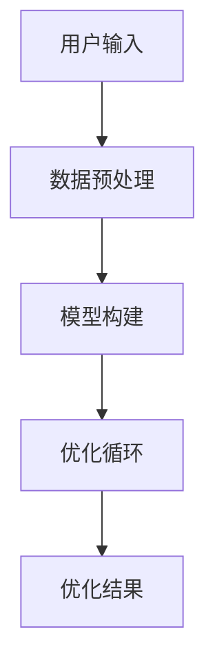

                 


# 贝叶斯优化：调整AI Agent的超参数

> 关键词：贝叶斯优化，超参数调优，AI Agent，机器学习，高斯过程回归

> 摘要：贝叶斯优化是一种高效且强大的方法，用于优化AI Agent的超参数。本文从贝叶斯优化的基本概念和原理入手，详细分析其在超参数调优中的应用，结合数学模型和实际案例，逐步解析其在AI Agent中的具体实现和优化策略。

---

## 第一部分：贝叶斯优化的背景与基础

### 第1章：贝叶斯优化的背景与概念

#### 1.1 贝叶斯优化的起源与意义

- **优化问题的背景与挑战**
  - 在机器学习和AI领域，超参数的选择对模型性能至关重要。
  - 传统试错法效率低，计算成本高，难以应对高维问题。
  - 贝叶斯优化通过概率建模，有效降低搜索空间，提升优化效率。

- **贝叶斯方法的基本思想**
  - 利用概率模型描述目标函数的不确定性。
  - 通过不断采样和更新模型，逐步缩小最优解的范围。
  - 平衡探索与利用，确保优化过程的高效性。

- **贝叶斯优化的核心概念**
  - 通过构建概率模型，预测目标函数的后验分布。
  - 使用采集函数（Acquisition Function）选择下一个采样点。
  - 适用于黑箱函数优化，无需目标函数的导数信息。

#### 1.2 超参数调优的重要性

- **机器学习模型中的超参数**
  - 学习率、正则化系数、批量大小等，直接影响模型的泛化能力。
  - 超参数选择不当可能导致模型过拟合或欠拟合。

- **超参数对模型性能的影响**
  - 不同超参数的组合会导致模型性能的显著变化。
  - 超参数调优是模型部署前的关键步骤。

- **超参数调优的挑战与解决方案**
  - 试错法的低效性。
  - 自动化调优的需求与贝叶斯优化的优势。

#### 1.3 贝叶斯优化的优势与应用场景

- **贝叶斯优化的优势**
  - 高效性：每次采样都提供新的信息，逐步缩小搜索范围。
  - 灵活性：适用于连续、离散或混合类型的超参数优化。
  - 鲁棒性：对目标函数的噪声具有较强的适应性。

- **贝叶斯优化在AI Agent中的应用**
  - 自然语言处理模型的超参数优化。
  - 强化学习算法的参数调优。
  - 推荐系统的性能优化。

- **其他优化方法的对比**
  - 随机搜索：简单但效率低。
  - 非参数优化：依赖梯度信息，难以处理非可微函数。
  - 贝叶斯优化：结合概率建模与贪心策略，适合复杂场景。

---

## 第二部分：贝叶斯优化的核心概念与原理

### 第2章：贝叶斯优化的核心概念

#### 2.1 贝叶斯优化的核心原理

- **贝叶斯优化的基本流程**
  1. 初始化：选择一些初始的采样点。
  2. 建模：基于已有数据构建概率模型。
  3. 选择下一个采样点：使用采集函数确定最优采样点。
  4. 更新模型：将新数据纳入模型，更新后验分布。
  5. 重复步骤2-4，直到满足终止条件。

- **贝叶斯优化的数学基础**
  - 基于高斯过程回归模型，描述目标函数的后验分布。
  - 使用采集函数（如UCB、EI）选择下一个采样点。

- **贝叶斯优化的核心要素**
  - **先验分布**：对目标函数的初始假设。
  - **后验分布**：基于已有数据更新的概率分布。
  - **采集函数**：衡量潜在采样点的收益，指导搜索方向。

#### 2.2 贝叶斯优化的数学模型

- **高斯过程回归模型**
  - 定义：$f(x) \sim \mathcal{GP}(m(x), k(x, x'))$，其中$m(x)$是均值函数，$k(x, x')$是协方差函数。
  - 后验分布计算：基于已有数据$D = \{(x_i, y_i)\}$，计算后验分布$p(f(x) | D)$。

- **采集函数的数学表达式**
  - **上置信边界（UCB）**：$UCB(x) = \mu(x) + \beta \cdot \sigma(x)$。
  - **预期改进（EI）**：$EI(x) = \mathbb{E}[\max(f(x) - f_{\text{best}}, 0)]$。

#### 2.3 贝叶斯优化的算法实现

- **高斯过程回归的实现步骤**
  1. 初始化数据集$D$。
  2. 定义协方差函数（如RBF核）。
  3. 训练模型，计算后验均值和方差。
  4. 使用采集函数选择下一个采样点$x_{\text{new}}$。
  5. 更新数据集$D$，重复步骤2-4。

---

### 第3章：贝叶斯优化的系统分析与架构设计

#### 3.1 系统架构设计

- **系统功能模块**
  - 数据预处理模块：处理输入数据，构建初始采样点。
  - 模型构建模块：基于高斯过程回归构建概率模型。
  - 优化循环模块：计算采集函数，选择采样点，更新模型。

- **系统架构图**



- **系统接口设计**
  - 输入接口：接收超参数范围和目标函数。
  - 输出接口：返回最优超参数组合。

---

## 第三部分：贝叶斯优化的项目实战

### 第4章：贝叶斯优化的环境安装与实现

#### 4.1 环境安装

- 安装必要的Python库：
  ```bash
  pip install numpy scipy matplotlib GPyOpt
  ```

#### 4.2 核心代码实现

```python
import numpy as np
from GPyOpt import BayesianOptimization
from GPyOpt.core import Objective

# 定义目标函数
def f(x):
    return -(x[0] ** 2 + x[1] ** 2)  # 示例函数：寻找最小值

# 初始化贝叶斯优化器
bo = BayesianOptimization(f=f, 
                         domain=[{'name': 'x1', 'type': 'continuous', 'min': -3, 'max': 3},
                                 {'name': 'x2', 'type': 'continuous', 'min': -3, 'max': 3}])

# 执行优化
bo.run_optimization(max_iter=20)

# 获取最优解
best = bo.get_optimum()
print(best)
```

#### 4.3 代码解读与优化分析

- **目标函数**：定义需要优化的函数$f(x)$。
- **贝叶斯优化器初始化**：指定变量范围和优化目标。
- **优化过程**：通过多次迭代，逐步逼近最优解。
- **结果分析**：输出最优解及其对应的函数值。

---

### 第5章：贝叶斯优化的实际案例分析

#### 5.1 案例背景

- **案例目标**：优化AI Agent的超参数，如学习率和批量大小。
- **数据集**：使用公开数据集，如MNIST或CIFAR-10。
- **优化过程**：
  1. 初始化超参数范围。
  2. 定义目标函数，计算模型性能指标（如准确率）。
  3. 使用贝叶斯优化选择最优超参数组合。

#### 5.2 优化结果分析

- **优化前后的对比**：
  - 优化前：随机选择超参数，模型性能不稳定。
  - 优化后：通过贝叶斯优化找到最优组合，模型性能显著提升。

#### 5.3 总结与启示

- 贝叶斯优化在AI Agent超参数调优中的有效性。
- 优化过程中的关键参数选择与调整。
- 实际应用中的注意事项与优化策略。

---

## 第四部分：贝叶斯优化的最佳实践与小结

### 第6章：贝叶斯优化的最佳实践

#### 6.1 实践中的注意事项

- **采集函数的选择**：根据问题类型选择合适的采集函数。
- **模型的选择**：高斯过程回归是主流选择，但也可尝试其他模型。
- **计算资源的分配**：贝叶斯优化需要多次迭代，确保计算资源充足。

#### 6.2 贝叶斯优化的局限性

- **计算成本**：对于大规模数据，优化过程可能较慢。
- **高维问题**：维度越高，优化难度越大。
- **模型假设**：高斯过程回归对模型假设的敏感性。

#### 6.3 进一步学习与拓展

- **深入学习贝叶斯优化**：阅读相关论文和书籍。
- **尝试其他优化算法**：如遗传算法、模拟退火等。
- **实际项目中的应用**：结合具体场景优化超参数。

---

## 总结

贝叶斯优化是一种高效且强大的超参数调优方法，尤其适用于AI Agent的复杂场景。通过概率建模和采集函数的结合，贝叶斯优化能够在有限的计算资源下，快速找到最优解。本文从理论到实践，详细介绍了贝叶斯优化的核心概念、算法实现和实际应用，为读者提供了全面的指导。希望本文能帮助读者更好地理解和应用贝叶斯优化，提升AI Agent的性能和效率。

