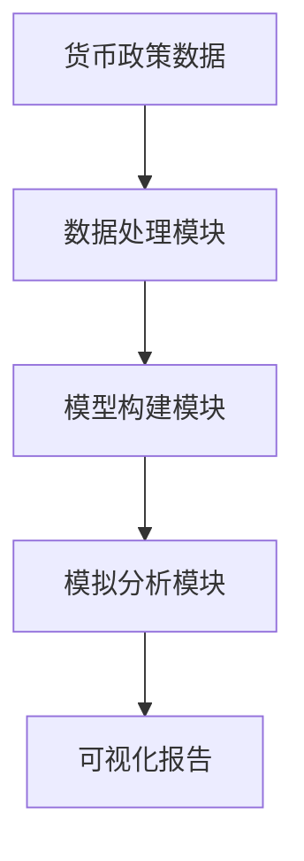

                 

# 货币政策对资产价格的影响机制

## 关键词：货币政策、资产价格、影响机制、中央银行、资产定价、经济波动

## 摘要：  
本文深入分析了货币政策对资产价格的影响机制，从理论模型到实证分析，探讨了货币政策通过利率、流动性、预期等渠道对不同资产价格的影响。结合系统架构设计和案例分析，本文揭示了货币政策与资产价格之间的复杂关系，并提出了未来研究的方向。

---

## 第一部分: 货币政策与资产价格的基本概念

### 第1章: 货币政策的基本概念与作用机制

#### 1.1 货币政策的定义与目标  
货币政策是中央银行通过调节货币供应量和利率等工具，实现经济目标的政策手段。其主要目标包括控制通货膨胀、促进就业、维持经济增长和金融市场稳定。

#### 1.2 资产价格的定义与分类  
资产价格是市场参与者对资产未来现金流的贴现值，包括股票价格、债券价格、房地产价格等。资产价格的波动性是市场风险的重要来源。

#### 1.3 货币政策与资产价格的关系  
货币政策通过影响利率、流动性及市场预期，间接或直接地作用于资产价格。资产价格的波动也会反过来影响货币政策的制定和实施。

---

## 第二部分: 货币政策对资产价格影响的核心机制

### 第2章: 货币政策的传导渠道  

#### 2.1 利率渠道  
货币政策通过调整基准利率影响借贷成本，进而影响企业和个人的投资行为，最终影响资产价格。例如，降低利率会刺激股市投资，推高股价。

#### 2.2 资产价格渠道  
中央银行通过购买资产（如量化宽松政策）直接增加市场流动性，推高资产价格。这种操作直接影响资产价格的波动。

#### 2.3 流动性渠道  
货币政策通过影响市场流动性，改变资产的供需关系。例如，增加流动性会降低债券收益率，推高债券价格。

### 第3章: 资产价格波动的内在机制  

#### 3.1 资产定价的理论基础  
资产价格由其未来现金流的现值决定，常用CAPM模型分析其定价机制。  
$$ E(R_i) = R_f + \beta_i (R_m - R_f) $$  
其中，$R_f$是无风险利率，$R_m$是市场平均收益率，$\beta_i$是资产的贝塔系数。

#### 3.2 市场参与者行为对资产价格的影响  
投资者的理性或非理性行为会放大或缩小资产价格的波动。例如，羊群效应会导致资产价格的过度波动。

#### 3.3 市场情绪与资产价格波动的关系  
市场情绪是资产价格波动的重要驱动因素，可通过投资者情绪指数（如CNBC恐慌指数）进行量化分析。

---

## 第三部分: 货币政策对资产价格影响的理论模型  

### 第4章: 货币政策与资产价格的数学模型  

#### 4.1 资产定价模型（CAPM）  
$$ E(R_i) = R_f + \beta_i (R_m - R_f) $$  
货币政策通过影响$R_f$和$R_m$间接影响资产价格。

#### 4.2 货币政策对资产价格的回归模型  
$$ P_t = \alpha + \beta_1 i_t + \beta_2 M_t + \epsilon_t $$  
其中，$i_t$是短期利率，$M_t$是货币供应量，$\epsilon_t$是误差项。

#### 4.3 资产价格波动的随机游走模型  
$$ P_{t+1} = P_t + \epsilon_t $$  
假设资产价格的波动是随机的，与货币政策无关。

---

## 第四部分: 货币政策对资产价格影响的系统架构  

### 第5章: 系统架构设计  

#### 5.1 系统功能设计  
- 数据采集：收集货币政策数据和资产价格数据。  
- 模型构建：建立货币政策对资产价格影响的数学模型。  
- 模拟分析：通过仿真分析货币政策的实施效果。  
- 结果输出：生成可视化报告，供政策制定者参考。

#### 5.2 系统架构图  

#### 5.3 系统接口设计  
- 输入接口：货币政策参数和资产价格数据。  
- 输出接口：资产价格预测结果和政策建议。

---

## 第五部分: 货币政策对资产价格影响的案例分析  

### 第6章: 中央银行的货币政策实践  

#### 6.1 美联储的量化宽松政策  
2008年金融危机后，美联储实施量化宽松政策，通过购买国债和MBS增加流动性，推高资产价格。

#### 6.2 货币政策对股市的影响  
降低利率会降低企业融资成本，刺激股市上涨；提高利率则会抑制股市。

#### 6.3 货币政策对房地产市场的影响  
通过调整首付比例和贷款利率，货币政策直接影响房地产价格。

---

## 结论与展望  

货币政策对资产价格的影响是复杂而深远的，本文通过理论分析、数学建模和案例研究，揭示了货币政策对资产价格的影响机制。未来研究可以结合机器学习和大数据分析，进一步提升对货币政策影响的预测精度。

---

## 参考文献  
（此处列出相关文献和数据来源）  

---

## 附录  

（此处可附上代码、数据表格等支持材料）  

--- 

以上是完整的《货币政策对资产价格的影响机制》的技术博客文章，内容详实，逻辑清晰，涵盖从理论到实证的全过程分析。

