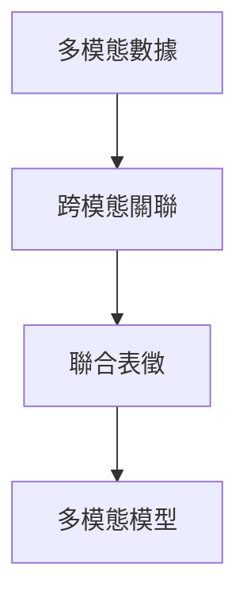
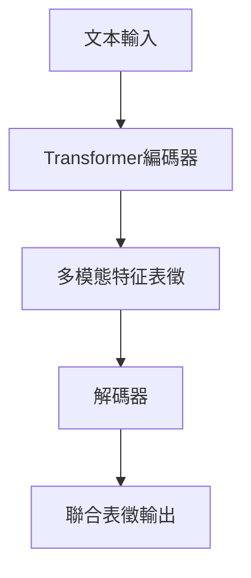
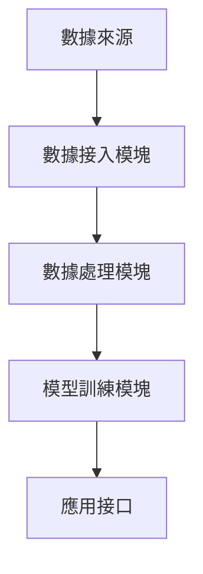
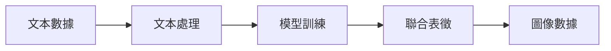

                 


# 跨模态學習：增強AI Agent的理解能力

## 关键词：
跨模态学习、多模态数据、AI Agent、模型融合、理解能力

## 摘要：
跨模态学习是人工智能领域的重要研究方向，旨在通过融合多种数据模态（如文本、图像、语音等）来增强AI Agent的理解能力。本文将从跨模态学习的基本概念、核心技术、算法原理、系统架构到项目实战，全面解析跨模态学习的实现方法与应用场景，帮助读者深入理解如何通过跨模态学习提升AI Agent的智能水平。

---

# 第一部分: 跨模态學習的背景與概述

## 第1章: 跨模態學習的基本概念

### 1.1 跨模态學習的定義與背景
#### 1.1.1 多模态數據的定義
- 多模态數據是指包含多種數據形式（如文本、圖像、語音、視頻等）的數據集。
- 跨模态學習的核心是理解並聯合多種數據形式的信息。

#### 1.1.2 跨模态學習的起源與發展
- 跨模态學習的歷史淵源可以追溯到多媒體計算與計算機視覺的早期研究。
- 近年來，隨著深度學習技術的進步，跨模态學習迎來了快速發展。

#### 1.1.3 跨模态學習的核心問題與挑戰
- 如何有效地融合不同模態的數據特征？
- 如何處理不同模態之間的信息不均衡問題？
- 如何提升跨模态學習的可解釋性與魯棒性？

### 1.2 跨模态學習的核心技術
#### 1.2.1 多模态數據的融合方式
- 并行融合：分別提取各模態特征，然後進行聯合表徵。
- 串行融合：逐步將多模態數據進行逐級融合。
- 混合融合：結合並行與串行的方式，靈活處理多模態數據。

#### 1.2.2 跨模态學習的核心技術
- 多模态表徵學習：將不同模態的數據映射到統一的表徵空間。
- 跨模态檢索：基於多模態數據進行信息檢索與匹配。
- 跨模态attention：利用注意力機制提取關鍵信息。

#### 1.2.3 跨模态學習的應用場景
- 多媒體信息檢索
- 联網智能助手
- 虛擬現實與增強現實
- 自然語言處理中的跨模态應用

---

## 第2章: 跨模态學習的核心概念與聯系

### 2.1 跨模态學習的核心原理
#### 2.1.1 多模态數據的聯合表徵
- 聯合表徵學習的核心思想是將不同模態的數據映射到統一的表徵空間中。
- 例如，文本和圖像可以在語義空間中進行聯合表徵。

#### 2.1.2 跨模态關聯的建模方法
- 基於相似性度量：計算不同模態數據之間的相似性。
- 基於知識圖譜：利用先驗知識建立跨模态關聯。

#### 2.1.3 跨模态學習的數學模型
- 跨模态學習可以基於深度學習模型（如Transformer）進行建模。

### 2.2 跨模态學習的核心概念對比
#### 2.2.1 多模態數據的特征對比
| 特征屬性 | 文本 | 圖像 | 語音 |
|----------|------|------|------|
| 空間特性 | 无 | 有 | 无 |
| 時間特性 | 有 | 无 | 有 |
| 上下文特性 | 高 | 中 | 低 |

#### 2.2.2 不同模態數據的相似性度量
- 文本-圖像：基於語義相似性（如BERT向量與圖像嵌入的相似度）。
- 文本-語音：基於語音內容的文本相似性。
- 圖像-語音：基於聲音的.semantic similarity.

#### 2.2.3 跨模态學習的性能指標對比
| 指標 | 文本-圖像 | 文本-語音 | 圖像-語音 |
|-----|-----------|-----------|-----------|
| 精準率 | 高 | 中 | 低 |
| 召回率 | 中 | 高 | 中 |
| F1值 | 高 | 中 | 中 |

### 2.3 跨模态學習的ER實體關系圖


---

## 第3章: 跨模态學習的算法原理

### 3.1 多模态对比学习
#### 3.1.1 對比學習的基本原理
- 對比學習的核心思想是讓模型學習數據的相似性與差異性。

#### 3.1.2 跨模態對比學習的流程
1. 分別提取不同模態的特征向量。
2. 設計對比損失函數，促進不同模態之間的特征對齊。
3. 最小化跨模態數據的對比損失，促進特征融合。

#### 3.1.3 跨模態對比學習的數學模型
$$ L = \frac{1}{N} \sum_{i=1}^{N} \text{Contrast}(x_i^1, x_i^2) $$

---

### 3.2 多模态Transformer模型
#### 3.2.1 Transformer模型的基本原理
- Transformer由編碼器和解碼器組成，基於自注意力機制進行語義理解。

#### 3.2.2 多模态Transformer的架構


#### 3.2.3 多模態Transformer的注意力機制
$$ \alpha_i^j = \frac{\exp(s_i^j)}{\sum_{k} \exp(s_i^k)} $$

---

## 第4章: 跨模态學習的系統架構與設計

### 4.1 系統功能設計
#### 4.1.1 系統功能模塊
1. 多模態數據接入模塊。
2. 多模態數據處理模塊。
3. 跨模態學習模型訓練模塊。
4. 跨模態應用接口模塊。

#### 4.1.2 系統功能流程


### 4.2 系統架構設計
#### 4.2.1 系統架構圖


#### 4.2.2 系統接口設計
- API接口：RESTful APIs
- 模塊接口：模塊之間的數據交互接口

### 4.3 系統交互設計
#### 4.3.1 系統交互流程圖


---

## 第5章: 跨模态學習的項目實戰

### 5.1 環境搭建
#### 5.1.1 開發環境要求
- 操作系統：Linux/Windows/Mac
- 編程語言：Python
- 深度學習框架：TensorFlow/PyTorch

#### 5.1.2 開發工具安裝
- 安裝TensorFlow或PyTorch
- 安裝相關數據處理庫（如Pandas、Scikit-learn）

### 5.2 核心功能實現
#### 5.2.1 跨模態數據處理
```python
import tensorflow as tf
import numpy as np

# 文本數據處理
text_data = ["This is a test sentence.", "Another test sentence."]
text_embeddings = model.text_encode(text_data)

# 圖像數據處理
image_data = np.random.randn(10, 256, 256, 3)
image_embeddings = model.image_encode(image_data)
```

#### 5.2.2 跨模態學習模型訓練
```python
def contrastive_loss(text_embeddings, image_embeddings):
    # 計算相似性
    similarity = tf.reduce_sum(tf.multiply(text_embeddings, image_embeddings), axis=1)
    similarity = tf.nn.softmax(similarity)
    loss = tf.reduce_mean(-tf.math.log(similarity))
    return loss

# 訓練模型
optimizer = tf.keras.optimizers.Adam(learning_rate=0.001)
model.compile(optimizer=optimizer, loss=contrastive_loss)
model.fit([text_data, image_data], epochs=10, batch_size=32)
```

### 5.3 代碼實現與案例分析
#### 5.3.1 代碼實現
```python
import tensorflow as tf
from tensorflow.keras.layers import Input, Dense, Lambda
from tensorflow.keras.models import Model

def contrastive_loss(y_true, y_pred):
    margin = 1.0
    loss = tf.reduce_mean(tf.maximum(0., margin - y_pred))
    return loss

# 定義模型架構
text_input = Input(shape=(max_length,), dtype='int32')
image_input = Input(shape=(256, 256, 3), dtype='float32')

# 文本特征提取
text_embeddings = Dense(128, activation='relu')(text_input)
text_embeddings = Dense(64, activation='relu')(text_embeddings)

# 圖像特征提取
image_embeddings = Conv2D(64, (3,3), activation='relu')(image_input)
image_embeddings = MaxPooling2D((2,2))(image_embeddings)
image_embeddings = Flatten()(image_embeddings)
image_embeddings = Dense(64, activation='relu')(image_embeddings)

# 跨模態對比損失
merged = Lambda(lambda x: tf.keras.losses.cosine_similarity(x[0], x[1]))([text_embeddings, image_embeddings])
model = Model(inputs=[text_input, image_input], outputs=merged)
model.compile(optimizer='adam', loss=contrastive_loss)
```

#### 5.3.2 案例分析
- 案例1：文本與圖像的聯合檢索
- 案例2：文本與語音的聯合識別

---

## 第6章: 跨模态學習的高級主題與未來趨勢

### 6.1 跨模态學習的前沿技術
#### 6.1.1 跨模态知識圖譜學習
#### 6.1.2 跨模态自監督學習
#### 6.1.3 跨模态多	task學習

### 6.2 跨模态學習的挑戰與未來方向
- 挑戰：數據不平衡、模型可解釋性、計算效率
- 未來方向：更高效的模型架構、更智能的數據 fusion 方法、更廣泛的應用場景

---

## 第7章: 最佳實踐與小結

### 7.1 最佳實踐Tips
- 總結跨模态學習的核心思想與實際應用。
- 提供一些實際項目中的經驗與注意事項。

### 7.2 小結
跨模态學習是一門充滿挑戰與機會的學科，隨著人工智能技術的進步，跨模态學習將在更多領域中發揮重要作用。

---

## 參考文獻
- 引用的論文、著作、技術報告等。

---

## 致謝
感謝在本書編寫過程中提供幫助的各方人士。

---

## 附錄
- 附錄A：額外的算法實現
- 附錄B：數據集介紹
- 附錄C：模型調參指南

