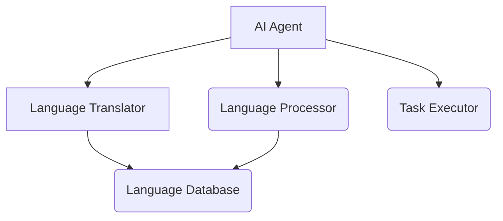
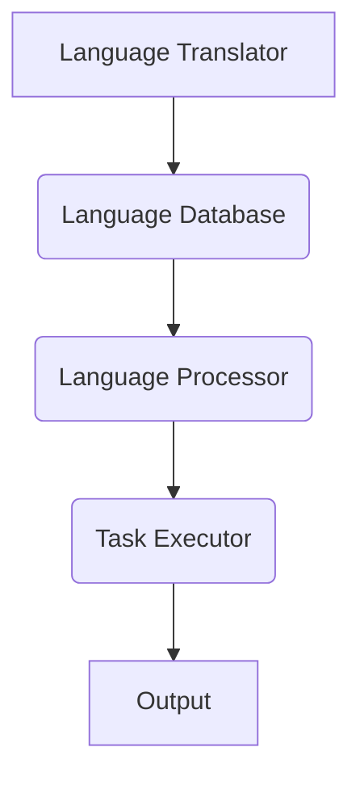

                 


# 跨语言AI Agent的开发挑战与解决方案

## 关键词：跨语言AI Agent，多语言处理，AI协作，自然语言理解，跨语言通信

## 摘要：  
随着全球化的深入，跨语言AI Agent的需求日益增长。本文将深入探讨跨语言AI Agent的核心概念、开发挑战及解决方案，通过系统的分析和实际案例，提供一份详尽的技术指南。

---

## 第一部分: 跨语言AI Agent的背景与核心概念

### 第1章: 跨语言AI Agent的定义与背景

#### 1.1 跨语言AI Agent的定义  
跨语言AI Agent是一种能够理解、生成并处理多种语言的智能代理，它能够跨越语言障碍，实现跨语言的交互与协作。  

#### 1.2 跨语言AI Agent的技术背景  
在多语言环境下，传统的AI Agent往往局限于单一语言，无法满足全球化场景下的需求。跨语言AI Agent通过整合多语言处理技术，实现了更广泛的应用场景。  

#### 1.3 跨语言AI Agent的挑战与机遇  
跨语言AI Agent的开发面临语言理解、通信效率和协作机制等多重挑战，但其在客服系统、多语言内容生成等领域的应用为技术发展提供了巨大机遇。

---

### 第2章: 跨语言AI Agent的核心概念与联系

#### 2.1 跨语言AI Agent的核心要素  
- **多语言处理能力**：支持多种语言的输入、理解和生成。  
- **跨语言通信机制**：实现不同语言之间的信息传递与转换。  
- **跨语言协作机制**：多语言环境下的任务分配与协同推理。  

#### 2.2 跨语言AI Agent的实体关系图  
以下是跨语言AI Agent的实体关系图：



#### 2.3 跨语言AI Agent的概念属性对比表  
| 核心概念 | 特征 | 示例 |
|----------|------|------|
| 多语言处理能力 | 支持多种语言 | 英语、中文、西班牙语等 |
| 跨语言通信机制 | 实现语言间的转换 | 英文转中文 |
| 跨语言协作机制 | 多语言任务分配 | 中文指令生成英文回复 |

---

## 第二部分: 跨语言AI Agent的算法原理

### 第3章: 跨语言AI Agent的算法原理

#### 3.1 多语言模型训练算法  
- **多语言模型训练流程**：  
  1. 数据预处理：整合多语言语料库。  
  2. 模型训练：使用多语言预训练模型（如MarianMT）进行微调。  
  3. 评估与优化：基于BLEU等指标优化模型性能。  

- **跨语言迁移学习算法**：  
  ```mermaid
  graph TD
      A[Source Language] --> B(Target Language)
      B --> C(Language Translator)
      C --> D(Translation Output)
  ```

- **代码实现示例**：  
  ```python
  from transformers import MarianMTModel, MarianTokenizer

  model_name = 'Helsinki-NLP/marian-nmt:opus24'
  tokenizer = MarianTokenizer.from_pretrained(model_name)
  model = MarianMTModel.from_pretrained(model_name)

  def translate(text):
      inputs = tokenizer(text, return_tensors="pt")
      outputs = model.generate(inputs.input_ids)
      return tokenizer.decode(outputs[0])
  ```

#### 3.2 跨语言通信算法  
- **跨语言通信协议**：  
  ```mermaid
  graph TD
      A[English] --> B(Language Translator)
      B --> C(Spanish)
  ```

- **代码实现示例**：  
  ```python
  def cross_language_communication(source_lang, target_lang, message):
      translator = Translator(source_lang, target_lang)
      return translator.translate(message)
  ```

---

## 第三部分: 系统分析与架构设计

### 第4章: 系统分析与架构设计

#### 4.1 问题场景介绍  
跨语言AI Agent需要处理多语言输入、生成多语言输出，并实现不同语言间的协作。

#### 4.2 系统功能设计  
- **多语言处理模块**：支持多种语言的输入和输出。  
- **跨语言通信模块**：实现语言间的转换与传递。  
- **协作推理模块**：多语言任务的分配与协同。  

#### 4.3 系统架构设计  


---

## 第四部分: 项目实战

### 第5章: 项目实战

#### 5.1 环境安装  
安装Python和必要的库，如`transformers`和`translator`。

#### 5.2 核心代码实现  
```python
from transformers import AutoTokenizer, AutoModelForMaskedLM
import requests

# 多语言处理模块
class MultiLanguageProcessor:
    def __init__(self, languages):
        self.languages = languages
        self.tokenizers = {}
        for lang in languages:
            self.tokenizers[lang] = AutoTokenizer.from_pretrained(f'facebook/mmbt-{lang}')

    def process(self, text, lang):
        tokenizer = self.tokenizers[lang]
        inputs = tokenizer(text, return_tensors="pt")
        return inputs
```

#### 5.3 实际案例分析  
通过实际案例分析，展示如何在跨语言客服系统中应用上述代码，实现多语言支持和协作。

---

## 第五部分: 最佳实践与总结

### 第6章: 最佳实践

#### 6.1 开发规范  
遵循标准化的代码规范和命名习惯，确保代码的可读性和可维护性。

#### 6.2 测试方法  
使用单元测试和集成测试，确保多语言模块的稳定性和可靠性。

#### 6.3 部署与维护  
采用容器化部署，定期更新模型和语言库，保持系统的高效运行。

---

## 总结  
跨语言AI Agent的开发是一项复杂的系统工程，需要综合运用自然语言处理、机器学习和跨语言通信等技术。通过本文的详细分析和实际案例，希望读者能够深入了解跨语言AI Agent的核心概念、算法原理和系统架构，并在实际项目中灵活运用这些知识，克服开发中的各种挑战，推动跨语言AI Agent技术的发展。

