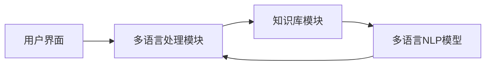
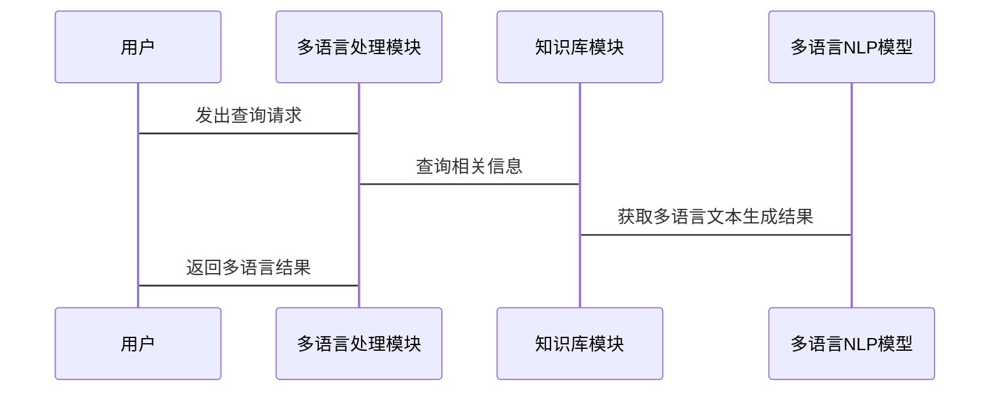

                 


# 跨语言AI Agent：突破语言障碍的智能助手

> 关键词：跨语言AI Agent, 自然语言处理, 多语言模型, 跨语言通信, AI助手

> 摘要：本文深入探讨了跨语言AI Agent的设计与实现，从背景分析到算法原理，再到系统架构与项目实战，全面解析了如何构建能够突破语言障碍的智能助手。通过详细的技术分析和实际案例，展示了跨语言AI Agent在解决企业合作、国际交流中的语言障碍问题中的潜力和应用。

---

## 第一部分：背景与概述

### 第1章：跨语言AI Agent的背景与概述

#### 1.1 跨语言AI Agent的背景

- **1.1.1 全球化背景下的语言障碍问题**
  - 在全球化背景下，跨语言交流的需求日益增加。企业合作、国际会议、多语言客户支持等场景中，语言障碍成为效率提升的瓶颈。
  - 例如，跨国企业在内部沟通时，员工可能需要使用多种语言，导致信息传递的延迟和误解。

- **1.1.2 AI技术的发展与跨语言需求的结合**
  - 自然语言处理（NLP）技术的快速发展为跨语言交流提供了技术支持。
  - 多语言模型（如多语言BERT）的出现，使得AI能够同时理解和生成多种语言，为跨语言AI Agent的实现奠定了基础。

- **1.1.3 跨语言AI Agent的应用场景与潜力**
  - 应用场景包括跨国企业的内部沟通、国际客服支持、多语言内容生成等。
  - 潜力在于能够显著提升跨语言交流的效率，减少因语言障碍导致的错误和误解。

#### 1.2 问题背景与描述

- **1.2.1 语言障碍对企业合作和国际交流的影响**
  - 语言障碍可能导致信息传递不准确，影响决策效率。
  - 在跨国团队中，语言不通可能导致沟通不畅，影响项目进度。

- **1.2.2 当前跨语言工具的局限性**
  - 现有的翻译工具往往仅能提供机械翻译，缺乏语境理解和上下文推理能力。
  - 例如，谷歌翻译等工具在处理复杂句子时，容易出现语法错误和语义偏差。

- **1.2.3 跨语言AI Agent的目标与核心问题**
  - 目标是构建一个能够理解、生成多种语言，并具备一定推理能力的智能助手。
  - 核心问题在于如何实现跨语言的语义理解和准确的信息传递。

#### 1.3 跨语言AI Agent的解决思路

- **1.3.1 利用NLP技术实现多语言处理**
  - 基于预训练的语言模型（如BERT、GPT），训练多语言模型，使其能够处理多种语言的文本。
  - 例如，使用多语言BERT模型进行跨语言文本表示。

- **1.3.2 结合机器学习模型进行跨语言推理**
  - 利用监督学习或无监督学习，训练模型在不同语言间进行信息推理。
  - 例如，通过跨语言迁移学习，利用一种语言的数据来提升另一种语言的性能。

- **1.3.3 融合知识图谱构建跨语言语义理解**
  - 通过构建多语言知识图谱，增强模型对不同语言语义的理解能力。
  - 例如，使用Wikidata等多语言知识库，帮助模型在跨语言场景下进行语义匹配。

#### 1.4 跨语言AI Agent的边界与外延

- **1.4.1 与传统翻译工具的区别**
  - 传统翻译工具仅能提供简单的文本翻译，而跨语言AI Agent能够理解上下文，并提供更智能的交互。
  - 例如，翻译工具无法处理歧义句子，而AI Agent可以根据上下文进行推理。

- **1.4.2 与其他跨语言服务（如API）的关系**
  - 跨语言AI Agent可以集成现有的跨语言API（如翻译API、NLP API）作为其功能模块。
  - 例如，AI Agent可以调用翻译API进行文本翻译，再结合自身的推理能力生成更准确的响应。

- **1.4.3 跨语言AI Agent的扩展应用领域**
  - 除了企业沟通，还可以应用于教育、医疗、旅游等多个领域。
  - 例如，在旅游场景中，AI Agent可以为用户提供多语言的景点信息查询服务。

#### 1.5 核心概念结构与组成要素

- **1.5.1 核心概念的层次结构**
  - 核心概念包括：跨语言理解、跨语言生成、跨语言推理。
  - 这些概念共同构建了跨语言AI Agent的核心能力。

- **1.5.2 组成要素的详细说明**
  - 多语言NLP模型：负责处理多种语言的文本理解与生成。
  - 跨语言推理模块：负责在不同语言间进行逻辑推理。
  - 多语言知识库：提供跨语言的知识支持。

- **1.5.3 概念之间的关系与相互作用**
  - 多语言NLP模型为跨语言推理提供基础的语言表示。
  - 跨语言推理模块利用知识库中的信息，进行跨语言的逻辑推理。
  - 例如，在处理跨语言查询时，模型先通过多语言NLP模型理解输入，再通过推理模块结合知识库生成准确的响应。

---

## 第二部分：跨语言AI Agent的核心概念与联系

### 第2章：核心概念与联系

#### 2.1 跨语言AI Agent的核心概念

- **2.1.1 多语言处理模型**
  - 多语言处理模型能够同时理解和生成多种语言的文本。
  - 例如，多语言BERT模型可以在多种语言上进行文本表示和分类。

- **2.1.2 跨语言通信模型**
  - 跨语言通信模型专注于在不同语言间进行信息传递和理解。
  - 例如，使用跨语言迁移学习，训练模型在一种语言上表现良好的情况下，能够在另一种语言上同样表现良好。

- **2.1.3 跨语言文化适应性模块**
  - 该模块负责处理不同语言和文化背景下的语义差异。
  - 例如，中文和英文在表达某些概念时可能存在差异，模块需要能够识别并适应这些差异。

#### 2.2 跨语言AI Agent的核心概念属性特征对比

| 概念                | 输入/输出 | 实现方法                     | 应用场景                         |
|---------------------|-----------|-----------------------------|----------------------------------|
| 多语言处理模型      | 多语言文本 | 预训练多语言模型             | 跨语言翻译、多语言问答           |
| 跨语言通信模型      | 多语言文本 | 跨语言迁移学习               | 跨语言信息检索、跨语言对话       |
| 跨语言文化适应性模块 | 多语言文本 | 基于知识图谱的文化适应性训练 | 多语言内容生成、文化敏感性交互   |

#### 2.3 跨语言AI Agent的核心概念ER实体关系图


---

## 第三部分：跨语言AI Agent的算法原理

### 第3章：算法原理讲解

#### 3.1 多语言模型训练算法

- **3.1.1 多语言模型训练流程**
  - 数据预处理：收集和整理多语言语料库，进行分词、标记化等处理。
  - 模型构建：基于预训练语言模型，构建多语言版本。
  - 模型训练：使用多语言数据进行微调，优化模型在多种语言上的表现。

- **3.1.2 多语言模型训练的数学公式**

  ```latex
  \text{损失函数} = \sum_{i=1}^{N} \text{交叉熵损失}(y_i, \hat{y}_i)
  $$

  其中，交叉熵损失用于衡量模型预测值与真实值之间的差异，公式如下：

  ```latex
  \text{交叉熵损失} = -\sum_{i=1}^{M} y_i \log(\hat{y}_i)
  ```

- **3.1.3 代码实现**
  - 使用Hugging Face的Transformers库训练多语言模型。

  ```python
  from transformers import AutoTokenizer, AutoModelForMaskedLM

  model_name = "bert-base-multilingual-cased"
  tokenizer = AutoTokenizer.from_pretrained(model_name)
  model = AutoModelForMaskedLM.from_pretrained(model_name)
  ```

#### 3.2 跨语言迁移学习算法

- **3.2.1 跨语言迁移学习的流程**
  - 在源语言上进行预训练，提升模型在源语言上的性能。
  - 在目标语言上进行微调，利用源语言的知识提升目标语言的性能。

- **3.2.2 跨语言迁移学习的数学公式**

  ```latex
  \theta_{\text{target}} = f(\theta_{\text{source}}, \lambda)
  ```

  其中，θ_target为目标语言模型的参数，θ_source为源语言模型的参数，λ为超参数。

- **3.2.3 代码实现**
  - 使用PyTorch进行跨语言迁移学习。

  ```python
  import torch
  from torch.utils.data import Dataset, DataLoader

  class MultiLanguageDataset(Dataset):
      def __init__(self, texts, labels, tokenizer):
          self.texts = texts
          self.labels = labels
          self.tokenizer = tokenizer

      def __len__(self):
          return len(self.texts)

      def __getitem__(self, idx):
          text = self.texts[idx]
          label = self.labels[idx]
          encoding = self.tokenizer(text, padding=True, truncation=True, return_tensors='pt')
          return encoding['input_ids'], encoding['attention_mask'], label

  # 初始化数据集和数据加载器
  dataset = MultiLanguageDataset(texts, labels, tokenizer)
  dataloader = DataLoader(dataset, batch_size=8, shuffle=True)
  ```

---

## 第四部分：跨语言AI Agent的系统架构设计

### 第4章：系统分析与架构设计方案

#### 4.1 跨语言AI Agent的系统功能设计

- **4.1.1 用户界面模块**
  - 提供多语言输入输出界面，支持多种语言的文本输入和结果展示。
  - 例如，用户可以通过中文输入问题，AI Agent以英文生成回答。

- **4.1.2 多语言处理模块**
  - 负责对输入文本进行多语言理解，生成对应的多语言响应。
  - 使用多语言NLP模型进行文本处理。

- **4.1.3 知识库模块**
  - 维护多语言知识图谱，支持跨语言语义理解。
  - 例如，知识库包含多种语言的事实知识，支持跨语言信息检索。

#### 4.2 跨语言AI Agent的系统架构图



#### 4.3 系统接口设计

- **输入接口：**
  - 支持多种语言的文本输入和查询请求。
  - 例如，用户输入“如何预约会议？”（中文），系统理解并生成英文的预约步骤。

- **输出接口：**
  - 提供多语言的文本输出和结果展示。
  - 例如，系统以英文生成回复，并支持用户选择其他语言进行展示。

#### 4.4 系统交互流程图



---

## 第五部分：跨语言AI Agent的项目实战

### 第5章：项目实战

#### 5.1 环境安装

- 安装必要的库：
  ```bash
  pip install transformers torch numpy
  ```

- 安装Hugging Face的Transformers库：
  ```bash
  pip install transformers
  ```

#### 5.2 系统核心实现代码

- 多语言NLP模型加载：
  ```python
  from transformers import AutoTokenizer, AutoModelForMaskedLM

  model_name = "bert-base-multilingual-cased"
  tokenizer = AutoTokenizer.from_pretrained(model_name)
  model = AutoModelForMaskedLM.from_pretrained(model_name)
  ```

- 多语言处理模块实现：
  ```python
  def process_input(input_text):
      inputs = tokenizer(input_text, return_tensors="pt", padding=True, truncation=True)
      outputs = model(**inputs)
      return outputs
  ```

#### 5.3 代码应用解读与分析

- **输入处理：**
  - 使用多语言分词器对输入文本进行处理，生成模型可接受的格式。

- **模型推理：**
  - 调用预训练的多语言模型进行文本生成或理解任务。

- **结果处理：**
  - 对模型输出进行解码，生成人类可读的响应。

#### 5.4 实际案例分析

- **案例：跨语言信息检索**
  - 用户输入中文问题：“如何提高英语写作能力？”
  - 系统通过多语言处理模块理解问题，调用知识库模块进行检索，生成英文的详细回答。

- **案例：跨语言对话**
  - 用户输入英文问题：“What is machine learning?”
  - 系统理解后，以中文生成解释：“机器学习是一种人工智能技术，通过数据训练模型进行预测。”

#### 5.5 项目小结

- 通过项目实战，验证了跨语言AI Agent的可行性。
- 展示了如何利用现有的NLP库和模型构建高效的跨语言智能助手。

---

## 第六部分：跨语言AI Agent的总结与展望

### 第6章：总结与展望

#### 6.1 核心内容总结

- 跨语言AI Agent通过结合多语言NLP模型和跨语言推理能力，能够有效解决语言障碍问题。
- 通过预训练模型、跨语言迁移学习和知识图谱构建，提升了AI Agent的多语言理解和生成能力。

#### 6.2 最佳实践 tips

- **数据质量：** 确保多语言数据的多样性和平衡性，避免某一语言数据不足导致模型性能下降。
- **模型选择：** 根据具体应用场景选择合适的多语言模型，例如选择适合文本生成的模型或适合文本分类的模型。
- **性能优化：** 在模型训练和推理过程中，注意优化模型的计算效率和响应速度。

#### 6.3 注意事项

- **语言差异：** 注意不同语言之间的语法、词汇和语义差异，避免模型在处理某些语言时出现错误。
- **文化敏感性：** 在设计跨语言AI Agent时，需要考虑不同文化背景下的语义差异，避免生成不适当的内容。

#### 6.4 未来的发展方向

- **多模态AI Agent：** 结合视觉、语音等多种模态信息，提升AI Agent的交互能力。
- **实时跨语言交互：** 提升AI Agent的实时响应能力，支持更高效的跨语言交流。
- **自适应学习：** 引入自适应学习机制，使AI Agent能够根据用户反馈不断优化自己的性能。

---

## 结语

通过本文的详细分析和实战演示，我们展示了如何构建一个能够突破语言障碍的跨语言AI Agent。从背景分析到算法实现，从系统架构到项目实战，我们全面解析了跨语言AI Agent的设计与实现过程。未来，随着NLP技术和AI技术的不断进步，跨语言AI Agent将在更多领域发挥重要作用，为人类的跨语言交流带来更大的便利。

