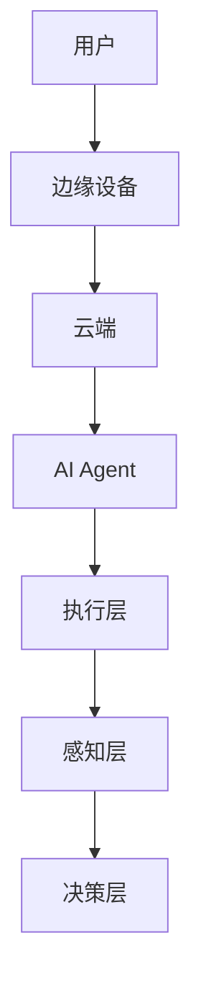

                 

# 边缘计算在AI Agent中的应用

> 关键词：边缘计算、AI Agent、分布式系统、自然语言处理、实时决策

> 摘要：本文详细探讨了边缘计算在AI Agent中的应用，从边缘计算的基本概念和AI Agent的核心原理出发，分析了两者结合的优势和应用场景。通过实际案例和系统设计，展示了如何利用边缘计算提升AI Agent的实时性和响应速度。文章内容涵盖背景介绍、核心概念、算法原理、系统架构设计以及项目实战，帮助读者全面理解边缘计算在AI Agent中的重要性。

---

# 第一部分: 边缘计算与AI Agent概述

## 第1章: 边缘计算与AI Agent的基本概念

### 1.1 边缘计算的定义与特点

边缘计算是一种分布式计算范式，将计算能力从云端扩展到数据源的边缘。与传统的云计算模式不同，边缘计算强调在靠近数据生成的位置进行数据处理，减少了数据传输的延迟和带宽消耗。

#### 1.1.1 边缘计算的定义

边缘计算是指在靠近数据源的设备或节点上进行数据处理和计算的技术。这些设备通常被称为边缘设备，包括传感器、智能终端、边缘服务器等。边缘计算的核心思想是“数据不出门”，即尽可能在边缘完成数据处理，减少对云端的依赖。

#### 1.1.2 边缘计算的核心特点

1. **实时性**：边缘计算能够快速响应本地事件，减少延迟。
2. **带宽优化**：通过在边缘处理数据，减少向云端传输的数据量。
3. **分布式架构**：边缘计算采用分布式架构，能够灵活扩展。
4. **本地化决策**：边缘设备能够独立完成部分决策，减少对云端的依赖。

#### 1.1.3 边缘计算与云计算的区别

| 特性       | 边缘计算               | 云计算                 |
|------------|-----------------------|-----------------------|
| 数据处理位置 | 边缘设备               | 云端                   |
| 延迟         | 低延迟                 | 高延迟                 |
| 带宽消耗     | 低                     | 高                     |
| 适用场景     | 实时性要求高的场景       | 计算资源需求高的场景     |

### 1.2 AI Agent的定义与特点

AI Agent（智能代理）是一种能够感知环境、自主决策并执行任务的智能实体。AI Agent可以是软件程序，也可以是物理设备，其核心目标是通过与环境交互，完成特定任务。

#### 1.2.1 AI Agent的定义

AI Agent是一种具有智能性的实体，能够感知环境、理解用户需求、自主决策并执行任务。AI Agent可以分为两类：基于规则的Agent和基于模型的Agent。前者通过预定义的规则进行决策，后者通过学习和推理来动态调整行为。

#### 1.2.2 AI Agent的核心特点

1. **自主性**：AI Agent能够在没有外部干预的情况下自主完成任务。
2. **反应性**：AI Agent能够实时感知环境并做出反应。
3. **学习能力**：基于机器学习的AI Agent能够通过数据不断优化自身行为。
4. **交互能力**：AI Agent能够与用户或其他系统进行自然语言交互。

#### 1.2.3 AI Agent与传统AI的区别

| 特性       | AI Agent               | 传统AI                 |
|------------|-----------------------|-----------------------|
| 自主性       | 高                     | 低                     |
| 交互能力     | 强                     | 弱                     |
| 适应性       | 强                     | 低                     |
| 应用场景     | 个性化服务、智能助手     | 数据分析、模式识别       |

### 1.3 边缘计算在AI Agent中的应用背景

边缘计算与AI Agent的结合，能够充分发挥边缘计算的实时性和AI Agent的智能性，为各种应用场景提供更高效、更智能的解决方案。

#### 1.3.1 边缘计算与AI Agent的结合意义

1. **降低延迟**：通过在边缘设备上进行AI推理，减少数据传输到云端的时间，提高实时响应能力。
2. **提升效率**：边缘计算能够分担云端的计算压力，提高整体系统的处理效率。
3. **增强隐私**：通过在边缘设备上处理数据，可以减少敏感数据的外泄风险。

#### 1.3.2 边缘计算在AI Agent中的优势

1. **实时决策**：边缘设备能够快速做出决策，适用于需要实时响应的场景。
2. **本地化处理**：边缘计算能够在本地完成数据处理，减少对云端的依赖。
3. **灵活性**：边缘计算的分布式架构能够适应不同的应用场景。

#### 1.3.3 边缘计算在AI Agent中的应用前景

随着物联网技术的发展和AI技术的成熟，边缘计算在AI Agent中的应用前景广阔。未来，边缘计算将与AI Agent结合，为智能城市、智能工厂、智能医疗等领域提供更高效的解决方案。

---

## 第2章: 边缘计算的核心技术

### 2.1 边缘计算的计算模型

边缘计算的计算模型主要包括分布式计算和边缘节点计算。分布式计算强调将计算任务分配到不同的边缘节点上，而边缘节点计算则关注单个节点的计算能力。

#### 2.1.1 分布式计算模型

分布式计算模型将计算任务分配到多个边缘节点上，每个节点负责一部分任务。通过分布式计算，可以充分利用边缘设备的计算能力，提高整体系统的处理效率。

#### 2.1.2 边缘节点的计算特点

边缘节点的计算能力有限，通常需要在资源受限的环境下完成任务。因此，边缘节点的计算需要优化算法，减少计算资源的消耗。

### 2.2 边缘计算的通信机制

边缘计算的通信机制包括边缘设备与云端的通信以及边缘设备之间的通信。边缘设备与云端的通信主要用于数据的上传和指令的接收，而边缘设备之间的通信则用于协同完成任务。

#### 2.2.1 边缘设备与云端的通信

边缘设备与云端的通信主要通过互联网进行。数据从边缘设备上传到云端，云端处理后将结果返回给边缘设备。为了提高效率，边缘设备通常会缓存部分数据，减少与云端的通信频率。

#### 2.2.2 边缘设备之间的通信

边缘设备之间的通信主要用于协同完成任务。例如，在智能工厂中，多个边缘设备需要协同工作，完成生产流程的监控和优化。

### 2.3 边缘计算的数据管理

边缘计算的数据管理包括数据的存储和处理。边缘设备通常会缓存部分数据，减少与云端的通信。数据处理方面，边缘设备需要对数据进行清洗、转换和分析。

#### 2.3.1 边缘数据的存储方式

边缘设备的数据存储方式包括本地存储和边缘云存储。本地存储适用于小规模数据，而边缘云存储则适用于大规模数据。

#### 2.3.2 边缘数据的处理流程

边缘数据的处理流程包括数据采集、数据清洗、数据转换和数据分析。通过数据处理，边缘设备能够生成有意义的信息，供后续决策使用。

### 2.4 本章小结

本章详细介绍了边缘计算的核心技术，包括分布式计算模型、通信机制和数据管理。通过这些技术，边缘计算能够在资源受限的环境下高效完成任务，为AI Agent的应用提供了坚实的基础。

---

## 第3章: AI Agent的核心原理

### 3.1 AI Agent的架构与决策机制

AI Agent的架构包括感知层、决策层和执行层。感知层负责获取环境信息，决策层负责制定决策，执行层负责执行决策。

#### 3.1.1 AI Agent的架构模型

AI Agent的架构模型包括分层架构和分布式架构。分层架构将任务分解为多个层次，每个层次负责不同的功能。分布式架构将任务分配到多个节点上，通过协同完成任务。

#### 3.1.2 AI Agent的决策机制

AI Agent的决策机制包括基于规则的决策、基于模型的决策和基于强化学习的决策。基于规则的决策适用于简单场景，基于模型的决策适用于复杂场景，基于强化学习的决策适用于动态环境。

### 3.2 AI Agent的自然语言处理技术

自然语言处理（NLP）是AI Agent与用户交互的核心技术。通过NLP，AI Agent能够理解用户的意图并生成自然语言的回复。

#### 3.2.1 NLP的基本原理

NLP的基本原理包括分词、句法分析、语义理解和生成。分词将输入的文本分割成词语，句法分析分析词语之间的关系，语义理解理解文本的含义，生成生成自然语言的回复。

#### 3.2.2 NLP在AI Agent中的应用

NLP在AI Agent中的应用包括意图识别、对话生成和情感分析。通过NLP技术，AI Agent能够与用户进行自然语言交互，提高用户体验。

### 3.3 本章小结

本章详细介绍了AI Agent的核心原理，包括架构与决策机制、自然语言处理技术等。通过这些技术，AI Agent能够高效完成任务，为边缘计算的应用提供了智能支持。

---

## 第4章: 边缘计算在AI Agent中的应用

### 4.1 边缘计算在AI Agent中的数据处理

边缘计算在AI Agent中的数据处理包括数据采集、数据清洗和数据分析。通过在边缘设备上完成数据处理，可以减少数据传输到云端的时间，提高实时响应能力。

#### 4.1.1 数据采集

数据采集是边缘计算在AI Agent中的第一步。通过传感器或其他设备，AI Agent能够获取环境中的数据。

#### 4.1.2 数据清洗

数据清洗是将采集到的数据进行预处理，去除噪声和冗余数据，提高数据质量。

#### 4.1.3 数据分析

数据分析是通过对清洗后的数据进行分析，提取有用的信息，供后续决策使用。

### 4.2 边缘计算在AI Agent中的计算优化

边缘计算在AI Agent中的计算优化包括算法优化和资源分配。通过优化算法，可以在资源受限的环境下提高计算效率。

#### 4.2.1 算法优化

算法优化是通过改进算法，减少计算资源的消耗。例如，通过剪枝技术，可以在不显著降低准确率的前提下，减少计算量。

#### 4.2.2 资源分配

资源分配是通过合理分配计算任务到不同的边缘节点，充分利用资源，提高整体系统的处理效率。

### 4.3 边缘计算在AI Agent中的通信机制

边缘计算在AI Agent中的通信机制包括边缘设备与云端的通信和边缘设备之间的通信。通过优化通信机制，可以减少数据传输的延迟和带宽消耗。

#### 4.3.1 边缘设备与云端的通信

边缘设备与云端的通信主要用于数据的上传和指令的接收。通过缓存技术，可以减少与云端的通信频率，提高效率。

#### 4.3.2 边缘设备之间的通信

边缘设备之间的通信主要用于协同完成任务。通过优化通信协议，可以减少数据传输的延迟，提高协同效率。

### 4.4 边缘计算在AI Agent中的实际案例

边缘计算在AI Agent中的实际案例包括智能工厂、智能医疗和智能交通等领域。通过边缘计算与AI Agent的结合，可以实现高效、智能的解决方案。

#### 4.4.1 智能工厂

在智能工厂中，边缘计算可以用于实时监控生产流程，快速响应设备故障，提高生产效率。

#### 4.4.2 智能医疗

在智能医疗中，边缘计算可以用于实时监测患者的状态，快速做出诊断决策，提高医疗效率。

#### 4.4.3 智能交通

在智能交通中，边缘计算可以用于实时优化交通流量，减少拥堵，提高交通效率。

### 4.5 本章小结

本章详细介绍了边缘计算在AI Agent中的应用，包括数据处理、计算优化和通信机制等方面。通过实际案例，展示了边缘计算在AI Agent中的重要性。

---

## 第五部分: 总结与展望

### 5.1 本章总结

本文详细探讨了边缘计算在AI Agent中的应用，从边缘计算的基本概念和AI Agent的核心原理出发，分析了两者结合的优势和应用场景。通过实际案例和系统设计，展示了如何利用边缘计算提升AI Agent的实时性和响应速度。

### 5.2 未来展望

随着物联网技术的发展和AI技术的成熟，边缘计算在AI Agent中的应用前景广阔。未来，边缘计算将与AI Agent结合，为智能城市、智能工厂、智能医疗等领域提供更高效的解决方案。

---

### 附录

#### 附录A: 边缘计算与AI Agent的对比表格

| 特性       | 边缘计算               | AI Agent               |
|------------|-----------------------|-----------------------|
| 数据处理位置 | 边缘设备               | 边缘设备               |
| 延迟         | 低延迟                 | 低延迟                 |
| 带宽消耗     | 低                     | 低                     |
| 自主性       | 高                     | 高                     |
| 交互能力     | 强                     | 强                     |

#### 附录B: 边缘计算在AI Agent中的系统架构图

---

通过以上目录结构和内容安排，文章将全面、系统地探讨边缘计算在AI Agent中的应用，为读者提供深入的技术洞察和实践指导。

