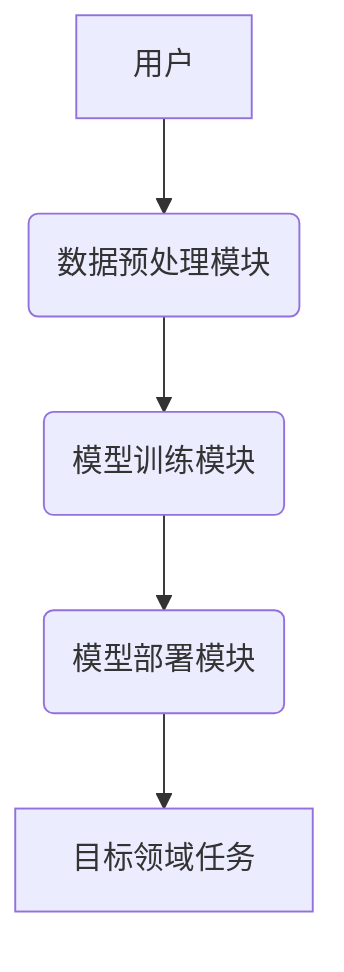
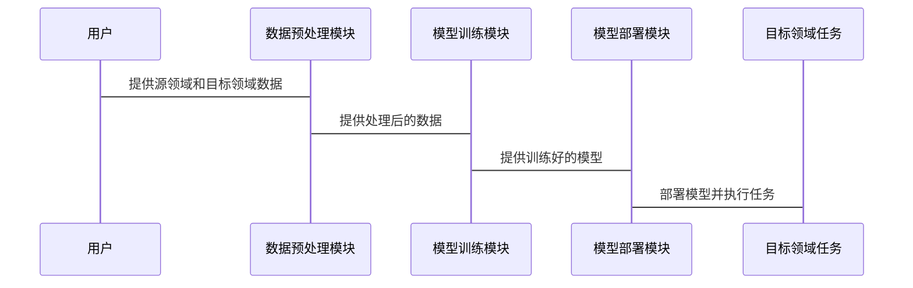

                 


# 迁移学习：快速适应新领域的AI Agent

## 关键词：迁移学习、AI Agent、机器学习、模型适应、领域迁移、快速应用

## 摘要：  
本文深入探讨了迁移学习在AI Agent中的应用，从理论基础到算法实现，再到系统设计与项目实战，全面解析如何利用迁移学习帮助AI Agent快速适应新领域。通过详细分析迁移学习的核心概念、算法原理、系统架构以及实际案例，本文为读者提供了一套完整的解决方案，帮助他们在实际项目中快速落地迁移学习技术。

---

# 第一部分：迁移学习与AI Agent概述

## 第1章：迁移学习与AI Agent概述

### 1.1 迁移学习的基本概念  
迁移学习是一种机器学习技术，旨在通过将已学到的知识迁移到新的任务或领域中，以提高模型在目标领域的性能。AI Agent作为一种智能体，能够通过迁移学习快速适应新环境中的任务需求。

#### 1.1.1 迁移学习的定义与背景  
- **定义**：迁移学习是指将一个领域中学到的知识应用到另一个领域中，从而减少对新领域数据的依赖。  
- **背景**：传统机器学习模型在面对新领域时，通常需要大量新领域的数据进行训练，这在实际应用中成本高昂且效率低下。迁移学习通过共享不同领域的特征，降低了对新领域数据的需求。  

#### 1.1.2 AI Agent的基本概念  
- **AI Agent**：AI Agent是一种智能体，能够感知环境、执行任务并做出决策。它可以是一个软件程序或物理设备，具备自主学习和适应能力。  
- **AI Agent的核心能力**：感知、推理、规划、学习和执行。  

#### 1.1.3 迁移学习在AI Agent中的作用  
- **快速适应新领域**：通过迁移学习，AI Agent可以在新领域中快速部署，减少对新数据的依赖。  
- **提高泛化能力**：迁移学习帮助AI Agent在不同领域之间共享知识，增强模型的泛化能力。  

### 1.2 迁移学习的应用背景  
#### 1.2.1 传统机器学习的局限性  
- **数据依赖性强**：传统机器学习模型需要大量标注数据，且在新领域中表现不佳。  
- **领域适应成本高**：在不同领域之间迁移模型通常需要重新训练，成本高昂。  

#### 1.2.2 迁移学习的适用场景  
- **数据稀缺领域**：在数据量较少的新领域中，迁移学习可以帮助模型快速适应。  
- **跨领域任务**：需要在多个领域之间共享知识的任务，如跨语言翻译、跨领域推荐系统。  

#### 1.2.3 AI Agent在迁移学习中的需求  
- **动态适应能力**：AI Agent需要在不断变化的环境中快速适应新任务。  
- **领域通用性**：AI Agent需要在多个领域中共享知识，提高通用性。  

### 1.3 迁移学习的核心目标  
#### 1.3.1 快速适应新领域  
- 通过迁移学习，AI Agent可以在新领域中快速部署，减少训练时间。  

#### 1.3.2 提高模型的泛化能力  
- 迁移学习帮助模型在不同领域中共享特征，增强泛化能力。  

#### 1.3.3 降低数据依赖性  
- 通过迁移学习，模型可以在数据稀缺的领域中表现良好。  

### 1.4 迁移学习的边界与外延  
#### 1.4.1 迁移学习的适用范围  
- 迁移学习适用于领域之间有部分相似性，但目标领域数据不足的情况。  

#### 1.4.2 迁移学习与其他学习方法的区别  
- 与传统机器学习相比，迁移学习强调跨领域的知识共享。  

#### 1.4.3 迁移学习的未来发展  
- 进一步研究小样本迁移学习和无监督迁移学习，以适应更多场景。  

### 1.5 本章小结  
本章介绍了迁移学习的基本概念、AI Agent的核心能力以及迁移学习的应用背景，强调了迁移学习在AI Agent中的重要性。

---

# 第二部分：迁移学习的核心概念与原理

## 第2章：迁移学习的核心概念

### 2.1 迁移学习的核心要素  
#### 2.1.1 源领域与目标领域  
- **源领域**：已经学习过知识的领域。  
- **目标领域**：需要迁移学习的目标领域。  

#### 2.1.2 特征空间与任务空间  
- **特征空间**：数据的表示方式，如图像的像素值或文本的词向量。  
- **任务空间**：任务的定义方式，如分类任务的标签。  

#### 2.1.3 迁移学习的三个核心假设  
1. 领域之间的特征分布具有相似性。  
2. 源任务和目标任务之间存在某种关系。  
3. 源领域的知识可以被迁移到目标领域。  

### 2.2 迁移学习的分类  
#### 2.2.1 基于样本的迁移学习  
- 直接利用源领域的样本进行训练，然后将模型迁移到目标领域。  

#### 2.2.2 基于特征的迁移学习  
- 通过变换特征空间，使得源领域和目标领域的特征对齐。  

#### 2.2.3 基于模型的迁移学习  
- 通过共享模型参数，将源领域的知识迁移到目标领域。  

### 2.3 迁移学习的核心原理  
#### 2.3.1 特征对齐的原理  
- 通过特征变换，使得源领域和目标领域的特征分布尽可能接近。  

#### 2.3.2 知识迁移的机制  
- 通过共享模型参数或特征空间，将源领域的知识迁移到目标领域。  

#### 2.3.3 风险最小化的目标  
- 在源领域和目标领域之间最小化风险函数。  

### 2.4 迁移学习与传统机器学习的对比  
#### 2.4.1 数据依赖性的对比  
- 迁移学习：降低对目标领域数据的依赖。  
- 传统机器学习：依赖大量目标领域数据。  

#### 2.4.2 模型灵活性的对比  
- 迁移学习：模型更具灵活性，适用于多个领域。  
- 传统机器学习：模型针对特定领域优化。  

#### 2.4.3 性能表现的对比  
- 迁移学习：在目标领域数据不足时表现更优。  
- 传统机器学习：在目标领域数据充足时表现更优。  

### 2.5 本章小结  
本章详细讲解了迁移学习的核心概念，包括源领域、目标领域、特征空间等，并分析了迁移学习的分类和核心原理。

---

# 第三部分：迁移学习的算法原理

## 第3章：迁移学习的算法原理

### 3.1 基于样本的迁移学习算法  
#### 3.1.1 直接迁移  
- 将源领域的模型直接应用到目标领域，无需额外处理。  

#### 3.1.2 样本加权迁移  
- 对目标领域的样本赋予更高的权重，以减少领域差异的影响。  

#### 3.1.3 基于相似性的迁移  
- 根据样本之间的相似性，将源领域的知识迁移到目标领域。  

### 3.2 基于特征的迁移学习算法  
#### 3.2.1 特征对齐方法  
- 使用特征变换将源领域和目标领域的特征对齐。  

#### 3.2.2 特征空间变换  
- 通过线性变换或非线性变换，改变特征空间的分布。  

#### 3.2.3 基于核的迁移学习  
- 使用核方法，将源领域和目标领域的特征映射到同一空间。  

### 3.3 基于模型的迁移学习算法  
#### 3.3.1 参数迁移  
- 通过共享模型参数，将源领域的知识迁移到目标领域。  

#### 3.3.2 模型适配  
- 根据目标领域数据，微调源领域的模型。  

#### 3.3.3 知识蒸馏  
- 将源领域的知识迁移到目标领域的轻量级模型中。  

### 3.4 迁移学习算法的对比  
#### 3.4.1 基于样本 vs. 基于特征  
- 基于样本的迁移学习适用于数据量较小的场景，而基于特征的迁移学习适用于特征空间差异较大的场景。  

#### 3.4.2 基于模型 vs. 基于特征  
- 基于模型的迁移学习适用于模型需要在多个领域中共享知识的场景，而基于特征的迁移学习适用于特征空间需要对齐的场景。  

### 3.5 本章小结  
本章详细讲解了迁移学习的算法原理，包括基于样本、特征和模型的迁移学习方法，并分析了不同算法的适用场景。

---

# 第四部分：系统分析与架构设计

## 第4章：系统分析与架构设计

### 4.1 问题场景介绍  
- 假设我们需要设计一个AI Agent，能够在多个领域中快速部署并执行任务。  

### 4.2 系统功能设计  
#### 4.2.1 领域模型设计  
- 使用领域模型描述源领域和目标领域的特征和任务。  

#### 4.2.2 系统功能模块  
- 数据预处理模块：处理源领域和目标领域的数据。  
- 模型训练模块：训练迁移学习模型。  
- 模型部署模块：将模型部署到目标领域。  

### 4.3 系统架构设计  


### 4.4 系统接口设计  
- 数据接口：与数据源交互，获取源领域和目标领域数据。  
- 模型接口：与训练模块交互，训练迁移学习模型。  
- 任务接口：与目标领域任务交互，执行任务。  

### 4.5 系统交互设计  


### 4.6 本章小结  
本章分析了系统设计的各个方面，包括功能设计、架构设计和接口设计，并通过mermaid图展示了系统的交互流程。

---

# 第五部分：项目实战

## 第5章：项目实战

### 5.1 环境安装  
- 安装Python、TensorFlow、Keras等必要的库。  

### 5.2 核心代码实现  
```python
import tensorflow as tf
from tensorflow import keras
from tensorflow.keras import layers

# 源领域数据
source_data = ...  # 源领域数据集
# 目标领域数据
target_data = ...  # 目标领域数据集

# 数据预处理
source_feature = source_data[:, :-1]
source_label = source_data[:, -1]
target_feature = target_data[:, :-1]
target_label = target_data[:, -1]

# 特征对齐
source_encoder = keras.Sequential([
    layers.Dense(64, activation='relu'),
    layers.Dense(32, activation='relu')
])
source_feature_encoded = source_encoder(source_feature)

target_encoder = keras.Sequential([
    layers.Dense(64, activation='relu'),
    layers.Dense(32, activation='relu')
])
target_feature_encoded = target_encoder(target_feature)

# 模型训练
model = keras.Sequential([
    source_encoder,
    layers.Dense(10, activation='softmax')
])
model.compile(optimizer='adam', loss='sparse_categorical_crossentropy', metrics=['accuracy'])
model.fit(source_feature, source_label, epochs=10, batch_size=32)

# 模型部署
deployed_model = keras.Sequential([
    source_encoder,
    layers.Dense(10, activation='softmax')
])
deployed_model.compile(optimizer='adam', loss='sparse_categorical_crossentropy', metrics=['accuracy'])
deployed_model.fit(target_feature, target_label, epochs=5, batch_size=32)
```

### 5.3 案例分析与解读  
- **案例分析**：通过一个具体的案例，展示迁移学习在目标领域中的应用。  
- **代码解读**：详细解读代码实现，说明每一步的作用。  

### 5.4 本章小结  
本章通过实际项目展示了迁移学习的应用过程，包括环境安装、代码实现和案例分析。

---

# 第六部分：未来展望与总结

## 第6章：未来展望与总结

### 6.1 迁移学习的发展趋势  
- 小样本迁移学习：研究如何在目标领域数据极少的情况下实现迁移。  
- 无监督迁移学习：研究如何在无标签数据的情况下实现迁移。  
- 多领域迁移学习：研究如何在多个领域之间共享知识。  

### 6.2 未来挑战  
- **领域差异性**：如何处理源领域和目标领域之间的差异性。  
- **模型可解释性**：如何提高迁移学习模型的可解释性。  
- **计算效率**：如何提高迁移学习的计算效率，适用于大规模数据。  

### 6.3 全文总结  
本文从迁移学习的基本概念到算法实现，再到系统设计和项目实战，全面探讨了迁移学习在AI Agent中的应用。通过本文的分析，读者可以掌握迁移学习的核心概念和算法原理，并能够在实际项目中快速落地迁移学习技术。

---

# 结语  
迁移学习作为一种强大的机器学习技术，正在被广泛应用于AI Agent的设计中。通过本文的详细讲解，读者可以深入了解迁移学习的核心原理和实际应用，为未来的AI Agent开发奠定坚实的基础。

--- 

如果需要进一步扩展或具体章节的详细内容，请随时告知！

