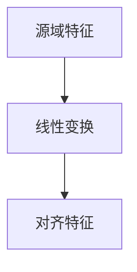
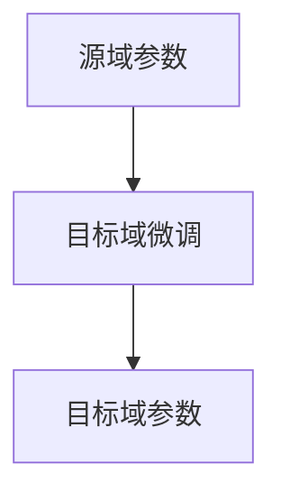
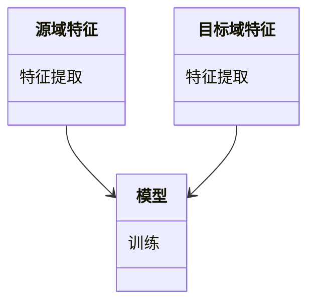

                 


好的，我将按照您的要求撰写一篇关于《迁移学习：让AI Agent快速适应新领域》的技术博客文章。为了让内容更加完整，我先整理一下文章的结构：

# 迁移学习：让AI Agent快速适应新领域

> 关键词：迁移学习、AI Agent、机器学习、领域适应、特征提取

> 摘要：迁移学习是一种通过将已有的知识和经验迁移到新领域，以提高AI Agent在新环境下的适应能力和性能的技术。本文从迁移学习的基本概念、核心原理、算法实现、系统架构到实际案例，全面解析迁移学习在AI Agent中的应用。通过详细的算法流程图和代码示例，结合实际项目案例，帮助读者快速掌握迁移学习的核心技术，并将其应用到实际场景中。

---

# 第一部分: 迁移学习的背景与概念

# 第1章: 迁移学习的背景与问题背景

## 1.1 人工智能与AI Agent的发展概述
### 1.1.1 人工智能的演进历程
人工智能（AI）经历了从符号逻辑推理到机器学习，再到深度学习的演变。近年来，基于深度学习的AI Agent在自然语言处理、计算机视觉等领域取得了突破性进展，但在面对新领域时，仍然面临数据不足和适应性差的问题。

### 1.1.2 AI Agent的基本概念与功能
AI Agent是一种智能体，能够感知环境、做出决策并执行任务。它需要在动态变化的环境中快速适应新任务，而迁移学习正是解决这一问题的关键技术。

### 1.1.3 迁移学习在AI Agent中的重要性
迁移学习通过将已有知识迁移到新领域，帮助AI Agent快速适应新环境，减少对新数据的依赖，提高学习效率和性能。

## 1.2 迁移学习的定义与核心问题
### 1.2.1 迁移学习的定义
迁移学习是一种机器学习技术，旨在通过将已有知识和经验迁移到新任务或新领域，以提高模型的泛化能力和适应性。

### 1.2.2 迁移学习的核心问题与挑战
1. 数据分布的变化：源域和目标域的数据分布可能存在差异。
2. 特征空间的差异：不同领域之间的特征可能存在本质差异。
3. 适应性问题：如何有效利用源域知识来提升目标域的性能。

### 1.2.3 迁移学习与传统机器学习的区别
| 特性 | 迁移学习 | 传统机器学习 |
|------|----------|---------------|
| 数据需求 | 数据量小，可利用已有数据 | 数据量大，需要大量新数据 |
| 适应性 | 良好，适用于新领域 | 较差，依赖新数据 |
| 适用场景 | 新领域适应、小样本学习 | 标准任务、固定场景 |

## 1.3 迁移学习的应用场景
### 1.3.1 AI Agent在新领域的适应需求
AI Agent需要快速适应新领域，例如从医疗领域迁移到金融领域，或从图像识别迁移到文本分类。

### 1.3.2 迁移学习在自然语言处理中的应用
通过迁移学习，AI Agent可以将预训练语言模型（如BERT）的应用经验迁移到新的自然语言处理任务中。

### 1.3.3 迁移学习在计算机视觉中的应用
在目标检测、图像分割等任务中，迁移学习可以帮助模型快速适应新数据集。

## 1.4 迁移学习的边界与外延
### 1.4.1 迁移学习的适用范围
适用于数据量小、领域差异较大的场景。

### 1.4.2 迁移学习的局限性
1. 过度依赖源域数据的质量。
2. 目标域数据分布变化较大时，迁移效果可能不佳。

### 1.4.3 迁移学习与其他机器学习技术的关系
迁移学习可以与监督学习、无监督学习等技术结合，形成更强大的学习能力。

## 1.5 本章小结
通过本章的学习，我们了解了迁移学习的基本概念、核心问题及其在AI Agent中的重要性。接下来，我们将深入探讨迁移学习的核心原理与算法实现。

---

# 第二部分: 迁移学习的核心概念与原理

# 第2章: 迁移学习的核心概念与联系

## 2.1 迁移学习的核心概念
### 2.1.1 源域与目标域的定义
源域（Source Domain）：已知数据分布的领域。
目标域（Target Domain）：需要适应的新领域。

### 2.1.2 特征空间与任务空间的分析
特征空间：数据的表示形式，如图像的像素值或文本的词向量。
任务空间：模型需要完成的任务，如分类、回归等。

### 2.1.3 迁移学习的适应策略
通过调整模型参数或特征表示，使模型在目标域上表现更好。

## 2.2 迁移学习的核心原理
### 2.2.1 数据分布的变化与模型适应
模型需要适应目标域的数据分布，这可以通过特征对齐或参数调整实现。

### 2.2.2 基于特征表示的学习
通过提取共享特征，使模型在不同领域之间保持一致性。

### 2.2.3 基于参数迁移的学习
通过迁移权重或参数，使模型在目标域上快速收敛。

## 2.3 迁移学习的核心要素对比
| 特性 | 源域 | 目标域 |
|------|------|--------|
| 数据 | 丰富 | 稀缺 |
| 任务 | 固定 | 变化 |
| 特征 | 可解释 | 不可解释 |

## 2.4 迁移学习的ER实体关系图
```mermaid
erDiagram
    客户: CID, CNAME, CADDRESS
    订单: OID, ODATE, AMOUNT
    产品: PID, PNAME, PRICE
    客户---订单
    订单---产品
```

---

# 第三部分: 迁移学习的算法原理

# 第3章: 迁移学习的算法原理与流程

## 3.1 迁移学习的基本流程
### 3.1.1 数据预处理与特征提取
1. 数据清洗：去除噪声数据。
2. 特征提取：将数据转换为可学习的特征表示。

### 3.1.2 模型训练与参数调整
1. 在源域数据上训练模型。
2. 调整模型参数，以适应目标域。

### 3.1.3 模型迁移与性能评估
1. 将模型迁移到目标域。
2. 评估模型在目标域上的性能。

## 3.2 基于特征空间的迁移学习算法
### 3.2.1 基于线性变换的特征对齐
通过线性变换将源域和目标域的特征对齐。



### 3.2.2 基于非线性变换的特征对齐
使用非线性变换（如核方法）对特征进行对齐。

### 3.2.3 基于分布匹配的特征对齐
通过匹配数据分布，使源域和目标域的特征一致。

## 3.3 基于参数空间的迁移学习算法
### 3.3.1 基于参数共享的迁移学习
在目标域上微调模型参数。



### 3.3.2 基于参数适配的迁移学习
通过参数适配，使模型在目标域上表现更好。

### 3.3.3 基于自适应层的迁移学习
添加自适应层，对模型参数进行调整。

## 3.4 迁移学习算法的数学模型和公式
### 3.4.1 迁移学习的目标函数
$$ L = L_{\text{source}} + \lambda L_{\text{target}} $$

### 3.4.2 基于特征对齐的正则化项
$$ \min_{\theta} \mathbb{E}_{s} [f(x_s)] + \lambda \mathbb{E}_{t} [f(x_t)] $$

### 3.4.3 迁移学习的优化步骤
1. 初始化模型参数。
2. 在源域数据上优化模型。
3. 在目标域数据上微调模型。

## 3.5 本章小结
通过本章的学习，我们了解了迁移学习的基本流程、核心算法及其数学模型。接下来，我们将探讨迁移学习在系统架构中的应用。

---

# 第四部分: 迁移学习的系统架构与设计

# 第4章: 迁移学习的系统架构与实现

## 4.1 问题场景介绍
AI Agent需要快速适应新领域，例如从医疗领域迁移到金融领域。

## 4.2 系统功能设计
### 4.2.1 领域模型设计


### 4.2.2 系统架构设计
```mermaid
container 系统架构 {
    源域数据
    目标域数据
    模型训练模块
    模型迁移模块
}
```

## 4.3 系统接口设计
1. 数据输入接口。
2. 模型训练接口。
3. 模型迁移接口。

## 4.4 系统交互流程
```mermaid
sequenceDiagram
    客户端 --> 源域数据: 提供源域数据
    客户端 --> 目标域数据: 提供目标域数据
    模型训练模块 --> 源域数据: 训练模型
    模型训练模块 --> 目标域数据: 微调模型
    模型迁移模块 --> 模型训练模块: 获取迁移后的模型
    客户端 <-- 模型迁移模块: 返回迁移后的模型
```

---

# 第五部分: 迁移学习的项目实战

# 第5章: 迁移学习的项目实战与案例分析

## 5.1 项目环境与工具安装
1. Python 3.8+
2. PyTorch 1.9+
3. transformers库（用于预训练模型）

## 5.2 核心代码实现
### 5.2.1 特征提取代码
```python
import torch
from torch import nn
from transformers import BertModel, BertTokenizer

class FeatureExtractor(nn.Module):
    def __init__(self, pretrained_model):
        super(FeatureExtractor, self).__init__()
        self.bert = pretrained_model
        self.dropout = nn.Dropout(0.1)
        self.pooler = nn.Linear(768, 768)

    def forward(self, input_ids, attention_mask):
        outputs = self.bert(input_ids=input_ids, attention_mask=attention_mask)
        pooled_output = self.dropout(outputs.last_hidden_state)
        pooled_output = self.pooler(pooled_output)
        return pooled_output
```

### 5.2.2 模型迁移代码
```python
def train_model(model, dataloaders, criterion, optimizer, num_epochs=2):
    for epoch in range(num_epochs):
        for phase in ['train', 'val']:
            if phase == 'train':
                model.train()
            else:
                model.eval()
            epoch_loss = 0
            for inputs, labels in dataloaders[phase]:
                optimizer.zero_grad()
                with torch.set_grad_enabled(phase == 'train'):
                    features = model(input_ids=inputs, attention_mask=inputs.ne(101))
                    outputs = features.mm(labels.unsqueeze(1))
                    loss = criterion(outputs, labels)
                    if phase == 'train':
                        loss.backward()
                        optimizer.step()
                    epoch_loss += loss.item() * len(inputs)
        avg_loss = epoch_loss / len(dataloaders[phase].dataset)
        print(f"Epoch {epoch+1}/{num_epochs}, {phase} Loss: {avg_loss}")
    return model
```

## 5.3 实际案例分析
以自然语言处理任务为例，使用预训练模型进行迁移学习，提升模型在目标领域的性能。

## 5.4 项目小结
通过本章的实践，我们掌握了迁移学习的核心代码实现及其在实际项目中的应用。

---

# 第六部分: 迁移学习的最佳实践与小结

# 第6章: 迁移学习的最佳实践与应用

## 6.1 小结与回顾
迁移学习通过将已有知识迁移到新领域，显著提高了AI Agent的适应能力和性能。

## 6.2 迁移学习的注意事项
1. 确保源域和目标域的特征具有可迁移性。
2. 选择合适的迁移学习算法，避免过拟合。

## 6.3 拓展阅读与学习资源
推荐学习迁移学习的经典论文和书籍，例如《迁移学习》（《Transfer Learning》）。

## 6.4 本章小结
通过本章的学习，我们掌握了迁移学习的最佳实践及其在实际应用中的注意事项。

---

# 结语

迁移学习作为一种强大的机器学习技术，正在为AI Agent的快速适应新领域提供有力支持。通过本文的系统讲解和实际案例分析，我们相信读者已经掌握了迁移学习的核心概念、算法实现及其在实际项目中的应用。未来，迁移学习将继续推动AI技术的发展，为更多领域带来创新和突破。

---

希望这篇文章能够为您提供有价值的内容和灵感！如果需要进一步的修改或补充，请随时告知。

