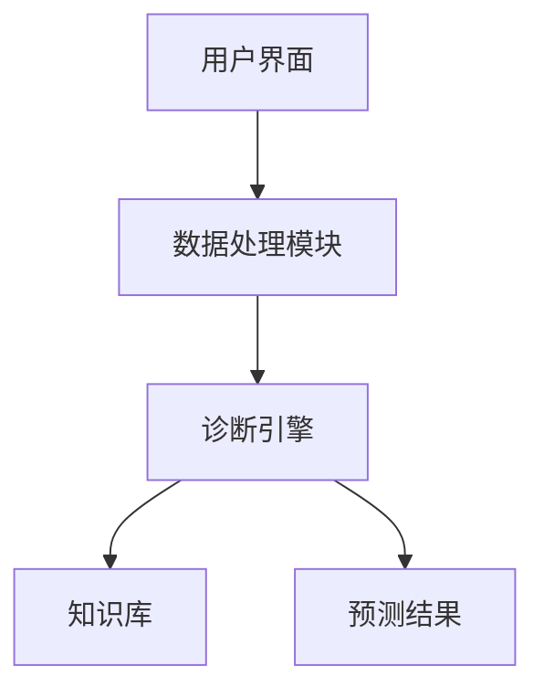

                 


# 远程医疗中的AI Agent诊断助手

## 关键词：远程医疗、AI Agent、诊断助手、算法原理、系统架构、医疗信息化

## 摘要：  
随着远程医疗的快速发展，AI Agent诊断助手作为一种智能化的医疗辅助工具，正在成为医疗行业的重要组成部分。本文深入探讨了AI Agent在远程医疗中的应用背景、核心算法原理、系统架构设计以及实际应用场景。通过详细分析AI Agent的算法模型和系统实现，本文展示了如何利用AI技术提升远程医疗的诊断效率和准确性。文章最后还总结了当前技术的局限性，并提出了未来的发展方向。

---

## 第一部分：远程医疗与AI Agent诊断助手的背景介绍

### 第1章：远程医疗的定义与现状

#### 1.1 远程医疗的定义与现状
远程医疗是指通过互联网技术实现患者与医生之间的远程诊疗活动，包括病情咨询、诊断建议、治疗方案制定等。近年来，随着5G网络、物联网和云计算技术的快速发展，远程医疗在医疗资源分配不均、患者就医不便的地区发挥了重要作用。

- **远程医疗的优势**：  
  - 节省患者的就医时间与费用。  
  - 优化医疗资源的分配，提升医疗服务效率。  
  - 支持偏远地区患者的医疗需求。  

- **远程医疗的现状**：  
  当前，远程医疗主要应用于慢性病管理、术后随访、心理咨询等领域。然而，由于医疗数据的安全性、诊断的准确性等问题，远程医疗的普及仍面临一定的挑战。

---

### 第2章：AI Agent诊断助手的核心概念与联系

#### 2.1 AI Agent诊断助手的核心概念
AI Agent（人工智能代理）是一种能够感知环境、自主决策并执行任务的智能体。在远程医疗中，AI Agent诊断助手通过分析患者的症状、病史、检查结果等信息，辅助医生进行诊断。

- **AI Agent诊断助手的功能特点**：  
  - 自然语言处理能力，能够理解患者的症状描述。  
  - 机器学习算法，能够预测疾病的可能性并提供诊断建议。  
  - 实时数据分析能力，能够快速检索医疗知识库。  

- **AI Agent与远程医疗的结合**：  
  AI Agent诊断助手通过整合远程医疗系统中的数据，为医生提供更精准的诊断支持，从而提升远程医疗的诊断效率和准确性。

---

## 第二部分：AI Agent诊断助手的算法原理

### 第3章：AI Agent诊断助手的算法基础

#### 3.1 机器学习与自然语言处理
- **机器学习**：  
  AI Agent诊断助手通过训练大量的医疗数据，学习疾病的症状、检查结果与诊断之间的关联关系。例如，使用支持向量机（SVM）或随机森林（Random Forest）算法进行疾病分类。

- **自然语言处理**：  
  利用自然语言处理技术，AI Agent能够理解患者的症状描述，提取关键词并匹配对应的疾病信息。例如，使用TF-IDF算法进行文本关键词提取。

#### 3.2 疾病预测模型
- **疾病预测模型的构建**：  
  基于机器学习算法，AI Agent诊断助手可以构建疾病预测模型。例如，使用逻辑回归（Logistic Regression）算法预测患者是否患有某种疾病。

- **数学模型示例**：  
  以逻辑回归模型为例，预测患者是否患有糖尿病的概率：
  $$ P(y=1|x) = \frac{1}{1 + e^{-\beta x}} $$
  其中，$x$ 表示患者的症状和检查指标，$\beta$ 是模型参数。

---

### 第4章：AI Agent诊断助手的系统架构设计

#### 4.1 系统功能设计
- **用户界面**：  
  提供患者与医生的交互界面，患者输入症状，AI Agent诊断助手生成诊断建议。

- **数据处理模块**：  
  对患者的症状、检查结果等数据进行清洗、分析和存储。

- **诊断引擎**：  
  基于机器学习模型，生成诊断建议并提供治疗方案。

#### 4.2 系统架构图


---

## 第三部分：远程医疗中的AI Agent诊断助手项目实战

### 第5章：项目环境与核心实现

#### 5.1 环境安装
- **Python环境**：安装Python 3.8及以上版本。  
- **库依赖**：安装`scikit-learn`、`nltk`、`flask`等库。

#### 5.2 核心代码实现
- **症状分析模块**：  
  使用自然语言处理技术提取患者的症状关键词。

```python
from sklearn.feature_extraction.text import TfidfVectorizer

vectorizer = TfidfVectorizer()
text = "咳嗽、发热、乏力"
tfidf = vectorizer.fit_transform([text])
print(vectorizer.get_feature_names())
```

- **疾病预测模块**：  
  基于机器学习模型预测疾病。

```python
from sklearn.linear_model import LogisticRegression

# 假设X是输入特征，y是标签
model = LogisticRegression()
model.fit(X, y)
```

---

### 第6章：案例分析与实际应用

#### 6.1 实际案例分析
- **案例背景**：一位患者通过远程医疗平台描述症状“咳嗽、发热、乏力”。  
- **AI Agent诊断助手的处理流程**：  
  1. 提取关键词：咳嗽、发热、乏力。  
  2. 调用疾病预测模型，预测患者可能患有普通感冒或新冠。  
  3. 提供诊断建议：建议患者进行核酸检测，并注意体温监测。  

---

## 第四部分：总结与展望

### 第7章：总结与未来展望

#### 7.1 系统总结
- AI Agent诊断助手通过机器学习和自然语言处理技术，显著提升了远程医疗的诊断效率和准确性。  
- 系统架构设计合理，功能模块清晰，能够满足实际应用需求。

#### 7.2 未来展望
- **算法优化**：进一步优化疾病预测模型，提升诊断准确率。  
- **数据安全**：加强医疗数据的隐私保护，确保患者信息安全。  
- **多模态数据融合**：结合图像识别技术，提升诊断的全面性。  

#### 7.3 最佳实践
- 在实际应用中，建议医疗机构与技术团队合作，共同优化AI诊断系统的性能。  
- 加强用户教育，提升患者对AI诊断系统的信任度。

---

## 附录：相关资源与扩展阅读

- **推荐书籍**：  
  - 《机器学习实战》  
  - 《自然语言处理入门》  

- **推荐论文**：  
  - "Deep Learning for Medical Imaging"  

- **推荐工具**：  
  - `scikit-learn`：机器学习库  
  - `Flask`：Web框架  

---

通过以上内容，我们全面介绍了AI Agent诊断助手在远程医疗中的应用，从算法原理到系统实现，再到实际案例分析，为读者提供了详细的理论与实践指导。希望本文能为远程医疗的智能化发展提供有益的参考。

