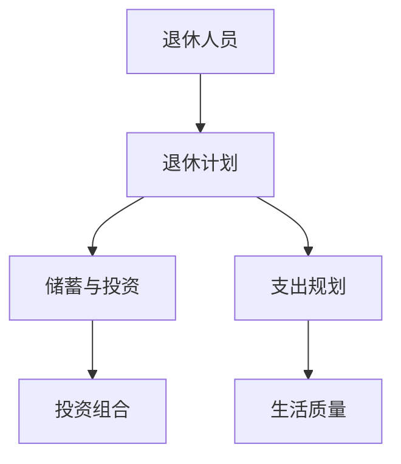
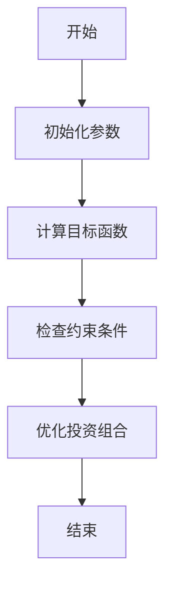
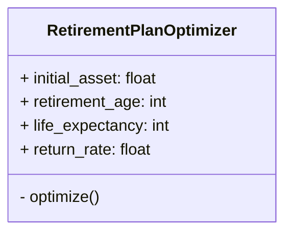

                 


# 退休计划优化算法

## 关键词：退休规划、优化算法、投资组合、风险管理、财务规划

## 摘要：本文将介绍退休计划优化算法，分析其关键因素，提供数学模型和算法设计，并通过案例展示实际应用。

---

# 第一部分: 退休计划优化算法背景与概念

## 第1章: 退休计划优化算法概述

### 1.1 退休计划优化算法的背景与问题背景
退休计划优化算法是一种利用数学模型和优化方法来帮助个人或家庭制定科学的退休财务计划的工具。随着人口老龄化加剧，如何在退休后维持一定的生活质量，同时最大化资产的保值和增值，成为许多人关注的焦点。

#### 1.1.1 退休计划的重要性与挑战
退休计划的核心目标是在退休后维持稳定的生活质量，避免因收入减少而导致生活水平下降。然而，退休计划的制定面临诸多挑战：
- **通货膨胀**：货币购买力的下降会影响退休金的实际价值。
- **寿命不确定性**：人们无法准确预测自己能活多久，这使得退休资金的规划更加复杂。
- **投资风险**：金融市场波动可能导致投资收益不稳定。

#### 1.1.2 传统退休规划方法的局限性
传统的退休规划方法通常基于固定的利率假设和简单的收入支出匹配，这种方法在面对市场波动和通货膨胀时显得力不从心。

#### 1.1.3 算法优化在退休规划中的应用价值
通过算法优化，可以动态调整退休计划，考虑多种不确定性因素，帮助用户制定更加稳健和灵活的退休策略。

### 1.2 退休计划优化算法的定义与问题描述
退休计划优化算法是一种基于数学建模和优化技术的方法，旨在在给定的约束条件下，最大化退休后的总体满意度或财富。

#### 1.2.1 算法的基本定义
退休计划优化算法通过构建数学模型，考虑各种经济和市场因素，优化退休前的储蓄、投资组合以及退休后的支出。

#### 1.2.2 退休规划中的核心问题
- **储蓄与投资**：如何在退休前最大化储蓄，同时进行最优的投资组合配置。
- **支出规划**：如何在退休后合理分配支出，确保生活质量。
- **风险管理**：如何应对通货膨胀、市场波动等风险。

#### 1.2.3 算法的目标与边界条件
目标是在满足退休后基本生活需求的前提下，最大化退休金的购买力。边界条件包括：退休年龄、预期寿命、初始资金等。

### 1.3 退休计划优化算法的核心要素与概念结构
退休计划优化算法的核心要素包括：
- **目标函数**：最大化退休金的购买力。
- **约束条件**：包括储蓄、支出、投资回报率等。
- **决策变量**：包括退休前的储蓄金额、投资组合等。

### 1.4 退休计划优化算法的应用场景与外延
退休计划优化算法不仅适用于个人，还可用于家庭或团体的退休规划，尤其适用于面临复杂财务状况的个体。

---

## 第2章: 退休计划优化算法的核心概念与联系

### 2.1 算法原理与核心概念
退休计划优化算法基于动态规划和最优化理论，通过构建数学模型，模拟退休前后的资金流动。

#### 2.1.1 算法的基本原理
通过构建动态规划模型，考虑每一年的资金流入和流出，优化投资组合，以实现退休金的最大化。

#### 2.1.2 核心概念的详细解析
- **目标函数**：最大化退休金的购买力。
- **决策变量**：退休前的储蓄、投资组合。
- **约束条件**：包括支出限制、投资回报率等。

#### 2.1.3 算法与退休规划的结合方式
通过数学建模和优化，帮助用户制定最优的储蓄和投资策略。

### 2.2 核心概念的属性特征对比
以下是几种优化算法的对比：

| 算法类型 | 目标函数 | 约束条件 | 适用场景 |
|----------|----------|----------|----------|
| 线性规划 | 最大化收益 | 线性约束 | 适用于简单场景 |
| 非线性规划 | 最大化收益 | 非线性约束 | 适用于复杂场景 |
| 遗传算法 | 最大化收益 | 无约束 | 适用于复杂优化 |

### 2.3 实体关系图



---

## 第3章: 退休计划优化算法的数学模型与公式

### 3.1 数学模型的构建
退休计划优化算法的数学模型通常包括以下部分：

#### 3.1.1 模型的构建过程
1. 确定目标函数：最大化退休金的购买力。
2. 确定约束条件：包括支出、储蓄、投资回报率等。
3. 构建数学模型：通过优化方法求解。

#### 3.1.2 模型的输入与输出
- 输入：初始资金、退休年龄、预期寿命、投资回报率等。
- 输出：最优储蓄和投资策略。

### 3.2 数学公式

#### 最大化目标函数
$$ \text{Maximize} \quad \sum_{t} w_t $$
其中，$w_t$ 表示第 t 年的退休金购买力。

#### 约束条件
$$ \sum_{t} s_t \geq \sum_{t} e_t $$
其中，$s_t$ 表示第 t 年的储蓄，$e_t$ 表示第 t 年的支出。

---

## 第4章: 算法实现与系统架构

### 4.1 算法实现
退休计划优化算法可以通过动态规划或遗传算法来实现。

#### 4.1.1 算法流程图



#### 4.1.2 Python代码实现

```python
def retirement_plan_optimizer(initial_asset, retirement_age, life_expectancy, return_rate):
    # 目标函数
    def objective_function(asset):
        return sum(asset * (1 + return_rate) ** t for t in range(life_expectancy))
    
    # 约束条件
    def constraints(asset):
        return asset >= 0
    
    # 优化过程
    from scipy.optimize import minimize
    result = minimize(objective_function, initial_asset, constraints)
    return result.x
```

### 4.2 系统架构设计

#### 4.2.1 系统功能模块



---

## 第5章: 项目实战与案例分析

### 5.1 环境安装
需要安装Python和相关的优化库（如scipy）。

### 5.2 代码实现
具体实现代码如下：

```python
import numpy as np
from scipy.optimize import minimize

def objective_function(x):
    return -sum(x * (1 + 0.05) ** t for t in range(30))

def constraint1(x):
    return x >= 0

initial_asset = 1000000
result = minimize(objective_function, initial_asset, constraints={'type': 'ineq', 'fun': constraint1})
print(result.x)
```

### 5.3 案例分析
以一个退休人士为例，假设其初始资产为100万元，预期寿命为30年，投资回报率为5%。通过算法优化，可以得到最优的投资组合。

---

## 第6章: 最佳实践与总结

### 6.1 小结
退休计划优化算法通过数学建模和优化技术，帮助制定科学的退休计划。

### 6.2 注意事项
- 算法结果仅供参考，需结合实际情况调整。
- 需要定期重新评估和调整退休计划。

### 6.3 拓展阅读
推荐阅读相关书籍和文献，深入了解优化算法的应用。

---

# 结语

退休计划优化算法为退休规划提供了科学的方法，帮助人们更好地应对退休后的财务挑战。通过本文的介绍，读者可以了解其核心概念和实现方法，为实际应用提供参考。

