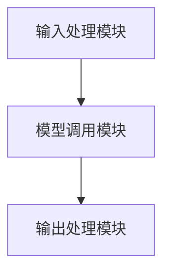
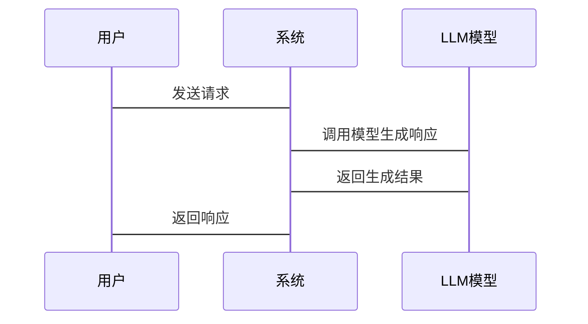

                 


# 选择合适的LLM模型：AI Agent开发的第一步

> 关键词：LLM模型，AI Agent，生成式AI，自然语言处理，模型选择，算法原理

> 摘要：本文将详细探讨选择合适的大型语言模型（LLM）对于AI代理开发的重要性。从模型概述到核心原理，从算法选择到系统架构，再到项目实战，我们将一步步解析如何在AI代理开发中选择和使用合适的LLM模型。

---

## 第一部分：背景与基础

### 第1章: 背景与基础

#### 1.1 LLM模型概述

##### 1.1.1 大型语言模型的定义与特点
大型语言模型（LLM）是一种基于深度学习的自然语言处理模型，通常使用Transformer架构。其特点包括：
- **大规模训练数据**：通常使用数百万或数十亿的文本数据进行训练。
- **生成能力**：能够生成连贯且符合语境的文本。
- **多任务能力**：通过微调或提示工程技术，可以应用于多种任务，如文本生成、问答系统、机器翻译等。
- **上下文理解**：通过注意力机制，能够捕捉文本中的长距离依赖关系，从而更好地理解上下文。

##### 1.1.2 LLM在AI Agent中的作用
AI Agent（智能代理）是一种能够感知环境、执行任务并做出决策的智能系统。LLM在AI Agent中的作用包括：
- **自然语言理解**：帮助AI Agent理解用户输入的自然语言指令。
- **生成自然语言响应**：AI Agent可以通过LLM生成符合用户需求的回复。
- **任务规划与推理**：LLM可以辅助AI Agent进行任务分解和逻辑推理。

##### 1.1.3 AI Agent的定义与应用场景
AI Agent是一种智能系统，能够根据任务需求与环境交互，执行任务并提供服务。应用场景包括：
- **虚拟助手**：如Siri、Alexa等。
- **聊天机器人**：用于客服、娱乐等场景。
- **智能推荐系统**：基于用户行为推荐相关内容。
- **自动化工具**：如自动编写代码、生成报告等。

#### 1.2 LLM模型的技术基础

##### 1.2.1 生成式AI的基本原理
生成式AI通过生成模型来创建新的内容，主要包括：
- **编码器**：将输入数据转换为隐层表示。
- **解码器**：根据编码器的输出生成目标文本。

##### 1.2.2 Transformer架构的核心概念
Transformer架构由Google于2018年提出，主要由以下部分组成：
- **编码器层**：负责将输入序列转换为上下文向量。
- **解码器层**：根据编码器输出生成目标序列。

##### 1.2.3 解码器-解码器模型的工作流程
解码器-解码器模型的工作流程如下：
1. 输入序列经过编码器层生成上下文向量。
2. 解码器层根据上下文向量逐步生成目标序列。

#### 1.3 选择LLM模型的标准

##### 1.3.1 模型性能指标
选择LLM模型时需要考虑以下性能指标：
- **生成准确性**：生成文本的正确性。
- **生成效率**：生成速度。
- **模型大小**：模型的参数数量影响计算资源需求。

##### 1.3.2 任务需求分析
选择模型时需要明确任务需求，例如：
- **文本生成**：需要生成高质量的文本。
- **问答系统**：需要准确回答问题。
- **机器翻译**：需要准确翻译文本。

##### 1.3.3 模型的可扩展性与适应性
选择模型时需要考虑其可扩展性和适应性，例如：
- **多语言支持**：是否支持多种语言。
- **可微调性**：是否可以通过微调适应特定任务。

#### 1.4 为什么选择合适的LLM模型至关重要

##### 1.4.1 模型选择对AI Agent性能的影响
合适的模型可以提高AI Agent的生成能力和响应速度，从而提升用户体验。

##### 1.4.2 不同场景下的模型适用性
不同场景下可能需要不同的模型，例如：
- **实时交互**：需要快速响应的模型。
- **复杂任务**：需要具有较强推理能力的模型。

##### 1.4.3 模型选择的长期影响
选择合适的模型可以降低开发成本，提高系统的可维护性和可扩展性。

---

## 第二部分：核心概念与原理

### 第2章: LLM模型的核心概念与原理

#### 2.1 LLM模型的核心原理

##### 2.1.1 解码器-解码器架构的详细解析
解码器-解码器架构通过编码器和解码器层的交互完成文本生成任务。编码器层将输入序列转换为上下文向量，解码器层根据上下文向量逐步生成目标序列。

##### 2.1.2 注意力机制的数学模型
注意力机制的核心公式为：
$$
\text{Attention}(Q, K, V) = \text{softmax}\left(\frac{QK^T}{\sqrt{d_k}}\right)V
$$
其中，$Q$、$K$、$V$分别是查询、键和值向量，$d_k$是键的维度。

##### 2.1.3 梯度下降与优化算法
常用的优化算法包括随机梯度下降（SGD）、Adam优化器等。

#### 2.2 LLM模型的训练与推理

##### 2.2.1 监督学习与无监督学习的区别
- **监督学习**：需要标注数据。
- **无监督学习**：不需要标注数据，通常用于发现数据中的隐藏结构。

##### 2.2.2 微调与从头训练的优缺点
- **微调**：在预训练模型的基础上进行微调，适用于特定任务。
- **从头训练**：从头开始训练模型，适用于需要高度定制化任务。

##### 2.2.3 推理过程中的采样方法
常用的采样方法包括贪心采样和蒙特卡洛采样。

#### 2.3 LLM模型的评估指标

##### 2.3.1 准确率与召回率的定义
- **准确率**：正确预测的样本数与总样本数的比值。
- **召回率**：正确预测的正样本数与所有正样本数的比值。

##### 2.3.2 BLEU与ROUGE指标的计算公式
- **BLEU**：基于n-gram的精确度。
- **ROUGE**：基于召回率的评估指标。

##### 2.3.3 模型的可解释性评估
可解释性评估通常包括中间层激活分析和梯度可视化。

---

## 第三部分：算法与数学原理

### 第3章: LLM模型的算法与数学原理

#### 3.1 解码器-解码器模型的算法流程

##### 3.1.1 输入序列的处理流程
输入序列经过编码器层生成上下文向量，然后解码器层根据上下文向量逐步生成目标序列。

##### 3.1.2 注意力机制的计算步骤
1. 计算查询、键、值向量。
2. 计算注意力权重。
3. 加权求和得到注意力输出。

##### 3.1.3 输出概率的计算公式
输出概率通过 softmax 函数计算得到：
$$
P(y_i|x) = \text{softmax}(W_{y}h_i + b_y)
$$

#### 3.2 注意力机制的数学模型

##### 3.2.1 查询、键、值的计算公式
查询、键、值向量的计算公式为：
$$
Q = W_q h_i
$$
$$
K = W_k h_i
$$
$$
V = W_v h_i
$$

##### 3.2.2 注意力权重的计算公式
注意力权重的计算公式为：
$$
\text{Attention}(Q, K, V) = \text{softmax}\left(\frac{QK^T}{\sqrt{d_k}}\right)V
$$

#### 3.3 梯度下降与优化算法

##### 3.3.1 随机梯度下降（SGD）
$$
\theta_{t+1} = \theta_t - \eta \nabla L(\theta_t)
$$

##### 3.3.2 Adam优化器
$$
m_t = \beta_1 m_{t-1} + (1 - \beta_1) g_t
$$
$$
n_t = \beta_2 n_{t-1} + (1 - \beta_2) g_t^2
$$
$$
\theta_{t+1} = \theta_t - \eta \frac{m_t}{\sqrt{n_t} + \epsilon}
$$

---

## 第四部分：系统架构

### 第4章: 系统架构

#### 4.1 系统整体架构设计

##### 4.1.1 系统功能模块
- **输入处理模块**：接收用户输入并进行预处理。
- **模型调用模块**：调用预训练好的LLM模型进行生成。
- **输出处理模块**：对生成结果进行后处理并返回给用户。

##### 4.1.2 系统架构设计图


#### 4.2 系统接口设计

##### 4.2.1 输入接口设计
- **文本输入**：用户输入的自然语言文本。
- **参数设置**：如生成长度、温度等参数。

##### 4.2.2 输出接口设计
- **文本输出**：生成的自然语言文本。
- **错误信息**：生成过程中出现的错误信息。

#### 4.3 系统交互流程图



---

## 第五部分：项目实战

### 第5章: 项目实战

#### 5.1 环境安装

##### 5.1.1 安装Python
```bash
python --version
```

##### 5.1.2 安装依赖
```bash
pip install transformers torch
```

#### 5.2 系统核心实现源代码

##### 5.2.1 模型选择与加载
```python
from transformers import AutoTokenizer, AutoModelForCausalLM
model_name = "gpt2"
tokenizer = AutoTokenizer.from_pretrained(model_name)
model = AutoModelForCausalLM.from_pretrained(model_name)
```

##### 5.2.2 文本生成
```python
def generate_text(prompt, max_length=50):
    inputs = tokenizer(prompt, return_tensors="pt")
    outputs = model.generate(**inputs, max_length=max_length)
    return tokenizer.decode(outputs[0], skip_special_tokens=True)
```

##### 5.2.3 系统交互
```python
def main():
    while True:
        prompt = input("请输入您的指令：")
        response = generate_text(prompt)
        print("AI Agent的响应：", response)
```

#### 5.3 代码应用解读与分析

##### 5.3.1 模型选择
选择GPT-2作为示例模型，因为其生成能力强且易于使用。

##### 5.3.2 代码实现细节
- **tokenizer**：负责将文本转换为模型可以处理的格式。
- **model**：预训练好的生成模型。
- **generate_text**：生成文本的函数，可以根据需要调整生成长度。

##### 5.3.3 系统交互流程
- 用户输入指令。
- 系统调用生成函数生成响应。
- 系统输出生成结果。

#### 5.4 实际案例分析和详细讲解剖析

##### 5.4.1 案例分析
假设用户输入“写一个关于AI的段落”，系统生成如下响应：
"AI（人工智能）是一种模拟人类智能的技术，广泛应用于各个领域。"

##### 5.4.2 代码解读
- **tokenizer**：将输入的文本转换为模型可以理解的格式。
- **model.generate**：根据输入生成输出。

#### 5.5 项目小结

##### 5.5.1 项目总结
通过本项目，我们学习了如何选择和使用合适的LLM模型开发AI代理。

##### 5.5.2 经验与教训
- **选择合适的模型**：需要根据具体任务需求选择合适的模型。
- **优化生成效果**：可以通过调整生成参数（如温度）优化生成效果。

---

## 第六部分：总结与展望

### 第6章: 总结与展望

#### 6.1 全文总结
本文详细探讨了选择合适的LLM模型开发AI代理的重要性，从模型概述到核心原理，从算法选择到系统架构，再到项目实战，为读者提供了全面的指导。

#### 6.2 未来展望
随着技术的发展，LLM模型将更加高效和智能化。未来的研究方向包括：
- **模型优化**：进一步优化模型的生成能力和计算效率。
- **多模态应用**：将LLM模型与其他模态（如图像、语音）结合，实现更复杂的任务。

---

## 第七部分：最佳实践 Tips、小结、注意事项、拓展阅读

### 第7章: 最佳实践 Tips、小结、注意事项、拓展阅读

#### 7.1 最佳实践 Tips
- **选择模型时**：明确任务需求，选择合适的模型。
- **优化生成效果**：通过调整生成参数和优化模型提高生成质量。
- **考虑计算资源**：根据计算资源选择模型大小。

#### 7.2 小结
选择合适的LLM模型是开发AI代理的第一步，也是关键一步。通过本文的指导，读者可以更好地理解和掌握这一过程。

#### 7.3 注意事项
- **模型选择**：避免盲目选择大模型，考虑实际需求。
- **数据处理**：确保输入数据的质量和多样性。
- **系统优化**：优化系统的性能和可扩展性。

#### 7.4 拓展阅读
- **《Deep Learning》——Ian Goodfellow
- **《Transformers: A Tutorial》—— Francois Chollet
- **《Large Language Models: A Survey》—— Jacob Devlin

---

通过以上详细的内容，读者可以系统地了解选择合适的LLM模型进行AI代理开发的关键步骤和方法。希望本文能够为读者提供有价值的参考和指导。

