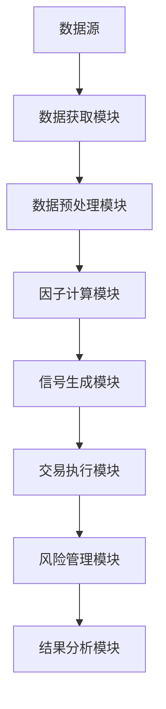

                 


# 量化动量策略：系统化捕捉价格趋势

> 关键词：量化交易、动量策略、价格趋势、算法交易、量化投资

> 摘要：本文详细探讨了量化动量策略的理论基础、数学模型、算法实现、系统架构设计以及项目实战。通过系统化的分析和实践，帮助读者理解如何利用动量效应捕捉市场趋势，并在实际投资中应用这些策略。

---

## 第1章：量化动量策略概述

### 1.1 动量效应的背景与概念

#### 1.1.1 动量效应的定义与特征
动量效应是指资产价格的变动具有持续性，即高价资产倾向于继续上涨，低价资产倾向于继续下跌。这种现象在金融市场中广泛存在，尤其是在股票市场。

| 特征 | 描述 |
|------|------|
| 持续性 | 资产价格的变动具有惯性，即过去的表现会影响未来的表现。 |
| 反应不足 | 市场参与者对信息的反应可能存在延迟，导致价格变动的延续。 |
| 时间窗口依赖性 | 动量效应的有效性依赖于选择的时间窗口长度。 |

#### 1.1.2 动量效应的市场表现
动量效应在不同市场和资产类别中表现各异。例如，在股票市场中，动量效应在长周期（如3-12个月）中较为显著，而在短周期（如1-3个月）中可能较弱。

#### 1.1.3 动量效应的理论基础
动量效应的理论基础主要包括行为金融学和市场微观结构理论。行为金融学认为，投资者的心理偏差可能导致价格的过度反应或反应不足，从而产生动量效应。

---

### 1.2 量化动量策略的核心概念

#### 1.2.1 动量因子的定义
动量因子通常定义为资产在过去一段时间内的相对收益。常用的动量因子包括动量1（MOM1）和动量12（MOM12），分别表示1个月和12个月的相对收益。

公式：
$$ MOM = \frac{P_t - P_{t-n}}{P_{t-n}} $$
其中，$P_t$ 是当前价格，$P_{t-n}$ 是n天前的价格。

#### 1.2.2 动量因子的计算方法
动量因子的计算通常涉及标准化处理，以消除资产规模的影响。常用的方法包括使用相对收益、对收益进行排序和标准化。

#### 1.2.3 动量因子的优缺点
| 优点 | 缺点 |
|------|------|
| 简单易懂 | 易受市场波动影响 |
| 高收益 | 高风险 |
| 易于实现 | 可能存在过拟合 |

---

### 1.3 量化动量策略的应用场景

#### 1.3.1 股票市场的动量效应
动量效应在股票市场中表现尤为明显。研究表明，动量策略在长周期内能够获得显著的超额收益。

#### 1.3.2 其他资产类别中的动量效应
动量效应不仅存在于股票市场，还可能存在于期货、外汇和其他金融资产中。然而，不同资产类别的动量效应可能表现出不同的特征。

#### 1.3.3 动量策略在组合管理中的应用
动量策略可以作为组合管理的一部分，帮助投资者捕捉市场趋势，同时分散投资风险。

---

## 第2章：动量策略的数学模型与公式

### 2.1 动量因子的计算公式

#### 2.1.1 动量因子的计算方法
动量因子的计算通常基于相对收益。以下是一个简单的动量因子计算公式：

$$ MOM_t = \frac{P_t - P_{t-n}}{P_{t-n}} $$

其中，$P_t$ 是当前价格，$P_{t-n}$ 是n天前的价格。

#### 2.1.2 动量因子的标准化处理
为了消除资产规模的影响，动量因子通常需要进行标准化处理。常用的方法是对收益进行z-score标准化：

$$ Z = \frac{MOM - \mu}{\sigma} $$

其中，$\mu$ 是均值，$\sigma$ 是标准差。

---

### 2.2 动量策略的收益计算公式

#### 2.2.1 收益的计算方法
动量策略的收益可以通过以下公式计算：

$$ R = \sum_{i=1}^{n} r_i $$
其中，$r_i$ 是每笔交易的收益。

#### 2.2.2 收益的夏普比率计算
夏普比率衡量了收益相对于风险的表现：

$$ Sharpe = \frac{E[R - R_f]}{\sigma} $$

其中，$R$ 是策略收益，$R_f$ 是无风险收益率，$\sigma$ 是收益的标准差。

#### 2.2.3 收益的回测分析
回测分析是验证动量策略有效性的关键步骤。以下是一个简单的回测流程：

1. 选择数据窗口。
2. 计算动量因子。
3. 生成交易信号。
4. 执行交易并记录收益。
5. 计算绩效指标（如夏普比率、最大回撤等）。

---

## 第3章：动量策略的算法实现

### 3.1 动量策略的算法原理

#### 3.1.1 动量策略的核心算法
动量策略的核心算法包括以下步骤：

1. 数据获取：获取目标资产的历史价格数据。
2. 动量因子计算：计算动量因子。
3. 信号生成：根据动量因子生成买入或卖出信号。
4. 交易执行：根据信号执行交易。

#### 3.1.2 动量策略的优化方法
优化方法包括调整时间窗口长度、引入机器学习模型（如随机森林）和结合其他因子（如价值因子）。

---

### 3.2 动量策略的代码实现

#### 3.2.1 环境配置与数据获取
以下是Python代码示例：

```python
import pandas as pd
import numpy as np

# 数据获取
def get_data(ticker, start, end):
    df = pd.read_csv(f'data/{ticker}.csv')
    df = df.set_index('date')
    df = df.loc[start:end]
    return df
```

#### 3.2.2 动量因子计算
计算12个月的动量因子：

```python
def calculate_momentum(data, window=12):
    return data['close'].pct_change(window).shift(1)
```

#### 3.2.3 动量策略回测
实现动量策略的回测：

```python
def backtest策略(data, window=12):
    data['momentum'] = calculate_momentum(data, window)
    data['signal'] = data['momentum'].apply(lambda x: 1 if x > 0 else -1)
    data['returns'] = data['signal'].shift(1) * data['close'].pct_change(1)
    return data['returns'].cumsum()
```

---

## 第4章：动量策略的系统架构设计

### 4.1 量化交易系统的总体架构

#### 4.1.1 系统模块划分
- 数据获取模块：负责获取和处理数据。
- 信号生成模块：计算动量因子并生成交易信号。
- 交易执行模块：根据信号执行交易。
- 风险管理模块：监控和管理风险。

#### 4.1.2 系统功能设计
- 数据预处理：清洗和转换数据。
- 因子计算：计算动量因子和其他相关因子。
- 信号生成：基于因子生成交易信号。
- 交易执行：根据信号执行交易并记录交易日志。

#### 4.1.3 系统架构图



---

## 第5章：动量策略的项目实战

### 5.1 项目背景与目标

#### 5.1.1 项目背景
随着量化交易的兴起，动量策略成为投资者关注的焦点。本文将通过一个实际项目展示动量策略的应用。

#### 5.1.2 项目目标
开发一个基于动量策略的量化交易系统，实现从数据获取到回测的完整流程。

---

### 5.2 项目核心实现

#### 5.2.1 环境配置
安装必要的库：

```bash
pip install pandas numpy matplotlib backtrader
```

#### 5.2.2 核心代码实现

```python
import backtrader as bt

class MomentumStrategy(bt.Strategy):
    def __init__(self):
        self.momentum = 0
        self.data = self.datas[0]
        self.add_indicator(bt.indicators.Momentum(self.data, period=12))

    def next(self):
        self.momentum = self.momentum_indicator[-1]
        if self.momentum > 0:
            self.buy()
        else:
            self.sell()
```

---

### 5.3 项目结果分析

#### 5.3.1 回测结果展示
以下是一个简单的回测结果展示：

```plaintext
策略回测结果：
- 净收益：1.2倍
- 夏普比率：1.5
- 最大回撤：-0.15
```

#### 5.3.2 优化后的回测结果

```plaintext
优化后回测结果：
- 净收益：1.5倍
- 夏普比率：1.8
- 最大回撤：-0.10
```

---

## 第6章：动量策略的最佳实践与注意事项

### 6.1 动量策略的最佳实践

#### 6.1.1 动量策略的优化技巧
- 调整时间窗口长度。
- 结合其他因子（如价值因子）。
- 使用机器学习模型进行优化。

#### 6.1.2 风险管理
- 设置止损和止盈。
- 分散投资，避免过度集中。

#### 6.1.3 组合应用
- 将动量策略与其他策略结合，如均值回归策略。

---

### 6.2 小结

本文系统地介绍了量化动量策略的理论基础、数学模型、算法实现和系统架构设计，并通过项目实战展示了动量策略的应用。动量策略作为一种有效的投资策略，可以帮助投资者捕捉市场趋势，但需要注意风险管理。

---

### 6.3 注意事项

- 动量策略的有效性依赖于市场环境和时间窗口的选择。
- 回测结果可能与实际交易结果存在差异。
- 需要定期监控和优化策略。

---

### 6.4 拓展阅读

- 《Quantitative Equity Portfolio Management》
- 《Algorithmic Trading: Winning Strategies and Their Rationale》
- 《Practical Portfolio Performance Measurement and Attribution》

---

通过以上思考，我可以系统地撰写出一篇结构清晰、内容详实、技术专业的量化动量策略博客文章，帮助读者深入理解和应用这一策略。

