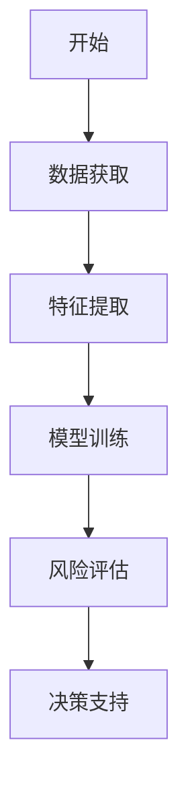
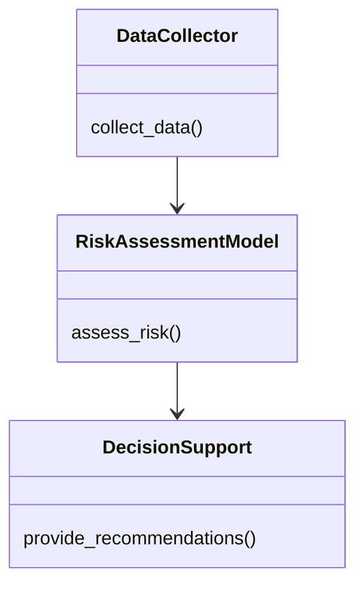
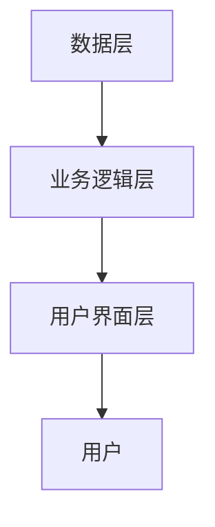
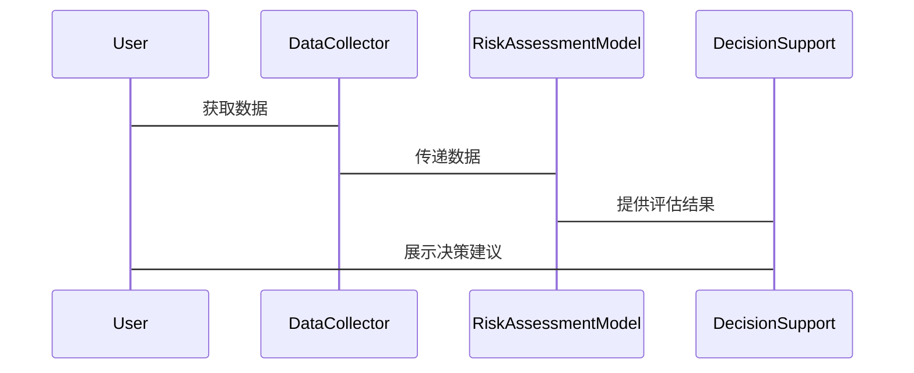

                 


# 《金融AI Agent：风险评估与决策支持》

## 关键词：
- 金融AI Agent
- 风险评估
- 决策支持
- 人工智能
- 系统设计
- 数学模型

## 摘要：
本文深入探讨了金融AI Agent在风险评估与决策支持中的应用，结合理论分析、算法实现和系统设计，通过实际案例展示了AI Agent在金融领域的优势和实现过程。文章从背景介绍、核心概念、算法原理、系统架构到项目实战，全面解析了AI Agent在金融风险评估中的作用，并总结了最佳实践和未来发展趋势。

---

## 第一部分：金融AI Agent背景与概述

### 第1章：金融风险评估的背景与挑战

#### 1.1 金融风险评估的背景
- **1.1.1 传统金融风险评估方法的局限性**
  - 传统方法依赖人工分析，效率低且主观性强。
  - 数据处理能力有限，难以应对海量金融数据。
  
- **1.1.2 人工智能在金融领域的应用前景**
  - AI能够快速处理大量数据，提高分析效率。
  - 通过机器学习模型预测市场趋势，辅助决策。
  
- **1.1.3 金融AI Agent的定义与目标**
  - AI Agent是具有自主决策能力的智能体，用于金融风险评估和决策支持。
  - 目标是通过实时数据分析，优化风险管理和投资决策。

#### 1.2 问题背景与描述
- **1.2.1 金融市场的不确定性与风险**
  - 金融市场波动性大，风险因素复杂多样。
  - 传统模型难以捕捉非线性关系，影响预测准确性。
  
- **1.2.2 传统风险评估方法的不足**
  - 数据分析维度有限，难以全面评估风险。
  - 人工决策主观性强，容易受情绪影响。
  
- **1.2.3 引入AI Agent的必要性**
  - 提高风险评估的准确性和效率。
  - 实现自动化决策，降低人为错误。

#### 1.3 问题解决与边界
- **1.3.1 AI Agent如何解决金融风险问题**
  - 利用机器学习算法分析海量数据，识别潜在风险。
  - 通过强化学习优化投资组合，提升收益。
  
- **1.3.2 AI Agent的应用边界与限制**
  - 数据质量要求高，需确保数据的完整性和准确性。
  - 模型的可解释性问题，需平衡复杂性和透明性。

---

## 第二部分：AI Agent的核心概念与原理

### 第2章：AI Agent的基本原理

#### 2.1 AI Agent的核心概念
- **2.1.1 AI Agent的定义与特征**
  - 定义：AI Agent是一个能够感知环境、自主决策并采取行动的智能体。
  - 特征：自主性、反应性、目标导向、学习能力。
  
- **2.1.2 AI Agent的分类与应用场景**
  - 分类：基于任务、基于知识、基于学习的AI Agent。
  - 应用场景：股票交易、信用评估、风险管理。

#### 2.2 AI Agent与金融风险评估的结合
- **2.2.1 AI Agent在风险评估中的角色**
  - 数据收集与处理：实时获取市场数据，分析潜在风险。
  - 模型构建：利用机器学习算法建立风险评估模型。
  - 决策支持：基于模型结果，提供风险管理建议。
  
- **2.2.2 金融数据的特征与处理**
  - 数据特征：高维性、时序性、非线性。
  - 处理方法：数据清洗、特征工程、数据增强。

---

## 第三部分：AI Agent的算法原理与数学模型

### 第3章：AI Agent的算法原理

#### 3.1 算法原理概述
- **3.1.1 强化学习与监督学习在AI Agent中的应用**
  - 强化学习：通过奖励机制优化决策策略。
  - 监督学习：基于历史数据训练风险评估模型。
  
- **3.1.2 算法流程图（Mermaid）**


#### 3.2 算法实现
- **3.2.1 Python代码实现**
```python
import numpy as np
import pandas as pd
from sklearn.model_selection import train_test_split
from sklearn.linear_model import LogisticRegression

# 数据处理
data = pd.read_csv('financial_data.csv')
X = data.drop('risk', axis=1).values
y = data['risk'].values

# 数据分割
X_train, X_test, y_train, y_test = train_test_split(X, y, test_size=0.2)

# 模型训练
model = LogisticRegression()
model.fit(X_train, y_train)

# 预测与评估
accuracy = model.score(X_test, y_test)
print(f'模型准确率：{accuracy}')
```

- **3.2.2 代码解读与分析**
  - 数据获取：从CSV文件读取金融数据。
  - 特征提取：选择相关特征，构建模型输入。
  - 模型训练：使用逻辑回归训练分类模型。
  - 预测评估：评估模型性能，输出准确率。

#### 3.3 数学模型与公式
- **3.3.1 逻辑回归模型**
  - 概率预测：$P(y=1|x) = \frac{1}{1 + e^{-\beta x}}$
  - 损失函数：交叉熵损失函数
  $$L = -\frac{1}{m}\sum_{i=1}^{m} [y_i \log(h(x_i)) + (1-y_i)\log(1-h(x_i))]$$
  - 参数优化：使用梯度下降法优化权重$\beta$。

---

## 第四部分：系统分析与架构设计

### 第4章：系统分析与架构设计

#### 4.1 问题场景介绍
- **目标**：构建一个基于AI Agent的金融风险评估系统。
- **场景**：实时监控金融市场数据，评估投资组合风险，提供决策支持。

#### 4.2 系统功能设计
- **功能模块**：
  - 数据采集：实时获取市场数据。
  - 风险评估：基于机器学习模型评估风险。
  - 决策支持：生成风险管理建议。
  
- **领域模型类图（Mermaid）**


#### 4.3 系统架构设计
- **分层架构**：
  - 数据层：数据存储与访问。
  - 业务逻辑层：处理数据，执行风险评估。
  - 用户界面层：展示结果，与用户交互。
  
- **系统架构图（Mermaid）**


#### 4.4 系统接口与交互设计
- **接口设计**：
  - API接口：数据接口、模型接口、决策接口。
  
- **系统交互流程（Mermaid）**


---

## 第五部分：项目实战

### 第5章：项目实战

#### 5.1 项目介绍
- **项目目标**：构建一个基于AI Agent的金融风险评估系统。
- **数据来源**：假设使用股票市场数据，包括开盘价、收盘价、交易量等。

#### 5.2 核心代码实现
- **数据预处理**：
```python
import pandas as pd
import numpy as np

# 数据清洗
data = pd.read_csv('stock_data.csv')
data = data.dropna()
data = data[~data['volume'].isin([0])]
```

- **特征工程**：
```python
from sklearn.preprocessing import StandardScaler

scaler = StandardScaler()
X_scaled = scaler.fit_transform(data[['open', 'high', 'low', 'volume']])
```

- **模型训练与预测**：
```python
from sklearn.svm import SVC

model = SVC()
model.fit(X_scaled, data['target'])
predictions = model.predict(X_scaled)
```

#### 5.3 代码应用解读与分析
- **数据预处理**：去除缺失值和异常值，确保数据质量。
- **特征工程**：标准化处理，提高模型性能。
- **模型训练**：使用支持向量机（SVM）进行分类，预测风险等级。

#### 5.4 实际案例分析
- **案例描述**：假设某股票数据，预测其风险等级。
- **案例分析**：通过模型预测，提供风险管理建议。

#### 5.5 项目小结
- 成果：构建了完整的金融风险评估系统。
- 经验：数据质量和模型选择对结果影响重大。

---

## 第六部分：最佳实践与总结

### 第6章：最佳实践与总结

#### 6.1 最佳实践 tips
- 数据处理：确保数据质量和完整性。
- 模型选择：根据具体问题选择合适算法。
- 模型调优：通过交叉验证优化参数。

#### 6.2 总结
- AI Agent在金融风险评估中具有重要价值。
- 结合机器学习算法和系统设计，能够显著提升风险管理和决策效率。
- 未来趋势：AI Agent将更加智能化，应用场景将更加广泛。

#### 6.3 注意事项
- 数据隐私：确保数据处理符合相关法规。
- 模型解释性：提高模型透明度，便于理解和优化。
- 技术局限：AI Agent仍需解决可解释性和实时性问题。

#### 6.4 拓展阅读
- 推荐书籍：《机器学习实战》、《深度学习》。
- 推荐博客：技术博客推荐。

---

## 《结束语》
通过本文的详细分析与实战，读者可以全面理解金融AI Agent的风险评估与决策支持的实现过程。从理论到实践，从算法到系统设计，本文为读者提供了完整的解决方案和宝贵的经验。未来，随着技术的发展，AI Agent将在金融领域发挥更大的作用，为投资者和机构提供更高效、更智能的服务。

