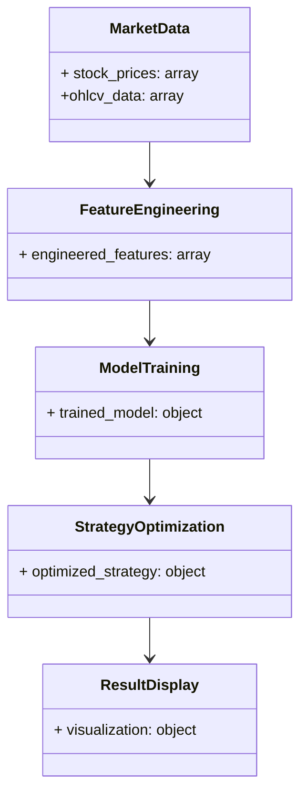
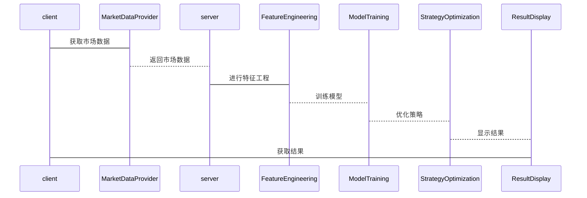

                 


# 金融市场分析的AI Agent决策支持

> 关键词：AI Agent, 金融市场分析, 决策支持, 强化学习, 时间序列分析, 图神经网络, 金融数据

> 摘要：本文深入探讨了AI Agent在金融市场分析中的应用，结合理论、算法和实际案例，系统性地分析了AI Agent如何在金融市场的数据复杂性和动态性中提供决策支持。文章从AI Agent的基本概念、金融市场分析的数学模型与算法、系统架构设计、项目实战等方面展开，详细阐述了AI Agent在金融领域的潜力与挑战。

---

## 第1章: AI Agent与金融市场的结合

### 1.1 AI Agent的基本概念

#### 1.1.1 AI Agent的定义
AI Agent（人工智能代理）是指能够感知环境、自主决策并采取行动的智能体。它通过传感器获取信息，利用知识库和推理机制进行分析，并通过执行器采取行动以实现目标。

#### 1.1.2 AI Agent的核心特征
- **自主性**：AI Agent能够自主决策，无需人工干预。
- **反应性**：能够实时感知环境变化并做出反应。
- **学习能力**：通过数据和经验不断优化决策策略。
- **协作性**：在多智能体系统中与其他智能体协同工作。

#### 1.1.3 AI Agent与传统金融分析的区别
传统金融分析依赖于人工经验和技术指标，而AI Agent能够通过大数据分析、深度学习和强化学习等技术，实现更高效、更精准的决策。

### 1.2 金融市场的基本概念

#### 1.2.1 金融市场的定义与分类
金融市场是指通过交易金融资产进行资金融通的市场，主要包括股票市场、债券市场、外汇市场等。

#### 1.2.2 金融市场的数据特征
- **时间序列性**：金融市场数据通常以时间序列表示。
- **波动性**：市场数据波动较大，受多种因素影响。
- **复杂性**：市场行为受到宏观经济、政策、情绪等多种因素的影响。

#### 1.2.3 金融市场分析的主要方法
- **技术分析**：通过价格、成交量等技术指标预测市场走势。
- **基本面分析**：通过公司财务数据、行业趋势等基本面因素进行分析。
- **量化分析**：利用数学模型和算法进行量化投资。

### 1.3 AI Agent在金融市场中的应用前景

#### 1.3.1 金融市场的数据复杂性
金融市场数据具有高度的不确定性和复杂性，传统方法难以捕捉所有潜在信息。

#### 1.3.2 AI Agent在金融决策中的优势
- **高效性**：AI Agent能够快速处理海量数据，提供实时决策支持。
- **精准性**：通过深度学习和强化学习，AI Agent能够发现数据中的非线性关系，提高预测精度。
- **自适应性**：AI Agent能够根据市场变化动态调整策略。

#### 1.3.3 未来发展趋势与挑战
AI Agent在金融市场的应用前景广阔，但也面临数据质量、模型解释性、伦理道德等挑战。

### 1.4 本章小结
本章介绍了AI Agent的基本概念和金融市场分析的基本方法，分析了AI Agent在金融决策中的优势和未来发展趋势。

---

## 第2章: AI Agent的核心理论基础

### 2.1 AI Agent的理论框架

#### 2.1.1 知识表示与推理
知识表示是将金融市场中的信息转化为计算机可处理的形式，常见的表示方法包括符号逻辑、语义网络等。推理是通过逻辑规则从已知信息中推导出新的结论。

#### 2.1.2 决策树与策略优化
决策树是一种常用的策略优化方法，通过构建树状结构，将问题分解为多个子问题，最终找到最优策略。

#### 2.1.3 强化学习的基本原理
强化学习是一种通过试错机制来优化决策策略的方法，AI Agent通过与环境交互，不断优化自身的策略。

### 2.2 多智能体系统

#### 2.2.1 多智能体系统的基本概念
多智能体系统是由多个智能体组成的系统，智能体之间通过协作和竞争共同完成任务。

#### 2.2.2 多智能体系统的协作机制
协作机制包括通信、协商、任务分配等，确保多个智能体能够协同工作。

#### 2.2.3 多智能体系统在金融中的应用
在金融市场中，多个智能体可以协同完成交易、风险控制等任务。

### 2.3 知识图谱与语义理解

#### 2.3.1 知识图谱的构建
知识图谱是将金融市场中的实体及其关系以图的形式表示，帮助AI Agent理解复杂的关系。

#### 2.3.2 语义理解的基本原理
语义理解通过自然语言处理技术，理解金融市场中的文本信息，提取有用的知识。

#### 2.3.3 知识图谱在金融分析中的应用
知识图谱可以用于风险评估、关联交易分析等金融场景。

### 2.4 本章小结
本章介绍了AI Agent的理论基础，包括知识表示与推理、强化学习、多智能体系统和知识图谱等。

---

## 第3章: 金融市场分析的数学模型与算法

### 3.1 时间序列分析

#### 3.1.1 时间序列的基本特征
时间序列分析是金融市场分析的重要方法，常用ARIMA、LSTM等模型进行预测。

#### 3.1.2 ARIMA模型的原理与应用
ARIMA模型是一种经典的时序预测模型，通过自回归、差分和移动平均等方法进行预测。

#### 3.1.3 LSTM模型的原理与应用
LSTM模型通过长短期记忆机制，能够有效捕捉时间序列中的长距离依赖关系。

### 3.2 强化学习算法

#### 3.2.1 Q-Learning算法的原理
Q-Learning是一种经典的强化学习算法，通过Q值表记录状态-动作对的期望收益，实现最优决策。

#### 3.2.2 DQN算法的原理与应用
DQN算法通过深度神经网络近似Q值函数，应用于金融市场中的交易决策。

#### 3.2.3 策略网络的基本原理
策略网络直接输出最优动作，常用于复杂的金融市场决策问题。

### 3.3 图神经网络

#### 3.3.1 图神经网络的基本概念
图神经网络是一种处理图结构数据的深度学习模型，能够捕捉节点之间的关系。

#### 3.3.2 图卷积网络的原理
图卷积网络通过在图上进行卷积操作，提取节点特征，应用于金融网络分析。

#### 3.3.3 图神经网络在金融网络中的应用
图神经网络可以用于金融风险评估、社交网络分析等场景。

### 3.4 本章小结
本章详细介绍了金融市场分析中的数学模型与算法，包括时间序列分析、强化学习算法和图神经网络等。

---

## 第4章: AI Agent的系统架构设计

### 4.1 系统需求分析

#### 4.1.1 问题场景介绍
本文设计的AI Agent系统用于辅助金融市场分析，帮助投资者做出决策。

#### 4.1.2 项目目标与范围
系统目标是实现一个基于AI Agent的金融市场分析工具，范围包括数据获取、特征提取、模型训练和策略优化。

#### 4.1.3 系统功能需求
系统需要实现数据获取、特征工程、模型训练、策略优化和结果展示等功能。

### 4.2 系统功能设计

#### 4.2.1 领域模型设计（Mermaid类图）


#### 4.2.2 系统架构设计（Mermaid架构图）


#### 4.2.3 系统接口设计
系统接口包括数据接口、模型接口和用户接口，确保各模块之间的协同工作。

#### 4.2.4 系统交互流程（Mermaid序列图）


### 4.3 本章小结
本章详细设计了AI Agent系统的架构，包括功能需求、系统设计和交互流程。

---

## 第5章: 项目实战

### 5.1 环境搭建

#### 5.1.1 安装必要的库
需要安装NumPy、Pandas、Keras、TensorFlow等库。

### 5.2 数据获取

#### 5.2.1 获取股票数据
使用Yahoo Finance API获取股票的历史数据。

### 5.3 特征工程

#### 5.3.1 数据预处理
对数据进行标准化、缺失值处理等预处理操作。

### 5.4 模型训练

#### 5.4.1 LSTM模型的实现
编写LSTM模型代码，进行训练和预测。

### 5.5 模型优化

#### 5.5.1 超参数调优
通过网格搜索等方法优化模型参数。

### 5.6 实际案例分析

#### 5.6.1 案例介绍
以某只股票为例，进行预测和策略优化。

#### 5.6.2 结果分析
分析模型的预测结果和策略收益，总结经验教训。

### 5.7 本章小结
本章通过实际项目展示了AI Agent在金融市场分析中的应用，详细讲解了环境搭建、数据获取、特征工程、模型训练和优化的过程。

---

## 第6章: 总结与展望

### 6.1 本章总结
本文系统性地探讨了AI Agent在金融市场分析中的应用，详细介绍了理论基础、算法原理和系统设计。

### 6.2 未来展望
未来，AI Agent在金融市场中的应用将更加广泛，但也需要解决数据质量、模型解释性等挑战。

### 6.3 最佳实践 tips
- 数据质量是模型性能的关键，需重视数据预处理。
- 模型解释性是实际应用的重要考量，需注重模型的可解释性。
- 多智能体系统的协作机制是未来研究的方向。

### 6.4 小结
本文为AI Agent在金融市场分析中的应用提供了理论支持和实践指导。

---

## 附录

### 附录A: 代码实现

```python
import numpy as np
import pandas as pd
from keras.layers import LSTM, Dense, Dropout
from keras.models import Sequential

# 示例代码：LSTM模型训练
def build_lstm_model(input_shape):
    model = Sequential()
    model.add(LSTM(64, input_shape=input_shape))
    model.add(Dropout(0.5))
    model.add(Dense(1))
    model.compile(loss='mean_squared_error', optimizer='adam')
    return model

# 数据预处理
data = pd.read_csv('stock_data.csv')
features = data[['open', 'high', 'low', 'close']]
scaler = MinMaxScaler()
scaled_features = scaler.fit_transform(features)

# 划分训练集和测试集
train = scaled_features[:int(0.8*len(scaled_features))]
test = scaled_features[int(0.8*len(scaled_features)):]

# 构建输入和输出
X_train = []
y_train = []
for i in range(60, len(train)):
    X_train.append(train[i-60:i])
    y_train.append(train[i])
X_train = np.array(X_train)
y_train = np.array(y_train)

# 训练模型
model = build_lstm_model((60, 4))
model.fit(X_train, y_train, epochs=100, batch_size=32)
```

### 附录B: 参考文献
- 文献1：介绍强化学习在金融中的应用
- 文献2：时间序列分析的经典方法
- 文献3：图神经网络的最新研究

---

通过本文的系统性分析，读者可以全面了解AI Agent在金融市场分析中的应用，并能够在实际中应用这些方法进行决策支持。

