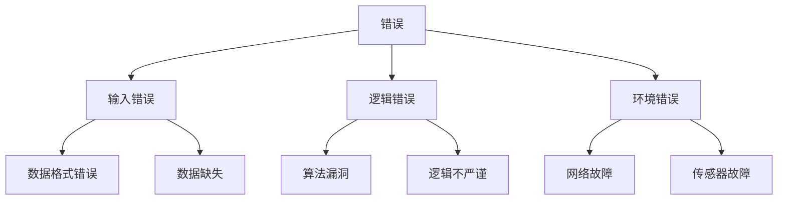
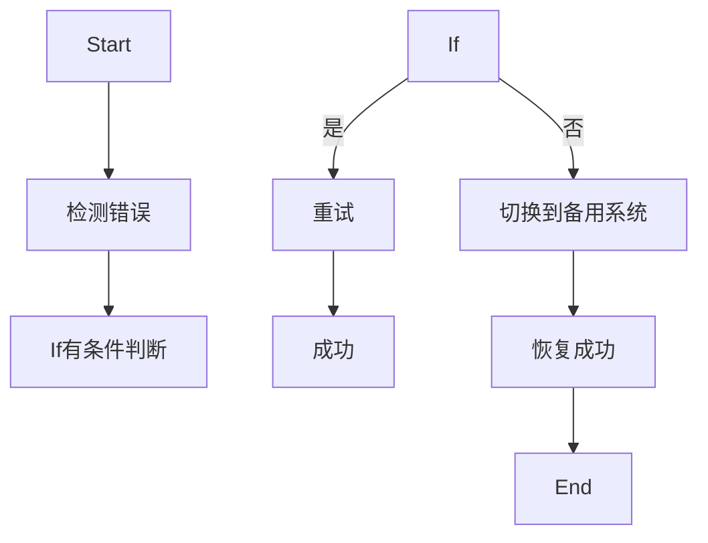
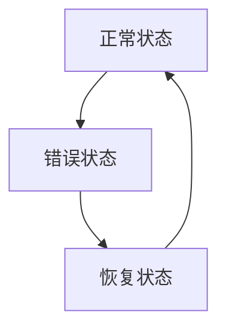

                 


# 错误处理与恢复：提高AI Agent的鲁棒性

> 关键词：错误处理，恢复机制，AI Agent，鲁棒性，故障检测，容错设计

> 摘要：本文深入探讨了错误处理与恢复在提高AI Agent鲁棒性中的重要性。从错误检测机制、恢复算法原理到系统架构设计，结合实际案例，详细讲解了如何通过有效的错误处理与恢复技术来增强AI Agent的稳定性和可靠性。文章还提供了数学模型和公式，以及系统的架构设计图和代码示例，帮助读者全面理解并掌握相关技术。

---

# 第1章: 错误处理与恢复的背景与重要性

## 1.1 错误处理的基本概念

### 1.1.1 什么是错误

错误是指系统在运行过程中出现的不符合预期的状态或行为。在AI Agent中，错误可能源于输入数据的异常、算法逻辑的漏洞或外部环境的变化。错误处理的目标是识别这些异常状态并采取措施进行修复或调整，以确保系统的正常运行。

### 1.1.2 错误的分类与特征

错误可以分为以下几类：

1. **输入错误**：由于输入数据不符合预期格式或范围导致的错误。
2. **逻辑错误**：算法设计中的漏洞或逻辑不严密导致的错误。
3. **环境错误**：外部环境的变化（如网络故障、传感器故障）导致的错误。
4. **资源错误**：系统资源不足（如内存不足、文件句柄不足）导致的错误。

错误的特征包括突发性、不可预测性和隐蔽性。错误可能在任何时间发生，且难以预测其具体发生位置和原因。

### 1.1.3 错误处理的核心目标

错误处理的核心目标是：

1. **检测错误**：通过有效的检测机制及时发现错误。
2. **定位错误**：确定错误的具体位置和原因。
3. **修复或补偿错误**：采取措施恢复系统到正常状态或绕过错误影响。

---

## 1.2 AI Agent的鲁棒性要求

### 1.2.1 AI Agent的定义与特点

AI Agent是一种智能主体，能够感知环境、自主决策并执行任务。其特点包括：

1. **自主性**：能够在没有外部干预的情况下运行。
2. **反应性**：能够根据环境变化实时调整行为。
3. **社会性**：能够与其他系统或用户交互协作。

### 1.2.2 鲁棒性在AI Agent中的重要性

鲁棒性是指系统在面对异常情况时仍能保持正常运行的能力。对于AI Agent来说，鲁棒性尤为重要，因为它们通常运行在复杂多变的环境中，可能面临各种不可预测的错误。

### 1.2.3 错误处理与恢复对鲁棒性的贡献

错误处理与恢复是实现AI Agent鲁棒性的关键技术。通过有效的错误处理机制，AI Agent可以在出现故障时快速恢复，确保任务的顺利完成。

---

## 1.3 错误处理与恢复的背景与重要性

### 1.3.1 错误处理的历史发展

错误处理技术经历了从简单到复杂的演变过程。早期的错误处理主要依赖于人工干预，随着计算机技术的发展，自动化的错误检测和恢复机制逐渐成为主流。

### 1.3.2 恢复机制的演变

恢复机制从简单的重启恢复发展到复杂的自适应恢复，例如基于状态的恢复和基于上下文的恢复。

### 1.3.3 错误处理与恢复在AI Agent中的应用前景

随着AI技术的广泛应用，错误处理与恢复技术在AI Agent中的应用将更加广泛和重要。通过不断优化错误处理与恢复机制，可以提高AI系统的可靠性和用户体验。

---

# 第2章: 错误处理与恢复的核心概念

## 2.1 错误检测机制

### 2.1.1 错误检测的基本原理

错误检测的基本原理是通过监测系统的行为或状态，发现与预期不符的情况。常用的方法包括：

1. **阈值检测**：通过设置阈值，检测系统状态是否超出预期范围。
2. **异常检测**：利用统计方法或机器学习模型，识别异常行为。

### 2.1.2 常见的错误检测方法

#### 表格：错误检测方法对比

| 方法         | 描述                       | 优缺点             |
|--------------|--------------------------|-------------------|
| 阈值检测      | 基于预设阈值检测异常状态   | 简单易实现，但可能漏检复杂情况 |
| 异常检测      | 利用统计或机器学习模型检测异常 | 高精度，但实现复杂 |
| 日志分析      | 通过分析日志发现异常      | 依赖日志质量，实现成本高 |

### 2.1.3 错误检测的挑战与解决方案

错误检测的挑战包括：

1. **噪声干扰**：环境噪声可能导致误报。
2. **动态变化**：系统的动态变化可能导致检测模型失效。

解决方案包括：

1. **自适应阈值**：根据系统状态动态调整阈值。
2. **在线学习**：利用在线学习算法更新检测模型。

---

## 2.2 错误分类与处理策略

### 2.2.1 错误分类的层次结构

#### 图表：错误分类层次结构



### 2.2.2 不同类型错误的处理策略

#### 表格：错误类型与处理策略

| 错误类型       | 处理策略                   |
|----------------|--------------------------|
| 输入错误       | 数据清洗、格式转换         |
| 逻辑错误       | 重新设计算法、修复漏洞     |
| 环境错误       | 切换备用资源、冗余设计     |

---

## 2.3 恢复算法的原理与实现

### 2.3.1 恢复机制的基本概念

恢复机制的目标是在检测到错误后，采取措施将系统恢复到正常状态。常见的恢复策略包括：

1. **重试机制**：重复执行失败的操作，直到成功。
2. **切换机制**：切换到备用系统或模块。
3. **修复机制**：自动修复错误或触发人工干预。

### 2.3.2 常见的恢复算法

#### 图表：恢复算法流程图



---

## 2.4 错误处理与恢复的数学模型

### 2.4.1 错误检测的概率模型

错误检测的概率模型可以表示为：

$$ P(\text{错误}) = 1 - P(\text{正常}) $$

其中，$P(\text{正常})$ 是系统正常运行的概率。

### 2.4.2 基于马尔可夫链的恢复模型

恢复模型可以基于马尔可夫链进行建模，状态转移图如下：



恢复过程的概率转移矩阵可以表示为：

$$
\begin{pmatrix}
0 & 1 & 0 \\
0 & 0 & 1 \\
1 & 0 & 0 \\
\end{pmatrix}
$$

---

## 2.5 系统架构与接口设计

### 2.5.1 系统功能设计

系统功能模块包括：

1. **错误检测模块**：负责实时监测系统状态。
2. **错误分类模块**：对检测到的错误进行分类。
3. **恢复执行模块**：根据错误类型执行相应的恢复策略。

### 2.5.2 系统架构图

```mermaid
graph TD
    Agent[A

