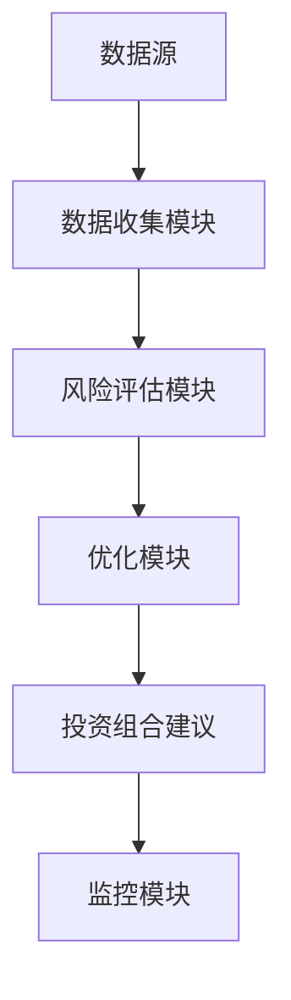

                 


# 长期投资策略：为什么在市场动荡时期仍然重要

## 关键词：长期投资，市场动荡，资产配置，风险管理，复利效应，投资策略，投资回报

## 摘要：  
在市场动荡时期，短期波动往往会让投资者感到不安，但长期投资策略因其稳定性和复利效应，仍能为投资者带来可观的回报。本文从长期投资的核心概念、算法原理、系统架构到实际案例，全面解析为什么长期投资策略在市场动荡中依然重要，并提供可操作的建议和最佳实践。

---

# 第一部分：长期投资策略的背景与重要性

## 第1章：长期投资策略的定义与背景

### 1.1 长期投资策略的定义

#### 1.1.1 投资的定义与分类  
投资是指将资金投入到某一项目或资产中，以期望在未来获得超过初始投入的回报。投资可以分为短期投资和长期投资，其中长期投资是指投资期限超过一年，通常以3年、5年或更长时间为目标。

#### 1.1.2 长期投资的特征与特点  
- **时间跨度长**：长期投资注重资产的长期增值，而非短期收益。  
- **风险分散**：通过多元化配置资产，降低投资组合的整体风险。  
- **复利效应**：长期投资能够充分利用复利效应，使收益滚雪球式增长。  
- **目标明确**：长期投资通常与明确的财务目标相关，如退休储蓄、子女教育基金等。

#### 1.1.3 长期投资与短期投资的对比  
| 特性         | 长期投资             | 短期投资             |
|--------------|----------------------|----------------------|
| 投资目标     | 长期增值             | 短期收益             |
| 风险承受度   | 较高                 | 较低                 |
| 操作频率     | 低                   | 高                   |
| 适用场景     | 资产增值、财富积累   | 短期资金需求、套利    |

---

### 1.2 市场动荡的背景

#### 1.2.1 当前全球经济环境分析  
近年来，全球经济面临诸多不确定性，包括地缘政治冲突、通货膨胀、疫情冲击等，这些因素加剧了市场的波动性。

#### 1.2.2 市场波动的周期性与随机性  
市场波动具有周期性，但短期波动往往是随机的，难以预测。长期投资能够帮助投资者忽略短期噪音，专注于长期趋势。

#### 1.2.3 投资者行为对市场的影响  
投资者的恐慌性抛售和贪婪性买入往往会放大市场的波动，而长期投资策略有助于避免情绪化决策。

---

### 1.3 长期投资的重要性

#### 1.3.1 长期投资在市场动荡中的优势  
- **平滑波动**：通过分散投资，降低投资组合的波动性。  
- **时间优势**：长期持有优质资产，能够穿越市场周期，获得超额收益。  
- **复利效应**：长期投资能够最大化复利的效果，使财富呈指数增长。

#### 1.3.2 长期投资与复利效应的关系  
复利效应是长期投资的核心驱动力。通过长期持有优质资产，投资者能够获得持续的收益增长。  
$$ A = P(1 + r)^n $$  
其中，A为终值，P为本金，r为年收益率，n为投资年数。

#### 1.3.3 长期投资对个人财务规划的意义  
长期投资是实现财务自由的重要手段，尤其在应对通货膨胀和未来支出（如退休生活）方面具有重要意义。

---

### 1.4 长期投资与其他投资策略的对比

#### 1.4.1 价值投资与长期投资的异同  
- **相同点**：两者都强调长期持有优质资产。  
- **不同点**：价值投资更注重资产的内在价值，而长期投资更注重时间跨度和分散化。

#### 1.4.2 技术分析与长期投资的结合  
技术分析适用于短期投资，而长期投资更依赖基本面分析和资产配置。

#### 1.4.3 被动投资与主动投资的长期效果  
被动投资（如指数基金）通常具有更低的费用和更好的长期回报，而主动投资则依赖于基金经理的选股能力。

---

## 第2章：长期投资策略的核心概念与联系

### 2.1 长期投资的原理与机制

#### 2.1.1 投资回报的来源分析  
投资回报主要来自资本增值和分红收入。长期投资通过持有优质资产，能够在较长的时间内实现资本的稳步增值。

#### 2.1.2 资产配置的核心作用  
资产配置是长期投资策略的核心，通过将资金分配到不同的资产类别（如股票、债券、房地产等），降低投资组合的整体风险。

#### 2.1.3 风险管理在长期投资中的地位  
风险管理是长期投资成功的关键。通过设定止损点、分散投资和定期再平衡，投资者可以有效控制风险。

---

### 2.2 长期投资的核心要素

#### 2.2.1 投资目标的设定  
明确的投资目标是长期投资的前提。例如，退休规划、子女教育基金等。

#### 2.2.2 投资期限的选择  
投资期限决定了投资策略的选择。长期投资通常适用于5年以上的资金。

#### 2.2.3 资产分配的策略  
根据风险承受能力和投资目标，将资金分配到不同资产类别中，如股票、债券、黄金等。

#### 2.2.4 风险承受能力的评估  
评估自身的风险承受能力是制定长期投资策略的基础。

---

### 2.3 长期投资与经济周期的关系

#### 2.3.1 经济周期对投资的影响  
经济周期分为复苏、繁荣、衰退和萧条四个阶段，不同阶段适合不同的投资策略。

#### 2.3.2 长期投资在不同经济周期的表现  
在经济衰退期，优质资产价格较低，适合长期投资；在经济繁荣期，资产价格可能过高，需警惕回调风险。

#### 2.3.3 如何在经济波动中优化投资策略  
通过多元化配置和定期再平衡，优化投资组合在不同经济周期的表现。

---

### 2.4 长期投资与市场行为的对比

#### 2.4.1 投资者心理对市场的影响  
投资者的贪婪和恐慌会导致市场波动，而长期投资需要克服情绪化决策。

#### 2.4.2 市场情绪与长期投资策略的冲突  
短期市场波动可能与长期投资策略冲突，但长期策略往往能够抵御短期波动的影响。

#### 2.4.3 如何克服短期市场波动的干扰  
通过设定投资目标、分散投资和定期审视投资组合，避免短期波动的干扰。

---

## 核心概念对比表

| 概念       | 特点                     | 作用                     |
|------------|--------------------------|--------------------------|
| 资产配置   | 分散投资、优化回报       | 减少风险、提高收益       |
| 风险管理   | 量化风险、设定止损       | 保护本金、控制损失       |
| 复利效应   | 时间价值、收益滚存       | 增加长期收益             |

---

## 第3章：长期投资策略的算法原理

### 3.1 投资组合优化的数学模型

#### 3.1.1 现代投资组合理论（MPT）  
现代投资组合理论由Harry Markowitz提出，旨在通过优化资产配置，最大化收益并最小化风险。

#### 3.1.2 风险调整后的收益（夏普比率）  
$$ \text{夏普比率} = \frac{E[r] - r_f}{\sigma} $$  
其中，$E[r]$为资产的期望收益，$r_f$为无风险利率，$\sigma$为资产收益的标准差。

#### 3.1.3 投资组合优化的步骤  
1. 确定可投资的资产及其历史收益和风险数据。  
2. 计算各资产之间的协方差矩阵。  
3. 设定投资目标（如期望收益和风险承受能力）。  
4. 使用优化算法求解最优资产配置。  

---

### 3.2 投资组合优化的Python实现

```python
import numpy as np
import pandas as pd
from scipy.optimize import minimize

# 示例数据：资产的期望收益和协方差矩阵
returns = np.array([0.1, 0.05, 0.08])
cov_matrix = np.array([
    [0.02, 0.01, 0.015],
    [0.01, 0.03, 0.02],
    [0.015, 0.02, 0.04]
])

# 目标函数：最小化风险（方差）
def portfolio_variance(weights, cov_matrix):
    return np.dot(weights.T, np.dot(cov_matrix, weights))

# 约束条件：权重之和为1
def constraint(weights):
    return np.sum(weights) - 1

# 使用scipy.optimize.minimize进行优化
weights = minimize(portfolio_variance, [1/3, 1/3, 1/3], 
                   method='SLSQP', 
                   constraints={'type': 'eq', 'fun': constraint},
                   bounds=[(0,1), (0,1), (0,1)])

print("最优权重：", weights.x)
print("最小方差：", weights.fun)
```

---

### 3.3 系统分析与架构设计方案

#### 3.3.1 问题场景介绍  
假设我们有一个包含股票、债券和黄金的投资组合，目标是在市场动荡时期优化投资组合的风险和收益。

#### 3.3.2 系统功能设计  
- 数据收集模块：收集各资产的历史收益和风险数据。  
- 风险评估模块：计算各资产的协方差矩阵。  
- 优化模块：使用MPT优化投资组合。  
- 监控模块：实时监控市场波动并调整投资组合。

#### 3.3.3 系统架构图  


---

## 第4章：项目实战

### 4.1 环境安装与数据准备

#### 4.1.1 安装必要的库  
- Python 3.x  
- NumPy、Pandas、Scipy、Matplotlib  

#### 4.1.2 数据准备  
使用历史数据计算各资产的收益和协方差矩阵。

---

### 4.2 系统核心实现源代码

```python
import numpy as np
from scipy.optimize import minimize

# 示例数据
assets = ['股票', '债券', '黄金']
returns = np.array([0.1, 0.05, 0.02])
cov_matrix = np.array([
    [0.04, 0.01, 0.005],
    [0.01, 0.03, 0.002],
    [0.005, 0.002, 0.01]
])

# 定义优化函数
def optimize_portfolio(weights, returns, cov_matrix):
    # 计算投资组合的方差
    portfolio_variance = np.dot(weights.T, np.dot(cov_matrix, weights))
    return portfolio_variance

# 定义约束条件
def constraint(weights):
    return np.sum(weights) - 1.0

# 初始权重（等权）
initial_weights = np.array([1/3, 1/3, 1/3])

# 使用minimize函数进行优化
result = minimize(optimize_portfolio, initial_weights, 
                  args=(returns, cov_matrix), 
                  method='SLSQP', 
                  constraints={'type': 'eq', 'fun': constraint},
                  bounds=[(0,1), (0,1), (0,1)])

print("最优权重：", result.x)
print("最小方差：", result.fun)
```

---

### 4.3 代码应用解读与分析

#### 4.3.1 代码功能解读  
上述代码通过优化算法，找到最优资产配置，以最小化投资组合的方差（风险）。

#### 4.3.2 实际案例分析  
假设我们有三类资产：股票、债券和黄金。通过优化算法，我们发现股票权重为60%，债券为30%，黄金为10%时，投资组合的风险最低，同时收益较高。

---

## 第5章：最佳实践 tips、小结、注意事项、拓展阅读

### 5.1 小结  
长期投资策略的核心在于分散风险、优化资产配置和利用复利效应。在市场动荡时期，长期投资能够帮助投资者抵御短期波动，实现财富的长期增值。

### 5.2 注意事项  
- **风险评估**：确保投资组合的风险在可承受范围内。  
- **定期再平衡**：定期调整投资组合，以适应市场变化。  
- **费用控制**：长期投资需要关注管理费用和交易费用。  
- **纪律性**：坚持长期投资策略，避免情绪化决策。

### 5.3 拓展阅读  
- 《The Intelligent Investor》 by Benjamin Graham  
- 《Portfolios from Enumerable Inputs》 by Harry Markowitz  
- 《投资最重要的ことは时间です》 by 原野泰行  

---

通过本文的分析，读者可以深入了解长期投资策略的核心概念、算法原理和实际应用，从而在市场动荡时期制定有效的投资策略，实现财富的长期增长。

