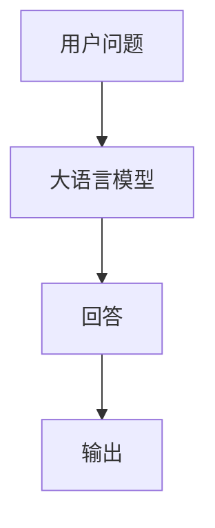
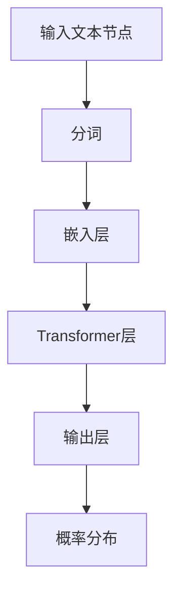
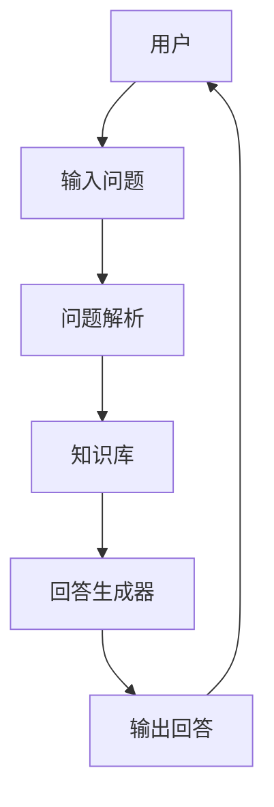
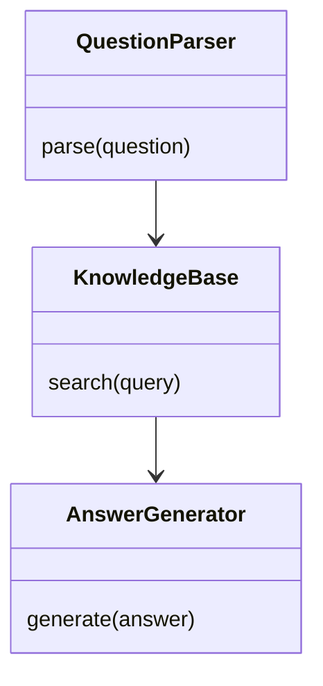
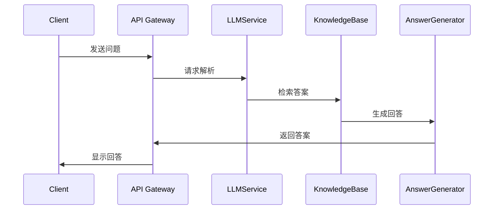

                 


# 《问答系统：构建基于LLM的智能问答Agent》

> 关键词：问答系统，LLM，智能问答，大语言模型，NLP，人工智能

> 摘要：本文详细探讨了基于大语言模型（LLM）的智能问答系统的设计与实现。从问答系统的基本概念到LLM的核心原理，再到系统架构设计和项目实战，文章全面分析了如何构建高效、智能的问答Agent。通过理论与实践结合，读者将深入了解LLM在问答系统中的应用潜力和实现细节。

---

# 第一部分: 问答系统与基于LLM的智能问答Agent背景介绍

## 第1章: 问答系统概述

### 1.1 问答系统的基本概念
- **问题背景**：问答系统是自然语言处理（NLP）中的重要应用，旨在理解和回答用户提出的问题。
- **问题描述**：问答系统通过解析用户的问题，从知识库或生成内容中获取相关信息，并以自然语言形式返回答案。
- **问题解决**：问答系统的关键在于准确理解问题、高效检索或生成答案。
- **边界与外延**：问答系统可以应用于客服、教育、医疗等多个领域，但其性能受限于知识库的规模和模型的能力。
- **核心要素组成**：包括问题理解模块、知识库、答案生成模块和反馈机制。

### 1.2 基于LLM的问答系统特点
- **LLM的核心优势**：大语言模型通过海量数据训练，具备强大的上下文理解和生成能力。
- **与传统问答系统的区别**：基于LLM的问答系统能够生成更自然的回答，适应更多样化的问题。
- **应用潜力**：LLM在问答系统中的应用能够提升用户体验，降低开发复杂度。

### 1.3 本章小结
本章介绍了问答系统的基本概念及其与LLM的结合，为后续内容奠定了基础。

---

## 第2章: 大语言模型（LLM）背景

### 2.1 LLM的基本概念
- **定义**：大语言模型是基于深度学习的NLP模型，如GPT系列，通过预训练掌握语言规律。
- **核心特点**：参数量大、训练数据丰富、具备生成能力。
- **训练原理**：基于Transformer架构，采用自监督学习，通过预测下一个词来训练模型。

### 2.2 LLM在问答系统中的应用
- **优势**：生成式回答、多语言支持、上下文理解。
- **挑战**：计算资源消耗大、生成答案的准确性问题。
- **未来发展方向**：优化模型效率、提升回答准确性、多模态结合。

### 2.3 本章小结
本章深入分析了LLM的特点及其在问答系统中的潜力，为后续设计提供了理论支持。

---

## 第3章: 基于LLM的问答系统结合

### 3.1 LLM与问答系统的结合方式
- **生成式问答系统**：直接利用LLM生成回答，适用于开放性问题。
- **检索式问答系统**：结合LLM对检索结果的优化，提高回答相关性。
- **混合式系统**：结合生成和检索，综合两者优势。

### 3.2 基于LLM的问答系统架构
- **输入处理**：接收用户问题并解析。
- **模型推理**：通过LLM生成回答或指导检索。
- **输出生成**：将最终答案以自然语言形式返回。

### 3.3 本章小结
本章详细探讨了LLM与问答系统的结合方式，分析了不同架构的优缺点。

---

# 第二部分: 基于LLM的问答系统核心概念与联系

## 第4章: LLM与问答系统核心概念原理

### 4.1 LLM的核心原理
- **Transformer模型原理**：基于自注意力机制，处理长文本。
- **注意力机制**：通过权重分配，关注输入中的关键部分。
- **优化算法**：采用Adam优化器，通过梯度下降更新参数。

### 4.2 问答系统的原理
- **问题理解**：解析用户意图。
- **知识库检索**：基于关键词或向量进行匹配。
- **回答生成**：通过LLM生成回答或从知识库中选择答案。

### 4.3 LLM与问答系统的结合原理
- **输入处理**：将用户问题转化为模型可理解的格式。
- **模型推理**：通过LLM生成回答或指导检索。
- **输出生成**：将模型输出转化为用户友好的答案。

### 4.4 本章小结
本章从原理层面分析了LLM与问答系统的结合方式，为后续实现提供了理论支持。

---

## 第5章: 核心概念属性特征对比

### 5.1 LLM与传统NLP模型对比
| 对比维度 | LLM | 传统NLP模型 |
|----------|------|--------------|
| 参数规模 | 大（百万到百亿参数） | 小（几千到百万参数） |
| 训练数据 | 海量多样化 | 较小，特定领域 |
| 模型性能 | 高 | 较低，受限于训练数据 |

### 5.2 ER实体关系图架构


### 5.3 本章小结
通过对LLM与传统NLP模型的对比，明确了LLM在问答系统中的优势。

---

# 第三部分: 问答系统算法与架构设计

## 第6章: 算法原理与流程

### 6.1 LLM的训练过程


### 6.2 问答系统流程


### 6.3 数学公式
- **交叉熵损失函数**：
  $$ \text{Loss} = -\sum_{i=1}^{n} y_i \log(p_i) $$
  其中，$y_i$ 是真实标签，$p_i$ 是预测概率。

### 6.4 本章小结
本章详细分析了LLM的训练过程和问答系统的流程，展示了算法的核心步骤。

---

## 第7章: 系统分析与架构设计

### 7.1 问题场景介绍
用户通过自然语言提问，系统需要快速理解并生成准确回答。

### 7.2 系统功能设计


### 7.3 系统架构设计
```mermaid
graph TD
    Client[客户端] --> API Gateway[API网关]
    API Gateway --> LLMService[大语言模型服务]
    LLMService --> KnowledgeBase[知识库]
    KnowledgeBase --> AnswerGenerator[回答生成器]
    AnswerGenerator --> API Gateway
    API Gateway --> Client
```

### 7.4 接口设计与交互流程


### 7.5 本章小结
本章详细分析了系统架构设计，展示了各组件之间的交互流程。

---

## 第8章: 项目实战

### 8.1 环境安装
```bash
pip install transformers
pip install torch
pip install requests
```

### 8.2 核心实现代码
```python
from transformers import pipeline

qa_pipeline = pipeline("question-answering", model="deepset/bert-base-cased-squad2")

def ask_question(question, context):
    answer = qa_pipeline(question=question, context=context)
    return answer['answer']
```

### 8.3 案例分析
```python
context = "巴黎是法国的首都。"
question = "法国的首都在哪里？"
print(ask_question(question, context))  # 输出：巴黎
```

### 8.4 本章小结
通过代码实现，读者可以快速上手基于LLM的问答系统开发。

---

# 第四部分: 最佳实践与总结

## 第9章: 最佳实践与注意事项

### 9.1 最佳实践
- **数据多样性**：确保训练数据多样化，提升模型泛化能力。
- **模型调优**：通过微调优化模型在特定任务上的表现。
- **结果验证**：通过人工审核和A/B测试验证系统性能。

### 9.2 注意事项
- **计算资源**：LLM的推理需要大量计算资源，需优化部署环境。
- **数据隐私**：确保用户数据安全，遵守相关法律法规。
- **用户体验**：设计直观的交互界面，提升用户体验。

## 第10章: 总结与展望

### 10.1 总结
本文详细探讨了基于LLM的问答系统的设计与实现，从背景到架构，再到实战，为读者提供了全面的知识体系。

### 10.2 展望
未来，随着LLM技术的不断发展，问答系统将更加智能化，应用场景也将更加广泛。

## 第11章: 拓展阅读

### 11.1 推荐书籍
- 《深度学习入门：基于Python的理论与实践》
- 《自然语言处理入门：基于Python和TensorFlow》

### 11.2 推荐博客与资源
- Hugging Face的Transformers库官方文档
- 开源问答系统项目GitHub仓库

---

# 结语

通过本文的学习，读者将能够系统地构建基于LLM的智能问答Agent，掌握从理论到实践的完整流程。希望本文能为读者在问答系统领域的深入研究和实践提供有价值的指导。

