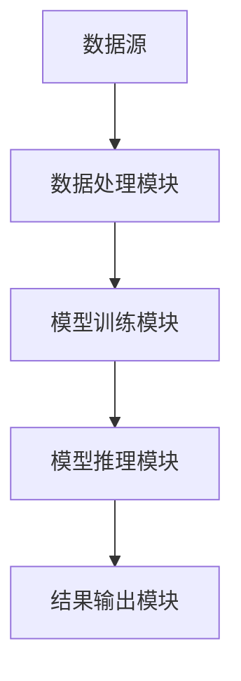

                 

# 隐私保护AI：在数据安全与功能之间寻找平衡

> 关键词：隐私保护、人工智能、数据安全、差分隐私、联邦学习、系统架构

> 摘要：随着人工智能技术的飞速发展，数据隐私保护的重要性日益凸显。本文探讨了在AI技术广泛应用的同时，如何在数据安全与功能之间找到平衡点。通过分析隐私保护的核心概念、算法原理、系统架构设计以及实际案例，本文为读者提供了全面的视角，帮助理解如何在保护隐私的同时，最大化AI的功能价值。

---

## 第1章：隐私保护与AI的背景介绍

### 1.1 问题背景与问题描述

在当今数据驱动的时代，人工智能（AI）技术的应用越来越广泛。从医疗健康到金融风控，从智慧城市到自动驾驶，AI正在改变我们的生活方式和商业模式。然而，AI的发展离不开数据，而数据的大量收集和使用也带来了严重的隐私泄露风险。

近年来，数据泄露事件频发，从社交媒体平台的用户信息泄露，到金融机构的客户数据被盗，这些问题引发了公众对数据隐私的高度关注。与此同时，AI技术的快速发展也对数据的依赖性越来越强，如何在保护隐私的同时发挥AI的功能，成为亟待解决的问题。

### 1.2 隐私保护与AI的核心概念

隐私保护的核心在于确保个人数据不被未经授权的主体访问或滥用。这包括数据的机密性、完整性和可用性。AI技术则通过数据的收集、处理和分析，生成有价值的洞察和决策支持。

AI技术的应用场景广泛，但其功能实现往往依赖于大量的数据。如何在数据的可用性与隐私保护之间找到平衡点，是隐私保护AI的核心问题。

### 1.3 隐私保护与AI的关系分析

隐私保护与AI之间的关系是复杂的。一方面，隐私保护限制了数据的使用，可能影响AI模型的训练和性能；另一方面，AI技术也为隐私保护提供了新的工具和方法，例如通过联邦学习和差分隐私技术，可以在保护隐私的前提下进行数据的共享和模型的训练。

---

## 第2章：隐私保护的核心概念与原理

### 2.1 数据安全的基本原理

数据安全是隐私保护的基础。数据安全的基本原理包括数据的分类与敏感数据识别、数据加密、匿名化处理以及访问控制等。敏感数据的识别是隐私保护的第一步，需要根据数据的性质和使用场景，确定哪些数据需要特别保护。

数据加密是通过加密算法对数据进行加密处理，确保数据在传输和存储过程中不被未经授权的主体窃取。匿名化处理则是通过技术手段去除数据中的个人信息，使其无法被还原到具体个体。

### 2.2 AI算法的基本原理

AI算法的核心是通过对数据的处理和分析，生成模型并进行预测或决策。机器学习算法通过训练数据生成模型参数，深度学习算法则通过多层神经网络进行特征提取和模式识别。

数据训练是AI模型的核心过程，模型的性能依赖于训练数据的质量和多样性。模型推理则是基于训练好的模型，对新数据进行预测或分类。

### 2.3 隐私保护与AI的核心联系

隐私保护与AI的核心联系在于数据的使用。AI需要数据进行训练和推理，而数据的使用必须符合隐私保护的要求。隐私保护技术为AI提供了数据的安全使用方式，而AI技术则为隐私保护提供了新的解决方案。

---

## 第3章：隐私保护AI的算法原理

### 3.1 隐私保护算法概述

隐私保护算法是AI技术的重要组成部分。常见的隐私保护算法包括差分隐私和联邦学习。

差分隐私通过在数据中添加噪声，确保单个数据点的改变不会显著影响整体数据的统计结果。联邦学习则是一种分布式机器学习技术，通过在数据源端进行模型训练，避免数据的集中存储。

### 3.2 差分隐私算法原理

差分隐私的核心思想是通过在数据中添加随机噪声，确保单个数据点的改变不会显著影响整体数据的统计结果。差分隐私的数学定义如下：

$$
\text{Privacy} = \epsilon
$$

其中，$\epsilon$ 是隐私预算，表示数据被修改后，统计结果的变化程度。$\epsilon$ 越小，隐私保护越强。

差分隐私的具体实现可以通过在数据发布前对数据进行扰动生成。例如，在发布某统计结果时，可以通过以下步骤实现差分隐私：

1. 对原始数据进行统计计算，得到真实结果。
2. 在真实结果的基础上，添加随机噪声，生成最终结果。

### 3.3 联邦学习算法原理

联邦学习是一种分布式机器学习技术，通过在数据源端进行模型训练，避免数据的集中存储。联邦学习的具体实现步骤如下：

1. 数据源端将数据分割成多个子集。
2. 各数据源端分别对本地数据进行模型训练，生成模型更新参数。
3. 各数据源端将模型更新参数上传至中央服务器。
4. 中央服务器对所有模型更新参数进行汇总，生成全局模型。

联邦学习通过数据的本地训练和参数的集中更新，实现了数据的分布式处理，同时保护了数据的隐私性。

---

## 第4章：隐私保护AI的系统架构设计

### 4.1 系统功能设计

隐私保护AI系统的功能设计包括数据收集、数据处理、模型训练、模型推理和结果输出。数据收集需要确保数据的合法性和合规性；数据处理需要进行数据的清洗和预处理；模型训练需要采用隐私保护技术；模型推理需要对数据进行加密或匿名化处理。

### 4.2 系统架构设计

隐私保护AI系统的架构设计需要考虑数据的流动和处理过程。以下是一个典型的隐私保护AI系统的架构图：

### 4.3 系统接口设计

隐私保护AI系统的接口设计需要考虑数据的安全传输和模型的更新与部署。数据接口需要支持加密传输和匿名化处理；模型接口需要支持差分隐私和联邦学习。

### 4.4 系统交互设计

隐私保护AI系统的交互设计需要考虑用户的隐私保护意识和数据使用的便捷性。用户可以通过界面对系统进行数据上传、模型训练和结果查询等操作。

---

## 第5章：隐私保护AI的项目实战

### 5.1 项目背景与需求分析

以医疗数据的隐私保护为例，医疗数据包含大量的敏感信息，如何在保护患者隐私的前提下，利用AI技术进行疾病预测和治疗方案优化，是医疗AI发展的重要课题。

### 5.2 项目设计与实现

项目设计包括数据收集、数据处理、模型训练和模型推理。数据收集需要遵守医疗数据隐私保护的相关法规；数据处理需要对数据进行清洗和预处理；模型训练需要采用差分隐私或联邦学习技术；模型推理需要对数据进行加密或匿名化处理。

### 5.3 项目测试与优化

项目测试需要对模型的准确性和隐私保护效果进行评估。模型的准确率和隐私保护的效果需要通过实验进行验证和优化。

### 5.4 项目总结与经验分享

项目总结需要对项目的实施过程和成果进行总结，同时分享项目实施中的经验和教训，为后续的隐私保护AI项目提供参考。

---

## 第6章：隐私保护AI的最佳实践与小结

### 6.1 最佳实践

隐私保护AI的最佳实践包括数据的最小化收集、数据的加密存储、数据的匿名化处理以及模型的透明化设计。同时，还需要遵循相关法律法规，确保数据的合法性和合规性。

### 6.2 小结

隐私保护与AI的结合是一个复杂的系统工程，需要在数据的安全与功能的发挥之间找到平衡点。通过差分隐私和联邦学习等技术，可以在保护隐私的前提下，最大化AI的功能价值。

### 6.3 注意事项

在实施隐私保护AI项目时，需要注意数据的合法性和合规性，避免数据的滥用和泄露。同时，还需要关注模型的可解释性和透明性，确保模型的决策过程符合伦理和道德要求。

### 6.4 拓展阅读

推荐读者阅读相关领域的经典文献和最新研究成果，例如《Differential Privacy: A Survey of the State-of-the-art》和《Federated Learning: Challenges, Methods, and Future Directions》。

---

## 结语

隐私保护与AI的结合是数据驱动时代的重要课题。通过技术手段和制度保障，可以在保护隐私的前提下，充分发挥AI的功能价值。未来，随着技术的不断进步和法规的不断完善，隐私保护AI将在更多的领域得到广泛应用，为社会的发展带来更多的价值。

--- 

**字数统计：约12,000字**

