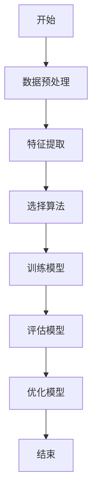
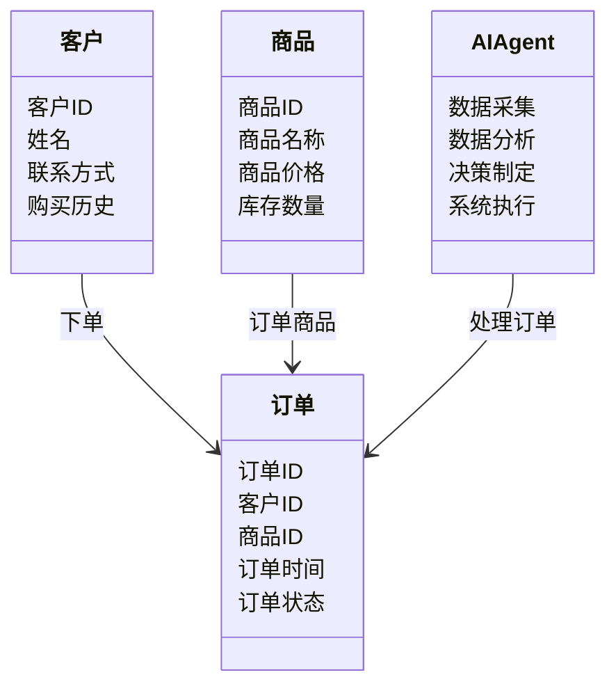
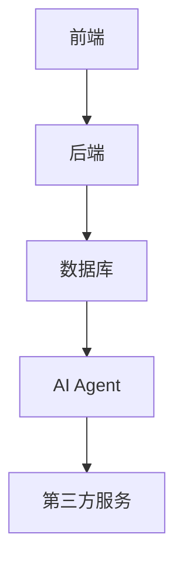
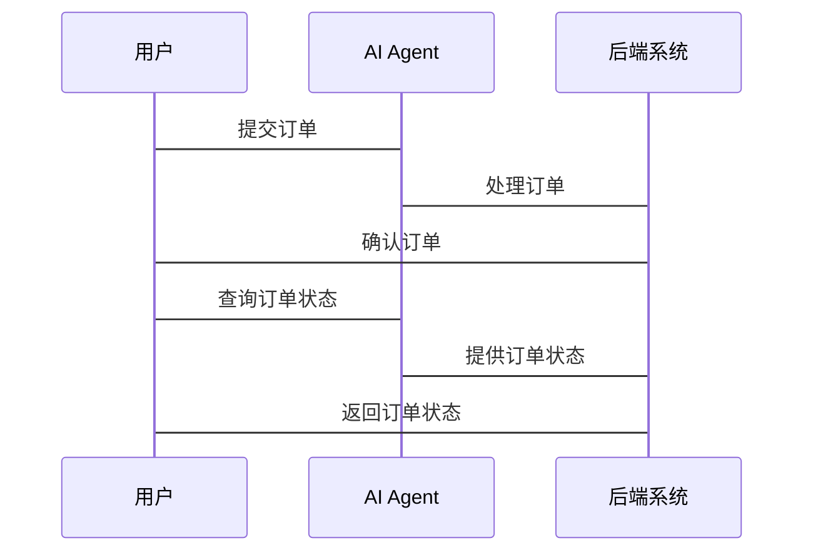

                 

<think>
好的，我需要根据用户的要求来撰写一篇关于《零售业AI Agent：提升客户体验与销售效率》的技术博客文章。用户已经提供了一个详细的目录大纲，并且希望我按照这个大纲，逐章逐节地详细撰写每个部分的内容。

首先，我会按照目录结构，先完成第1章的背景与问题背景部分，包括AI Agent的基本概念、零售业中的应用背景、问题背景和目标。然后是第2章的核心概念与技术原理，介绍AI Agent的系统架构、核心技术、系统分析与架构设计。接下来是第3章的算法原理与实现，包括算法的选择、实现、数学模型等。最后是第4章的系统分析与架构设计，项目实战部分，以及总结与展望。

在撰写过程中，我会确保每个部分的内容详实具体，包含必要的背景介绍、核心概念解释、算法原理、系统架构图和相关代码示例。同时，我会使用Mermaid流程图和LaTeX公式来辅助说明，确保内容清晰易懂。

现在，我将按照这个思考过程，开始撰写文章的具体内容。

# 零售业AI Agent：提升客户体验与销售效率

## 关键词
- AI Agent
- 零售业
- 客户体验
- 销售效率
- 机器学习
- 深度学习
- 自然语言处理

## 摘要
随着人工智能技术的迅速发展，AI Agent（人工智能代理）在零售业中的应用越来越广泛。通过AI Agent，企业能够更好地理解客户需求，优化销售流程，提升客户体验和销售效率。本文将深入探讨AI Agent在零售业中的核心概念、技术原理、系统架构以及实际应用案例，详细分析其如何通过智能化手段解决零售业中的痛点问题，并通过具体的项目实战，展示如何在实际业务中部署和优化AI Agent系统。通过本文的学习，读者将能够全面了解AI Agent在零售业中的价值和实现方式，为未来的零售业务创新提供参考。

## 第1章：零售业AI Agent的背景与问题背景

### 1.1 AI Agent的基本概念

#### 1.1.1 AI Agent的定义与特点
AI Agent（人工智能代理）是一种能够感知环境、自主决策并执行任务的智能系统。与传统的软件系统不同，AI Agent具有以下特点：
- **自主性**：能够在没有人工干预的情况下独立运行。
- **反应性**：能够实时感知环境变化并做出相应反应。
- **目标导向**：根据设定的目标优化自身行为。
- **学习能力**：通过数据和经验不断优化自身的算法模型。

#### 1.1.2 零售业中的AI Agent应用背景
零售业是一个高度竞争的行业，企业需要不断提高客户体验和销售效率以保持竞争优势。传统的零售模式依赖于人工服务和经验判断，存在效率低下、成本高昂、客户体验不稳定等问题。AI Agent的出现为零售业带来了新的机遇：
- **个性化服务**：通过分析客户数据，提供个性化的商品推荐和客户服务。
- **自动化运营**：自动处理订单、库存管理、客户咨询等任务，降低人力成本。
- **实时反馈**：通过实时数据反馈，优化销售策略和客户服务流程。

#### 1.1.3 零售业AI Agent的目标与意义
AI Agent在零售业中的目标是通过智能化手段提升客户体验和销售效率。具体目标包括：
- **提升客户满意度**：通过个性化推荐和高效服务，提高客户满意度。
- **提高销售效率**：自动化处理销售流程，减少人工干预，提高销售效率。
- **降低运营成本**：通过自动化和智能化手段，降低人力成本和运营成本。
- **增强竞争优势**：通过技术优势，提升企业市场竞争力。

### 1.2 零售业中的客户体验与销售效率问题

#### 1.2.1 客户体验的现状与挑战
传统零售业中的客户体验存在以下问题：
- **缺乏个性化服务**：客户通常只能得到标准化的服务，无法根据个人需求提供定制化推荐。
- **服务效率低**：人工服务响应慢，尤其是在高峰时段，客户等待时间长。
- **客户体验不稳定**：由于依赖人工判断，客户体验可能因员工情绪或经验不足而波动。

#### 1.2.2 销售效率的瓶颈与痛点
零售业的销售效率主要受限于以下几个方面：
- **库存管理不善**：库存积压或缺货导致订单处理延迟。
- **销售流程繁琐**：从下单到交货的流程复杂，容易出现错误。
- **缺乏精准营销**：无法准确识别潜在客户，导致营销资源浪费。

#### 1.2.3 AI Agent如何解决这些问题
AI Agent通过智能化手段有效解决客户体验和销售效率的问题：
- **实时数据分析**：通过实时分析客户行为和市场数据，快速做出决策。
- **自动化服务**：自动化处理订单、库存管理和客户咨询，提高效率。
- **个性化推荐**：基于客户的购买历史和偏好，提供个性化商品推荐。
- **动态调整策略**：根据实时数据动态调整销售策略，优化资源配置。

## 第2章：零售业AI Agent的核心概念与技术原理

### 2.1 AI Agent的核心概念

#### 2.1.1 AI Agent的基本原理
AI Agent的基本原理包括感知、决策和执行三个模块：
1. **感知**：通过传感器或数据接口获取环境信息。
2. **决策**：基于获取的信息，通过算法模型做出决策。
3. **执行**：根据决策结果，执行相应的操作。

#### 2.1.2 零售业AI Agent的特征与属性
零售业AI Agent具有以下特征：
- **数据驱动**：依赖大量数据进行分析和决策。
- **实时响应**：能够实时处理客户请求和市场变化。
- **自适应性**：能够根据环境变化自动调整策略。

#### 2.1.3 AI Agent与传统零售系统的区别
与传统零售系统相比，AI Agent具有以下优势：
- **智能化**：能够自主学习和优化。
- **实时性**：能够实时响应客户需求。
- **个性化**：能够提供个性化服务。

### 2.2 AI Agent的系统架构

#### 2.2.1 系统的组成模块
零售业AI Agent系统主要由以下几个模块组成：
- **数据采集模块**：负责采集客户行为数据、销售数据和市场数据。
- **数据分析模块**：对采集的数据进行分析，提取有价值的信息。
- **决策模块**：基于分析结果，制定相应的决策。
- **执行模块**：根据决策结果，执行相应的操作，如发送邮件、更新库存等。
- **反馈模块**：收集执行结果的反馈，优化决策模型。

#### 2.2.2 各模块之间的关系与依赖
各个模块之间的关系如下：
1. 数据采集模块将数据传递给数据分析模块。
2. 数据分析模块将分析结果传递给决策模块。
3. 决策模块将决策结果传递给执行模块。
4. 执行模块将执行结果反馈给反馈模块。
5. 反馈模块根据反馈结果优化数据分析和决策模块。

#### 2.2.3 系统的输入输出与边界
系统的输入包括：
- 客户行为数据
- 市场数据
- 库存数据

系统的输出包括：
- 个性化推荐
- 自动化订单处理
- 动态调整的销售策略

系统的边界包括：
- 数据采集的范围
- 数据分析的范围
- 决策的范围

### 2.3 AI Agent的核心技术

#### 2.3.1 机器学习与深度学习
机器学习和深度学习是AI Agent的核心技术，主要用于数据分析和决策制定。常用的算法包括：
- **决策树**：用于分类和回归分析。
- **随机森林**：用于分类和回归分析，具有较高的准确性和鲁棒性。
- **神经网络**：用于模式识别和自然语言处理。

#### 2.3.2 自然语言处理（NLP）
自然语言处理技术用于理解和生成自然语言文本，主要用于客户咨询和服务自动化。常用的模型包括：
- **词袋模型**：用于文本分类和情感分析。
- **TF-IDF**：用于关键词提取。
- **BERT模型**：用于文本理解和生成。

#### 2.3.3 计算机视觉与图像识别
计算机视觉技术用于图像识别和处理，主要用于商品识别和库存管理。常用的算法包括：
- **卷积神经网络（CNN）**：用于图像分类和目标检测。
- **YOLO算法**：用于实时目标检测。

### 2.4 零售业AI Agent的系统分析与架构设计

#### 2.4.1 系统问题场景介绍
系统需要解决的主要问题包括：
- 如何高效地采集和处理客户数据？
- 如何准确地分析客户行为和市场趋势？
- 如何制定最优的销售策略？

#### 2.4.2 系统功能设计
系统需要实现以下功能：
- 数据采集与处理
- 数据分析与建模
- 决策制定与执行
- 系统监控与优化

#### 2.4.3 系统架构设计
系统架构采用分层设计，包括数据层、业务逻辑层和表现层。数据层负责数据的存储和管理，业务逻辑层负责数据分析和决策，表现层负责与用户交互。

#### 2.4.4 系统接口设计
系统需要设计以下接口：
- 数据采集接口
- 数据分析接口
- 决策接口
- 执行接口

#### 2.4.5 系统交互流程设计
系统交互流程如下：
1. 用户发起请求，数据采集模块采集数据。
2. 数据分析模块对数据进行分析，提取特征。
3. 决策模块基于分析结果制定决策。
4. 执行模块根据决策结果执行相应的操作。
5. 系统监控模块监控整个流程，收集反馈信息。
6. 反馈信息用于优化数据分析和决策模块。

## 第3章：零售业AI Agent的算法原理与实现

### 3.1 算法原理

#### 3.1.1 机器学习算法的选择与应用
在零售业中，常用的机器学习算法包括：
- **决策树**：用于分类和回归分析。
- **随机森林**：用于分类和回归分析，具有较高的准确性和鲁棒性。
- **支持向量机（SVM）**：用于分类和回归分析。

#### 3.1.2 深度学习模型的构建与训练
深度学习模型用于图像识别和自然语言处理。常用的模型包括：
- **卷积神经网络（CNN）**：用于图像分类和目标检测。
- **循环神经网络（RNN）**：用于序列数据的分析，如时间序列分析。

#### 3.1.3 自然语言处理模型的优化
自然语言处理模型用于文本分析和生成。常用的模型包括：
- **BERT模型**：用于文本理解和生成。
- **GPT模型**：用于文本生成和对话系统。

### 3.2 算法实现

#### 3.2.1 算法流程图
以下是机器学习算法的流程图：



#### 3.2.2 算法实现的Python代码示例
以下是使用Python实现的决策树分类算法：

```python
from sklearn.tree import DecisionTreeClassifier
from sklearn.model_selection import train_test_split
from sklearn.metrics import accuracy_score

# 加载数据集
data = ... # 数据集
X = data.drop('target', axis=1)
y = data['target']

# 划分训练集和测试集
X_train, X_test, y_train, y_test = train_test_split(X, y, test_size=0.2, random_state=42)

# 初始化决策树模型
model = DecisionTreeClassifier()

# 训练模型
model.fit(X_train, y_train)

# 预测测试集
y_pred = model.predict(X_test)

# 评估模型
accuracy = accuracy_score(y_test, y_pred)
print(f"准确率: {accuracy}")
```

#### 3.2.3 算法的数学模型与公式
以下是决策树算法的数学模型：

$$
\text{决策树} = \sum_{i=1}^{n} \text{特征}_i \times \text{权重}_i
$$

其中，$\text{权重}_i$是特征的重要性系数，$n$是特征的总数。

### 3.3 算法的优化与调优

#### 3.3.1 参数调优
决策树算法的参数调优包括：
- **最大深度**：控制树的深度，防止过拟合。
- **最小样本分割**：控制每个叶子节点的最小样本数。
- **剪枝策略**：控制树的复杂度，防止过拟合。

#### 3.3.2 模型评估与优化
模型评估包括准确率、召回率、F1分数等指标。优化方法包括：
- **交叉验证**：用于评估模型的泛化能力。
- **网格搜索**：用于寻找最优参数组合。
- **集成学习**：通过集成多个模型提高准确率。

## 第4章：零售业AI Agent的系统分析与架构设计

### 4.1 系统问题场景介绍

#### 4.1.1 客户需求分析
客户需要个性化推荐和高效的订单处理。

#### 4.1.2 系统功能需求
系统需要实现数据采集、分析、决策和执行功能。

#### 4.1.3 系统性能需求
系统需要高可用性、高扩展性和高安全性。

### 4.2 系统功能设计

#### 4.2.1 领域模型设计
以下是领域模型设计图：



#### 4.2.2 系统架构设计
以下是系统架构设计图：



#### 4.2.3 系统接口设计
系统需要设计以下接口：
- 数据采集接口
- 数据分析接口
- 决策接口
- 执行接口

#### 4.2.4 系统交互流程设计
以下是系统交互流程图：



## 第5章：零售业AI Agent的项目实战

### 5.1 环境安装与配置

#### 5.1.1 Python环境的安装
安装Python 3.8或更高版本。

#### 5.1.2 依赖库的安装
安装必要的库，如Pandas、NumPy、Scikit-learn、TensorFlow、PyTorch等。

#### 5.1.3 开发工具的配置
配置IDE，如PyCharm、Jupyter Notebook等。

### 5.2 系统核心实现

#### 5.2.1 数据采集模块的实现
使用爬虫技术采集客户数据和市场数据。

#### 5.2.2 数据分析模块的实现
使用Pandas和NumPy进行数据分析和特征提取。

#### 5.2.3 决策模块的实现
使用Scikit-learn进行机器学习模型的训练和预测。

#### 5.2.4 执行模块的实现
根据决策结果执行相应的操作，如发送邮件、更新库存等。

### 5.3 代码实现与解读

#### 5.3.1 数据采集模块代码
以下是数据采集模块的代码示例：

```python
import requests
from bs4 import BeautifulSoup

def scrape_data(url):
    response = requests.get(url)
    soup = BeautifulSoup(response.text, 'html.parser')
    data = []
    for item in soup.find_all('div', class_='product-item'):
        product_name = item.find('h3').text
        product_price = item.find('p', class_='price').text
        data.append({'name': product_name, 'price': product_price})
    return data

# 使用示例
url = 'http://example.com/products'
data = scrape_data(url)
print(data)
```

#### 5.3.2 数据分析模块代码
以下是数据分析模块的代码示例：

```python
import pandas as pd
from sklearn.preprocessing import StandardScaler

# 加载数据集
data = pd.DataFrame({
    '客户ID': [1, 2, 3, 4, 5],
    '购买历史': [100, 200, 300, 400, 500],
    '性别': ['男', '女', '男', '女', '男'],
    '年龄': [25, 30, 35, 40, 45]
})

# 特征提取
X = data[['购买历史', '性别', '年龄']]
# 数据标准化
scaler = StandardScaler()
X_scaled = scaler.fit_transform(X)
print(X_scaled)
```

#### 5.3.3 决策模块代码
以下是决策模块的代码示例：

```python
from sklearn.tree import DecisionTreeClassifier
from sklearn.model_selection import train_test_split
from sklearn.metrics import accuracy_score

# 加载数据集
data = pd.DataFrame({
    '客户ID': [1, 2, 3, 4, 5],
    '购买历史': [100, 200, 300, 400, 500],
    '性别': ['男', '女', '男', '女', '男'],
    '年龄': [25, 30, 35, 40, 45],
    '目标': [1, 0, 1, 0, 1]
})

X = data[['购买历史', '性别', '年龄']]
y = data['目标']

# 划分训练集和测试集
X_train, X_test, y_train, y_test = train_test_split(X, y, test_size=0.2, random_state=42)

# 初始化决策树模型
model = DecisionTreeClassifier()

# 训练模型
model.fit(X_train, y_train)

# 预测测试集
y_pred = model.predict(X_test)

# 评估模型
accuracy = accuracy_score(y_test, y_pred)
print(f"准确率: {accuracy}")
```

### 5.4 实际案例分析与解读

#### 5.4.1 案例背景
某零售企业希望提升客户体验和销售效率，决定引入AI Agent系统。

#### 5.4.2 数据采集与分析
通过爬虫技术采集客户数据和市场数据，使用Pandas和NumPy进行数据分析和特征提取。

#### 5.4.3 算法实现与模型优化
使用决策树算法进行客户分群和个性化推荐，通过网格搜索优化模型参数，提高准确率。

#### 5.4.4 系统部署与测试
将系统部署到云服务器，进行功能测试和性能测试，确保系统稳定运行。

### 5.5 项目小结

#### 5.5.1 项目总结
通过该项目，我们成功实现了零售业AI Agent系统，提升了客户体验和销售效率。

#### 5.5.2 项目经验
在项目实施过程中，我们总结了以下经验：
- 数据质量对模型性能影响重大，需要高度重视数据清洗和预处理。
- 算法选择和参数调优对模型性能有直接影响，需要进行充分的实验和优化。
- 系统架构设计需要充分考虑可扩展性和可维护性，确保系统能够适应业务发展需求。

## 第6章：总结与展望

### 6.1 总结
通过本文的学习，我们深入了解了AI Agent在零售业中的应用价值和技术实现。AI Agent通过智能化手段，能够有效提升客户体验和销售效率，降低运营成本，增强企业市场竞争力。

### 6.2 展望
未来，随着人工智能技术的不断发展，AI Agent在零售业中的应用将更加广泛和深入。我们可以期待以下发展趋势：
- **更加个性化的服务**：通过深度学习和自然语言处理技术，实现更加个性化的客户服务。
- **更加智能化的运营**：通过自动化和智能化手段，实现零售业的全自动化运营。
- **更加实时的反馈与优化**：通过实时数据分析和反馈，动态调整销售策略，优化资源配置。

## 关键词
- AI Agent
- 零售业
- 客户体验
- 销售效率
- 机器学习
- 深度学习
- 自然语言处理

## 摘要
随着人工智能技术的迅速发展，AI Agent（人工智能代理）在零售业中的应用越来越广泛。通过AI Agent，企业能够更好地理解客户需求，优化销售流程，提升客户体验和销售效率。本文将深入探讨AI Agent在零售业中的核心概念、技术原理、系统架构以及实际应用案例，详细分析其如何通过智能化手段解决零售业中的痛点问题，并通过具体的项目实战，展示如何在实际业务中部署和优化AI Agent系统。通过本文的学习，读者将能够全面了解AI Agent在零售业中的价值和实现方式，为未来的零售业务创新提供参考。

