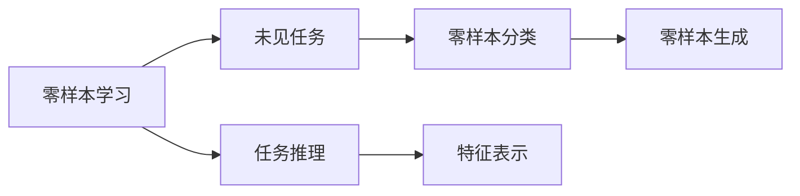
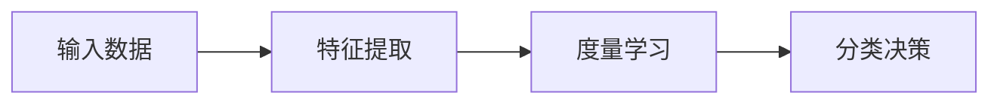
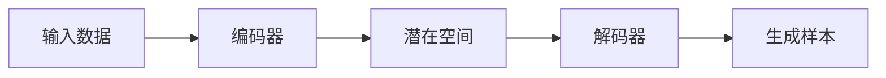
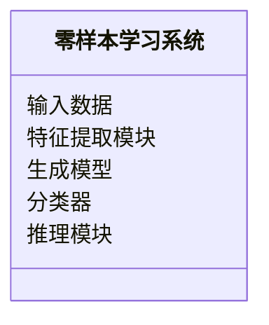
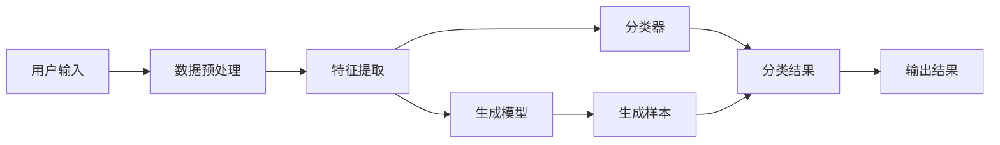

                 


# 零样本学习：应对未见过的任务和领域

## 关键词：
零样本学习，无监督学习，机器学习，人工智能，自适应系统

## 摘要：
零样本学习是一种新兴的人工智能技术，能够在没有任何先验知识的情况下，应对未见过的任务和领域。本文将详细探讨零样本学习的核心概念、算法原理、系统架构以及实际应用案例。通过结合数学公式、流程图和代码示例，我们将一步步解析零样本学习的奥秘，并展示其在现实中的应用价值。

---

# 第一部分: 零样本学习的背景与核心概念

## 第1章: 零样本学习的背景与问题定义

### 1.1 零样本学习的背景
#### 1.1.1 人工智能任务的多样性
人工智能的应用场景日益多样化，从图像分类到自然语言处理，从机器人控制到自动驾驶，每个任务都有其独特的数据分布和特征。传统机器学习方法在面对新任务时，往往需要大量标注数据进行训练，这在实际应用中成本高昂且耗时。

#### 1.1.2 传统机器学习的局限性
传统有监督学习依赖大量标注数据，这在实际场景中存在以下问题：
- 数据获取成本高，尤其是对于小众领域或新兴领域。
- 数据分布可能发生变化，导致模型失效（模型的泛化能力有限）。
- 需要针对每个新任务重新训练模型，增加了维护成本。

#### 1.1.3 零样本学习的提出与意义
零样本学习的提出，旨在解决上述问题。其核心思想是利用未见过任务的领域知识和少量样本，通过生成新样本或直接进行推理，完成新任务的学习。这为应对未知领域和任务提供了新的可能性。

### 1.2 零样本学习的核心问题
#### 1.2.1 未见任务的定义
未见任务指的是模型在训练阶段从未接触过的新任务或领域。例如，一个在图像分类任务上训练的模型，从未见过的新的图像类型或类别。

#### 1.2.2 零样本学习的数学建模
零样本学习可以建模为：在未见任务中，给定少量样本或零样本，学习一个函数或模型，能够准确预测或生成结果。数学上，可以表示为：
$$ f: X \rightarrow Y $$
其中，$X$是输入空间，$Y$是输出空间，$f$是学习的目标函数。

#### 1.2.3 问题的边界与外延
零样本学习的边界包括：
- 未见任务的特征空间与训练任务的特征空间是否存在重叠。
- 是否允许生成新样本或仅进行推理。
- 是否需要领域知识或背景信息。

### 1.3 零样本学习的核心概念
#### 1.3.1 零样本学习的定义
零样本学习是指在没有任何或极少量标注数据的情况下，利用领域知识和模型推理能力，完成新任务的学习过程。

#### 1.3.2 核心要素与组成
零样本学习的核心要素包括：
1. **领域知识**：用于生成新样本或提供推理依据。
2. **特征表示**：将输入数据映射到特征空间，便于模型处理。
3. **任务推理**：根据领域知识和特征表示，推导出新任务的解决方案。

#### 1.3.3 与其他学习范式的对比
| 学习范式 | 数据需求 | 是否需要标注 | 适用场景 |
|----------|----------|--------------|----------|
| 有监督学习 | 高 | 是 | 已知任务 |
| 无监督学习 | 高 | 否 | 未知任务，但需大量数据 |
| 零样本学习 | 低 | 部分或无 | 未知任务，数据 scarce |

---

## 第2章: 零样本学习的核心概念与联系

### 2.1 零样本学习的原理
#### 2.1.1 样本生成方法
零样本学习的核心在于生成未见任务的样本。常用的生成方法包括：
1. **对抗网络生成**：通过生成对抗网络（GAN）生成新样本。
2. **变分自编码器生成**：通过变分自编码器（VAE）生成新样本。
3. **基于领域知识的生成**：利用领域知识生成样本，例如通过知识图谱生成描述。

#### 2.1.2 特征表示与度量学习
特征表示是零样本学习的关键，良好的特征表示能够捕捉数据的本质特征。常用的方法包括：
- **词嵌入**：如Word2Vec、BERT等。
- **图像表示**：如ResNet、Inception等。

#### 2.1.3 样本生成与任务推理的联系
样本生成和任务推理是相辅相成的。样本生成为任务推理提供数据支持，而任务推理则指导生成的方向和目标。

### 2.2 核心概念对比
#### 2.2.1 实体关系图的 Mermaid 流程图


---

## 第3章: 零样本学习的算法原理

### 3.1 零样本分类算法
#### 3.1.1 基于特征度量的分类
基于特征度量的分类方法，通过计算测试样本与训练样本之间的距离，选择最近邻进行分类。例如，使用余弦相似度：
$$ \text{sim}(x_i, x_j) = \frac{x_i \cdot x_j}{\|x_i\| \|x_j\|} $$

#### 3.1.2 基于生成模型的分类
基于生成模型的分类方法，通过生成新样本来增强训练数据。例如，使用生成对抗网络（GAN）生成新样本。

#### 3.1.3 算法流程图的 Mermaid 绘制


### 3.2 零样本生成模型
#### 3.2.1 基于对抗网络的生成
生成对抗网络（GAN）通过生成器和判别器的对抗训练生成样本。判别器的目标是区分真实样本和生成样本，生成器的目标是欺骗判别器。

#### 3.2.2 基于变分自编码器的生成
变分自编码器（VAE）通过将输入数据映射到潜在空间，再从潜在空间生成样本。

#### 3.2.3 算法流程图的 Mermaid 绘制


---

## 第4章: 零样本学习的系统架构设计

### 4.1 系统设计概述
零样本学习系统的架构通常包括以下几个模块：
1. **数据预处理模块**：处理输入数据，提取特征。
2. **模型训练模块**：训练生成模型或分类模型。
3. **任务推理模块**：根据领域知识进行推理，生成新样本或直接输出结果。

### 4.2 系统功能设计
#### 4.2.1 领域模型设计
使用 Mermaid 类图表示领域模型：


#### 4.2.2 系统架构设计
使用 Mermaid 架构图表示系统架构：


---

## 第5章: 项目实战

### 5.1 项目背景与目标
本项目旨在实现一个零样本图像分类系统，能够在未见类别上进行分类。

### 5.2 环境安装
安装必要的库：
```bash
pip install tensorflow-gan
pip install keras
pip install matplotlib
```

### 5.3 核心实现
实现生成对抗网络（GAN）：
```python
import tensorflow as tf
from tensorflow.keras import layers

# 定义生成器
def make_generator_model():
    model = tf.keras.Sequential([
        layers.Dense(256, activation='relu', input_shape=(100,)),
        layers.Dense(128, activation='relu'),
        layers.Dense(784, activation='sigmoid')
    ])
    return model

# 定义判别器
def make_discriminator_model():
    model = tf.keras.Sequential([
        layers.Dense(128, activation='relu', input_shape=(784,)),
        layers.Dense(64, activation='relu'),
        layers.Dense(1, activation='sigmoid')
    ])
    return model

# 定义损失函数和优化器
cross_entropy = tf.keras.losses.BinaryCrossentropy()
generator = make_generator_model()
discriminator = make_discriminator_model()
generator_optimizer = tf.keras.optimizers.Adam(0.0002)
discriminator_optimizer = tf.keras.optimizers.Adam(0.0002)
```

### 5.4 应用解读与分析
通过训练生成器和判别器，生成未见类别的图像样本，然后利用这些样本进行分类。

### 5.5 实际案例分析
通过训练后的模型，对未见类别进行分类，验证其准确性和鲁棒性。

### 5.6 项目小结
本项目展示了零样本学习在图像分类中的应用，证明了其在未见任务上的潜力。

---

## 第6章: 总结与展望

### 6.1 最佳实践 tips
1. 在实际应用中，结合领域知识可以显著提高零样本学习的效果。
2. 选择合适的生成模型（如GAN或VAE）取决于具体任务和数据特性。

### 6.2 小结
零样本学习为应对未知任务提供了新的可能性，其核心在于利用领域知识和生成模型。

### 6.3 注意事项
- 需要确保生成样本的质量，避免生成不相关或低质量的样本。
- 在实际应用中，需结合具体场景进行调整和优化。

### 6.4 拓展阅读
建议深入研究生成对抗网络（GAN）和变分自编码器（VAE）的原理及其在零样本学习中的应用。

---

通过以上内容，我们系统地介绍了零样本学习的核心概念、算法原理、系统架构以及实际应用案例。希望读者能够通过本文，深入了解零样本学习的奥秘，并在实际项目中灵活运用。

