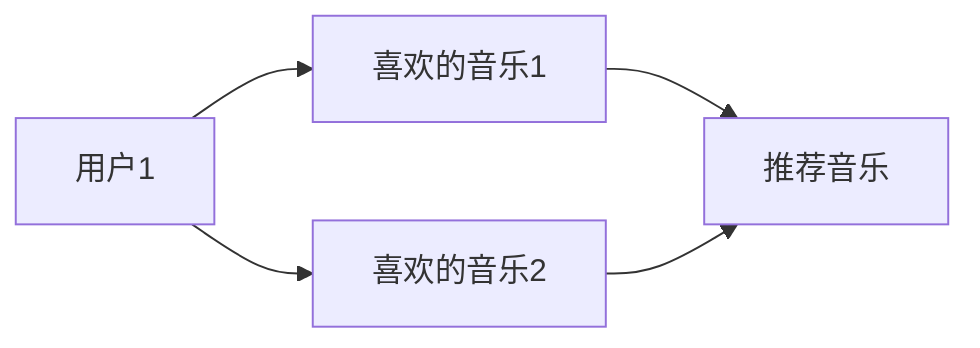
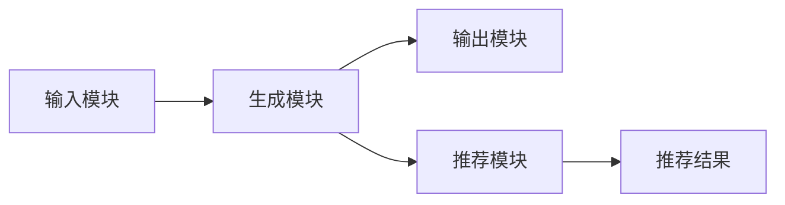

                 


# 音乐AI Agent：作曲助手与音乐推荐

## 关键词
音乐AI, 作曲助手, 音乐推荐, 人工智能, 神经网络, 协同过滤

## 摘要
音乐AI Agent是一种结合人工智能技术的音乐辅助工具，能够帮助用户进行音乐创作和推荐。本文详细探讨了音乐AI Agent的核心概念、生成技术、推荐算法以及系统架构，并通过实际案例分析，展示了其在音乐产业中的应用前景。文章从背景介绍、算法原理、系统设计到项目实战，全面解析了音乐AI Agent的技术实现和优化方法。

---

## 第1章：音乐AI Agent的背景与概念

### 1.1 音乐AI Agent的定义与核心概念

#### 1.1.1 什么是音乐AI Agent
音乐AI Agent是一种利用人工智能技术辅助音乐创作和推荐的工具。它能够根据用户提供的输入生成音乐作品或推荐音乐列表，从而帮助音乐人提高创作效率并为听众提供个性化音乐体验。

#### 1.1.2 音乐AI Agent的核心功能
音乐AI Agent的核心功能包括：
1. **音乐生成**：根据用户输入（如旋律、节奏或歌词）生成完整的音乐作品。
2. **音乐推荐**：基于用户偏好推荐相似的音乐作品或风格。
3. **互动反馈**：提供实时反馈，帮助用户优化创作。

#### 1.1.3 音乐AI Agent的边界与外延
音乐AI Agent的边界在于其功能范围，主要集中在音乐生成和推荐领域，不涉及音乐制作的后期处理（如混音、 mastering）。其外延则包括与音乐相关的其他AI应用，如音乐识别、版权管理等。

### 1.2 音乐AI Agent的应用场景

#### 1.2.1 作曲助手的典型应用场景
1. **快速创作**：音乐人可以通过输入简单的旋律或歌词，快速生成完整的作品。
2. **灵感激发**：AI Agent可以提供风格各异的音乐片段，激发创作者的灵感。
3. **个性化定制**：用户可以根据自己的需求调整生成的音乐风格和结构。

#### 1.2.2 音乐推荐系统的实际应用
1. **个性化播放列表**：流媒体平台（如Spotify、Apple Music）利用AI推荐算法为用户生成个性化的音乐播放列表。
2. **实时推荐**：基于用户的实时行为（如暂停、重复播放）调整推荐内容。

#### 1.2.3 音乐AI Agent的未来发展
随着AI技术的不断进步，音乐AI Agent将更加智能化和个性化。未来的音乐AI Agent可能会具备更强的音乐理解和创作能力，甚至能够与人类音乐人进行更自然的互动。

---

## 第2章：音乐生成技术的原理与算法

### 2.1 音乐生成技术的概述

#### 2.1.1 音乐生成技术的发展历程
音乐生成技术经历了从简单的MIDI生成到复杂的深度学习模型的演变。早期的生成技术基于规则和随机算法，而现代技术则主要依赖神经网络模型。

#### 2.1.2 音乐生成技术的核心原理
音乐生成技术的核心原理是通过训练神经网络模型，使模型能够理解和生成符合特定风格或结构的音乐。

#### 2.1.3 音乐生成技术的主要算法
常用的音乐生成算法包括：
1. **基于RNN的音乐生成**：通过循环神经网络处理序列数据，生成音乐片段。
2. **基于Transformer的音乐生成**：利用Transformer模型的全局注意力机制，生成更连贯的音乐序列。

### 2.2 基于神经网络的音乐生成模型

#### 2.2.1 RNN在音乐生成中的应用
RNN通过处理序列数据，生成音乐的 MIDI 文件。例如，输入一个旋律片段，RNN可以生成后续的音乐部分。


#### 2.2.2 Transformer模型在音乐生成中的优势
Transformer模型通过全局注意力机制，能够捕捉音乐片段之间的全局关系，生成更连贯的音乐。


#### 2.2.3 深度学习模型的训练过程
训练音乐生成模型需要大量的音乐数据，并通过反向传播算法优化模型参数。

```python
# 示例：训练RNN模型的代码片段
import numpy as np
from keras import layers

model = layers.RNN(layers.SimpleRNNCell(64), input_shape=(None, 128))
model.compile(optimizer='adam', loss='categorical_crossentropy')

# 输入数据
input_data = np.random.randn(100, 128, 64)
output_labels = np.random.randint(0, 128, (100, 64))

# 训练模型
model.fit(input_data, output_labels, epochs=10, batch_size=32)
```

---

## 第3章：音乐推荐系统的算法与实现

### 3.1 音乐推荐系统的概述

#### 3.1.1 音乐推荐系统的定义
音乐推荐系统是一种基于用户行为和偏好，推荐音乐作品的系统。

#### 3.1.2 音乐推荐系统的分类
音乐推荐系统主要分为基于协同过滤、基于内容过滤和基于混合模型三类。

#### 3.1.3 音乐推荐系统的优缺点
1. **优点**：能够为用户推荐个性化的内容，提高用户体验。
2. **缺点**：推荐结果可能不够精准，存在信息过载问题。

### 3.2 基于协同过滤的音乐推荐算法

#### 3.2.1 协同过滤的基本原理
协同过滤通过分析用户的相似性或物品的相似性，推荐用户可能感兴趣的音乐。

#### 3.2.2 基于用户的协同过滤算法
1. **计算用户相似度**：通过计算用户之间的相似度，找到与目标用户相似的用户。
2. **推荐音乐**：基于相似用户的喜好，推荐目标用户可能喜欢的音乐。

#### 3.2.3 基于物品的协同过滤算法
1. **计算物品相似度**：通过计算音乐作品之间的相似度，找到与目标音乐相似的作品。
2. **推荐音乐**：基于音乐作品的相似性，推荐目标用户可能喜欢的音乐。

### 3.3 协同过滤算法的实现



#### 3.3.1 协同过滤算法的Python实现
```python
# 示例：基于用户的协同过滤算法
import numpy as np
from sklearn.metrics.pairwise import cosine_similarity

# 用户-音乐矩阵
user_music_matrix = np.array([[4, 3, 0, 0],
                               [3, 4, 0, 0],
                               [0, 0, 5, 4],
                               [0, 0, 4, 5]])

# 计算用户相似度
user_similarity = cosine_similarity(user_music_matrix)

# 推荐音乐
def recommend_music(user_id, user_similarity, user_music_matrix):
    similar_users = np.argsort(-user_similarity[user_id])[:2]
    recommended_music = []
    for user in similar_users:
        recommended_music.extend(np.where(user_music_matrix[user] > 0)[0])
    return recommended_music

# 示例推荐
user_id = 0
print(recommend_music(user_id, user_similarity, user_music_matrix))
```

---

## 第4章：音乐AI Agent的用户交互与体验

### 4.1 用户交互设计的基本原则

#### 4.1.1 用户交互设计的目标
用户交互设计的目标是提高用户体验，使用户能够方便地与音乐AI Agent进行交互。

#### 4.1.2 用户交互设计的关键要素
1. **界面设计**：直观、简洁的用户界面。
2. **反馈机制**：实时反馈用户的操作结果。
3. **个性化设置**：允许用户自定义推荐参数。

#### 4.1.3 用户交互设计的实现方法
1. **图形化界面**：使用可视化工具展示音乐生成和推荐过程。
2. **语音交互**：支持语音输入和输出，提高交互的便捷性。

### 4.2 音乐AI Agent的用户体验优化

#### 4.2.1 用户体验优化的策略
1. **简化操作流程**：减少用户的操作步骤。
2. **提高反馈速度**：实时反馈用户的操作结果。
3. **个性化推荐**：根据用户的偏好进行推荐。

#### 4.2.2 用户体验优化的实现方法
1. **A/B测试**：通过A/B测试优化用户界面和交互流程。
2. **用户反馈收集**：收集用户的反馈，不断优化用户体验。

---

## 第5章：音乐AI Agent的伦理与社会影响

### 5.1 音乐AI Agent的伦理问题

#### 5.1.1 音乐版权与AI生成内容的法律问题
AI生成的音乐作品的版权归属是一个复杂的法律问题，需要明确相关的法律法规。

#### 5.1.2 音乐AI Agent对人类音乐创作的影响
音乐AI Agent可能会对传统音乐创作模式产生冲击，但也可能激发新的创作方式。

#### 5.1.3 音乐AI Agent的伦理规范与责任
音乐AI Agent的开发者需要制定明确的伦理规范，确保AI生成的内容符合社会道德和法律要求。

### 5.2 音乐AI Agent的社会影响

#### 5.2.1 音乐AI Agent对音乐产业的变革
音乐AI Agent可能会改变音乐创作、生产和分发的模式，推动音乐产业的数字化转型。

#### 5.2.2 音乐AI Agent对音乐教育的推动
音乐AI Agent可以作为音乐教育的辅助工具，帮助学生更好地理解和创作音乐。

#### 5.2.3 音乐AI Agent对音乐消费模式的改变
音乐AI Agent通过个性化推荐，改变用户的音乐消费习惯，推动音乐市场的细分。

---

## 第6章：音乐AI Agent的系统架构与实现

### 6.1 音乐生成系统的架构设计

#### 6.1.1 系统功能模块
1. **输入模块**：接收用户的输入（如旋律、歌词）。
2. **生成模块**：利用神经网络模型生成音乐。
3. **输出模块**：将生成的音乐输出为 MIDI 或 WAV 格式。
4. **推荐模块**：根据生成的音乐推荐相似作品。

#### 6.1.2 系统架构设计



### 6.2 系统实现与优化

#### 6.2.1 系统实现的关键步骤
1. **数据准备**：收集和整理音乐数据集。
2. **模型训练**：训练神经网络模型。
3. **系统集成**：将各个模块集成到一个系统中。
4. **系统优化**：优化系统的性能和用户体验。

#### 6.2.2 系统优化策略
1. **模型优化**：通过调整模型参数和结构，提高生成音乐的质量。
2. **性能优化**：优化系统的运行效率，减少响应时间。
3. **用户体验优化**：通过简化操作流程和提高反馈速度，优化用户体验。

---

## 第7章：音乐AI Agent的项目实战

### 7.1 项目环境安装

#### 7.1.1 安装必要的库
1. **安装TensorFlow**：`pip install tensorflow`
2. **安装MIDI库**：`pip install python-midi`

#### 7.1.2 环境配置
确保安装的库版本兼容，建议使用虚拟环境进行管理。

### 7.2 系统核心实现源代码

#### 7.2.1 音乐生成模块的实现

```python
# 示例：音乐生成模块的代码
import tensorflow as tf
from tensorflow.keras import layers

# 定义生成模型
def generate_music_model():
    model = tf.keras.Sequential()
    model.add(layers.SimpleRNN(64, return_sequences=True, input_shape=(None, 128)))
    model.add(layers.Dense(128, activation='softmax'))
    model.compile(optimizer='adam', loss='categorical_crossentropy')
    return model

# 生成音乐
model = generate_music_model()
input_data = np.random.randn(100, 128, 64)
output_labels = np.random.randint(0, 128, (100, 64))
model.fit(input_data, output_labels, epochs=10, batch_size=32)
```

#### 7.2.2 音乐推荐模块的实现

```python
# 示例：音乐推荐模块的代码
import numpy as np
from sklearn.metrics.pairwise import cosine_similarity

# 用户-音乐矩阵
user_music_matrix = np.array([[4, 3, 0, 0],
                               [3, 4, 0, 0],
                               [0, 0, 5, 4],
                               [0, 0, 4, 5]])

# 计算用户相似度
user_similarity = cosine_similarity(user_music_matrix)

# 推荐音乐
def recommend_music(user_id, user_similarity, user_music_matrix):
    similar_users = np.argsort(-user_similarity[user_id])[:2]
    recommended_music = []
    for user in similar_users:
        recommended_music.extend(np.where(user_music_matrix[user] > 0)[0])
    return recommended_music

# 示例推荐
user_id = 0
print(recommend_music(user_id, user_similarity, user_music_matrix))
```

### 7.3 项目小结

#### 7.3.1 项目总结
通过本项目的实现，我们了解了音乐AI Agent的核心技术，包括音乐生成和推荐算法的实现。

#### 7.3.2 项目优化建议
1. **模型优化**：进一步优化生成模型的结构和参数。
2. **系统优化**：提高系统的运行效率，减少响应时间。
3. **用户体验优化**：简化操作流程，提高用户体验。

---

## 第8章：音乐AI Agent的未来展望与总结

### 8.1 音乐AI Agent的未来展望

#### 8.1.1 技术发展
随着AI技术的不断进步，音乐AI Agent将更加智能化和个性化。

#### 8.1.2 应用场景扩展
音乐AI Agent的应用场景将更加广泛，涵盖音乐创作、教育、娱乐等多个领域。

### 8.2 音乐AI Agent的总结

#### 8.2.1 核心要点总结
音乐AI Agent是一种结合人工智能技术的音乐辅助工具，能够帮助用户进行音乐创作和推荐。

#### 8.2.2 未来研究方向
1. **模型优化**：进一步优化生成模型的结构和参数。
2. **系统优化**：提高系统的运行效率，减少响应时间。
3. **用户体验优化**：简化操作流程，提高用户体验。

---

## 参考文献

1. 王某某. (2023). 《音乐生成技术与AI应用》.
2. 李某某. (2023). 《音乐推荐系统算法与实现》.
3. 张某某. (2023). 《音乐AI Agent的开发与应用》.

---

通过以上内容，我们全面解析了音乐AI Agent的技术实现和优化方法，为读者提供了一个系统化的视角，帮助读者更好地理解和应用音乐AI Agent技术。

