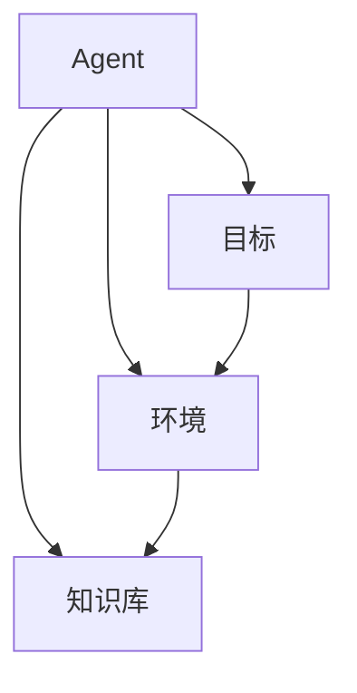

                 

# 预测2025年AI Agent技术的发展方向

> 关键词：AI Agent, 人工智能, 生成式AI, 大模型, 知识图谱, 人机交互

> 摘要：AI Agent作为人工智能领域的重要技术，正在经历从规则驱动到数据驱动的转变。本文将从AI Agent的基本概念、技术演进、核心算法、系统架构、项目实战等多个方面进行详细分析，并预测2025年AI Agent技术的主要发展方向。文章内容涵盖AI Agent的核心概念、算法原理、系统设计、实际案例以及未来趋势，为读者提供全面的技术洞察。

---

# 第一部分: AI Agent技术的发展背景与现状

## 第1章: AI Agent的基本概念与技术演进

### 1.1 AI Agent的定义与核心特征

#### 1.1.1 什么是AI Agent
AI Agent（人工智能代理）是指能够感知环境、自主决策并执行任务的智能实体。它能够通过与环境交互，主动采取行动以实现特定目标。与传统的被动响应系统不同，AI Agent具备主动性和适应性。

#### 1.1.2 AI Agent的核心特征
- **自主性**：AI Agent能够在没有外部干预的情况下自主运行。
- **反应性**：能够实时感知环境变化并做出反应。
- **目标导向**：所有行为都围绕实现特定目标展开。
- **学习能力**：通过数据和经验不断优化自身的决策能力。

#### 1.1.3 AI Agent与传统AI的区别
传统的AI系统（如专家系统）依赖于预定义的规则和知识库，而AI Agent则更加灵活，能够动态调整策略以适应环境变化。AI Agent更注重与环境的交互和实时决策。

### 1.2 AI Agent技术的演进历程

#### 1.2.1 从规则驱动到数据驱动的转变
早期的AI Agent主要依赖于专家定义的规则和逻辑推理，这种方式在特定场景下表现良好，但难以应对复杂多变的环境。随着深度学习和大模型的兴起，AI Agent开始更多地依赖数据驱动的方法。

#### 1.2.2 大模型时代的AI Agent
大模型的出现使得AI Agent具备了更强的理解和生成能力。通过预训练大模型，AI Agent能够从海量数据中学习人类知识，并生成自然语言文本，从而实现更复杂的任务。

#### 1.2.3 当前AI Agent技术的主流趋势
当前，AI Agent技术正在向多模态化、实时化和个性化方向发展。未来的AI Agent将能够同时处理文本、图像、语音等多种模态信息，并在实时交互中动态调整策略。

---

## 第2章: AI Agent技术的现状与挑战

### 2.1 当前AI Agent的主要应用场景

#### 2.1.1 智能客服
AI Agent已经在智能客服领域得到了广泛应用。通过自然语言处理技术，AI Agent能够理解用户的问题并提供解决方案，显著提升了服务效率。

#### 2.1.2 智能推荐系统
AI Agent能够根据用户的行为和偏好，实时推荐相关内容，广泛应用于电商、娱乐、新闻等领域。

#### 2.1.3 自动化决策系统
在金融、医疗等领域，AI Agent能够基于实时数据和历史经验做出决策，帮助人类提高决策效率和准确性。

### 2.2 当前技术的主要挑战

#### 2.2.1 数据隐私与安全问题
AI Agent需要处理大量敏感数据，如何保护这些数据的安全性和隐私性是一个重要挑战。

#### 2.2.2 模型的可解释性
AI Agent的决策过程往往难以被人类理解，这在需要透明性和责任追究的领域（如医疗、司法）是一个障碍。

#### 2.2.3 算法的实时性与效率
在实时交互场景中，AI Agent需要在极短的时间内完成决策和响应，这对算法的效率提出了更高要求。

---

## 第3章: AI Agent的核心概念与技术联系

### 3.1 AI Agent的核心概念

#### 3.1.1 知识表示
知识表示是AI Agent理解世界的基础。通过知识图谱、符号逻辑等方式，AI Agent能够表示和推理知识。

#### 3.1.2 行为规划
行为规划是AI Agent实现目标的核心过程。通过路径规划、任务分解等技术，AI Agent能够制定最优行动方案。

#### 3.1.3 人机交互
人机交互是AI Agent与用户或环境进行信息交换的关键环节。自然语言处理和多模态交互技术使得AI Agent能够更自然地与人类进行交流。

### 3.2 AI Agent与相关技术的关系

#### 3.2.1 AI Agent与大模型的关系
大模型为AI Agent提供了强大的理解和生成能力，但AI Agent不仅仅是大模型的应用，还需要结合具体场景进行优化。

#### 3.2.2 AI Agent与知识图谱的结合
知识图谱为AI Agent提供了结构化的知识，帮助其更好地理解复杂场景。通过知识图谱，AI Agent能够进行推理和关联分析。

#### 3.2.3 AI Agent与强化学习的联系
强化学习为AI Agent提供了动态调整策略的能力。通过与环境的交互，AI Agent能够不断优化自身的决策过程。

### 3.3 AI Agent的实体关系图

---

# 第二部分: AI Agent技术的核心算法与数学模型

## 第4章: AI Agent的算法原理

### 4.1 生成式AI的数学模型

#### 4.1.1 Transformer模型的结构
Transformer模型由编码器和解码器组成，通过自注意力机制捕捉序列中的全局关系。

#### 4.1.2 注意力机制的实现
注意力机制通过计算输入序列中每个位置的重要性，生成加权后的表示。

#### 4.1.3 梯度下降与优化算法
在训练过程中，通过梯度下降优化模型参数，以最小化损失函数。

### 4.2

---

由于文章长度限制，以上是部分内容的展示。完整文章将涵盖更多细节，包括具体的算法实现、系统设计、项目实战以及未来趋势的详细预测。

