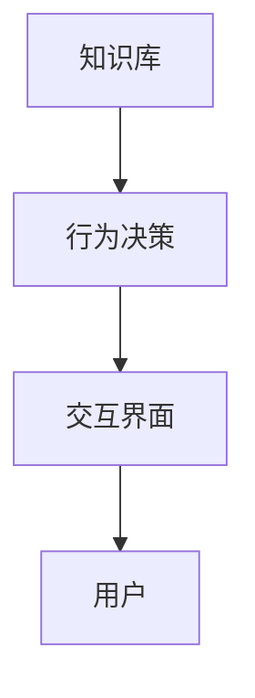
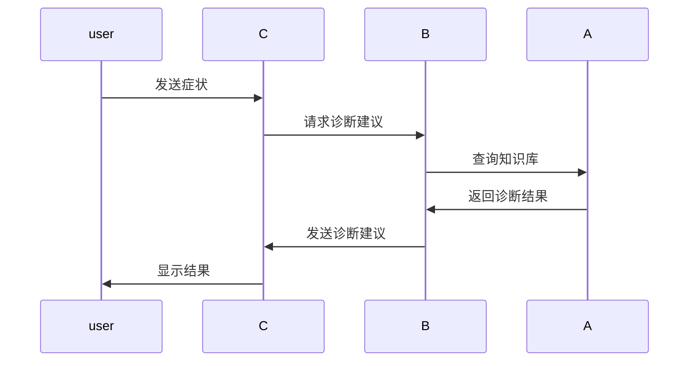

                 


# 领域特定AI Agent的开发策略

## 关键词
- 领域特定AI Agent
- 开发策略
- 人工智能
- 算法原理
- 系统架构

## 摘要
领域特定AI Agent是指针对特定领域问题设计的智能代理，旨在通过深度学习和强化学习等技术实现领域内的高效决策和自动化操作。本文将从背景、核心概念、算法原理、系统架构、项目实战等多维度详细探讨领域特定AI Agent的开发策略，结合实际案例和数学模型，为读者提供系统化的开发指导。

---

# 第1章：领域特定AI Agent的背景与概述

## 1.1 AI Agent的基本概念

### 1.1.1 AI Agent的定义与特点
AI Agent（人工智能代理）是指能够感知环境并采取行动以实现目标的智能实体。其特点包括自主性、反应性、目标导向和学习能力。

**表1-1：AI Agent与传统程序的对比**

| 属性         | AI Agent             | 传统程序           |
|--------------|----------------------|--------------------|
| 自主性       | 高                   | 低或无             |
| 反应性       | 强                   | 弱或无             |
| 目标导向     | 明确                 | 不明确或无         |
| 学习能力     | 强                   | 无或弱             |

### 1.1.2 领域特定AI Agent的特殊性
领域特定AI Agent专注于特定领域（如医疗、金融、教育等），其知识库和决策逻辑高度定制化，能够更高效地解决领域内的复杂问题。

**图1-1：领域特定AI Agent的实体关系图**

```mermaid
er
title 领域特定AI Agent的实体关系图
entity 知识库 {
  类别：领域知识
  属性：数据结构
  关系：属于
}
entity 行为决策 {
  类别：领域行为
  属性：决策规则
  关系：依赖
}
entity 交互界面 {
  类别：用户交互
  属性：输入输出
  关系：连接
}
```

---

## 1.2 领域特定AI Agent的背景

### 1.2.1 人工智能的发展历程
人工智能技术从20世纪50年代发展至今，经历了符号推理、机器学习和深度学习三个主要阶段。

### 1.2.2 领域特定AI Agent的兴起
随着深度学习和强化学习的兴起，领域特定AI Agent因其高效性和准确性，逐渐成为各行业的焦点。

### 1.2.3 领域特定AI Agent的应用场景
领域特定AI Agent广泛应用于金融、医疗、教育等领域，特别是在需要快速决策和个性化服务的场景中表现突出。

---

## 1.3 开发策略的重要性

### 1.3.1 领域特定AI Agent的开发挑战
开发领域特定AI Agent需要解决知识表示、数据获取、模型训练等多方面的挑战。

### 1.3.2 开发策略的核心作用
通过制定合理的开发策略，可以有效降低开发成本，提高开发效率和系统性能。

### 1.3.3 本书的目标与结构
本书旨在为读者提供一套完整的开发策略，涵盖从理论到实践的全生命周期。

---

# 第2章：领域特定AI Agent的核心概念与理论

## 2.1 领域特定AI Agent的结构

### 2.1.1 知识表示
知识表示是领域特定AI Agent的核心，通常采用符号逻辑和概率模型。

### 2.1.2 行为决策
行为决策模块负责根据当前状态和目标生成最优行动方案。

### 2.1.3 交互界面
交互界面是用户与AI Agent之间的桥梁，支持多模态输入输出。

---

## 2.2 领域特定AI Agent的设计原则

### 2.2.1 领域知识的深度整合
通过领域知识图谱实现知识的结构化表示。

### 2.2.2 用户需求的精准匹配
基于用户画像和意图识别实现个性化服务。

### 2.2.3 系统的可扩展性与灵活性
采用模块化设计，确保系统易于扩展和维护。

---

## 2.3 领域特定AI Agent的核心要素

### 2.3.1 知识库的构建
知识库构建包括数据收集、特征提取和知识推理三个步骤。

### 2.3.2 模型的训练与优化
采用深度学习模型，通过端到端训练优化性能。

### 2.3.3 交互机制的设计
设计高效的交互流程，确保用户体验流畅。

---

# 第3章：领域特定AI Agent的算法原理

## 3.1 强化学习算法

### 3.1.1 强化学习的基本原理
强化学习通过智能体与环境的交互，学习最优策略。

### 3.1.2 马尔可夫决策过程
MDP（马尔可夫决策过程）是强化学习的核心模型。

### 3.1.3 Q-learning算法的实现
Q-learning算法通过Q表更新策略，实现最优动作选择。

---

## 3.2 生成对抗网络（GAN）

### 3.2.1 GAN的基本结构
GAN由生成器和判别器组成，通过对抗训练生成高质量样本。

### 3.2.2 GAN在生成任务中的应用
GAN广泛应用于图像生成、数据增强等任务。

### 3.2.3 领域特定GAN的优化
通过领域适应层优化GAN，提升在特定领域的生成能力。

---

## 3.3 聚类与分类算法

### 3.3.1 K-means聚类算法
K-means算法通过迭代优化实现簇划分。

### 3.3.2 支持向量机（SVM）
SVM通过最大化间隔实现分类。

---

# 第4章：领域特定AI Agent的系统架构与设计

## 4.1 问题场景介绍
以医疗领域为例，设计一个辅助诊断的AI Agent。

## 4.2 系统功能设计

### 4.2.1 知识库构建
构建医疗知识图谱，包括疾病、症状、治疗方案等信息。

### 4.2.2 行为决策
基于患者症状和历史数据，生成诊断建议。

### 4.2.3 交互界面
设计用户友好的界面，支持自然语言输入和输出。

---

## 4.3 系统架构设计

### 4.3.1 系统功能模块
- 知识库模块
- 行为决策模块
- 交互界面模块

### 4.3.2 系统架构图



---

## 4.4 系统接口设计

### 4.4.1 API接口
提供RESTful API，支持HTTP请求。

### 4.4.2 数据格式
采用JSON格式，确保数据传输的标准化。

---

## 4.5 系统交互流程图



---

# 第5章：领域特定AI Agent的项目实战

## 5.1 环境安装

### 5.1.1 安装Python
```bash
python --version
```

### 5.1.2 安装依赖库
```bash
pip install numpy matplotlib tensorflow
```

---

## 5.2 系统核心实现

### 5.2.1 知识库构建
```python
class KnowledgeBase:
    def __init__(self):
        self.data = {}  # 知识库数据结构
```

### 5.2.2 行为决策模块
```python
def decision-making(inputs, model):
    return model.predict(inputs)
```

---

## 5.3 代码应用解读与分析
通过代码实现领域特定AI Agent的核心功能，包括知识表示、行为决策和交互界面。

---

## 5.4 实际案例分析
以医疗诊断为例，详细分析系统的设计与实现。

---

## 5.5 项目小结
总结项目开发的经验和教训，为后续开发提供参考。

---

# 第6章：领域特定AI Agent的最佳实践

## 6.1 开发中的注意事项
- 数据质量和多样性
- 模型的泛化能力
- 系统的安全性和稳定性

---

## 6.2 实际案例分析
通过具体案例分析，总结成功与失败的经验。

---

## 6.3 未来的发展趋势
预测领域特定AI Agent的发展方向，包括新技术的应用和新领域的拓展。

---

## 6.4 小结
强调开发策略的重要性，并鼓励读者持续探索和实践。

---

# 结语

通过本文的详细讲解，读者可以全面了解领域特定AI Agent的开发策略，从理论到实践，掌握一套完整的开发方法。未来，随着人工智能技术的不断发展，领域特定AI Agent将在更多领域发挥重要作用。

--- 

**关键词：领域特定AI Agent、开发策略、人工智能、算法原理、系统架构**

