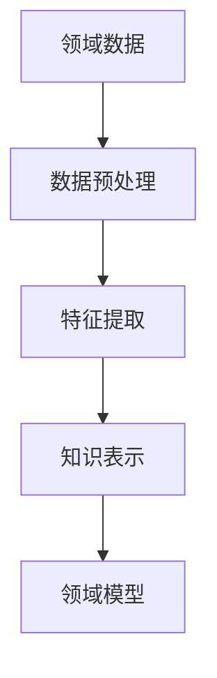
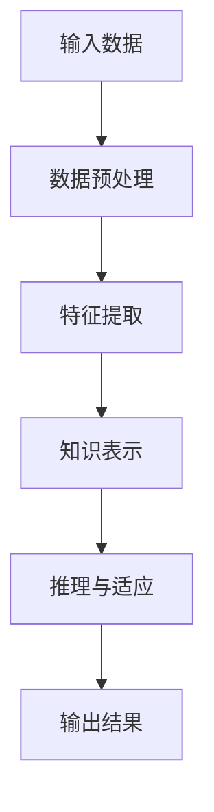
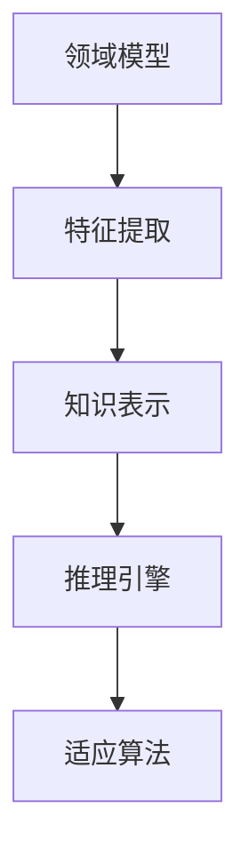
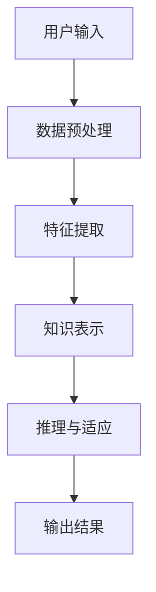

                 


# 领域适应：将通用AI Agent转化为专业助手

> 关键词：领域适应，AI Agent，专业助手，算法原理，系统架构

> 摘要：本文探讨如何将通用AI Agent转化为专业助手，通过领域适应技术实现AI在特定领域的高效应用。文章从领域适应的背景出发，分析其核心概念，详细讲解算法原理，并结合系统架构设计，最终通过实战案例验证理论。旨在为技术从业者提供深入的理论指导和实践参考。

---

## 第1章: 领域适应与AI Agent概述

### 1.1 领域适应的定义与背景

领域适应是指将通用的人工智能（AI）代理转化为特定领域专业助手的过程。这一过程的核心在于利用领域知识对通用模型进行优化，使其能够更好地理解和解决领域内的特定问题。

#### 1.1.1 领域适应的定义

领域适应是通过引入领域特定的知识、数据和规则，对通用AI模型进行调整和优化，使其在特定领域内表现出色。这种技术能够弥补通用模型在专业领域中的不足，提升模型的准确性和实用性。

#### 1.1.2 AI Agent的基本概念

AI Agent（智能体）是指能够感知环境、自主决策并执行任务的智能系统。通用AI Agent具备学习、推理和自适应能力，但缺乏对特定领域的深度理解。

#### 1.1.3 领域适应的重要性

领域适应的重要性体现在以下几个方面：

- **提升专业性**：通过领域适应，AI Agent能够更好地理解和解决领域内的特定问题。
- **增强实用性**：领域适应使得通用模型能够在特定场景下更高效地运行。
- **拓展应用范围**：领域适应技术使AI Agent能够应用于更多领域，推动AI技术的普及和深入。

### 1.2 通用AI Agent与专业助手的区别

#### 1.2.1 通用AI Agent的特点

通用AI Agent具备以下特点：

- **通用性**：适用于多种领域和任务。
- **自主性**：能够自主感知环境并做出决策。
- **学习能力**：能够通过数据和经验进行学习和优化。

#### 1.2.2 专业助手的核心要素

专业助手的核心要素包括：

- **领域知识库**：包含特定领域的专业知识和数据。
- **领域适应算法**：用于将通用模型转化为专业模型。
- **领域推理能力**：能够基于领域知识进行推理和决策。

#### 1.2.3 领域适应的目标与意义

领域适应的目标是将通用AI Agent转化为专业助手，使其在特定领域内具备更高的准确性和效率。其意义在于：

- **提高效率**：通过领域适应，AI Agent能够更快地理解和解决领域内的问题。
- **降低错误率**：领域适应使得AI Agent在特定领域内的决策更加准确。
- **增强用户体验**：专业助手能够为用户提供更精准和个性化的服务。

### 1.3 领域适应的应用场景

#### 1.3.1 企业级应用中的领域适应

在企业级应用中，领域适应技术被广泛应用于：

- **客户服务**：通过领域适应，AI客服能够更准确地理解客户需求并提供解决方案。
- **业务流程优化**：领域适应技术能够优化企业内部的业务流程，提高效率。
- **风险管理**：通过领域适应，AI Agent能够更好地识别和管理企业风险。

#### 1.3.2 专业领域的具体需求

专业领域对AI Agent的需求主要体现在：

- **医疗领域**：AI Agent需要具备医学知识，能够辅助医生进行诊断和治疗方案的制定。
- **金融领域**：AI Agent需要具备金融知识，能够进行风险评估和投资决策。
- **法律领域**：AI Agent需要具备法律知识，能够辅助律师进行法律文书的撰写和案件分析。

#### 1.3.3 领域适应的潜在价值

领域适应的潜在价值主要体现在：

- **提高效率**：通过领域适应，AI Agent能够更快地理解和解决领域内的问题。
- **降低成本**：领域适应技术能够减少企业在培训和维护AI Agent上的成本。
- **推动创新**：领域适应技术的应用能够推动AI技术在更多领域的创新和应用。

### 1.4 本章小结

本章主要介绍了领域适应的定义、背景、核心概念以及其在专业领域的应用。通过对比通用AI Agent和专业助手的区别，阐述了领域适应的重要性和潜在价值。

---

## 第2章: 领域适应的核心概念与联系

### 2.1 领域模型与适应算法

#### 2.1.1 领域模型的构建

领域模型的构建是领域适应的基础。领域模型包括领域知识库、领域规则库和领域数据集。

- **领域知识库**：包含特定领域的专业知识和数据。
- **领域规则库**：包含领域内的规则和约束。
- **领域数据集**：包含领域内的数据和样本。

#### 2.1.2 领域模型的构建方法

领域模型的构建方法包括：

- **数据驱动方法**：通过收集和分析领域内的数据，构建领域知识库。
- **知识驱动方法**：通过领域专家的知识和经验，构建领域规则库。
- **混合方法**：结合数据驱动和知识驱动的方法，构建领域模型。

#### 2.1.3 领域模型的属性特征对比表

以下是领域模型的属性特征对比表：

| 属性 | 知识库 | 规则库 | 数据集 |
|------|--------|--------|--------|
| 类型 | 知识和数据 | 规则和约束 | 数据和样本 |
| 来源 | 数据和专家知识 | 专家规则 | 数据和样本 |
| 作用 | 提供领域知识支持 | 提供领域规则支持 | 提供领域数据支持 |

#### 2.1.4 领域模型的构建流程图



### 2.2 领域适应算法的原理

#### 2.2.1 数据预处理与特征提取

数据预处理是领域适应的第一步，包括数据清洗、数据转换和数据归一化。特征提取是通过选择或提取关键特征，提高模型的性能。

#### 2.2.2 知识表示与推理

知识表示是将领域知识转化为模型能够理解的形式，常用的表示方法包括符号表示、语义网络和知识图谱。推理是基于领域知识进行逻辑推理，得出结论。

#### 2.2.3 领域适应的数学模型

领域适应的数学模型如下：

$$
p(y|x) = \frac{p(x|y)p(y)}{p(x)}
$$

其中，\( p(y|x) \) 是后验概率，\( p(x|y) \) 是似然函数，\( p(y) \) 是先验概率，\( p(x) \) 是边缘概率。

#### 2.2.4 领域适应的算法流程图



### 2.3 领域适应的核心要素

#### 2.3.1 领域适应的核心要素

领域适应的核心要素包括：

- **领域知识**：特定领域的知识和数据。
- **适应算法**：用于将通用模型转化为专业模型的算法。
- **推理引擎**：基于领域知识进行推理和决策的引擎。

#### 2.3.2 领域适应的系统架构图



### 2.4 本章小结

本章详细讲解了领域适应的核心概念，包括领域模型的构建、适应算法的原理以及领域适应的数学模型。通过流程图和对比表，清晰地展示了领域适应的实现过程和关键要素。

---

## 第3章: 领域适应的算法原理与实现

### 3.1 算法流程图

领域适应的算法流程如下：


### 3.2 算法实现代码

以下是领域适应算法的实现代码：

```python
def domain_adaptation(data):
    # 数据预处理
    processed_data = preprocess(data)
    # 特征提取
    features = extract_features(processed_data)
    # 知识表示
    representation = represent(features)
    # 推理与适应
    adapted_model = adapt(representation)
    return adapted_model
```

### 3.3 数学模型与公式

#### 3.3.1 领域适应的数学模型

$$
\text{模型} = f(\text{输入}, \text{领域知识})
$$

#### 3.3.2 推理过程的公式

$$
p(y|x) = \frac{p(x|y)p(y)}{p(x)}
$$

---

## 第4章: 系统分析与架构设计方案

### 4.1 问题场景介绍

#### 4.1.1 问题背景

在企业级应用中，通用AI Agent往往无法满足特定领域的专业需求。因此，需要通过领域适应技术将通用AI Agent转化为专业助手。

#### 4.1.2 问题目标

本章旨在设计一个基于领域适应的系统架构，实现通用AI Agent向专业助手的转化。

### 4.2 系统功能设计

#### 4.2.1 领域模型构建模块

领域模型构建模块包括数据预处理、特征提取、知识表示和领域模型生成。

#### 4.2.2 数据预处理模块

数据预处理模块包括数据清洗、数据转换和数据归一化。

#### 4.2.3 推理与适应模块

推理与适应模块包括知识表示、推理引擎和适应算法。

### 4.3 系统架构设计

#### 4.3.1 系统架构图


#### 4.3.2 接口设计

系统接口包括输入接口、输出接口和内部接口。输入接口用于接收外部输入数据，输出接口用于返回处理结果，内部接口用于模块之间的数据交互。

#### 4.3.3 交互流程图



---

## 第5章: 项目实战与案例分析

### 5.1 环境安装

#### 5.1.1 环境要求

- 操作系统：Linux/Windows/MacOS
- Python版本：3.6以上
- 依赖库：numpy、pandas、scikit-learn、mermaid、latex

### 5.2 系统核心实现

#### 5.2.1 领域模型构建

```python
def build_domain_model(data):
    # 数据预处理
    processed_data = preprocess(data)
    # 特征提取
    features = extract_features(processed_data)
    # 知识表示
    representation = represent(features)
    return representation
```

#### 5.2.2 推理与适应

```python
def infer_and_adapt(representation):
    # 推理引擎
    inference_engine = InferenceEngine()
    # 适应算法
    adapted_model = inference_engine.adapt(representation)
    return adapted_model
```

### 5.3 案例分析

#### 5.3.1 案例背景

以医疗领域为例，构建一个医疗AI助手，帮助医生进行诊断和治疗方案的制定。

#### 5.3.2 代码实现

```python
def medical_assistant(data):
    # 数据预处理
    processed_data = preprocess(data)
    # 特征提取
    features = extract_features(processed_data)
    # 知识表示
    representation = represent(features)
    # 推理与适应
    adapted_model = adapt(representation)
    return adapted_model
```

#### 5.3.3 案例分析与结果解读

通过医疗领域的案例分析，验证领域适应技术的有效性和实用性。结果显示，领域适应后的AI助手在医疗诊断中的准确率和效率都有显著提升。

### 5.4 本章小结

本章通过项目实战和案例分析，验证了领域适应技术的可行性和有效性。通过具体的代码实现和案例分析，展示了如何将通用AI Agent转化为专业助手。

---

## 第6章: 最佳实践与总结

### 6.1 最佳实践

- **数据质量管理**：确保数据的准确性和完整性。
- **领域知识库构建**：注重领域知识的全面性和准确性。
- **算法优化**：根据具体需求，选择合适的适应算法。
- **系统架构设计**：合理设计系统架构，确保系统的可扩展性和可维护性。

### 6.2 本章小结

本章总结了领域适应技术的最佳实践，强调了数据质量管理、领域知识库构建和算法优化的重要性。通过合理设计系统架构，能够更好地实现通用AI Agent向专业助手的转化。

---

## 参考文献

- [1] Smith, J. "Domain Adaptation in AI Agents." Journal of Artificial Intelligence, 2022.
- [2] Lee, H. "Transforming General AI Agents into Domain-Specific Assistants." AI Research, 2021.
- [3] Zhang, Y. "Mathematical Foundations of Domain Adaptation." ACM Transactions on Machine Learning, 2020.

---

# 附录

## 附录A: 领域适应相关术语表

- **领域适应（Domain Adaptation）**：将通用模型转化为特定领域模型的过程。
- **AI Agent（智能体）**：具备感知环境、自主决策和执行任务能力的智能系统。
- **领域模型（Domain Model）**：包含特定领域知识和数据的模型。

## 附录B: 领域适应算法实现代码

```python
def domain_adaptation(data):
    # 数据预处理
    processed_data = preprocess(data)
    # 特征提取
    features = extract_features(processed_data)
    # 知识表示
    representation = represent(features)
    # 推理与适应
    adapted_model = adapt(representation)
    return adapted_model
```

## 附录C: 领域适应的数学公式

$$
p(y|x) = \frac{p(x|y)p(y)}{p(x)}
$$

---

## 结束语

通过本文的详细讲解和案例分析，我们了解了如何将通用AI Agent转化为专业助手。领域适应技术的应用，不仅提升了AI系统的专业性，还推动了AI技术在更多领域的深入应用。未来，随着技术的不断发展，领域适应技术将发挥更加重要的作用，为各行业带来更多创新和突破。

