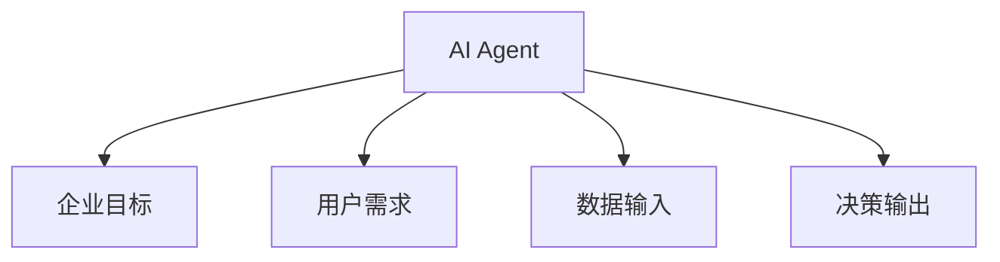
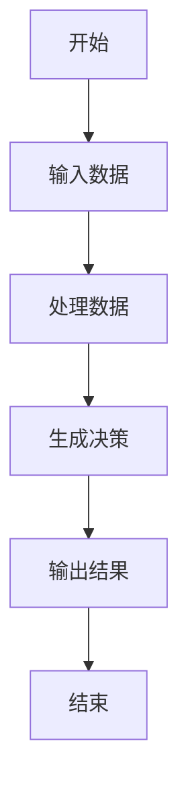
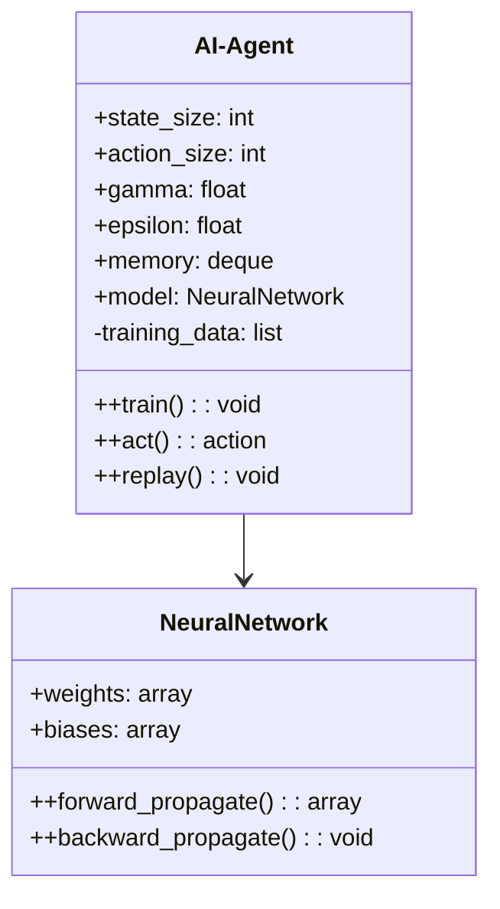
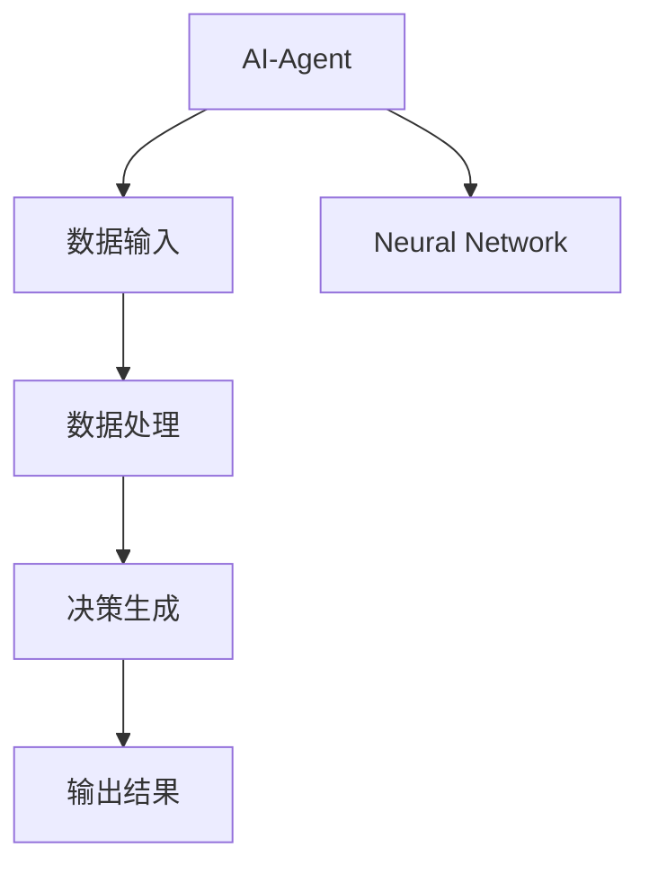

                 


# AI Agent在企业产品创新与概念验证中的角色

## 关键词
AI Agent, 企业创新, 概念验证, 人工智能, 机器学习, 强化学习

## 摘要
本文探讨AI Agent在企业产品创新和概念验证中的关键作用。通过分析AI Agent的定义、核心原理、算法实现及其在系统架构中的应用，结合实际案例，展示其如何助力企业创新。文章还提供了代码示例和系统设计图，帮助读者深入了解AI Agent的技术细节和实际应用。

---

## 第1章：AI Agent的基本概念与背景

### 1.1 问题背景
企业创新面临效率低下、资源浪费和市场响应慢的问题。传统方法依赖人工经验，效率有限，而AI Agent通过自动化和智能化优化流程，解决这些问题。

### 1.2 问题描述
企业在创新阶段常面临需求理解不准确和概念验证耗时的问题。AI Agent通过数据驱动的方法，帮助快速验证概念，提升效率。

### 1.3 问题解决
AI Agent利用智能算法和数据处理，优化创新流程，加快概念验证，降低试错成本。

### 1.4 边界与外延
AI Agent适用于数据驱动的决策场景，但需与企业文化和数据质量相结合，避免过度依赖技术。

---

## 第2章：AI Agent的核心概念与联系

### 2.1 核心概念原理
AI Agent具备可定制性、自适应性和智能性，通过感知和决策优化创新过程。

### 2.2 属性特征对比
| 属性 | 特征 |
|------|------|
| 可定制性 | 高 |
| 自适应能力 | 强 |
| 智能性 | 高 |

### 2.3 ER实体关系图


---

## 第3章：AI Agent的算法原理

### 3.1 算法原理
AI Agent采用强化学习和监督学习，通过数学模型优化决策。

### 3.2 算法流程图


### 3.3 算法实现
```python
import numpy as np
from collections import deque

class AI-Agent:
    def __init__(self, state_size, action_size):
        self.state_size = state_size
        self.action_size = action_size
        self.gamma = 0.99
        self.epsilon = 1.0
        self.epsilon_min = 0.01
        self.memory = deque(maxlen=1000)
        self.model = self._build_model()

    def _build_model(self):
        # 构建神经网络模型
        pass

    def remember(self, state, action, reward, next_state, done):
        self.memory.append((state, action, reward, next_state, done))

    def act(self, state):
        # 选择动作
        pass

    def replay(self, batch_size):
        # 回放记忆
        pass

    def train(self, batch_size):
        # 训练模型
        pass
```

---

## 第4章：系统分析与架构设计

### 4.1 问题场景
企业需快速验证创新概念，优化资源配置，提高效率。

### 4.2 系统功能设计


### 4.3 系统架构设计


### 4.4 接口设计
AI-Agent与数据源和用户交互，提供API接口。

---

## 第5章：项目实战

### 5.1 环境安装
安装Python、TensorFlow和Keras等库。

### 5.2 核心实现
```python
def main():
    env = Environment()
    agent = AI-Agent(state_size, action_size)
    for episode in range(num_episodes):
        state = env.reset()
        while not done:
            action = agent.act(state)
            next_state, reward, done = env.step(action)
            agent.remember(state, action, reward, next_state, done)
            agent.train(batch_size)
```

### 5.3 案例分析
通过电商产品推荐案例，展示AI-Agent如何优化概念验证。

---

## 第6章：最佳实践

### 6.1 小结
AI-Agent在企业创新中提供高效解决方案，提升概念验证效率。

### 6.2 注意事项
确保数据质量和模型迭代，避免过度依赖技术。

### 6.3 拓展阅读
推荐学习强化学习和深度学习相关知识。

---

## 总结
AI Agent通过智能化决策和高效验证，助力企业创新。掌握其原理和应用，企业可显著提升创新效率和成功率。

--- 

**全文完**

