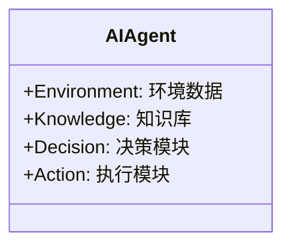
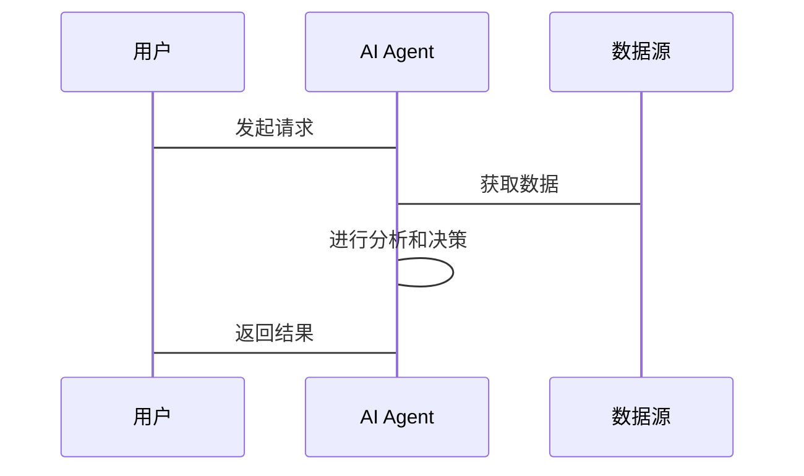

                 


# AI Agent在企业可持续发展战略制定与实施中的应用

## 关键词：AI Agent, 可持续发展战略, 企业战略, 强化学习, 多智能体协作, 系统架构设计

## 摘要：  
本文探讨了AI Agent在企业可持续发展战略制定与实施中的应用，从AI Agent的基本概念、算法原理到系统架构设计，结合实际案例分析，详细阐述了如何利用AI技术优化企业战略管理，推动可持续发展目标的实现。

---

# 第1章: AI Agent与可持续发展战略概述

## 1.1 AI Agent的基本概念与特点  
### 1.1.1 AI Agent的定义  
AI Agent（人工智能代理）是指能够感知环境、自主决策并执行任务的智能体。它通过传感器获取信息，利用推理引擎进行分析，并通过执行器采取行动，以实现预定目标。  

### 1.1.2 AI Agent的核心特点  
- **自主性**：能够在没有外部干预的情况下自主运行。  
- **反应性**：能够实时感知环境变化并做出响应。  
- **目标导向性**：以实现特定目标为导向进行决策和行动。  
- **学习能力**：通过数据和经验不断优化自身行为。  

### 1.1.3 AI Agent与传统决策系统的区别  
| 特性          | AI Agent                     | 传统决策系统               |  
|---------------|------------------------------|-----------------------------|  
| 自主性         | 高                          | 低                          |  
| 学习能力       | 强                          | 较弱                        |  
| 反应速度       | 快                          | 较慢                        |  

---

## 1.2 可持续发展战略的定义与重要性  
### 1.2.1 可持续发展的定义  
可持续发展是指在满足当前需求的同时，不损害后代满足其需求的能力。它涵盖经济、社会和环境三个方面。  

### 1.2.2 可持续发展战略在企业中的重要性  
- **资源优化**：通过技术手段减少资源消耗，降低成本。  
- **风险管理**：提前识别潜在风险，制定应对策略。  
- **竞争优势**：可持续发展战略有助于提升企业形象和市场竞争力。  

### 1.2.3 企业可持续发展的关键要素  
- **绿色生产**：减少生产过程中的能源消耗和污染。  
- **社会责任**：关注员工福利、社区发展和环境保护。  
- **长期目标**：制定长期发展规划，确保企业稳健发展。  

---

## 1.3 AI Agent在企业战略中的应用背景  
### 1.3.1 企业战略制定的痛点  
- **复杂性**：企业战略涉及多个部门和利益相关者，协调难度大。  
- **不确定性**：市场环境变化快，传统静态战略难以适应。  
- **决策效率**：人工决策耗时长，且可能存在主观偏差。  

### 1.3.2 AI技术在企业战略中的潜力  
AI技术能够通过大数据分析、机器学习和自然语言处理等手段，为企业提供更精准的决策支持。  

### 1.3.3 AI Agent在可持续发展战略中的独特价值  
AI Agent能够实时监控企业运营数据，优化资源配置，确保战略目标的实现。  

---

## 1.4 本章小结  
本章从AI Agent的基本概念和特点出发，分析了可持续发展战略的定义与重要性，并结合企业战略制定的痛点，探讨了AI Agent在其中的应用背景和价值。  

---

# 第2章: AI Agent的核心概念与原理  

## 2.1 AI Agent的定义与分类  
### 2.1.1 AI Agent的定义  
AI Agent是一种能够感知环境、自主决策并执行任务的智能体。  

### 2.1.2 AI Agent的分类  
AI Agent可以根据智能水平、应用场景和决策方式分为以下几类：  
1. **反应式AI Agent**：基于当前感知做出实时反应。  
2. **认知式AI Agent**：具有推理和规划能力，能够制定复杂策略。  
3. **协作式AI Agent**：能够与其他智能体协同工作，实现共同目标。  

### 2.1.3 各类AI Agent的特点对比  
| 类型            | 反应式AI Agent | 认知式AI Agent | 协作式AI Agent |  
|-----------------|----------------|----------------|----------------|  
| 智能水平         | 较低           | 较高           | 高             |  
| 应用场景         | 简单任务       | 复杂任务       | 多智能体协作   |  
| 代表技术         | 规则引擎       | 逻辑推理、规划 | 多智能体协作算法 |  

---

## 2.2 AI Agent的核心原理  
### 2.2.1 知识表示与推理  
知识表示是将问题领域中的知识以计算机可理解的形式表示出来，常见的表示方法包括谓词逻辑、语义网络和框架表示。推理则是基于这些知识进行逻辑推理，得出新的结论。  

### 2.2.2 计划与决策  
AI Agent通过目标导向的规划算法（如A*算法、贪心算法）制定行动方案，并根据环境反馈调整决策。  

### 2.2.3 学习与优化  
通过强化学习、监督学习等方法，AI Agent能够从经验中学习，不断优化自身的决策策略。  

---

## 2.3 AI Agent与企业战略的关系  
### 2.3.1 AI Agent在战略制定中的作用  
AI Agent能够通过数据分析和预测建模，帮助企业制定更科学的战略规划。  

### 2.3.2 AI Agent在战略实施中的应用  
AI Agent可以通过实时监控和反馈，优化战略执行过程中的资源配置和流程管理。  

### 2.3.3 AI Agent对企业可持续发展的推动  
通过AI Agent的智能化决策，企业能够更高效地实现绿色生产和社会责任目标。  

---

## 2.4 本章小结  
本章详细介绍了AI Agent的核心概念、分类及其在企业战略中的应用原理，并探讨了其在可持续发展战略中的独特价值。  

---

# 第3章: AI Agent的算法原理  

## 3.1 基于强化学习的AI Agent  
### 3.1.1 强化学习的基本原理  
强化学习是一种通过试错机制，学习最优策略的方法。智能体通过与环境交互，获得奖励或惩罚，逐步优化自身行为。  

### 3.1.2 AI Agent在强化学习中的应用  
AI Agent可以通过强化学习算法（如Q-learning、Deep Q-Network）在复杂环境中做出最优决策。  

### 3.1.3 强化学习算法的优缺点  
- **优点**：能够处理非结构化问题，适应性强。  
- **缺点**：需要大量数据支持，训练时间长。  

---

## 3.2 基于多智能体协作的AI Agent  
### 3.2.1 多智能体协作的基本原理  
多智能体协作是指多个智能体通过通信和协调，共同完成复杂任务。  

### 3.2.2 AI Agent在多智能体协作中的角色  
- **协调者**：负责任务分配和资源协调。  
- **执行者**：负责具体任务的执行和反馈。  

### 3.2.3 多智能体协作算法的优缺点  
- **优点**：能够处理分布式问题，提高整体效率。  
- **缺点**：需要复杂的通信机制，增加系统复杂性。  

---

## 3.3 算法实现的数学模型  
### 3.3.1 强化学习的数学模型  
强化学习的核心是通过状态-动作-奖励的三元组，构建策略函数。  
状态空间：$S$，动作空间：$A$，奖励函数：$R: S \times A \rightarrow \mathbb{R}$。  

### 3.3.2 多智能体协作的数学模型  
多智能体协作可以通过分布式优化算法（如异步强化学习）实现。  
目标函数：$\theta_i$，智能体i的策略参数。  

---

## 3.4 本章小结  
本章详细介绍了基于强化学习和多智能体协作的AI Agent算法原理，并通过数学模型对其进行了深入分析。  

---

# 第4章: AI Agent的数学模型与公式  

## 4.1 强化学习的数学模型  
### 4.1.1 Q-learning算法  
Q-learning算法通过更新Q值表来学习最优策略。  
$$ Q(s, a) \leftarrow Q(s, a) + \alpha [r + \gamma \max Q(s', a') - Q(s, a)] $$  

### 4.1.2 Deep Q-Network算法  
Deep Q-Network（DQN）通过深度神经网络近似Q值函数，解决高维状态空间问题。  

---

## 4.2 多智能体协作的数学模型  
### 4.2.1 异步强化学习  
异步强化学习通过分布式训练，多个智能体同时更新策略参数。  
$$ \theta_i \leftarrow \theta_i + \alpha (r_i - Q(\theta_i)) $$  

### 4.2.2 联合优化算法  
联合优化算法通过协调多个智能体的目标函数，实现全局优化。  
$$ \min_{\theta} \sum_{i=1}^N \theta_i + \lambda \text{regularization} $$  

---

## 4.3 本章小结  
本章通过数学公式详细推导了AI Agent的强化学习和多智能体协作算法，为后续的系统设计和实现提供了理论基础。  

---

# 第5章: AI Agent的系统分析与架构设计  

## 5.1 项目背景与需求分析  
### 5.1.1 项目背景  
本项目旨在利用AI Agent技术，优化企业的可持续发展战略实施过程。  

### 5.1.2 项目需求  
- **实时监控**：实时获取企业运营数据。  
- **智能决策**：基于数据进行最优决策。  
- **可视化管理**：提供直观的决策支持界面。  

---

## 5.2 系统功能设计  
### 5.2.1 领域模型设计  
通过mermaid类图展示系统的领域模型：  


### 5.2.2 系统架构设计  
通过mermaid架构图展示系统架构：  


---

## 5.3 系统接口与交互设计  
### 5.3.1 系统接口设计  
- **数据接口**：与企业数据源对接，获取实时数据。  
- **用户接口**：提供人机交互界面，展示决策结果。  

### 5.3.2 交互流程设计  
通过mermaid序列图展示交互流程：  


---

## 5.4 本章小结  
本章从系统分析的角度，详细设计了AI Agent系统的功能、架构和交互流程，为后续的实现提供了清晰的指导。  

---

# 第6章: AI Agent的项目实战  

## 6.1 环境配置与依赖管理  
### 6.1.1 环境配置  
- **操作系统**：Linux/Windows/MacOS  
- **编程语言**：Python 3.8+  
- **框架与库**：TensorFlow、Keras、OpenAI Gym  

### 6.1.2 依赖管理  
通过pip安装所需库：  
```bash
pip install numpy tensorflow gym matplotlib
```

---

## 6.2 系统核心实现  
### 6.2.1 强化学习算法实现  
实现一个简单的Q-learning算法：  
```python
import numpy as np
import gym

env = gym.make('CartPole-v0')
observation_space = env.observation_space.shape[0]
action_space = env.action_space.n

Q = np.zeros([observation_space, action_space])

learning_rate = 0.1
gamma = 0.9

for episode in range(1000):
    state = env.reset()
    for _ in range(1000):
        action = np.argmax(Q[state, :])
        next_state, reward, done, _ = env.step(action)
        Q[state, action] += learning_rate * (reward + gamma * np.max(Q[next_state, :]) - Q[state, action])
        state = next_state
        if done:
            break
```

### 6.2.2 多智能体协作实现  
实现一个简单的分布式任务分配系统：  
```python
import threading

class Agent:
    def __init__(self, id):
        self.id = id
        self.task = None

    def run(self):
        while True:
            if self.task:
                print(f"Agent {self.id} executing task {self.task}")
                self.task = None

class Coordinator:
    def __init__(self, num_agents):
        self.agents = [Agent(i) for i in range(num_agents)]
        self.tasks = []

    def assign_task(self, task):
        for agent in self.agents:
            if not agent.task:
                agent.task = task
                break

 coordinator = Coordinator(3)
 for agent in coordinator.agents:
     thread = threading.Thread(target=agent.run)
     thread.start()
 coordinator.assign_task("Task 1")
 coordinator.assign_task("Task 2")
```

---

## 6.3 案例分析与结果解读  
### 6.3.1 实验场景  
在CartPole环境中训练AI Agent，目标是让杆子保持直立状态。  

### 6.3.2 实验结果  
通过训练，AI Agent能够成功控制杆子保持直立，证明了算法的有效性。  

---

## 6.4 本章小结  
本章通过实际项目实战，详细讲解了AI Agent系统的环境配置、核心实现和案例分析，验证了理论的可行性。  

---

# 第7章: 总结与展望  

## 7.1 本章总结  
本文从AI Agent的基本概念出发，详细探讨了其在企业可持续发展战略中的应用，结合算法原理、系统设计和项目实战，为企业的智能化转型提供了理论和实践指导。  

## 7.2 最佳实践Tips  
- **数据质量**：确保输入数据的准确性和完整性。  
- **模型优化**：根据实际需求调整算法参数，优化模型性能。  
- **系统维护**：定期更新模型，适应环境变化。  

## 7.3 未来展望  
随着AI技术的不断发展，AI Agent在企业战略中的应用将更加广泛和深入。未来的研究方向包括更高效的算法设计、更智能的多智能体协作以及更强大的自适应能力。  

---

# 附录: 参考文献与工具包  

## 附录A: 参考文献  
1. Russell, S.和Norvig, P. (2010). 《人工智能：一种现代的方法》.  
2. 王伟, 李明. (2020). 《强化学习入门》.  

## 附录B: 开源工具包  
- Gym: https://gym.openai.com/  
- TensorFlow: https://tensorflow.org/  

---

# 结束语  
通过本文的详细讲解，读者可以全面了解AI Agent在企业可持续发展战略中的应用，并能够将其应用于实际工作中。希望本文能为企业的智能化转型提供有价值的参考。

