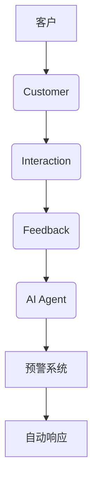

                 


# AI Agent在企业客户服务质量监控与提升中的实时应用

## 关键词：
- AI Agent
- 客户服务质量
- 实时监控
- 服务质量提升
- 人工智能技术

## 摘要：
随着人工智能技术的迅速发展，AI Agent（人工智能代理）在企业客户服务质量监控与提升中的应用日益广泛。本文将系统地探讨AI Agent如何实时监控和提升客户服务质量，分析其在实际应用中的优势和挑战。通过详细的技术讲解、案例分析和系统设计，本文旨在为企业提供一种创新的解决方案，以提高客户满意度和忠诚度，从而增强企业的市场竞争力。

---

## 第一章：AI Agent与客户服务质量管理概述

### 1.1 问题背景
在现代商业环境中，客户服务质量是企业成功的关键因素之一。然而，传统的客户服务质量管理存在以下问题：
- **人工成本高**：需要大量客服人员进行监控和管理。
- **响应速度慢**：人工处理客户反馈的时间较长，影响客户体验。
- **数据处理能力有限**：难以实时处理和分析海量客户数据。
- **个性化服务不足**：难以根据客户需求提供个性化的解决方案。

### 1.2 问题描述
客户服务质量管理的目标是确保客户在与企业互动过程中获得高质量的服务体验。然而，传统方法存在以下局限性：
- **效率低下**：人工处理客户反馈和投诉的效率较低，无法满足实时监控的需求。
- **缺乏智能化**：无法利用大数据和人工智能技术进行智能分析和预测。
- **客户体验不一致**：不同客服人员的服务水平参差不齐，导致客户体验不稳定。

### 1.3 问题解决
AI Agent作为一种智能代理，能够通过自动化的方式实时监控和提升客户服务质量。AI Agent能够：
- **实时监控**：持续监测客户与企业的互动，识别潜在问题。
- **智能分析**：利用自然语言处理和机器学习技术，分析客户反馈和情绪。
- **自动化处理**：快速响应客户问题，提供个性化的解决方案。

### 1.4 核心概念与要素
AI Agent在客户服务质量管理中的核心概念包括：
- **AI Agent**：能够自主执行任务的智能代理，能够理解客户需求并提供解决方案。
- **客户服务质量**：客户在与企业互动过程中所获得的服务体验的质量。
- **实时监控**：通过持续的数据收集和分析，实时了解客户服务质量的状态。
- **智能提升**：利用AI技术优化服务流程，提高客户满意度。

---

## 第二章：AI Agent的核心概念与原理

### 2.1 核心概念
AI Agent是一种智能代理，能够在没有人类干预的情况下自主执行任务。其核心概念包括：
- **自主性**：AI Agent能够自主决策和行动，无需人工干预。
- **反应性**：能够实时感知环境变化并做出响应。
- **学习能力**：通过机器学习算法不断优化自身的性能。

### 2.2 核心原理
AI Agent的核心原理包括：
- **感知与理解**：通过自然语言处理技术理解客户的反馈和需求。
- **分析与决策**：利用大数据分析和机器学习算法，分析客户数据并做出决策。
- **执行与反馈**：根据分析结果采取行动，并根据反馈不断优化自身性能。

### 2.3 ER实体关系图
以下是客户、AI Agent、互动和反馈之间的关系图：

```mermaid
er
  Customer: id, name, contact_info
  Agent: id, name, status
  Interaction: id, timestamp, customer_id, agent_id, content
  Feedback: id, timestamp, customer_id, score
```

---

## 第三章：AI Agent的算法原理讲解

### 3.1 算法原理
AI Agent的核心算法包括：
- **自然语言处理（NLP）**：用于理解和分析客户的文本反馈。
- **机器学习（ML）**：用于预测客户满意度和识别潜在问题。

#### 3.1.1 自然语言处理（NLP）
NLP用于分析客户的文本反馈，提取情感和关键词。例如，通过词袋模型或词嵌入技术（如Word2Vec）对文本进行处理。

#### 3.1.2 机器学习（ML）
机器学习用于训练模型，预测客户满意度。常用的算法包括支持向量机（SVM）和随机森林（Random Forest）。

### 3.2 算法实现
以下是基于Python的机器学习模型实现代码：

```python
import pandas as pd
from sklearn.feature_extraction.text import TfidfVectorizer
from sklearn.svm import SVC

# 数据预处理
df = pd.read_csv('customer_feedback.csv')
X = df['feedback'].values
y = df['sentiment'].values

# 特征提取
vectorizer = TfidfVectorizer(max_features=5000)
X_features = vectorizer.fit_transform(X).toarray()

# 训练模型
model = SVC()
model.fit(X_features, y)

# 预测
test_feedback = ["The service was excellent!", "I had a bad experience."]
test_features = vectorizer.transform(test_feedback).toarray()
predictions = model.predict(test_features)
print("Predictions:", predictions)
```

### 3.3 数学公式
以下是机器学习模型中的常见公式：

- **损失函数**：
  $$ L(y, y_{\text{pred}}) = \sum_{i=1}^{n} (y_i - y_{\text{pred}}_i)^2 $$

- **概率论中的贝叶斯定理**：
  $$ P(A|B) = \frac{P(B|A) \cdot P(A)}{P(B)} $$

---

## 第四章：系统分析与架构设计方案

### 4.1 问题场景
企业需要实时监控客户与客服的互动，识别潜在问题并快速响应。

### 4.2 系统功能设计
系统功能包括：
- **数据收集**：实时收集客户与客服的互动数据。
- **数据分析**：利用NLP和机器学习技术分析数据。
- **智能监控**：识别潜在问题并触发预警。
- **自动响应**：根据分析结果自动回复客户。

### 4.3 系统架构设计



---

## 第五章：项目实战

### 5.1 环境安装
需要安装以下工具：
- Python 3.8+
- Scikit-learn
- NLTK
- Mermaid

### 5.2 核心代码实现
以下是AI Agent的实现代码：

```python
import nltk
from sklearn.feature_extraction.text import TfidfVectorizer
from sklearn.svm import SVC

# 数据加载与预处理
df = pd.read_csv('customer_feedback.csv')
X = df['text'].values
y = df['label'].values

# 特征提取
vectorizer = TfidfVectorizer()
X_features = vectorizer.fit_transform(X)

# 模型训练
model = SVC()
model.fit(X_features, y)

# 预测
test_text = ["The service was excellent!", "I had a bad experience."]
test_features = vectorizer.transform(test_text)
predictions = model.predict(test_features)
print("Predictions:", predictions)
```

### 5.3 案例分析
通过分析客户反馈数据，AI Agent能够识别负面情绪并触发预警，帮助客服快速响应。

---

## 第六章：最佳实践与总结

### 6.1 小结
AI Agent在客户服务质量管理中的应用显著提高了效率和客户满意度。通过实时监控和智能分析，企业能够快速响应客户需求，提升服务质量。

### 6.2 注意事项
- **数据隐私**：确保客户数据的安全和隐私。
- **模型优化**：定期优化AI模型，提高准确性。
- **人机协作**：AI Agent应与人类客服协同工作，而非完全替代。

### 6.3 拓展阅读
- 《机器学习实战》
- 《自然语言处理入门》
- 《AI系统设计与实现》

---

通过以上章节的详细讲解，读者可以全面理解AI Agent在企业客户服务质量监控与提升中的应用，并能够实际操作相关技术。希望本文能为企业的客户服务质量管理提供有价值的参考和指导。

