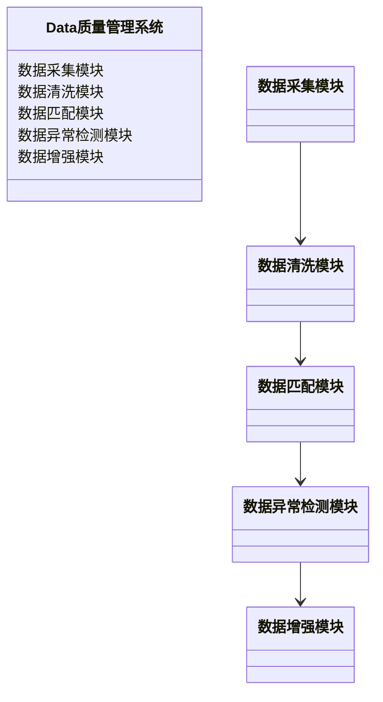
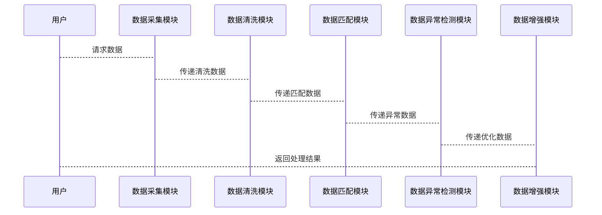

                 


# AI Agent在企业数据质量管理与治理中的应用

## 关键词：AI Agent，数据质量管理，数据治理，数据清洗，数据异常检测，数据匹配与合并

## 摘要：  
本文探讨了AI Agent在企业数据质量管理与治理中的应用，详细分析了数据质量管理的核心概念、AI Agent的作用及其算法原理，并通过实际案例展示了AI Agent如何提升数据治理的效率与效果。文章还总结了数据质量管理与治理的边界与外延，为企业应用AI Agent提供了理论依据和实践指导。

---

# 目录

1. [企业数据质量管理与治理的背景](#企业数据质量管理与治理的背景)
   - [1.1 数据质量管理的定义与重要性](#11-数据质量管理的定义与重要性)
   - [1.2 企业数据治理的挑战与需求](#12-企业数据治理的挑战与需求)
   - [1.3 AI Agent在数据质量管理中的作用](#13-AI-Agent在数据质量管理中的作用)
   - [1.4 数据质量管理与治理的边界与外延](#14-数据质量管理与治理的边界与外延)
   - [1.5 本章小结](#15-本章小结)

2. [数据质量管理的核心概念与联系](#数据质量管理的核心概念与联系)
   - [2.1 数据质量管理的核心要素](#21-数据质量管理的核心要素)
   - [2.2 数据治理的核心概念](#22-数据治理的核心概念)
   - [2.3 AI Agent与数据质量管理的关系](#23-AI-Agent与数据质量管理的关系)
   - [2.4 数据质量管理的核心概念结构](#24-数据质量管理的核心概念结构)
   - [2.5 本章小结](#25-本章小结)

3. [AI Agent在数据质量管理中的算法原理](#AI-Agent在数据质量管理中的算法原理)
   - [3.1 数据清洗与预处理算法](#31-数据清洗与预处理算法)
   - [3.2 数据异常检测算法](#32-数据异常检测算法)
   - [3.3 数据匹配与合并算法](#33-数据匹配与合并算法)
   - [3.4 数据增强与优化](#34-数据增强与优化)
   - [3.5 本章小结](#35-本章小结)

4. [AI Agent在数据质量管理中的系统架构](#AI-Agent在数据质量管理中的系统架构)
   - [4.1 系统功能设计](#41-系统功能设计)
   - [4.2 系统架构设计](#42-系统架构设计)
   - [4.3 接口与交互设计](#43-接口与交互设计)
   - [4.4 本章小结](#44-本章小结)

5. [AI Agent在数据质量管理中的项目实战](#AI-Agent在数据质量管理中的项目实战)
   - [5.1 项目背景与目标](#51-项目背景与目标)
   - [5.2 环境安装与配置](#52-环境安装与配置)
   - [5.3 核心代码实现](#53-核心代码实现)
   - [5.4 实际案例分析](#54-实际案例分析)
   - [5.5 项目总结与优化](#55-项目总结与优化)
   - [5.6 本章小结](#56-本章小结)

6. [AI Agent在数据质量管理中的最佳实践](#AI-Agent在数据质量管理中的最佳实践)
   - [6.1 最佳实践总结](#61-最佳实践总结)
   - [6.2 需要注意的问题](#62-需要注意的问题)
   - [6.3 未来研究方向](#63-未来研究方向)
   - [6.4 本章小结](#64-本章小结)

7. [结论与展望](#结论与展望)

---

## 第一部分: AI Agent与企业数据质量管理概述

### 第1章: 企业数据质量管理与治理的背景

#### 1.1 数据质量管理的定义与重要性

数据质量管理（Data Quality Management，DQM）是指通过一系列方法和技术，确保数据的准确性、完整性、一致性、及时性和可追溯性。它是企业在数据管理过程中不可或缺的一部分，直接影响企业的决策能力和运营效率。

数据质量管理的重要性体现在以下几个方面：
1. **提高数据准确性**：确保数据真实反映业务情况。
2. **确保数据完整性**：避免数据缺失或不完整。
3. **维护数据一致性**：确保同一数据在不同系统中的表现一致。
4. **保证数据及时性**：使数据能够反映最新的业务状态。
5. **增强数据可追溯性**：便于追查数据来源和变更历史。

#### 1.2 企业数据治理的挑战与需求

企业在数据治理方面面临的主要挑战包括：
1. **数据分散**：数据分布在不同的系统和部门，难以统一管理。
2. **数据孤岛**：不同系统之间缺乏数据共享和集成，导致信息孤岛。
3. **数据安全**：数据泄露和隐私保护成为企业面临的重要问题。
4. **数据治理的复杂性**：数据治理涉及多个部门和流程，协调难度大。

数据治理的需求与价值：
1. **提高数据利用率**：为企业决策提供可靠支持。
2. **降低数据管理成本**：通过自动化工具提高效率。
3. **增强数据安全**：保护企业核心数据资产。
4. **促进数据共享**：打破数据孤岛，提高协同效率。

#### 1.3 AI Agent在数据质量管理中的作用

AI Agent（人工智能代理）是一种能够感知环境并采取行动以实现目标的智能体。它具有自主性、反应性、目标导向和学习能力等特点，能够适应复杂多变的环境。

AI Agent在数据质量管理中的应用场景包括：
1. **数据清洗与预处理**：通过机器学习算法自动识别和修复数据中的错误。
2. **数据异常检测**：利用AI技术实时监控数据流，发现并标记异常数据。
3. **数据匹配与合并**：通过自然语言处理技术，实现不同数据源之间的数据匹配和合并。
4. **数据增强**：通过生成式AI技术，补充缺失数据，提升数据质量。

#### 1.4 数据质量管理与治理的边界与外延

数据质量管理的边界包括：
1. **数据范围**：仅限于企业内部数据，不涉及外部数据。
2. **数据类型**：主要关注结构化数据，对非结构化数据的处理能力有限。
3. **数据生命周期**：主要关注数据的采集、处理和存储阶段，对数据的销毁阶段关注较少。

数据治理的外延包括：
1. **数据安全**：保护数据的机密性、完整性和可用性。
2. **数据隐私**：确保数据的使用符合相关法律法规。
3. **数据共享**：促进数据在不同部门和系统之间的共享与协作。

数据质量管理与治理的关系：
数据质量管理是数据治理的重要组成部分，数据治理为企业提供数据管理的框架和策略，而数据质量管理则具体实施数据的清洗、修复和优化。两者相辅相成，共同确保企业数据的健康和价值。

#### 1.5 本章小结

本章主要介绍了数据质量管理的定义、重要性和核心目标，分析了企业数据治理的挑战与需求，探讨了AI Agent在数据质量管理中的作用及其优势与局限性，并明确了数据质量管理与治理的边界与外延。通过本章的学习，读者可以理解数据质量管理与治理的基本概念和其在企业中的重要地位。

---

## 第二部分: 数据质量管理的核心概念与联系

### 第2章: 数据质量管理的核心概念与联系

#### 2.1 数据质量管理的核心要素

数据质量管理的核心要素包括：
1. **数据的完整性**：数据必须包含所有必要的信息，且不存在缺失或重复。
2. **数据的准确性**：数据真实反映业务情况，没有错误或误导性信息。
3. **数据的及时性**：数据能够反映最新的业务状态，避免使用过时数据。
4. **数据的一致性**：同一数据在不同系统或上下文中的表现一致。
5. **数据的可追溯性**：能够追查数据的来源和变更历史，确保数据的透明性和可信度。

#### 2.2 数据治理的核心概念

数据治理的核心概念包括：
1. **数据资产的定义**：数据资产是指企业拥有或控制的、能够为企业带来价值的数据资源。
2. **数据生命周期管理**：数据生命周期管理是指从数据的生成、存储、使用到销毁的整个过程进行管理，确保数据在生命周期各阶段的安全和合规。
3. **数据安全与隐私保护**：数据安全与隐私保护是指通过技术和管理手段，保护数据不被未经授权的访问、泄露或篡改，同时确保数据的使用符合相关隐私法规。

#### 2.3 AI Agent与数据质量管理的关系

AI Agent在数据质量管理中的角色：
1. **数据清洗与预处理**：AI Agent能够自动识别和修复数据中的错误，提高数据清洗的效率。
2. **数据异常检测**：通过AI技术实时监控数据流，发现并标记异常数据，减少人工干预。
3. **数据匹配与合并**：利用自然语言处理技术，实现不同数据源之间的数据匹配和合并，提高数据整合的效率。

数据质量管理与AI Agent的协同工作：
1. 数据质量管理通过设定规则和标准，指导AI Agent的工作，而AI Agent则通过自动化处理提高数据质量管理的效率和准确性。
2. AI Agent对数据治理的促进作用：通过自动化数据清洗、修复和优化，帮助数据治理实现数据的标准化和规范化，降低数据治理的复杂性和成本。

#### 2.4 数据质量管理的核心概念结构

数据质量管理的层次结构：
1. 数据清洗：识别和修复数据中的错误和异常。
2. 数据验证：验证数据是否符合预设的规则和标准。
3. 数据标准化：将数据转换为统一的格式和标准。
4. 数据优化：通过技术手段，提高数据的质量和可用性。

数据治理的框架：
1. 数据战略：制定数据管理的长期目标和战略。
2. 数据政策：制定数据管理的规则和标准。
3. 数据组织：建立数据管理的组织架构和职责分工。
4. 数据工具：选择和实施数据管理的工具和平台。
5. 数据评估：评估数据管理的效果和绩效。

AI Agent在数据质量管理中的位置：
AI Agent位于数据清洗和数据验证的中间层，通过自动化处理提升数据质量管理的效率和效果。它不仅能够独立完成数据清洗和异常检测任务，还能与数据标准化和数据优化过程协同工作，确保数据质量管理的全面性和高效性。

#### 2.5 本章小结

本章详细探讨了数据质量管理的核心要素和数据治理的核心概念，并分析了AI Agent在数据质量管理中的角色和作用。通过本章的学习，读者可以理解数据质量管理与数据治理之间的联系，以及AI Agent如何促进数据治理的实现。

---

## 第三部分: AI Agent在数据质量管理中的算法原理

### 第3章: AI Agent在数据质量管理中的算法原理

#### 3.1 数据清洗与预处理算法

数据清洗的定义与目标：
数据清洗是指通过识别和修复数据中的错误和异常，提高数据质量的过程。

基于AI Agent的数据清洗算法：
1. **数据去重**：通过相似性检测算法，识别和删除重复数据。
2. **数据填充**：利用机器学习算法预测缺失值并进行填充。
3. **数据转换**：将数据转换为适合后续处理的格式，如标准化或归一化。

数据预处理的步骤与方法：
1. **数据解析**：将数据从各种来源中提取出来。
2. **数据转换**：将数据转换为统一的格式和标准。
3. **数据清洗**：识别并修复数据中的错误和异常。

#### 3.2 数据异常检测算法

数据异常检测的定义：
数据异常检测是指通过分析数据的分布和模式，识别与预期模式不符的异常数据。

基于AI Agent的异常检测算法：
1. **基于统计的方法**：利用统计学方法，如均值、标准差等，判断数据点是否为异常。
2. **基于机器学习的方法**：使用监督学习或无监督学习算法，训练模型识别异常数据。
3. **基于深度学习的方法**：利用神经网络模型，学习数据的特征，识别异常数据。

常见的数据异常检测方法：
1. **Z-Score方法**：通过计算数据点与均值的偏离程度，判断是否为异常。
2. **Isolation Forest方法**：通过隔离森林算法，识别异常数据点。
3. **K-近邻（KNN）方法**：通过计算数据点的最近邻居，识别异常数据。

#### 3.3 数据匹配与合并算法

数据匹配的定义与目标：
数据匹配是指将来自不同数据源的数据进行匹配，确保同一实体在不同数据源中有唯一标识。

基于AI Agent的数据匹配算法：
1. **基于规则的方法**：根据预定义的规则，匹配数据。
2. **基于机器学习的方法**：利用分类或聚类算法，自动学习数据的匹配规则。
3. **基于自然语言处理的方法**：通过文本相似度计算，匹配非结构化数据。

数据合并的步骤与方法：
1. **数据清洗**：对数据进行清洗和预处理，确保数据的准确性和一致性。
2. **数据匹配**：将来自不同数据源的数据进行匹配，识别相同实体。
3. **数据合并**：将匹配后的数据进行合并，形成统一的数据视图。

#### 3.4 数据增强与优化

数据增强的定义与目标：
数据增强是指通过技术手段，补充和完善数据，提高数据质量的过程。

基于AI Agent的数据增强算法：
1. **数据插值**：利用插值算法，补充缺失数据。
2. **数据生成**：通过生成式AI技术，生成新的数据。
3. **数据转换**：将数据转换为更符合业务需求的格式。

数据优化的方法与策略：
1. **数据标准化**：将数据转换为统一的格式和标准。
2. **数据归约**：通过数据压缩或降维，减少数据的存储和处理成本。
3. **数据增强**：通过技术手段，提高数据的质量和可用性。

#### 3.5 本章小结

本章详细介绍了AI Agent在数据质量管理中的算法原理，包括数据清洗与预处理、数据异常检测、数据匹配与合并以及数据增强与优化。通过这些算法的应用，AI Agent能够显著提高数据质量管理的效率和准确性，为企业数据治理提供强有力的支持。

---

## 第四部分: AI Agent在数据质量管理中的系统架构

### 第4章: AI Agent在数据质量管理中的系统架构

#### 4.1 系统功能设计

系统功能设计包括以下几个方面：
1. **数据采集**：从多个数据源采集数据，包括结构化数据和非结构化数据。
2. **数据清洗**：对采集到的数据进行清洗和预处理，识别并修复数据中的错误和异常。
3. **数据匹配与合并**：将来自不同数据源的数据进行匹配和合并，形成统一的数据视图。
4. **数据异常检测**：实时监控数据流，发现并标记异常数据，确保数据的准确性和一致性。
5. **数据增强与优化**：通过技术手段，补充和完善数据，提高数据质量。

系统功能设计的领域模型（Mermaid类图）：


#### 4.2 系统架构设计

系统架构设计包括以下几个部分：
1. **数据源层**：包括各种数据源，如数据库、文件系统、API接口等。
2. **数据处理层**：包括数据采集、数据清洗、数据匹配与合并等功能。
3. **数据存储层**：存储清洗后的数据和处理结果。
4. **数据服务层**：提供数据查询、数据报告等服务。
5. **用户界面层**：提供友好的用户界面，供用户进行数据管理操作。

系统架构设计（Mermaid架构图）：


#### 4.3 接口与交互设计

接口与交互设计包括以下几个方面：
1. **数据接口设计**：定义数据的输入和输出接口，确保不同模块之间的数据传递和交互。
2. **用户交互设计**：设计用户友好的界面，方便用户进行数据管理操作。
3. **系统交互设计**：定义系统内部各模块之间的交互流程和接口。

系统交互设计（Mermaid序列图）：


#### 4.4 本章小结

本章详细分析了AI Agent在数据质量管理中的系统架构，包括系统功能设计、系统架构设计以及接口与交互设计。通过这些设计，AI Agent能够高效地完成数据清洗、数据匹配、数据异常检测和数据增强等任务，为企业数据治理提供强有力的支持。

---

## 第五部分: AI Agent在数据质量管理中的项目实战

### 第5章: AI Agent在数据质量管理中的项目实战

#### 5.1 项目背景与目标

项目背景：
随着企业数字化转型的推进，数据质量管理的重要性日益凸显。企业需要通过数据质量管理，确保数据的准确性和一致性，提高数据的利用价值。

项目目标：
1. 实现数据的自动清洗与预处理，减少人工干预。
2. 提高数据异常检测的效率和准确性，降低数据错误率。
3. 实现数据匹配与合并，形成统一的数据视图。
4. 通过数据增强与优化，提高数据质量和可用性。

#### 5.2 环境安装与配置

环境要求：
- 操作系统：Windows 10或更高版本，或Linux系统。
- Python版本：Python 3.8或更高版本。
- 需要安装的库：Pandas、NumPy、Scikit-learn、TensorFlow、Keras、NLTK等。

安装步骤：
1. 安装Python和pip。
2. 使用pip安装所需的库：`pip install pandas numpy scikit-learn tensorflow keras nltk`。

#### 5.3 核心代码实现

以下是核心代码实现的示例：

1. 数据清洗代码：
```python
import pandas as pd

# 加载数据
data = pd.read_csv('input.csv')

# 删除重复数据
data = data.drop_duplicates()

# 填充缺失值
data['age'].fillna(data['age'].mean(), inplace=True)

# 转换数据格式
data['date'] = pd.to_datetime(data['date'])
```

2. 数据异常检测代码：
```python
from sklearn.ensemble import IsolationForest

# 初始化模型
model = IsolationForest(n_estimators=100, random_state=42)

# 训练模型
model.fit(X_train)

# 预测异常值
y_pred = model.predict(X_test)
```

3. 数据匹配与合并代码：
```python
import fuzzywuzzy

# 使用模糊匹配算法进行数据匹配
from fuzzywuzzy import process

matched_pairs = process.extractOne('apple', ['apple', 'banana', 'cherry'], scorer=fuzzywuzzy.fuzz.token_set_ratio)
```

4. 数据增强与优化代码：
```python
from tensorflow.keras import layers
import numpy as np

# 定义生成模型
model = keras.Sequential()
model.add(layers.Dense(128, activation='relu', input_shape=(input_dim,)))
model.add(layers.Dense(output_dim, activation='sigmoid'))

# 编译模型
model.compile(optimizer='adam', loss='binary_crossentropy', metrics=['accuracy'])

# 训练模型
model.fit(X_train, y_train, epochs=10, batch_size=32)
```

#### 5.4 实际案例分析

案例分析：
假设某企业需要清洗和整合来自不同部门的销售数据，存在重复、缺失和格式不一致的问题。通过AI Agent的数据清洗、数据匹配与合并算法，企业成功整合了数据，提高了数据的准确性和一致性。

#### 5.5 项目总结与优化

项目总结：
通过本项目，我们验证了AI Agent在数据质量管理中的有效性，实现了数据的自动清洗、匹配与合并，提高了数据质量。

项目优化：
1. 增加数据验证模块，确保数据清洗和匹配的准确性。
2. 优化模型参数，提高异常检测的准确率。
3. 引入分布式计算，提高数据处理的效率。

#### 5.6 本章小结

本章通过实际案例展示了AI Agent在数据质量管理中的应用，详细介绍了项目背景、环境安装、核心代码实现以及案例分析。通过本章的学习，读者可以了解如何将AI Agent应用于实际项目中，提升数据质量管理的效率和效果。

---

## 第六部分: AI Agent在数据质量管理中的最佳实践

### 第6章: AI Agent在数据质量管理中的最佳实践

#### 6.1 最佳实践总结

1. **数据清洗与预处理**：
   - 使用自动化工具和算法，提高数据清洗的效率和准确性。
   - 定期更新清洗规则，适应数据变化。

2. **数据异常检测**：
   - 根据业务需求选择合适的异常检测算法。
   - 定期检查模型性能，更新模型参数。

3. **数据匹配与合并**：
   - 使用多种匹配算法，提高匹配的准确率。
   - 建立统一的数据标准，确保数据一致性。

4. **数据增强与优化**：
   - 根据数据特点选择合适的数据增强方法。
   - 定期评估数据质量，优化数据处理流程。

#### 6.2 需要注意的问题

1. **数据隐私与安全**：
   - 确保数据处理过程中的隐私保护，避免数据泄露。
   - 遵守相关法律法规，确保数据合规性。

2. **模型的可解释性**：
   - 提高AI Agent的可解释性，确保数据处理过程透明。
   - 对异常检测结果进行人工复核，避免误判。

3. **数据源的多样性**：
   - 综合考虑结构化和非结构化数据，提高数据的全面性。
   - 处理多语言数据时，确保算法的兼容性和准确性。

#### 6.3 未来研究方向

1. **多模态数据处理**：
   - 研究如何将AI Agent应用于多模态数据的处理，提高数据的综合利用效率。
   - 探索图像、文本、音频等多种数据类型的协同处理方法。

2. **自适应数据治理**：
   - 研究AI Agent的自适应能力，使其能够根据业务变化自动调整数据处理策略。
   - 探索动态数据治理的方法，提高数据管理的灵活性和响应速度。

3. **数据治理的智能化**：
   - 利用AI Agent实现数据治理的智能化，降低数据治理的复杂性和成本。
   - 探索数据治理与业务目标的深度结合，提高数据治理的业务价值。

#### 6.4 本章小结

本章总结了AI Agent在数据质量管理中的最佳实践，提出了数据清洗、异常检测、数据匹配与合并以及数据增强的具体方法。同时，也指出了数据隐私与安全、模型可解释性等问题，并提出了未来的研究方向。通过本章的学习，读者可以更好地理解和应用AI Agent，推动企业数据质量管理与治理的智能化和高效化。

---

## 第七部分: 结论与展望

### 结论

AI Agent在企业数据质量管理与治理中的应用具有重要意义。通过自动化数据清洗、异常检测、数据匹配与合并以及数据增强等技术，AI Agent能够显著提高数据质量管理的效率和准确性，降低数据治理的复杂性和成本。随着AI技术的不断发展，AI Agent在数据质量管理中的应用将更加广泛和深入，为企业数据治理提供强有力的支持。

### 展望

未来，AI Agent在数据质量管理中的应用将朝着以下几个方向发展：
1. **智能化与自动化**：进一步提升AI Agent的智能化和自动化能力，实现数据质量管理的全面自动化。
2. **多模态数据处理**：研究AI Agent在多模态数据处理中的应用，提高数据的综合利用效率。
3. **动态数据治理**：探索AI Agent的自适应能力，使其能够根据业务变化自动调整数据处理策略。
4. **数据治理的智能化**：利用AI Agent实现数据治理的智能化，降低数据治理的复杂性和成本。

通过这些努力，AI Agent将为企业数据质量管理与治理提供更加高效和智能的解决方案，推动企业数据管理的智能化和数字化转型。

--- 

**注**：以上内容为书籍的部分章节内容，完整内容需要按照上述大纲继续完成。

