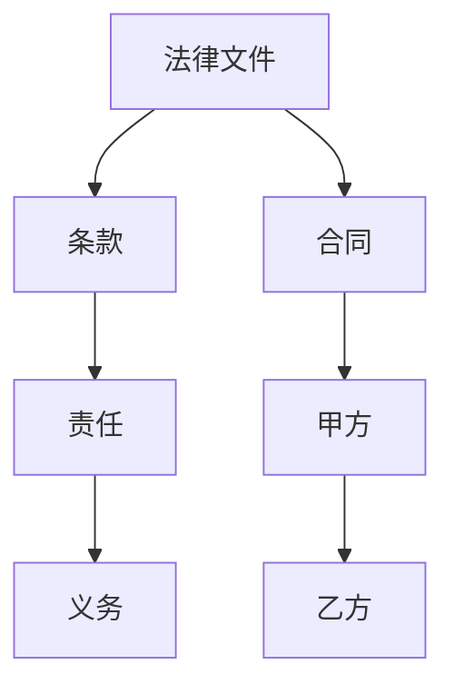
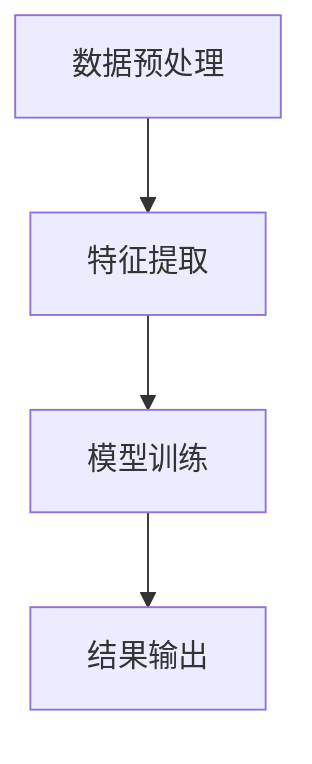
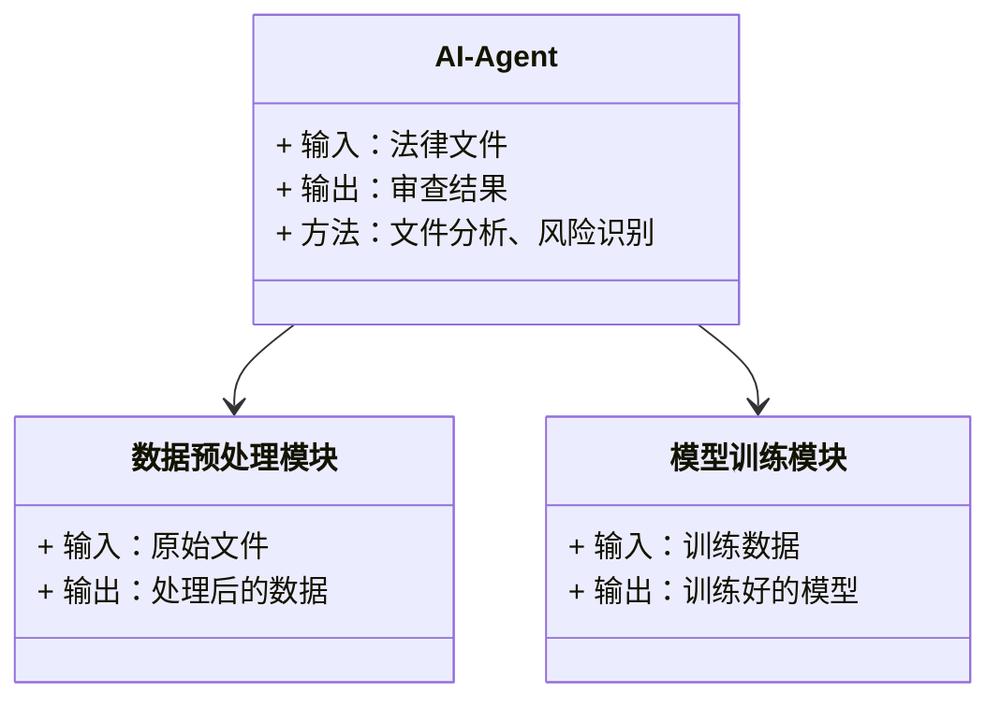
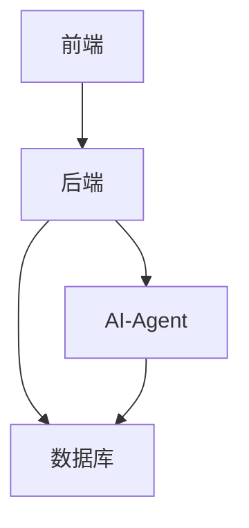
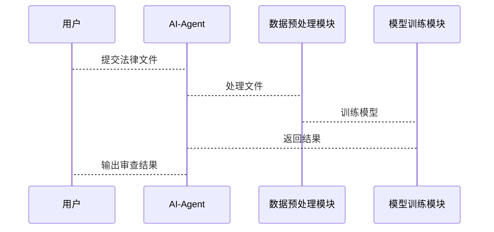

                 


# AI Agent在企业法律文件审查与风险识别中的自动化应用

## 关键词：AI Agent，法律文件审查，风险识别，自动化应用，自然语言处理，机器学习

## 摘要：本文详细探讨了AI Agent在企业法律文件审查与风险识别中的自动化应用。通过分析AI Agent的核心概念、算法原理、系统架构设计及项目实战，揭示了如何利用先进的自然语言处理和机器学习技术，实现法律文件的高效审查与风险识别。文章内容涵盖从背景介绍到系统实现的完整流程，并提供实际案例分析和最佳实践建议。

---

## 第一部分: AI Agent在企业法律文件审查与风险识别中的自动化应用概述

## 第1章: AI Agent与法律文件审查的背景介绍

### 1.1 AI Agent的基本概念

#### 1.1.1 什么是AI Agent
AI Agent（人工智能代理）是指能够感知环境并采取行动以实现目标的智能实体。在法律领域，AI Agent主要用于辅助法律专业人士进行文件分析、风险评估和决策支持。

#### 1.1.2 AI Agent的核心特征
- **自主性**：能够独立执行任务，无需人工干预。
- **反应性**：能够实时感知环境并做出反应。
- **学习能力**：通过机器学习模型不断优化自身的性能。
- **可解释性**：输出结果需要清晰可解释，以满足法律合规性要求。

#### 1.1.3 AI Agent在法律领域的优势
- **提高效率**：自动化处理大量法律文件，缩短审查时间。
- **减少错误**：通过算法降低人为错误，确保审查准确性。
- **降低成本**：减少对大量人力的依赖，降低企业运营成本。

### 1.2 法律文件审查的自动化需求

#### 1.2.1 传统法律文件审查的痛点
- **时间消耗大**：传统审查方式需要大量人工劳动，效率低下。
- **人为错误多**：由于主观因素和疲劳，审查结果可能出现错误。
- **成本高昂**：需要大量专业人员，增加了企业的运营成本。

#### 1.2.2 自动化审查的必要性
- **提升效率**：通过自动化技术快速处理大量法律文件。
- **降低成本**：减少对专业人员的依赖，降低企业运营成本。
- **确保合规性**：通过算法确保审查结果符合法律法规要求。

#### 1.2.3 AI Agent在法律文件审查中的应用前景
AI Agent在法律文件审查中的应用前景广阔，尤其是在合同审查、合规性检查和风险识别等领域。随着自然语言处理和机器学习技术的不断进步，AI Agent将变得更加智能化和高效化。

### 1.3 企业法律文件审查的场景分析

#### 1.3.1 合同审查场景
AI Agent可以自动分析合同中的条款，识别潜在风险点，如违约责任、知识产权问题等。

#### 1.3.2 法律合规性审查场景
AI Agent可以帮助企业确保其运营活动符合相关法律法规，避免法律纠纷。

#### 1.3.3 风险识别场景
通过分析企业内部和外部的法律文件，AI Agent可以识别潜在的法律风险，为企业决策提供支持。

---

## 第二部分: AI Agent的核心概念与原理

## 第2章: AI Agent的核心概念与联系

### 2.1 AI Agent的核心原理

#### 2.1.1 自然语言处理（NLP）在AI Agent中的应用
自然语言处理技术用于理解和生成人类语言，是AI Agent进行法律文件分析的基础。通过NLP技术，AI Agent能够从文本中提取关键信息，如合同条款、责任分配等。

#### 2.1.2 机器学习模型在AI Agent中的作用
机器学习模型用于训练AI Agent，使其能够从大量数据中学习并识别模式。监督学习、无监督学习和半监督学习等不同算法在法律文件审查中各有应用场景。

#### 2.1.3 知识图谱在法律文件分析中的应用
知识图谱用于构建法律领域的知识体系，帮助AI Agent更好地理解和关联法律概念，如法律条款、案例和术语等。

### 2.2 核心概念对比分析

#### 2.2.1 不同AI模型的对比分析表
| 模型类型       | 优点                         | 缺点                         |
|----------------|------------------------------|------------------------------|
| 监督学习模型     | 高准确性                     | 需大量标注数据               |
| 无监督学习模型   | 无需标注数据                 | 准确性较低                   |
| 半监督学习模型   | 结合监督和无监督学习           | 对部分标注数据依赖较大       |

#### 2.2.2 实体关系图（ER图）展示法律文件中的核心实体关系


---

## 第三部分: AI Agent的算法原理与实现

## 第3章: AI Agent的算法原理与实现

### 3.1 算法原理讲解

#### 3.1.1 算法工作流程


#### 3.1.2 算法实现代码示例
```python
# 示例代码：基于规则的AI Agent实现
def review_contract(text):
    # 提取关键信息
    keywords = ['违约责任', '知识产权', '保密条款']
    for keyword in keywords:
        if keyword in text:
            print(f"检测到{keyword}，请进一步审查。")
    return "合同审查完成。"
```

### 3.2 数学模型与公式

#### 3.2.1 损失函数
$$\text{损失函数} = -\frac{1}{m} \sum_{i=1}^{m} \text{标签预测结果} \cdot \ln(\text{预测概率})$$

#### 3.2.2 优化器
$$\text{优化器} = \text{Adam优化器}$$

---

## 第四部分: 系统分析与架构设计方案

## 第4章: 系统分析与架构设计

### 4.1 问题场景介绍
企业法务部门需要高效审查大量法律文件，包括合同、合规性文件等。传统方法效率低，容易出错，因此需要引入AI Agent进行自动化审查。

### 4.2 系统功能设计

#### 4.2.1 功能模块设计


### 4.3 系统架构设计

#### 4.3.1 系统架构图


### 4.4 接口设计与交互流程

#### 4.4.1 系统接口设计
- **输入接口**：接收法律文件并进行预处理。
- **输出接口**：返回审查结果和风险提示。

#### 4.4.2 交互流程图


---

## 第五部分: 项目实战

## 第5章: 项目实战

### 5.1 环境安装
- **安装Python**：确保Python 3.6或更高版本已安装。
- **安装必要的库**：如`numpy`、`pandas`、`scikit-learn`等。

### 5.2 系统核心实现

#### 5.2.1 核心代码实现
```python
# 示例代码：AI-Agent的核心实现
class AI-Agent:
    def __init__(self):
        self.models = {}

    def preprocess(self, text):
        # 数据预处理
        pass

    def train(self, data):
        # 模型训练
        pass

    def review(self, text):
        # 文件审查
        pass
```

#### 5.2.2 代码应用解读与分析
通过上述代码，AI-Agent能够实现法律文件的自动审查。`preprocess`方法对输入文本进行预处理，`train`方法训练模型，`review`方法执行审查并返回结果。

### 5.3 实际案例分析

#### 5.3.1 案例分析
- **案例背景**：审查一份商业合同。
- **AI-Agent行动**：提取关键条款，识别潜在风险点，生成审查报告。

#### 5.3.2 结果分析
AI-Agent在审查过程中发现了多个潜在风险点，如违约责任条款不明确、知识产权归属不清晰等，为法律人员提供了有力支持。

### 5.4 项目小结
通过本项目，我们展示了AI-Agent在法律文件审查中的强大能力。系统的实现不仅提高了审查效率，还显著降低了人为错误，为企业法务部门提供了有力支持。

---

## 第六部分: 最佳实践与总结

## 第6章: 最佳实践

### 6.1 最佳实践 tips
- **数据质量**：确保输入数据的准确性和完整性。
- **模型可解释性**：选择能够清晰解释结果的模型，避免“黑箱”问题。
- **持续优化**：定期更新模型，以适应法律法规的变化。

### 6.2 小结
本文详细探讨了AI-Agent在企业法律文件审查与风险识别中的应用，从背景介绍到系统实现，全面展示了其在法律领域的巨大潜力。

### 6.3 注意事项
- **数据隐私**：在处理敏感数据时，需严格遵守相关隐私保护法规。
- **模型泛化能力**：确保模型在不同场景下表现稳定。

### 6.4 拓展阅读
- 推荐书籍：《机器学习实战》、《自然语言处理入门》
- 推荐工具：Python的自然语言处理库（如spaCy）、机器学习框架（如Scikit-learn）

---

通过以上结构，本文系统地介绍了AI-Agent在企业法律文件审查与风险识别中的应用，为读者提供了从理论到实践的全面指导。

