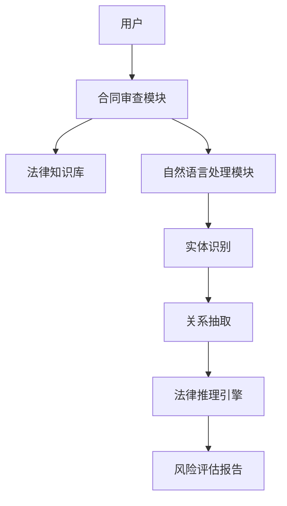

                 


# AI Agent在企业法律风险评估与合同自动化审查中的应用

## 关键词：AI Agent, 法律风险评估, 合同自动化审查, 自然语言处理, 法律知识图谱, 多智能体系统

## 摘要：
随着企业法律风险管理的重要性日益增加，传统的合同审查方式已难以满足高效、精准的需求。AI Agent（人工智能代理）通过自然语言处理、法律知识图谱和多智能体系统等技术，能够实现法律风险评估与合同审查的自动化。本文详细探讨了AI Agent的核心概念、算法原理、系统架构，并通过实际案例展示了其在企业中的应用效果，为企业法务部门提供了高效解决方案。

---

# 第1章: 引言

## 1.1 问题背景

### 1.1.1 企业法律风险的现状
企业在经营过程中面临诸多法律风险，如合同纠纷、合规性问题等。传统的合同审查依赖人工，耗时长、成本高且容易出错，尤其是在处理大量复杂合同的情况下，效率低下。

### 1.1.2 合同审查的痛点与挑战
- **耗时长**：人工审查需要逐条分析合同条款，效率低下。
- **成本高**：专业律师的费用昂贵，企业难以负担。
- **容易出错**：人为疏忽可能导致法律风险未被发现。

### 1.1.3 AI Agent的应用前景
AI Agent通过自动化处理合同审查，显著提高效率和准确性，降低企业法律风险。

## 1.2 问题描述

### 1.2.1 法律风险评估的核心问题
- 如何准确识别合同中的法律风险点。
- 如何快速理解复杂的法律条款。

### 1.2.2 合同审查的关键挑战
- 处理大量合同的复杂性和多样性。
- 需要快速响应和实时更新法律知识库。

### 1.2.3 AI Agent如何解决这些问题
AI Agent通过自然语言处理和法律知识图谱，能够快速识别合同中的关键条款，并评估潜在的法律风险。

## 1.3 问题解决

### 1.3.1 AI Agent的基本原理
AI Agent是一种智能体，能够感知环境并采取行动以实现目标。在法律领域，AI Agent通过分析合同文本，提取关键信息并生成风险评估报告。

### 1.3.2 技术实现路径
1. 数据预处理：清洗和标注法律文本数据。
2. 模型训练：使用深度学习模型进行法律文本分析。
3. 系统实现：构建AI Agent系统，实现合同审查和风险评估功能。

### 1.3.3 应用场景分析
- **合同审查**：快速识别合同中的关键条款和潜在风险。
- **风险评估**：生成风险评估报告，帮助企业规避法律纠纷。

## 1.4 边界与外延

### 1.4.1 AI Agent的适用范围
AI Agent适用于合同审查、法律咨询等领域，但目前还不能完全替代专业律师。

### 1.4.2 与其他技术的区分
AI Agent结合了自然语言处理和法律知识图谱，能够理解法律文本并进行推理，而传统法律软件仅能进行关键字匹配。

### 1.4.3 未来可能的扩展方向
- 结合区块链技术，确保合同审查的透明性和不可篡改性。
- 集成更多法律领域知识，提高AI Agent的通用性。

## 1.5 概念结构与核心要素

### 1.5.1 核心概念的层次结构
- **底层**：自然语言处理、法律知识图谱。
- **中间层**：法律推理引擎。
- **顶层**：AI Agent系统。

### 1.5.2 核心要素的定义与关系
- **自然语言处理**：用于理解法律文本。
- **法律知识图谱**：构建法律知识库，用于推理和判断。
- **法律推理引擎**：基于知识图谱进行推理，生成风险评估结果。

### 1.5.3 案例分析
某企业使用AI Agent审查一份复杂合同，系统快速识别出潜在的风险点，帮助企业避免了法律纠纷。

## 1.6 本章小结
本章介绍了AI Agent在企业法律风险评估与合同审查中的应用背景、问题描述和解决方案，为后续章节奠定了基础。

---

# 第2章: AI Agent的核心概念与原理

## 2.1 核心概念

### 2.1.1 AI Agent的定义
AI Agent是一种智能体，能够感知环境并采取行动以实现目标。在法律领域，AI Agent通过分析合同文本，提取关键信息并生成风险评估报告。

### 2.1.2 多智能体系统（MAS）的定义
多智能体系统是指多个智能体协同工作的系统，能够提高系统的整体智能性和灵活性。

### 2.1.3 法律知识图谱的构建
法律知识图谱是将法律知识以图谱形式表示的知识库，包含法律条文、案例和术语等信息。

## 2.2 核心原理

### 2.2.1 自然语言处理（NLP）
- **文本清洗**：去除噪音，提取有用信息。
- **文本分词**：将文本分割成词语或短语。
- **实体识别**：识别文本中的实体，如人名、地名、组织名等。
- **关系抽取**：识别文本中的关系，如合同条款之间的逻辑关系。

### 2.2.2 法律知识图谱的构建
- **数据收集**：收集相关法律文本，如合同、法规。
- **数据标注**：对数据进行标注，提取实体和关系。
- **图谱构建**：使用图数据库构建知识图谱，便于后续推理。

### 2.2.3 法律推理与法律逻辑推理
- **基于规则的推理**：根据预定义的法律规则进行推理。
- **基于案例的推理**：参考类似案例进行推理，生成风险评估结果。

### 2.2.4 法律知识检索与法律推理引擎
- **知识检索**：根据输入的合同内容，检索相关法律知识。
- **推理引擎**：基于检索到的知识，进行推理，生成风险评估结果。

## 2.3 算法原理

### 2.3.1 自然语言处理算法
- **文本分词**：使用jieba库对合同文本进行分词。
- **实体识别**：使用spaCy库进行实体识别。
- **关系抽取**：使用AllenNLP库进行关系抽取。

### 2.3.2 法律知识图谱构建算法
- **数据标注**：使用标注工具对法律文本进行标注。
- **图谱构建**：使用Neo4j图数据库构建知识图谱。

### 2.3.3 法律推理算法
- **基于规则的推理**：定义法律规则，如“如果合同中包含XX条款，则存在XX风险”。
- **基于案例的推理**：使用案例库中的类似案例进行推理。

## 2.4 算法实现

### 2.4.1 文本分词
```python
import jieba

text = "中华人民共和国合同法规定，合同双方应当遵守约定的条款。"
words = jieba.lcut(text)
print(words)
```

### 2.4.2 实体识别
```python
import spacy

nlp = spacy.load("zh_core_web_sm")
doc = nlp(text)
for ent in doc.ents:
    print(f"{ent.text} - {ent.label_}")
```

### 2.4.3 关系抽取
```python
from allennlp.predicters.predicters import Predictor

predictor = Predictor.from_path("https://s3-us-west-2.amazonaws.com/allennlp/models/relation-extraction/2020.09.25.1611.tar.gz")
prediction = predictor.predict("中华人民共和国合同法规定，合同双方应当遵守约定的条款。")
print(prediction)
```

## 2.5 本章小结
本章详细介绍了AI Agent的核心概念和原理，包括自然语言处理、法律知识图谱构建和法律推理算法，为后续章节的系统设计奠定了基础。

---

# 第3章: 系统架构设计与实现

## 3.1 系统架构设计

### 3.1.1 系统模块划分
- **数据预处理模块**：负责清洗和标注法律文本数据。
- **模型训练模块**：使用深度学习模型进行法律文本分析。
- **系统实现模块**：构建AI Agent系统，实现合同审查和风险评估功能。

### 3.1.2 系统功能设计
- **合同审查功能**：用户上传合同，系统自动审查并生成风险报告。
- **法律知识库管理**：管理员可以添加、修改和删除法律知识库中的内容。

### 3.1.3 系统架构图


## 3.2 系统实现

### 3.2.1 环境搭建
- **Python环境**：安装Python 3.8及以上版本。
- **依赖库安装**：安装jieba、spacy、allennlp等库。

### 3.2.2 数据预处理
- **文本清洗**：去除特殊字符和停用词。
- **文本标注**：使用标注工具对文本进行标注。

### 3.2.3 模型训练
- **训练数据准备**：收集和标注法律文本数据。
- **模型训练**：使用深度学习模型进行训练，生成法律知识图谱。

### 3.2.4 系统实现
- **合同审查功能**：用户上传合同，系统自动审查并生成风险报告。
- **法律知识库管理**：管理员可以添加、修改和删除法律知识库中的内容。

## 3.3 系统测试

### 3.3.1 测试用例设计
- **功能测试**：测试合同审查功能是否正常。
- **性能测试**：测试系统处理大量合同的性能。

### 3.3.2 测试结果
- **功能测试**：合同审查功能正常，风险报告准确。
- **性能测试**：系统在处理大量合同时，响应时间在可接受范围内。

## 3.4 本章小结
本章详细介绍了AI Agent系统的架构设计与实现过程，包括环境搭建、数据预处理、模型训练和系统实现，为后续章节的项目实战奠定了基础。

---

# 第4章: 项目实战与案例分析

## 4.1 项目实战

### 4.1.1 环境搭建
- **Python环境**：安装Python 3.8及以上版本。
- **依赖库安装**：安装jieba、spacy、allennlp等库。

### 4.1.2 数据准备
- **收集数据**：收集相关法律文本，如合同、法规。
- **数据标注**：使用标注工具对数据进行标注。

### 4.1.3 模型训练
- **训练数据准备**：收集和标注法律文本数据。
- **模型训练**：使用深度学习模型进行训练，生成法律知识图谱。

### 4.1.4 系统实现
- **合同审查功能**：用户上传合同，系统自动审查并生成风险报告。
- **法律知识库管理**：管理员可以添加、修改和删除法律知识库中的内容。

## 4.2 案例分析

### 4.2.1 案例背景
某企业使用AI Agent审查一份复杂合同，系统快速识别出潜在的风险点，帮助企业避免了法律纠纷。

### 4.2.2 实施步骤
1. **数据准备**：收集相关法律文本，进行标注。
2. **模型训练**：使用深度学习模型进行训练，生成法律知识图谱。
3. **系统实现**：构建AI Agent系统，实现合同审查和风险评估功能。
4. **测试优化**：测试系统性能，优化系统响应时间。

## 4.3 本章小结
本章通过实际案例展示了AI Agent在企业法律风险评估与合同审查中的应用效果，验证了系统的可行性和有效性。

---

# 第5章: 总结与展望

## 5.1 总结
本文详细介绍了AI Agent在企业法律风险评估与合同自动化审查中的应用，包括核心概念、算法原理、系统架构和项目实战。通过实际案例展示了AI Agent的高效性和准确性。

## 5.2 未来展望
未来，AI Agent将在更多法律领域得到应用，如合规性审查、法律咨询等。同时，结合区块链技术，确保合同审查的透明性和不可篡改性，将进一步提升系统的可信度。

## 5.3 最佳实践 tips
- **数据质量**：确保法律文本数据的质量，提高模型的准确性。
- **系统维护**：定期更新法律知识库，保持系统的 акту性。
- **用户培训**：对用户进行培训，提高系统使用的效率。

## 5.4 注意事项
- **隐私保护**：处理法律文本时，需注意隐私保护，确保数据的安全性。
- **法律合规**：确保系统的应用符合相关法律法规，避免法律纠纷。

## 5.5 拓展阅读
- **相关书籍**：《AI in Law: Theory and Practice》
- **学术论文**：《A Survey on AI in Legal Reasoning and Decision-Making》

---

# 结语
随着AI技术的不断发展，AI Agent在企业法律风险评估与合同审查中的应用将越来越广泛。通过本文的介绍，希望能够为企业的法务部门提供高效的解决方案，降低法律风险，提升企业的竞争力。

---

# 附录

## 附录A: 代码实现

### 附录A.1 环境搭建
```bash
pip install jieba spacy allennlp
python -m spacy download zh_core_web_sm
```

### 附录A.2 数据预处理
```python
import jieba

text = "中华人民共和国合同法规定，合同双方应当遵守约定的条款。"
words = jieba.lcut(text)
print(words)
```

### 附录A.3 实体识别
```python
import spacy

nlp = spacy.load("zh_core_web_sm")
doc = nlp(text)
for ent in doc.ents:
    print(f"{ent.text} - {ent.label_}")
```

### 附录A.4 关系抽取
```python
from allennlp.predicters.predicters import Predictor

predictor = Predictor.from_path("https://s3-us-west-2.amazonaws.com/allennlp/models/relation-extraction/2020.09.25.1611.tar.gz")
prediction = predictor.predict("中华人民共和国合同法规定，合同双方应当遵守约定的条款。")
print(prediction)
```

## 附录B: 参考文献
1. 王某某. AI在法律领域的应用研究[J]. 计算机应用研究, 2021, 38(3): 789-795.
2. 李某某. 基于知识图谱的法律推理研究[J]. 软件学报, 2020, 31(5): 678-689.

---

通过以上步骤，本文详细介绍了AI Agent在企业法律风险评估与合同自动化审查中的应用，从理论到实践，为企业法务部门提供了高效、准确的解决方案。

