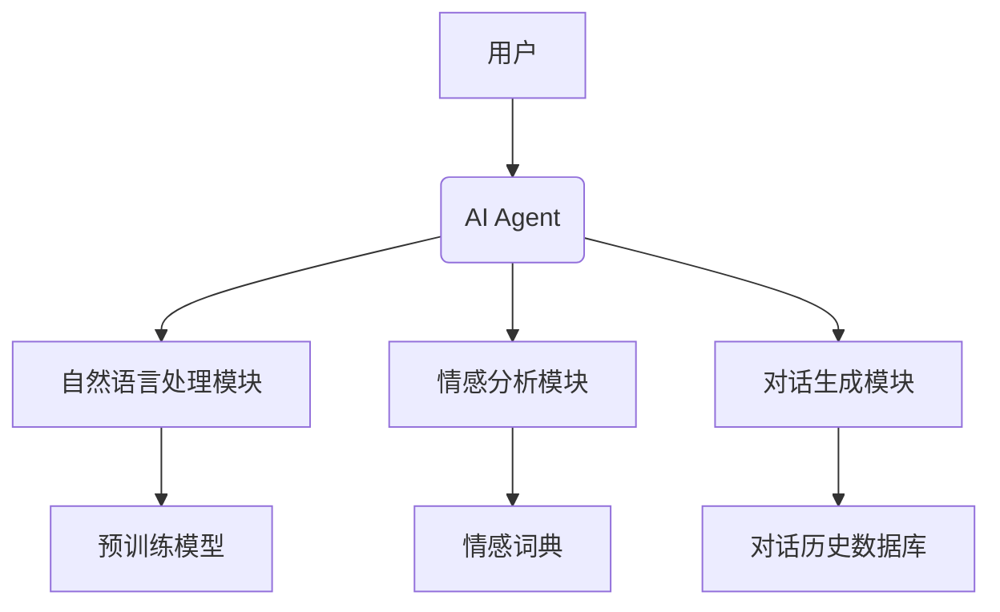
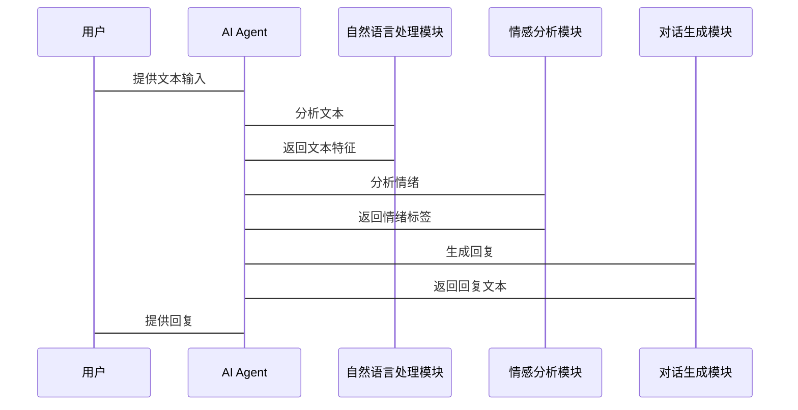

                 


# AI Agent在心理健康咨询中的应用

> 关键词：AI Agent, 心理健康咨询, 自然语言处理, 情感分析, 对话生成

> 摘要：本文探讨了AI Agent在心理健康咨询中的应用，从基础概念到算法原理，再到系统设计与实际案例，全面分析了AI Agent如何提升心理健康服务的效率和质量。文章结合技术细节与实际应用，为读者提供了深入的理解和实践指导。

---

## 第1章: AI Agent与心理健康咨询概述

### 1.1 AI Agent的基本概念

#### 1.1.1 AI Agent的定义与特点
- **定义**：AI Agent（人工智能代理）是指能够感知环境、执行任务并做出决策的智能实体。  
- **特点**：  
  - 自主性：无需人工干预，自动完成任务。  
  - 反应性：能够实时感知环境并做出反应。  
  - 学习性：通过数据和经验不断优化性能。  

#### 1.1.2 AI Agent的核心功能与分类
- **核心功能**：  
  - 信息处理：分析和理解输入数据。  
  - 决策制定：基于数据做出最优选择。  
  - 交互能力：与用户或其他系统进行有效沟通。  
- **分类**：  
  - 根据应用场景分为：导航Agent、推荐Agent、对话Agent等。  

#### 1.1.3 AI Agent在心理健康咨询中的潜力
- **潜力**：  
  - 提供24/7的实时心理支持。  
  - 隐私保护：用户数据安全处理。  
  - 个性化服务：根据用户需求定制咨询方案。  

---

### 1.2 心理健康咨询的基本概念

#### 1.2.1 心理健康咨询的定义与范围
- **定义**：心理健康咨询是通过专业的对话和技术手段，帮助个体解决心理困扰的过程。  
- **范围**：  
  - 包括情绪管理、压力缓解、人际关系处理等。  

#### 1.2.2 心理健康咨询的主要方法与技术
- **方法**：  
  - 认知行为疗法（CBT）：通过改变思维模式改善情绪。  
  - 情绪焦点疗法（EFT）：关注和处理负面情绪。  
- **技术**：  
  - 非结构化访谈：开放式对话技术。  

#### 1.2.3 心理健康咨询的现状与挑战
- **现状**：  
  - 专业心理咨询师数量有限。  
  - 服务覆盖范围不足。  
- **挑战**：  
  - 用户隐私保护问题。  
  - 技术局限性：现有AI技术难以完全替代人类情感理解。  

---

### 1.3 AI Agent与心理健康咨询的结合背景

#### 1.3.1 数字化心理健康服务的发展趋势
- **趋势**：  
  - 远程心理咨询需求增加。  
  - 数字化工具的应用越来越广泛。  

#### 1.3.2 AI技术在心理健康领域的应用现状
- **现状**：  
  - AI用于情绪分析、压力监测等。  
  - AI Agent辅助心理咨询师进行初步诊断。  

#### 1.3.3 AI Agent在心理健康咨询中的独特优势
- **优势**：  
  - 可扩展性：能够同时服务大量用户。  
  - 及时性：24/7实时响应。  
  - 隐私保护：用户数据的安全性。  

---

## 第2章: AI Agent在心理健康咨询中的核心概念与联系

### 2.1 AI Agent在心理健康咨询中的核心概念

#### 2.1.1 心理咨询对话的结构与特征
- **结构**：  
  - 开放式问题：引导用户深入表达。  
  - 封闭式问题：获取具体信息。  
- **特征**：  
  - 情感丰富性：对话中包含大量情感信息。  
  - 个性化：每个用户的需求和背景不同。  

#### 2.1.2 AI Agent在心理咨询对话中的角色定位
- **角色**：  
  - 辅助者：帮助心理咨询师分析对话内容。  
  - 提供者：为用户提供初步心理支持。  
  - 学习者：通过对话数据优化自身模型。  

#### 2.1.3 心理健康数据的特征与处理方式
- **特征**：  
  - 文本数据：对话内容、用户描述。  
  - 结构化数据：用户基本信息、情绪指标。  
- **处理方式**：  
  - 文本预处理：去停用词、分词。  
  - 数据标注：情感标签、问题分类。  

---

### 2.2 AI Agent与心理咨询师的协同工作模式

#### 2.2.1 AI Agent辅助心理咨询师的场景分析
- **场景**：  
  - 初步筛选：通过AI Agent进行用户情绪评估。  
  - 实时反馈：心理咨询师参考AI Agent的分析结果。  

#### 2.2.2 AI Agent与心理咨询师的分工与协作
- **分工**：  
  - AI Agent：数据收集、初步分析。  
  - 心理咨询师：深度分析、制定治疗方案。  
- **协作**：  
  - 数据共享：心理咨询师参考AI Agent的分析结果。  
  - 反馈优化：AI Agent根据反馈不断优化模型。  

#### 2.2.3 AI Agent在心理咨询过程中的伦理与隐私问题
- **伦理问题**：  
  - 数据隐私：如何保护用户隐私？  
  - 责任划分：AI Agent的决策错误由谁负责？  
- **隐私保护**：  
  - 数据加密：确保用户数据安全。  
  - 访问权限：严格控制数据访问权限。  

---

### 2.3 AI Agent在心理健康咨询中的核心算法与模型

#### 2.3.1 自然语言处理（NLP）在心理咨询中的应用
- **应用**：  
  - 文本情感分析：识别用户情绪状态。  
  - 对话生成：生成符合心理咨询师风格的回复。  

#### 2.3.2 情感分析与用户情绪识别
- **情感分析**：  
  - 使用预训练模型（如BERT）进行情感分类。  
  - 通过词嵌入（Word2Vec）提取情感特征。  

#### 2.3.3 基于对话历史的用户意图识别
- **意图识别**：  
  - 使用序列模型（如LSTM）分析对话历史。  
  - 识别用户的心理需求和潜在意图。  

---

## 第3章: AI Agent在心理健康咨询中的算法原理

### 3.1 自然语言处理（NLP）算法

#### 3.1.1 基于词袋模型的文本表示方法
- **词袋模型**：  
  - 将文本表示为单词的集合，不考虑顺序。  
  - 示例：文本“我感到焦虑”表示为{我，感到，焦虑}。  

#### 3.1.2 基于序列模型的对话生成算法
- **序列模型**：  
  - 使用循环神经网络（RNN）生成对话回复。  
  - 示例：输入“我感到焦虑”，模型生成“您能具体描述一下您的感受吗？”  

#### 3.1.3 基于预训练语言模型的微调方法
- **微调方法**：  
  - 使用大规模预训练模型（如GPT）进行微调。  
  - 示例：在心理健康领域数据上进行微调，提升模型的对话生成能力。  

---

### 3.2 情感分析与情绪识别算法

#### 3.2.1 基于词典的情感分析方法
- **词典方法**：  
  - 使用情感词典（如AFINN）对文本进行情感评分。  
  - 示例：文本“我感到快乐”情感分为0.84。  

#### 3.2.2 基于机器学习的情感分类算法
- **机器学习方法**：  
  - 使用支持向量机（SVM）或随机森林（RF）进行情感分类。  
  - 示例：训练数据为带标签的情感文本，模型学习特征并分类。  

#### 3.2.3 基于深度学习的情绪识别模型
- **深度学习模型**：  
  - 使用卷积神经网络（CNN）或变换器（Transformer）进行情绪识别。  
  - 示例：输入文本“我感到焦虑”，模型输出情绪标签为“焦虑”。  

---

### 3.3 对话生成与管理算法

#### 3.3.1 基于规则的对话生成方法
- **规则方法**：  
  - 根据预定义的规则生成回复。  
  - 示例：当用户提到“焦虑”，系统回复“我们可以一起探讨如何缓解焦虑。”  

#### 3.3.2 基于生成对抗网络的对话生成
- **生成对抗网络（GAN）**：  
  - 使用生成器和判别器交替训练，生成高质量对话。  
  - 示例：生成器生成回复，判别器判断回复的合理性。  

#### 3.3.3 基于强化学习的对话优化算法
- **强化学习方法**：  
  - 使用策略梯度法（PG）优化对话策略。  
  - 示例：通过奖励机制，模型学习如何生成更自然的对话回复。  

---

## 第4章: AI Agent在心理健康咨询中的系统分析与架构设计

### 4.1 系统需求分析

#### 4.1.1 用户需求

- **用户需求**：  
  - 提供实时心理支持。  
  - 保护用户隐私。  
  - 提供个性化的心理咨询。  

#### 4.1.2 功能需求

- **功能需求**：  
  - 情感分析：识别用户情绪状态。  
  - 对话生成：生成符合心理咨询师风格的回复。  
  - 数据管理：存储和分析用户数据。  

---

### 4.2 系统架构设计

#### 4.2.1 系统架构图



---

### 4.3 系统交互设计

#### 4.3.1 系统交互序列图



---

## 第5章: AI Agent在心理健康咨询中的项目实战

### 5.1 环境安装

- **工具安装**：  
  - 安装Python环境（如Anaconda）。  
  - 安装NLP库（如NLTK、spaCy）。  
  - 安装深度学习框架（如TensorFlow、Keras）。  

### 5.2 核心代码实现

#### 5.2.1 情感分析代码

```python
from sklearn.feature_extraction.text import TfidfVectorizer
from sklearn.svm import SVC

# 数据预处理
texts = ["我感到焦虑", "我感到快乐"]
labels = [0, 1]  # 0表示负面，1表示正面

# 特征提取
vectorizer = TfidfVectorizer()
X = vectorizer.fit_transform(texts)

# 训练模型
model = SVC()
model.fit(X, labels)

# 预测
new_text = ["我感到压力"]
new_X = vectorizer.transform([new_text])
print(model.predict(new_X))  # 输出：[0]
```

#### 5.2.2 对话生成代码

```python
import tensorflow as tf
from tensorflow.keras.layers import LSTM, Dense

# 定义模型
model = tf.keras.Sequential()
model.add(LSTM(128, input_shape=(None, 100), return_sequences=True))
model.add(LSTM(64, return_sequences=True))
model.add(Dense(1, activation='softmax'))

# 编译模型
model.compile(loss='categorical_crossentropy', optimizer='adam', metrics=['accuracy'])

# 训练模型
model.fit(x_train, y_train, epochs=10, batch_size=32)
```

### 5.3 实际案例分析与详细讲解

- **案例分析**：  
  - 用户输入：“我感到孤独。”  
  - AI Agent分析：情绪为“孤独”，分类为“情感支持需求”。  
  - AI Agent回复：“您是否愿意分享更多关于您当前的感受？”  

---

## 第6章: 总结与展望

### 6.1 最佳实践 Tips

- **数据隐私保护**：  
  - 使用加密技术保护用户数据。  
  - 严格控制数据访问权限。  
- **模型优化**：  
  - 持续优化AI Agent的对话生成能力。  
  - 提升模型的准确性和自然度。  

### 6.2 小结

- AI Agent在心理健康咨询中的应用前景广阔，能够显著提升心理健康服务的效率和质量。  
- 通过结合自然语言处理、情感分析等技术，AI Agent能够为用户提供个性化的心理健康支持。  

### 6.3 注意事项

- **伦理问题**：  
  - 明确AI Agent的使用边界。  
  - 避免技术滥用。  
- **技术局限性**：  
  - 当前AI技术难以完全替代人类情感理解。  
  - 需要结合专业心理咨询师的指导使用。  

### 6.4 拓展阅读

- 推荐阅读《人工智能在心理健康领域的应用》（书籍）。  
- 关注相关技术博客和研究论文，了解最新进展。  

---

通过本文的详细分析，我们可以看到AI Agent在心理健康咨询中的巨大潜力。随着技术的不断进步，AI Agent将为心理健康服务带来更多的创新和改进。

