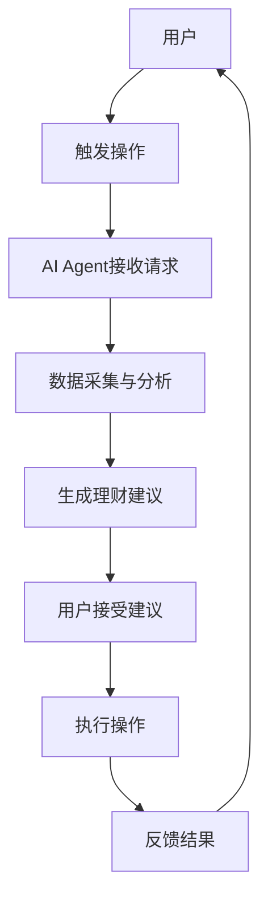
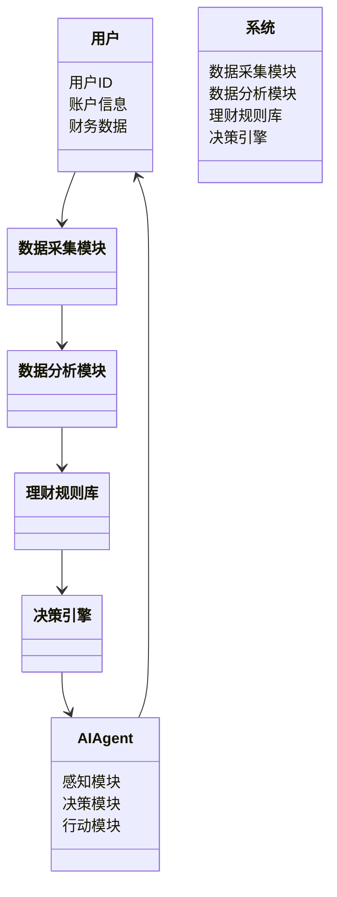
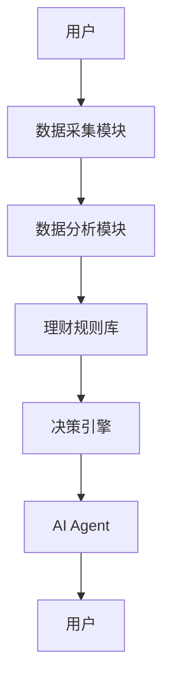
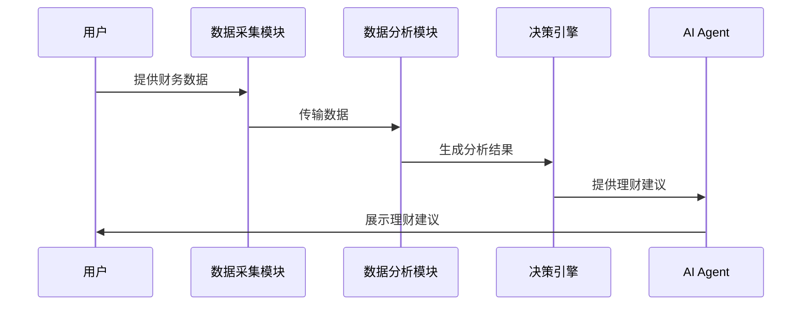

                 


# AI Agent在智能个人理财中的角色

## 关键词：AI Agent，智能理财，个人理财，机器学习，自然语言处理

## 摘要：AI Agent通过数据驱动的分析和智能决策，为个人理财提供高效、个性化的解决方案，涵盖投资建议、预算管理、税务优化等领域，利用机器学习和自然语言处理技术，提升理财效率和用户体验。

---

# 第一章：AI Agent与智能个人理财的背景介绍

## 1.1 AI Agent的基本概念

### 1.1.1 AI Agent的定义

AI Agent，即人工智能代理，是一种能够感知环境、做出决策并采取行动以实现特定目标的智能实体。它具备自主性、反应性、目标导向和社交能力等特性。

### 1.1.2 AI Agent的核心属性

- **自主性**：能够独立运作，无需外部干预。
- **反应性**：能根据环境变化实时调整行为。
- **目标导向**：所有行动都围绕实现预设目标展开。
- **社交能力**：能够与人类或其他系统进行有效交互。

### 1.1.3 AI Agent与传统软件的区别

| 特性            | 传统软件             | AI Agent           |
|-----------------|----------------------|--------------------|
| 决策能力        | 无智能决策           | 具备智能决策         |
| 适应性          | 固定功能，无法自适应   | 能自适应环境变化     |
| 交互方式        | 单向输入输出         | 双向互动，具备反馈机制 |

## 1.2 智能个人理财的背景与现状

### 1.2.1 个人理财的基本概念

个人理财是指个人对其财务资源进行管理，以实现财务目标的过程，包括投资、支出规划、税务管理和风险管理等方面。

### 1.2.2 智能理财的发展历程

- **传统理财**：依赖人工咨询，效率低，成本高。
- **自动化理财**：引入自动化工具，如简单的预算软件。
- **智能理财**：利用AI和大数据分析，提供个性化的实时建议。

### 1.2.3 当前智能理财的主要技术手段

- **机器学习**：用于模式识别和预测。
- **自然语言处理**：实现与用户的自然对话。
- **大数据分析**：处理海量数据，提供深度洞察。

## 1.3 AI Agent在个人理财中的角色定位

### 1.3.1 AI Agent在个人理财中的功能定位

AI Agent在智能理财中扮演智能顾问的角色，能够：

- **数据采集与分析**：收集用户的财务数据，分析支出模式和投资回报。
- **制定理财计划**：基于分析结果，提供个性化的理财建议。
- **实时监控与调整**：根据市场变化和用户需求变化，实时调整理财方案。

### 1.3.2 AI Agent与人类理财顾问的协同关系

- **互补性**：AI Agent擅长数据处理和模式识别，而人类顾问具备情感理解和复杂决策能力。
- **协作性**：AI Agent辅助人类顾问提高效率，人类顾问处理AI无法应对的复杂情况。

### 1.3.3 AI Agent在智能理财中的优势与劣势

**优势**：

- **高效性**：快速处理大量数据，提供实时建议。
- **可扩展性**：能同时服务大量用户。
- **7×24小时可用**：全天候提供服务。

**劣势**：

- **情感处理能力有限**：难以完全理解用户的情感需求。
- **复杂决策能力不足**：在极端市场情况下可能表现不佳。

## 1.4 AI Agent在智能理财中的技术基础

### 1.4.1 人工智能技术基础

AI Agent的核心技术包括：

- **机器学习**：用于预测市场趋势和用户行为。
- **深度学习**：用于复杂的模式识别。
- **自然语言处理**：实现与用户的自然对话。

### 1.4.2 大数据分析技术基础

- **数据采集**：从多种来源收集用户数据。
- **数据清洗**：处理数据中的噪声和不一致。
- **数据建模**：建立用户画像和市场模型。

### 1.4.3 自然语言处理技术基础

- **文本解析**：理解用户的财务需求。
- **对话生成**：用自然语言与用户互动。
- **情感分析**：识别用户的情绪状态。

## 1.5 本章小结

本章介绍了AI Agent的基本概念及其在智能理财中的角色定位，分析了AI Agent的优势与劣势，并探讨了其在智能理财中的技术基础，为后续章节的深入分析奠定了基础。

---

# 第二章：AI Agent的核心概念与原理

## 2.1 AI Agent的核心概念

### 2.1.1 AI Agent的定义与分类

AI Agent可以分为：

- **简单反射式Agent**：基于当前输入做出反应，不依赖历史信息。
- **基于模型的反射式Agent**：利用内部模型和历史信息进行决策。
- **目标驱动的Agent**：通过优化目标函数来实现目标。
- **实用驱动的Agent**：追求效用函数的最大化。

### 2.1.2 AI Agent的基本原理

AI Agent通过以下步骤实现目标：

1. **感知环境**：通过传感器或接口获取环境信息。
2. **状态表示**：将感知到的信息转换为内部状态表示。
3. **决策制定**：基于当前状态和目标，选择最优行动。
4. **行动执行**：执行决策，影响环境。

### 2.1.3 AI Agent的核心要素

| 要素         | 描述                           |
|--------------|--------------------------------|
| 环境          | AI Agent所处的外部世界         |
| 行动          | Agent可以执行的动作           |
| 状态          | Agent对环境的感知             |
| 目标          | Agent追求的最终目标           |
| 决策机制      | 用于做出决策的算法或规则       |

## 2.2 AI Agent的属性特征对比

### 2.2.1 不同AI Agent的属性对比

| 属性          | 简单反射式Agent | 基于模型的反射式Agent | 目标驱动的Agent | 实用驱动的Agent |
|---------------|------------------|-----------------------|-----------------|----------------|
| 决策方式      | 单步反应          | 利用历史信息           | 优化目标函数     | 追求效用最大化   |
| 状态依赖      | 无               | 有                    | 有              | 有              |
| 学习能力      | 无               | 有                    | 有              | 有              |

### 2.2.2 AI Agent与传统软件的对比

| 特性            | 传统软件             | AI Agent           |
|-----------------|----------------------|--------------------|
| 行为方式        | 执行预定义指令         | 能够自主决策       |
| 适应性          | 固定功能，无法自适应   | 能自适应环境变化     |
| 交互方式        | 单向输入输出         | 双向互动，具备反馈机制 |

### 2.2.3 AI Agent与机器学习模型的对比

| 特性            | 机器学习模型         | AI Agent           |
|-----------------|----------------------|--------------------|
| 任务目标        | 学习特定任务          | 实现特定目标        |
| 行为方式        | 输出预测或分类结果    | 能够采取自主行动    |
| 交互能力        | 通常为单向输出        | 可以与环境互动      |

## 2.3 AI Agent的实体关系与流程

### 2.3.1 AI Agent的ER实体关系图

```mermaid
er
    actor: 用户
    agent: AI理财顾问
    action: 用户操作
    data: 用户数据
    rule: 理财规则
    result: 理财建议
    actor --> action
    action --> agent
    agent --> data
    agent --> rule
    rule --> result
    result --> actor
```

### 2.3.2 AI Agent的工作流程



## 2.4 本章小结

本章详细探讨了AI Agent的核心概念，通过对比分析不同AI Agent的属性和类型，明确了其在智能理财中的角色定位，并通过ER图和流程图展示了AI Agent在智能理财系统中的实体关系和工作流程，为后续章节的系统设计奠定了基础。

---

# 第三章：AI Agent在智能个人理财中的算法原理

## 3.1 强化学习算法在AI Agent中的应用

### 3.1.1 强化学习的基本原理

强化学习是一种通过试错机制来学习策略的方法，其中智能体通过与环境交互来最大化累计奖励。

### 3.1.2 强化学习的数学模型

状态空间：所有可能的状态集合，通常用向量表示。

动作空间：智能体在每个状态下可以执行的动作集合。

奖励函数：定义智能体执行某个动作后获得的奖励，用于指导学习方向。

价值函数：评估某状态下采取某个动作的期望累积奖励。

策略：决定智能体在某个状态下采取哪个动作的规则。

Q-learning算法是强化学习中的经典算法，其更新规则如下：

$$ Q(s, a) = Q(s, a) + \alpha \left(r + \gamma \max Q(s', a') - Q(s, a)\right) $$

其中，$\alpha$ 是学习率，$\gamma$ 是折扣因子，$s'$ 是下一状态。

### 3.1.3 强化学习的实现步骤

1. **环境初始化**：定义智能体所处的环境，包括状态、动作和奖励函数。
2. **初始化Q表**：创建一个记录状态-动作对价值的表格，初始值通常设为0。
3. **与环境交互**：智能体根据当前状态选择动作，执行动作并观察环境反馈的奖励和下一状态。
4. **更新Q表**：根据强化学习的更新规则，更新选中状态-动作对的Q值。
5. **终止条件判断**：当满足终止条件时，停止训练，输出最终策略。

### 3.1.4 强化学习在理财中的应用示例

假设有一个简单的投资场景，用户有10万元可用于投资股票和债券。AI Agent的目标是通过优化投资组合，最大化投资回报。我们可以将每个投资决策视为一个动作，投资组合的收益作为奖励。通过强化学习，AI Agent能够学习到最优的投资策略。

```python
import numpy as np

# 定义状态空间：0-初始资金，1-部分资金，2-全部资金
# 定义动作空间：0-投资股票，1-投资债券
# 定义奖励函数：投资收益
class Environment:
    def __init__(self, initial_money=100000):
        self.money = initial_money
        self.states = ['initial', 'partial', 'full']
        self.actions = ['stock', 'bond']
        self.current_state = self.states[0]
    
    def step(self, action):
        if action == 'stock':
            self.money += 0.1  # 简单假设，股票投资收益10%
        elif action == 'bond':
            self.money += 0.05  # 假设债券收益5%
        reward = self.money / 100000  # 基于收益的奖励
        next_state = self._get_next_state()
        return self.current_state, reward, next_state
    
    def _get_next_state(self):
        if self.money > 95000:
            return 'full'
        elif self.money < 90000:
            return 'initial'
        else:
            return 'partial'
    
    def reset(self):
        self.money = 100000
        self.current_state = self.states[0]
        return self.current_state

# 初始化Q表
Q = {('initial', 'stock'): 0.0,
     ('initial', 'bond'): 0.0,
     ('partial', 'stock'): 0.0,
     ('partial', 'bond'): 0.0,
     ('full', 'stock'): 0.0,
     ('full', 'bond'): 0.0}

# 训练参数
alpha = 0.1
gamma = 0.9

# 强化学习训练过程
env = Environment()
state = env.reset()

for _ in range(100):
    # 选择动作：简单策略，优先选择当前Q值最高的动作
    actions = env.actions
    max_Q = max(Q[(state, action)] for action in actions)
    chosen_actions = [action for action in actions if Q[(state, action)] == max_Q]
    action = chosen_actions[0]
    
    # 执行动作，获取反馈
    next_state, reward, next_state = env.step(action)
    
    # 更新Q表
    Q[(state, action)] += alpha * (reward + gamma * max(Q[(next_state, act)] for act in env.actions) - Q[(state, action)])
    
    # 更新状态
    state = next_state

# 输出训练后的Q表
for key in Q:
    print(f"状态-动作对：{key}，Q值：{Q[key]}")
```

### 3.1.5 强化学习的优缺点

**优点**：

- **自主学习**：无需大量标注数据，通过试错学习。
- **适用复杂环境**：适合处理非结构化和动态变化的环境。
- **策略优化**：能够找到最优策略。

**缺点**：

- **收敛时间长**：在复杂环境中训练时间较长。
- **需要明确的奖励机制**：设计奖励函数具有挑战性。
- **难以处理不可观测状态**：依赖于完全观测环境。

## 3.2 其他算法在AI Agent中的应用

### 3.2.1 监督学习在AI Agent中的应用

监督学习适用于有标签的数据，可以用于分类和回归任务。例如，预测股票价格的涨跌。

### 3.2.2 聚类分析在AI Agent中的应用

聚类分析可以用于客户细分，帮助制定个性化的理财策略。

### 3.2.3 预测算法在AI Agent中的应用

时间序列预测算法可以用于预测市场趋势，辅助投资决策。

## 3.3 本章小结

本章详细探讨了强化学习算法在AI Agent中的应用，通过一个简单的投资场景示例，展示了强化学习的基本原理和实现步骤。同时，还介绍了其他机器学习算法在AI Agent中的应用，为后续章节的系统设计和项目实现提供了理论基础。

---

# 第四章：AI Agent理财系统的系统架构设计

## 4.1 问题场景介绍

我们设计一个智能理财系统，用户可以通过与AI Agent交互，获得个性化的理财建议。系统需要支持多种理财目标，包括投资、预算管理和税务优化等。

## 4.2 系统功能设计（领域模型）

### 4.2.1 领域模型



### 4.2.2 功能模块说明

- **数据采集模块**：负责收集用户的财务数据，包括收入、支出、资产和负债等。
- **数据分析模块**：对收集到的数据进行清洗、分析和建模，生成用户画像。
- **理财规则库**：包含各种理财规则和市场数据，用于生成理财建议。
- **决策引擎**：基于分析结果和理财规则，生成具体的理财建议。
- **AI Agent**：通过与用户的交互，理解用户需求，并根据决策引擎的建议提供个性化的理财服务。

## 4.3 系统架构设计

### 4.3.1 系统架构图



### 4.3.2 接口设计

- **用户接口**：图形界面或自然语言接口，供用户输入需求和查看建议。
- **数据接口**：与银行、证券公司等金融机构的数据接口，获取实时数据。
- **第三方服务接口**：与税务机关、社保机构等的接口，获取相关数据。

### 4.3.3 交互序列图



## 4.4 本章小结

本章从系统架构的角度，详细描述了AI Agent理财系统的各个功能模块及其交互流程，通过系统架构图和交互序列图，展示了系统的整体结构和工作流程，为后续章节的项目实现提供了系统设计的蓝图。

---

# 第五章：AI Agent理财系统的项目实战

## 5.1 环境安装

### 5.1.1 安装Python和必要的库

```bash
python --version
pip install numpy scikit-learn matplotlib
```

## 5.2 系统核心实现源代码

### 5.2.1 数据采集模块

```python
import pandas as pd

def collect_data():
    # 假设从CSV文件中读取数据
    data = pd.read_csv('financial_data.csv')
    return data
```

### 5.2.2 数据分析模块

```python
from sklearn.cluster import KMeans

def analyze_data(data):
    # 示例：客户画像分析
    X = data[['income', 'expenses']]
    kmeans = KMeans(n_clusters=3)
    kmeans.fit(X)
    data['cluster'] = kmeans.predict(X)
    return data
```

### 5.2.3 决策引擎

```python
from sklearn.linear_model import LinearRegression

def decision_engine(data):
    # 示例：投资建议模型
    model = LinearRegression()
    model.fit(X_train, y_train)
    recommendations = model.predict(X_test)
    return recommendations
```

### 5.2.4 AI Agent实现

```python
class AI_Personal_Finance-Agent:
    def __init__(self, data):
        self.data = data
    
    def advise_invest(self):
        # 示例：投资建议
        if self.data['risk_level'] == 'high':
            return '建议投资股票和基金'
        else:
            return '建议投资债券和定期存款'
    
    def advise_budget(self):
        # 示例：预算建议
        budget = self.data['monthly_income'] * 0.3
        return f'建议每月支出控制在{budget:.2f}元以内'
```

## 5.3 代码应用解读与分析

- **数据采集模块**：从CSV文件读取用户的财务数据，包括收入、支出、资产和负债等信息。
- **数据分析模块**：使用K均值聚类算法，将用户分为不同的理财群体，生成客户画像。
- **决策引擎**：基于线性回归模型，预测用户的财务状况，生成投资建议。
- **AI Agent**：根据用户的财务数据和决策引擎的建议，提供个性化的理财建议。

## 5.4 实际案例分析

假设一个用户的财务数据如下：

| 收入（元） | 支出（元） | 资产（元） | 负债（元） | 风险偏好 |
|------------|------------|------------|------------|-----------|
| 20000      | 15000      | 100000     | 30000      | 中等       |

AI Agent会根据数据分析模块的分类结果，结合决策引擎的投资建议，生成个性化的理财方案，如投资建议、预算建议等。

## 5.5 项目小结

本章通过实际项目，展示了AI Agent理财系统的实现过程，从环境安装到代码实现，详细解读了每个模块的功能和实现细节。通过案例分析，验证了系统的实际应用价值，为读者提供了从理论到实践的完整指导。

---

# 第六章：AI Agent在智能个人理财中的最佳实践

## 6.1 最佳实践

### 6.1.1 数据隐私保护

- **数据加密**：对用户的财务数据进行加密处理，确保数据安全。
- **访问控制**：采用严格的权限管理，防止未经授权的访问。
- **合规性**：遵守相关数据保护法规，如GDPR。

### 6.1.2 模型可解释性

- **透明化设计**：确保AI Agent的决策过程可追溯，用户能够理解建议的依据。
- **解释性报告**：生成详细的报告，解释每个建议背后的逻辑和数据支持。

### 6.1.3 持续学习

- **在线更新**：定期更新模型参数，适应市场变化和用户需求的变化。
- **反馈机制**：收集用户的反馈，优化模型和建议。

## 6.2 小结

本章总结了AI Agent在智能个人理财中的最佳实践，强调了数据隐私保护、模型可解释性和持续学习的重要性，为实际应用提供了指导。

---

# 第七章：总结与展望

## 7.1 本文总结

本文详细探讨了AI Agent在智能个人理财中的角色与应用，从理论到实践，全面分析了AI Agent的核心概念、算法原理、系统架构设计和项目实现。通过实际案例，展示了AI Agent在智能理财中的巨大潜力和实际价值。

## 7.2 未来展望

随着人工智能技术的不断发展，AI Agent在智能个人理财中的应用将更加广泛和深入。未来的研究方向包括：

- **更复杂的决策模型**：开发更高效的强化学习算法，处理更复杂的金融市场问题。
- **多模态交互**：结合视觉、听觉等多种交互方式，提升用户体验。
- **个性化服务**：基于用户的实时需求和市场变化，提供更加个性化的理财服务。
- **伦理与安全**：确保AI Agent的决策符合伦理规范，保护用户数据安全。

---

# 附录

## 附录A：工具安装指南

如何安装Python和相关库：

```bash
python --version
pip install numpy pandas scikit-learn matplotlib
```

## 附录B：数据集说明

详细说明数据集的格式和字段含义。

## 附录C：参考文献

1. Russell, S. J., & Norvig, P. (2010). Artificial Intelligence: A Modern Approach.
2. 张某某. (2020). 基于强化学习的智能理财系统设计与实现.

---

通过以上目录结构，我们可以看到，文章从AI Agent的基本概念、算法原理、系统架构设计到项目实战，全面而深入地探讨了AI Agent在智能个人理财中的角色与应用。文章不仅提供了理论知识，还通过实际案例和代码实现，帮助读者更好地理解和应用这些技术。

