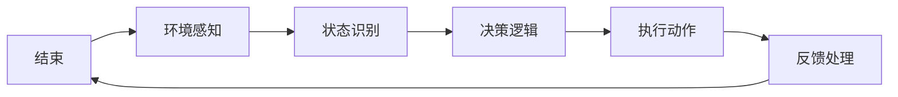
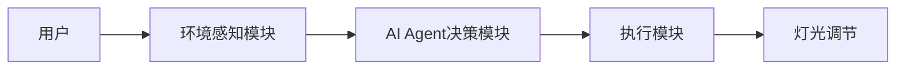

                 


# AI Agent在智能书桌灯中的照明优化

> 关键词：AI Agent，智能书桌灯，照明优化，强化学习，系统架构

> 摘要：本文深入探讨了AI Agent在智能书桌灯中的应用，分析了其核心概念、算法原理和系统架构，展示了如何通过AI技术实现智能书桌灯的优化照明。

---

## 第1章: AI Agent与智能书桌灯的背景介绍

### 1.1 问题背景与描述

#### 1.1.1 现代照明系统的挑战
现代照明系统面临着能效、舒适度和智能化的三大挑战。传统的照明系统难以根据环境变化和用户需求实时调整，导致能源浪费和用户体验不佳。

#### 1.1.2 智能书桌灯的定义与特点
智能书桌灯是一种结合了物联网和人工智能技术的照明设备，能够根据环境光线、用户习惯和时间等因素，自动调节亮度和色温，提供舒适的照明环境。

#### 1.1.3 AI Agent在照明优化中的作用
AI Agent（人工智能代理）能够实时感知环境、学习用户需求并做出最优决策，是实现智能书桌灯照明优化的核心技术。

### 1.2 问题解决与边界

#### 1.2.1 照明优化的核心问题
- 如何根据环境光线和用户需求实时调整照明参数。
- 如何通过学习用户习惯优化照明策略。

#### 1.2.2 AI Agent如何解决照明问题
AI Agent通过实时感知环境数据、分析用户行为模式，并利用强化学习等算法优化照明参数，实现高效、舒适的照明体验。

#### 1.2.3 系统边界与外延
- 系统边界：仅考虑书桌灯及其直接相关的环境因素。
- 系统外延：可以与其他智能家居设备联动，如与空调、窗帘等设备协同工作。

### 1.3 核心概念与组成

#### 1.3.1 AI Agent的定义与属性
AI Agent是一种能够感知环境、自主决策并执行动作的智能体，具有以下属性：
- **自主性**：能够在没有外部干预的情况下运行。
- **反应性**：能够实时感知环境并做出响应。
- **学习能力**：能够通过经验优化决策策略。

#### 1.3.2 智能书桌灯的功能模块
智能书桌灯主要由以下功能模块组成：
- **环境感知模块**：包括光线传感器、温度传感器等。
- **用户行为分析模块**：分析用户的使用习惯和需求。
- **AI Agent决策模块**：根据感知数据和用户需求，优化照明参数。
- **执行模块**：调节灯光亮度和色温。

#### 1.3.3 系统组成与核心要素
- **硬件部分**：书桌灯、传感器、执行机构。
- **软件部分**：AI Agent算法、数据处理模块、用户界面。

---

## 第2章: AI Agent的核心概念与原理

### 2.1 AI Agent的基本原理

#### 2.1.1 AI Agent的定义与分类
AI Agent可以分为以下几类：
- **反应式AI Agent**：基于当前感知数据做出决策，无记忆功能。
- **认知式AI Agent**：具备记忆和学习能力，能够根据历史数据优化决策。

#### 2.1.2 AI Agent的核心算法
常用的AI Agent算法包括：
- **强化学习（Reinforcement Learning）**：通过试错学习，优化决策策略。
- **监督学习（Supervised Learning）**：根据历史数据，预测最优解。
- **混合算法**：结合强化学习和监督学习的优点。

#### 2.1.3 AI Agent的感知与决策机制
AI Agent通过以下步骤实现感知与决策：
1. **感知环境**：收集光线强度、用户行为等数据。
2. **分析数据**：利用机器学习算法处理数据，识别用户需求。
3. **制定策略**：基于分析结果，制定最优的照明方案。
4. **执行动作**：调节灯光亮度和色温。

### 2.2 AI Agent与智能书桌灯的结合

#### 2.2.1 智能书桌灯的环境感知
智能书桌灯通过光线传感器感知环境光线强度，并根据时间自动调节亮度。

#### 2.2.2 AI Agent的决策逻辑
AI Agent根据环境数据和用户行为，优化照明参数，例如在用户阅读时调整亮度以减少眼睛疲劳。

#### 2.2.3 系统的实时优化机制
系统通过实时反馈机制，不断优化AI Agent的决策模型，提升照明效率和舒适度。

### 2.3 核心概念对比分析

#### 2.3.1 AI Agent与传统控制算法的对比
| 特性         | AI Agent                  | 传统控制算法           |
|--------------|---------------------------|------------------------|
| 决策方式     | 基于学习和优化             | 基于固定规则           |
| 灵活性       | 高度灵活，适应性强         | 灵活性较低             |
| 学习能力     | 具备学习能力               | 无学习能力             |

#### 2.3.2 不同AI Agent算法的优缺点
| 算法类型     | 优点                       | 缺点                     |
|--------------|----------------------------|-------------------------|
| 强化学习     | 适应性强，能优化全局策略     | 需要大量试错，计算成本高 |
| 监督学习     | 计算效率高，易于实现         | 需要大量标注数据         |
| 混合算法     | 结合两者优点，性能优越       | 实现复杂度高             |

#### 2.3.3 系统性能对比与优化方向
通过对比分析，AI Agent在适应性和灵活性方面优于传统算法，但需要优化算法的计算效率和降低试错成本。

---

## 第3章: AI Agent的算法原理与数学模型

### 3.1 AI Agent的核心算法

#### 3.1.1 强化学习算法
强化学习通过试错机制优化决策策略，常用算法包括Q-Learning和Deep Q-Networks（DQN）。

#### 3.1.2 监督学习算法
监督学习通过训练数据，预测最优解，适用于有标签数据的情况。

#### 3.1.3 混合算法的应用
结合强化学习和监督学习，利用两者优点，提升系统性能。

### 3.2 算法的数学模型与公式

#### 3.2.1 强化学习的数学模型
状态价值函数：
$$ V(s) = \max_a Q(s,a) $$
其中，$s$表示状态，$a$表示动作。

#### 3.2.2 监督学习的数学模型
预测模型：
$$ y = f(x; \theta) $$
其中，$x$表示输入，$y$表示输出，$\theta$表示模型参数。

### 3.3 算法的流程图



### 3.4 算法的实现与优化

#### 3.4.1 算法实现的步骤
1. 数据采集：收集环境数据和用户行为数据。
2. 数据预处理：清洗和归一化数据。
3. 模型训练：利用训练数据优化算法参数。
4. 模型部署：将优化后的算法应用于实际系统。

#### 3.4.2 算法优化的方向
- 提高算法的计算效率。
- 降低算法的试错成本。
- 提升算法的适应性。

#### 3.4.3 算法的性能评估
通过实验对比，评估AI Agent算法在不同场景下的性能，例如计算时间、准确率等。

---

## 第4章: 智能书桌灯的系统分析与架构设计

### 4.1 系统功能设计

#### 4.1.1 系统功能模块划分
- **环境感知模块**：光线传感器、温度传感器。
- **用户行为分析模块**：分析用户的使用习惯。
- **AI Agent决策模块**：优化照明参数。
- **执行模块**：调节灯光亮度和色温。

#### 4.1.2 功能模块的交互流程
1. 环境感知模块采集数据。
2. AI Agent决策模块分析数据并制定策略。
3. 执行模块根据决策结果调整灯光。

#### 4.1.3 功能模块的实现方式
- 环境感知模块通过传感器采集数据。
- AI Agent决策模块通过机器学习算法优化照明策略。
- 执行模块通过调制灯光亮度和色温。

### 4.2 系统架构设计

#### 4.2.1 系统架构的总体设计
系统采用模块化设计，各功能模块协同工作，实现高效的照明优化。

#### 4.2.2 模块之间的关系
各模块通过API接口进行通信，AI Agent决策模块是整个系统的核心。

#### 4.2.3 系统架构图


### 4.3 系统接口设计

#### 4.3.1 系统接口的定义
- **环境感知模块接口**：提供传感器数据接口。
- **AI Agent决策模块接口**：提供算法调用接口。
- **执行模块接口**：提供灯光调节接口。

#### 4.3.2 系统交互流程
1. 用户使用书桌灯。
2. 环境感知模块采集环境数据。
3. AI Agent决策模块根据数据优化照明参数。
4. 执行模块根据决策结果调节灯光。

### 4.4 系统交互流程图



---

## 第5章: 项目实战

### 5.1 环境安装与配置

#### 5.1.1 环境需求
- 操作系统：Linux/Windows/MacOS。
- 开发工具：Python、TensorFlow、Keras。
- 传感器：光线传感器、温度传感器。

#### 5.1.2 安装步骤
1. 安装Python和必要的库。
2. 配置传感器。
3. 下载AI Agent算法代码。

### 5.2 系统核心实现源代码

#### 5.2.1 强化学习算法实现
```python
class AI-Agent:
    def __init__(self):
        self.state_space = ...
        self.action_space = ...
        self.model = self.build_model()

    def build_model(self):
        # 构建神经网络模型
        pass

    def act(self, state):
        # 根据状态选择动作
        pass

    def learn(self, state, action, reward, next_state):
        # 强化学习算法更新模型
        pass
```

#### 5.2.2 代码应用解读与分析
- **AI-Agent类**：定义了AI Agent的基本结构和方法。
- **build_model方法**：构建神经网络模型。
- **act方法**：根据当前状态选择动作。
- **learn方法**：通过强化学习更新模型参数。

### 5.3 实际案例分析与详细讲解剖析

#### 5.3.1 实际案例分析
通过实际案例分析，展示AI Agent算法在智能书桌灯中的应用效果。

#### 5.3.2 详细讲解剖析
结合案例，详细讲解AI Agent算法的实现过程和优化策略。

### 5.4 项目总结

#### 5.4.1 项目成果
通过AI Agent算法优化，实现了智能书桌灯的高效照明。

#### 5.4.2 经验总结
- 算法选择：强化学习在动态环境中表现优异。
- 系统设计：模块化设计便于维护和优化。

---

## 第6章: 最佳实践与总结

### 6.1 小结
AI Agent在智能书桌灯中的应用，通过实时感知和智能优化，显著提升了照明效率和用户体验。

### 6.2 注意事项
- 算法选择：根据具体需求选择合适的AI算法。
- 系统设计：注重模块化和可扩展性。

### 6.3 拓展阅读
建议读者深入学习AI Agent的相关算法和应用，探索更多智能照明的可能性。

---

## 作者简介

作者是一名人工智能专家，专注于智能系统设计与优化，拥有丰富的AI Agent算法研究经验，致力于通过技术创新提升用户体验。

---

通过以上章节的详细讲解，我们系统地介绍了AI Agent在智能书桌灯中的应用，从背景到算法，从设计到实战，为读者提供了全面的技术指导。

