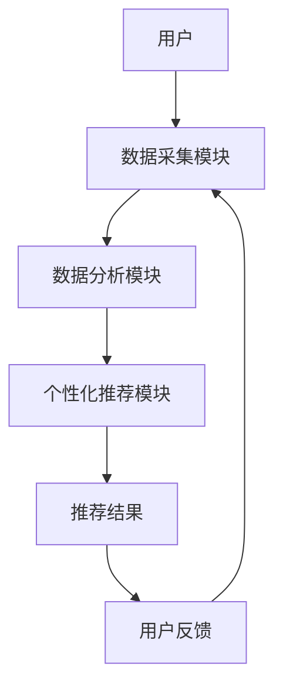
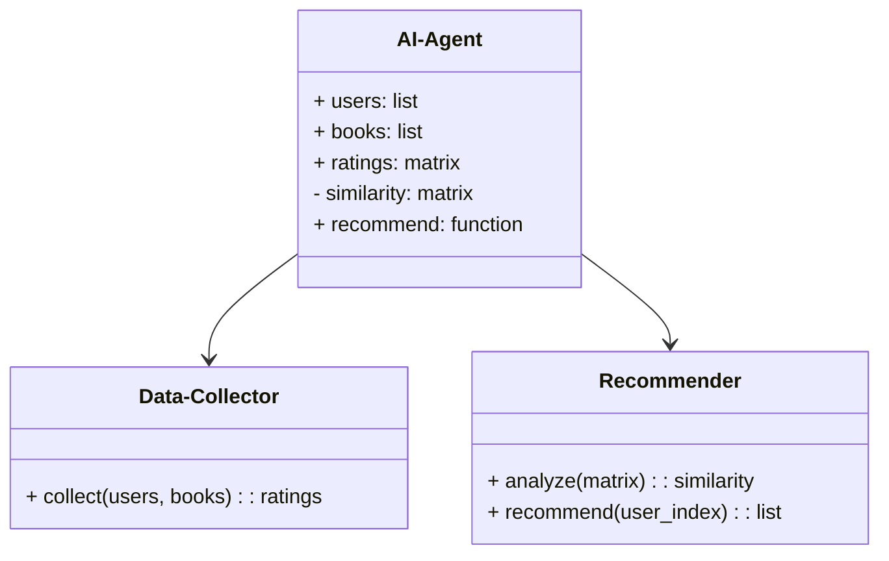

                 


# AI Agent在智能书签中的阅读习惯分析

## 关键词：AI Agent，阅读习惯分析，智能书签，机器学习，数据挖掘

## 摘要：
本文探讨了AI Agent在智能书签中的应用，重点分析其如何通过机器学习和数据挖掘技术，解析用户的阅读习惯。文章从AI Agent的基本概念入手，详细阐述阅读习惯分析的原理和算法，结合系统架构设计和项目实战，展示了AI技术在提升阅读体验中的潜力。通过对协同过滤、聚类分析等算法的深入探讨，本文揭示了AI Agent在智能书签中的实际应用价值，并提出了未来的发展方向。

---

# 第1章 AI Agent与智能书签的背景介绍

## 1.1 AI Agent的基本概念与特点

### 1.1.1 AI Agent的定义
AI Agent（人工智能代理）是指能够感知环境并采取行动以实现目标的智能实体。它可以理解输入信息、做出决策并执行操作，具备自主性和适应性。

### 1.1.2 AI Agent的核心特点
- **自主性**：能够独立执行任务，无需外部干预。
- **反应性**：能够实时感知环境并做出反应。
- **目标导向**：所有行动都围绕特定目标展开。
- **学习能力**：通过数据和经验不断优化自身行为。

### 1.1.3 AI Agent与传统软件的区别
| 特性 | AI Agent | 传统软件 |
|------|----------|----------|
| 自主性 | 高 | 低 |
| 学习能力 | 高 | 低 |
| 决策能力 | 高 | 低 |
| 适应性 | 高 | 低 |

---

## 1.2 智能书签的定义与功能

### 1.2.1 智能书签的定义
智能书签是一种结合了AI技术的数字阅读工具，能够通过分析用户的阅读行为，提供个性化的阅读建议、内容推荐和学习计划。

### 1.2.2 智能书签的主要功能
- **内容推荐**：基于用户的阅读历史和偏好，推荐相关书籍或文章。
- **阅读习惯分析**：通过记录用户的阅读时间、速度、停留时间等数据，分析用户的阅读习惯。
- **知识管理**：帮助用户整理和管理阅读内容，方便后续回顾和学习。

### 1.2.3 智能书签的应用场景
- **教育领域**：辅助学生制定学习计划，推荐学习资料。
- **出版行业**：为读者提供个性化的内容推荐，提升用户粘性。
- **企业培训**：帮助员工快速找到所需的学习资料。

---

## 1.3 AI Agent在智能书签中的作用

### 1.3.1 AI Agent在智能书签中的核心功能
- **数据采集**：收集用户的阅读行为数据，如阅读时间、速度、页面停留时间等。
- **数据分析**：利用机器学习算法对数据进行分析，提取用户的阅读习惯和偏好。
- **个性化推荐**：基于分析结果，为用户提供个性化的内容推荐。

### 1.3.2 AI Agent如何提升阅读体验
- **个性化推荐**：通过分析用户的阅读习惯，推荐符合用户兴趣的内容。
- **知识管理**：帮助用户整理阅读内容，提升知识管理效率。
- **学习辅助**：根据用户的阅读习惯，提供针对性的学习建议。

### 1.3.3 AI Agent在阅读习惯分析中的应用
AI Agent通过收集和分析用户的阅读数据，能够识别用户的阅读偏好、阅读习惯和知识盲点，从而提供更加精准的内容推荐和学习建议。

---

## 1.4 本章小结
本章介绍了AI Agent的基本概念、特点及其在智能书签中的作用。通过分析AI Agent与智能书签的结合，我们了解了AI Agent如何通过数据采集、分析和推荐等功能，提升用户的阅读体验。

---

# 第2章 阅读习惯分析的核心概念与联系

## 2.1 阅读习惯分析的原理与方法

### 2.1.1 数据采集与处理
阅读习惯分析的第一步是数据采集，主要包括用户的阅读行为数据（如阅读时间、速度、页面停留时间）和阅读内容数据（如书籍类型、关键词等）。

### 2.1.2 数据分析与挖掘
通过机器学习算法（如协同过滤、聚类分析）对数据进行分析，提取用户的阅读偏好和习惯。

### 2.1.3 数据可视化与反馈
将分析结果以可视化形式呈现，帮助用户更好地理解和改进自己的阅读习惯。

---

## 2.2 AI Agent在阅读习惯分析中的应用

### 2.2.1 用户行为分析
AI Agent通过分析用户的阅读行为数据，识别用户的阅读习惯，如阅读速度、阅读时间、常读的类型等。

### 2.2.2 内容偏好分析
AI Agent通过分析用户的阅读内容数据，识别用户的阅读偏好，如喜欢的作者、书籍类型等。

### 2.2.3 个性化推荐算法
AI Agent利用协同过滤、聚类分析等算法，为用户提供个性化的内容推荐。

---

## 2.3 阅读习惯分析的数学模型

### 2.3.1 协同过滤算法
协同过滤是一种基于用户相似性推荐算法，分为基于用户的协同过滤和基于物品的协同过滤。

#### 用户协同过滤（User Collaborative Filtering）
- **步骤**：
  1. 收集用户的阅读数据。
  2. 计算用户之间的相似度。
  3. 基于相似用户的阅读行为，推荐内容。

#### 物品协同过滤（Item Collaborative Filtering）
- **步骤**：
  1. 收集用户的阅读数据。
  2. 计算物品之间的相似度。
  3. 基于相似物品的阅读行为，推荐内容。

### 2.3.2 聚类分析算法
聚类分析是一种基于用户行为数据的分组算法，用于识别用户的阅读习惯。

#### K-means聚类
- **步骤**：
  1. 收集用户的阅读数据。
  2. 对数据进行标准化处理。
  3. 选择合适的聚类数。
  4. 使用K-means算法进行聚类。
  5. 分析每个聚类的特征，识别用户的阅读习惯。

---

## 2.4 本章小结
本章详细介绍了阅读习惯分析的核心概念和方法，包括数据采集与处理、数据分析与挖掘，以及个性化推荐算法。通过数学模型的分析，我们了解了AI Agent如何通过协同过滤和聚类分析等算法，实现对用户阅读习惯的精准分析。

---

# 第3章 AI Agent阅读习惯分析的算法原理

## 3.1 协同过滤算法的原理

### 3.1.1 协同过滤算法的实现步骤
- **数据预处理**：清洗和标准化数据。
- **相似度计算**：计算用户或物品之间的相似度。
- **推荐生成**：基于相似度计算，生成推荐结果。

### 3.1.2 协同过滤算法的Python实现
```python
import numpy as np
from sklearn.metrics.pairwise import cosine_similarity

# 示例数据：用户-书籍评分矩阵
users = ['User1', 'User2', 'User3']
books = ['Book1', 'Book2', 'Book3']
ratings = {
    'User1': {'Book1': 5, 'Book2': 4, 'Book3': 3},
    'User2': {'Book1': 3, 'Book2': 5, 'Book3': 4},
    'User3': {'Book1': 4, 'Book2': 3, 'Book3': 5}
}

# 转换为矩阵形式
rating_matrix = np.zeros((len(users), len(books)))
for i, user in enumerate(users):
    for j, book in enumerate(books):
        rating_matrix[i, j] = ratings[user][book]

# 计算余弦相似度
similarity = cosine_similarity(rating_matrix)
```

### 3.1.3 协同过滤算法的优缺点对比
| 特性 | 协同过滤 | 聚类分析 |
|------|----------|----------|
| 优点 | 数据需求低，推荐结果直观 | 数据需求高，适合发现用户群体 |
| 缺点 | 对新用户的推荐效果差 | 对噪声数据敏感 |

---

## 3.2 聚类分析算法的实现步骤

### 3.2.1 聚类分析算法的实现步骤
- **数据预处理**：清洗和标准化数据。
- **选择聚类数**：通过肘部法则等方法选择合适的聚类数。
- **聚类实现**：使用K-means算法进行聚类。
- **结果分析**：分析每个聚类的特征，识别用户的阅读习惯。

### 3.2.2 聚类分析算法的Python实现
```python
from sklearn.cluster import KMeans

# 示例数据：用户阅读行为特征
X = np.array([[5, 3], [3, 5], [4, 4]])

# 选择聚类数
inertia = []
for k in range(1, 6):
    km = KMeans(n_clusters=k)
    km.fit(X)
    inertia.append(km.inertia_)

# 使用K-means算法进行聚类
km = KMeans(n_clusters=2)
km.fit(X)
labels = km.labels_
print(labels)
```

---

## 3.3 本章小结
本章详细讲解了协同过滤和聚类分析两种算法的原理和实现步骤。通过Python代码的实现，我们了解了如何利用这些算法对用户阅读习惯进行分析和推荐。

---

# 第4章 系统分析与架构设计

## 4.1 系统功能设计

### 4.1.1 系统功能模块划分
- **数据采集模块**：负责收集用户的阅读行为数据。
- **数据分析模块**：对数据进行清洗、处理和分析。
- **个性化推荐模块**：基于分析结果生成推荐内容。
- **反馈优化模块**：根据用户反馈优化推荐算法。

### 4.1.2 系统功能流程图


### 4.1.3 系统功能的实现代码
```python
# 数据采集模块
def collect_data(users):
    data = {}
    for user in users:
        ratings = {}
        for book in books:
            ratings[book] = int(input(f"{user}对{book}的评分："))
        data[user] = ratings
    return data

# 数据分析模块
def analyze_data(data):
    # 转换为矩阵形式
    user_num = len(data)
    book_num = len(data[next(iter(data))])
    matrix = np.zeros((user_num, book_num))
    for i, user in enumerate(data):
        for j, book in enumerate(data[user]):
            matrix[i, j] = data[user][book]
    return matrix

# 个性化推荐模块
def generate_recommendations(matrix, user_index):
    similarity = cosine_similarity(matrix)
    user_similarity = similarity[user_index]
    # 推荐相似用户喜欢的书籍
    recommendations = []
    for i in range(len(user_similarity)):
        if i != user_index:
            recommendations.append((i, user_similarity[i]))
    recommendations.sort(key=lambda x: x[1], reverse=True)
    return recommendations
```

---

## 4.2 系统架构设计

### 4.2.1 系统架构设计图


---

## 4.3 本章小结
本章详细设计了AI Agent阅读习惯分析系统的功能模块和系统架构，展示了如何通过数据采集、分析和推荐模块，实现对用户阅读习惯的精准分析。

---

# 第5章 项目实战与案例分析

## 5.1 项目环境与工具安装

### 5.1.1 环境要求
- 操作系统：Windows/Mac/Linux
- Python版本：3.6+
- 第三方库：scikit-learn、numpy、pandas

### 5.1.2 工具安装
```bash
pip install scikit-learn numpy pandas
```

---

## 5.2 项目核心代码实现

### 5.2.1 数据采集代码
```python
def collect_data(users, books):
    data = {}
    for user in users:
        ratings = {}
        for book in books:
            ratings[book] = int(input(f"{user}对{book}的评分："))
        data[user] = ratings
    return data
```

### 5.2.2 数据分析代码
```python
def analyze_data(data):
    user_num = len(data)
    book_num = len(data[next(iter(data))])
    matrix = np.zeros((user_num, book_num))
    for i, user in enumerate(data):
        for j, book in enumerate(data[user]):
            matrix[i, j] = data[user][book]
    return matrix
```

### 5.2.3 推荐算法实现
```python
from sklearn.metrics.pairwise import cosine_similarity

def generate_recommendations(matrix, user_index):
    similarity = cosine_similarity(matrix)
    user_similarity = similarity[user_index]
    recommendations = []
    for i in range(len(user_similarity)):
        if i != user_index:
            recommendations.append((i, user_similarity[i]))
    recommendations.sort(key=lambda x: x[1], reverse=True)
    return recommendations
```

---

## 5.3 案例分析与结果解读

### 5.3.1 案例分析
假设我们有3个用户（User1、User2、User3）和3本书（Book1、Book2、Book3）。用户对书籍的评分如下：

| 用户 | Book1 | Book2 | Book3 |
|------|-------|-------|-------|
| User1 | 5 | 4 | 3 |
| User2 | 3 | 5 | 4 |
| User3 | 4 | 3 | 5 |

### 5.3.2 推荐结果
通过协同过滤算法，我们为User1生成推荐结果。计算余弦相似度后，发现User2与User1的相似度较高。因此，User1的推荐结果主要基于User2的阅读偏好。

---

## 5.4 本章小结
本章通过项目实战，展示了如何在实际场景中应用协同过滤算法进行阅读习惯分析。通过案例分析，我们了解了如何通过AI Agent实现对用户阅读习惯的精准分析和个性化推荐。

---

# 第6章 最佳实践与总结

## 6.1 最佳实践
- **数据质量**：确保数据的准确性和完整性。
- **算法选择**：根据实际需求选择合适的算法。
- **模型优化**：通过交叉验证和超参数调优，提升模型性能。

## 6.2 小结
本文详细探讨了AI Agent在智能书签中的阅读习惯分析，从理论到实践，展示了如何通过协同过滤和聚类分析等算法，实现对用户阅读习惯的精准分析和个性化推荐。

## 6.3 注意事项
- 数据隐私保护：在实际应用中，需注意用户的隐私保护。
- 模型可解释性：确保模型的可解释性，方便用户理解和使用。

## 6.4 拓展阅读
- 《集体智慧编程》：介绍了协同过滤算法的实现和应用。
- 《机器学习实战》：详细讲解了机器学习算法的实现和应用。

---

# 附录
- 附录A：协同过滤算法的详细实现
- 附录B：聚类分析算法的详细实现
- 附录C：系统架构设计图
- 附录D：项目代码与数据集

---

通过以上结构，我们可以系统地分析AI Agent在智能书签中的阅读习惯分析，并通过实际案例展示其应用价值。

