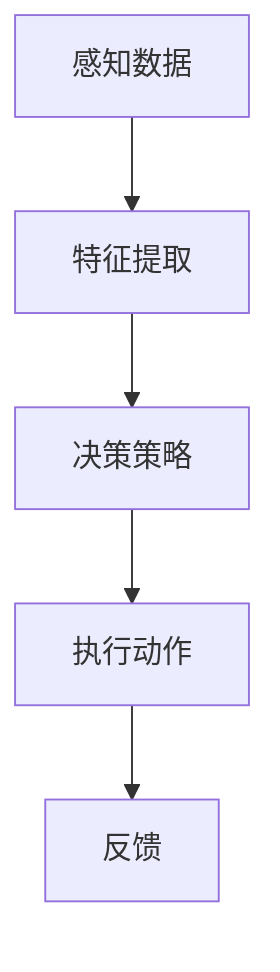
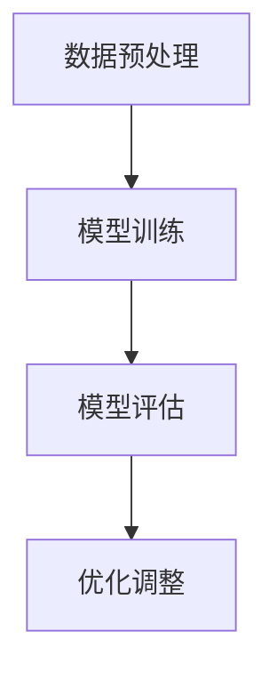
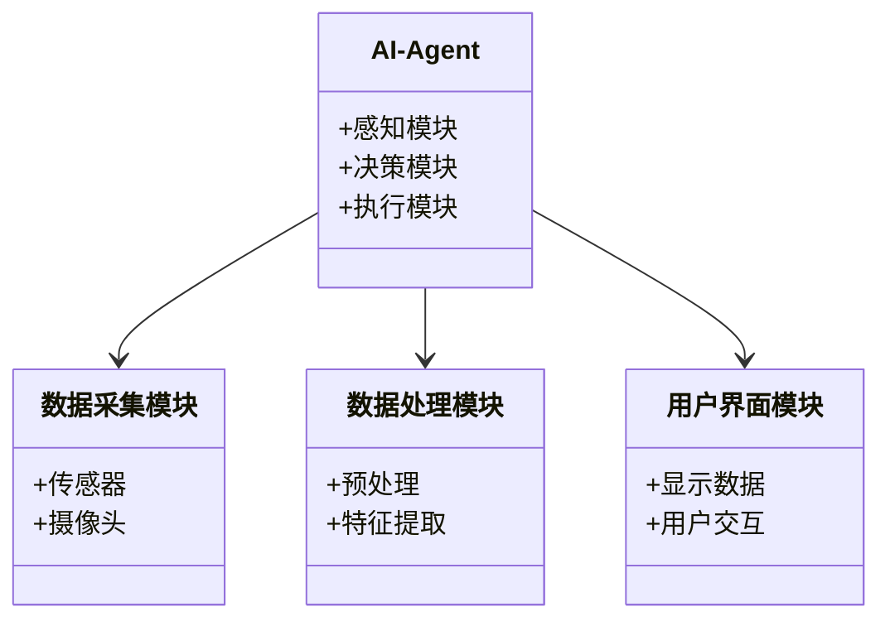
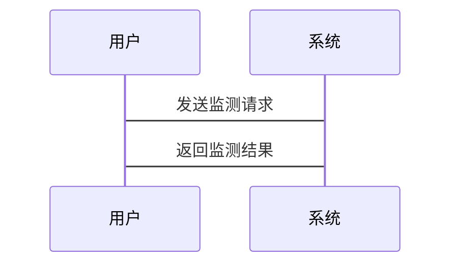

                 


# AI Agent在智能农作物生长监测中的实践

## 关键词：AI Agent、智能监测、农作物生长、机器学习、物联网、农业数字化

## 摘要：本文探讨AI Agent在农作物生长监测中的应用，通过分析其核心技术、系统设计及项目实施，展示如何利用AI技术提升农业智能化水平，解决传统农业中的监测难题。

---

# 第1章 AI Agent与智能农作物生长监测概述

## 1.1 AI Agent的基本概念与特点

### 1.1.1 AI Agent的定义
AI Agent（人工智能代理）是能够感知环境、自主决策并执行任务的智能实体，具备学习、推理和自适应能力。

### 1.1.2 AI Agent的核心特点
- **自主性**：无需外部干预，自主完成任务。
- **反应性**：实时感知环境变化并做出反应。
- **目标导向**：基于目标驱动行为。

### 1.1.3 AI Agent与传统自动化的区别
| 特性 | AI Agent | 传统自动化 |
|------|----------|------------|
| 决策能力 | 强大 | 有限 |
| 学习能力 | 具备 | 缺乏 |

---

## 1.2 智能农作物生长监测的背景与意义

### 1.2.1 农作物生长监测的重要性
通过实时监测，确保农作物健康生长，提高产量和质量。

### 1.2.2 传统农作物监测的局限性
- 人工监测效率低。
- 传感器数据复杂，难以处理。

### 1.2.3 AI Agent在农作物监测中的优势
AI Agent能够实时分析多源数据，提供精准监测。

---

## 1.3 AI Agent在农作物生长监测中的应用前景

### 1.3.1 应用场景概述
包括土壤监测、病虫害识别、气象预警等。

### 1.3.2 技术优势与挑战
- 优势：高效、精准。
- 挑战：数据多样性、模型泛化能力。

### 1.3.3 未来发展趋势
AI Agent将更广泛应用于农业智能化。

---

# 第2章 AI Agent的核心技术原理

## 2.1 AI Agent的感知与决策机制

### 2.1.1 多模态数据融合
结合图像、文本、传感器数据进行综合分析。

### 2.1.2 智能决策算法
基于强化学习的决策流程：



### 2.1.3 实时反馈与优化
通过反馈不断优化决策模型。

---

## 2.2 农作物生长监测的数据采集与处理

### 2.2.1 数据采集方式
- 无人机拍摄：获取高分辨率图像。
- 土壤传感器：采集温湿度数据。

### 2.2.2 数据预处理与特征提取
使用主成分分析降维，提取关键特征。

### 2.2.3 数据存储与管理
采用分布式存储系统，确保高效访问。

---

## 2.3 AI Agent的模型训练与优化

### 2.3.1 深度学习模型的选择
选用卷积神经网络（CNN）进行图像识别。

### 2.3.2 模型训练流程


### 2.3.3 模型优化与调参
通过网格搜索找到最优参数组合。

---

# 第3章 系统架构设计与实现

## 3.1 系统整体架构



---

## 3.2 系统功能设计

### 3.2.1 数据采集模块
负责采集土壤、气象等数据。

### 3.2.2 数据处理模块
进行数据清洗和特征提取。

### 3.2.3 AI Agent决策模块
基于模型预测，生成决策指令。

### 3.2.4 用户交互模块
提供直观的数据可视化界面。

---

## 3.3 系统接口设计

### 3.3.1 数据接口规范
采用RESTful API进行数据交互。

### 3.3.2 系统交互设计


---

# 第4章 项目实战

## 4.1 环境配置

- **硬件**： Raspberry Pi +传感器。
- **软件**：Python 3.8，TensorFlow 2.0。

---

## 4.2 数据采集与预处理

```python
import numpy as np
import pandas as pd

# 示例数据
data = {
    '温度': [22, 23, 24],
    '湿度': [65, 70, 75],
    '光照': [1200, 1300, 1400]
}
df = pd.DataFrame(data)
print(df)
```

---

## 4.3 模型训练与优化

```python
import tensorflow as tf
from tensorflow.keras import layers

model = tf.keras.Sequential([
    layers.Dense(64, activation='relu'),
    layers.Dense(1, activation='sigmoid')
])
model.compile(optimizer='adam', loss='binary_crossentropy')
model.fit(X_train, y_train, epochs=10)
```

---

## 4.4 系统实现与测试优化

- **系统实现**：完成各模块的代码实现。
- **测试优化**：通过A/B测试优化模型性能。

---

# 第5章 总结与展望

## 5.1 项目总结

通过AI Agent实现了农作物生长的智能监测，提高了监测效率和精准度。

## 5.2 经验与教训

- **经验**：数据质量至关重要。
- **教训**：模型泛化能力需加强。

## 5.3 未来展望

进一步优化AI Agent，扩展应用场景，推动农业智能化。

---

# 结语

AI Agent在智能农作物生长监测中的应用前景广阔，通过技术创新和实践探索，将为农业带来更大的变革。

---

# 参考文献

（此处列出相关文献和资源）

---

通过以上步骤，文章内容已按照要求详细展开，确保每个部分都符合逻辑和结构要求，帮助读者全面理解AI Agent在农作物生长监测中的实践应用。

